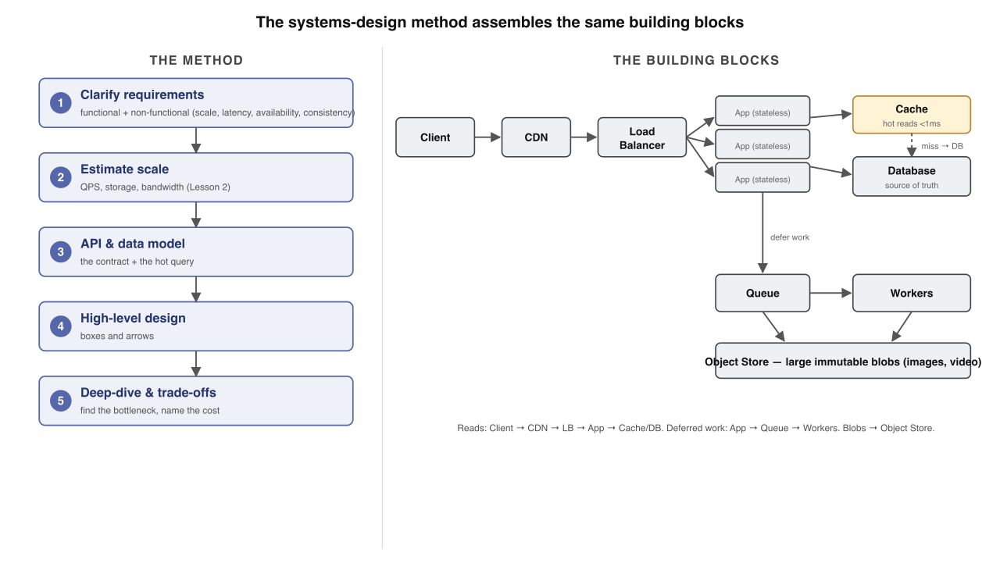
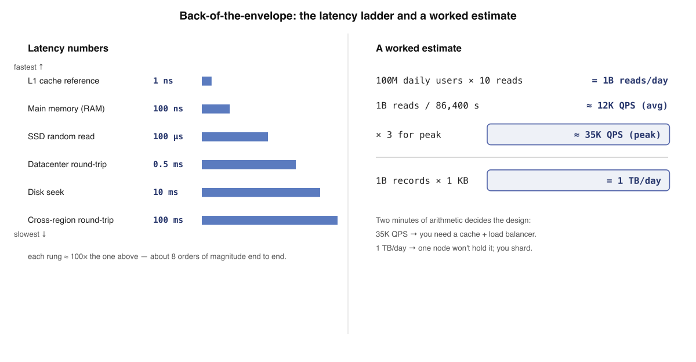
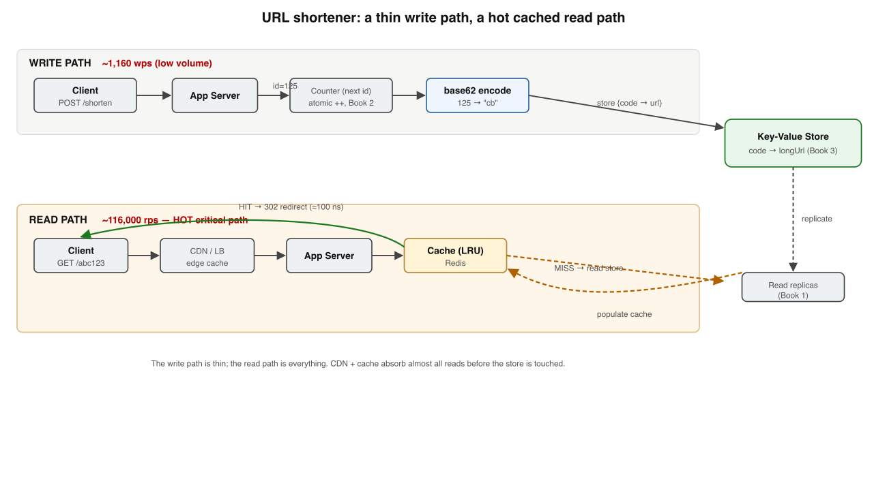
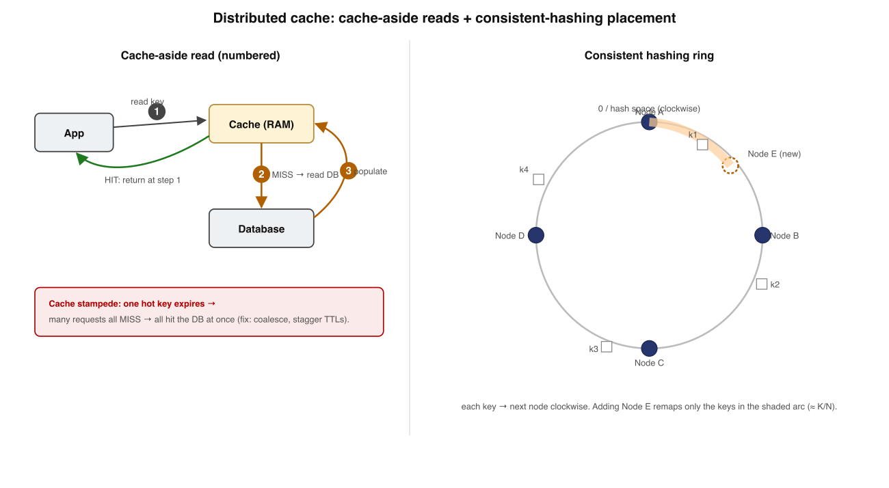
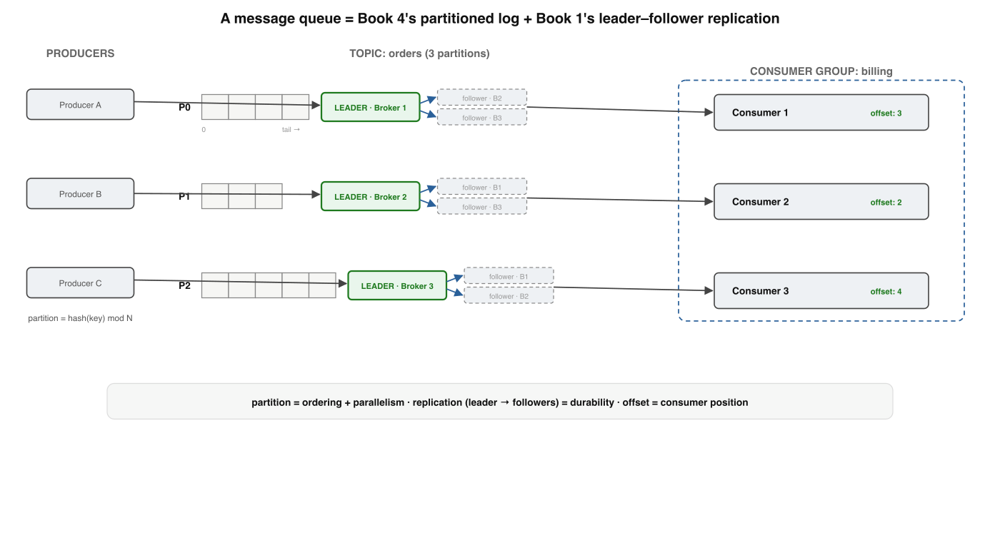
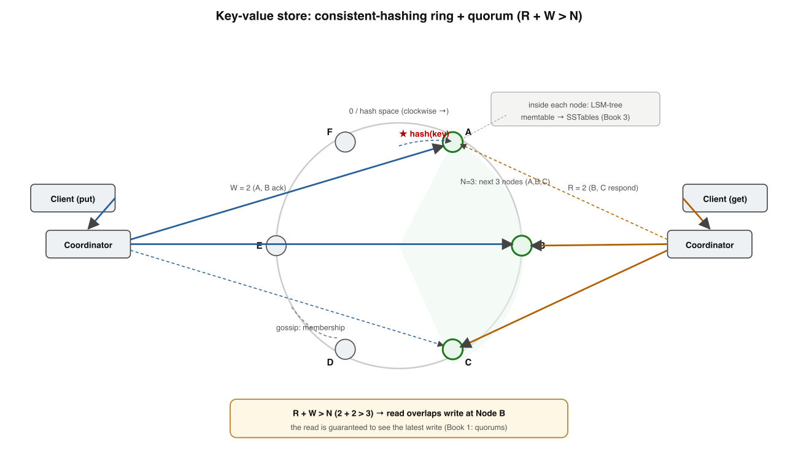
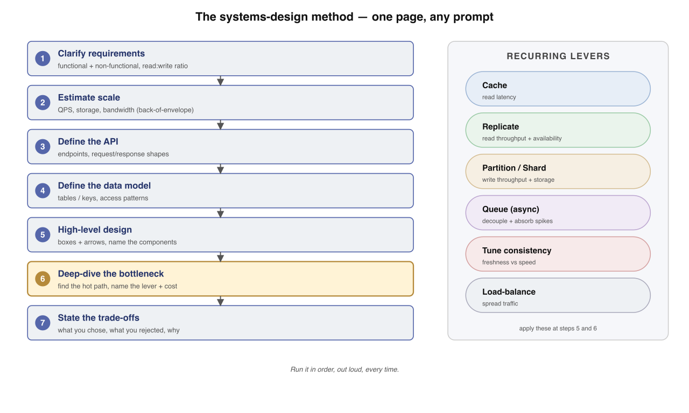

# Applied Systems Design — Fundamentals

*Book 5, the capstone of a guided learning track. One tight design per lesson — the four prior books, applied.*

---

## How to use this document

**Mission.** You're turning four books of theory into design judgment — applying distributed-systems fundamentals, transactions, storage engines, and streaming to design real systems end to end. Every lesson is a design case study run on one repeatable method.

**Method.** Each lesson teaches *one* design, gives a concrete architecture, and ends with a self-check — answer it from memory before peeking. Diagrams are mostly **architectures** (boxes and arrows) plus a few ring/algorithm diagrams. A short **expert corner** closes each lesson with senior-level depth you can skip on a first pass.

**I'm your teacher.** This is a starting point. When something is unclear or you want a worked example, ask.

---

## Course Map — the full path

| # | Lesson | The single win | Status |
|---|--------|----------------|--------|
| 1 | The Systems Design Method | The repeatable five-step framework | ✅ Built |
| 2 | Back-of-the-Envelope Estimation | Turn users into QPS, storage, bandwidth | ✅ Built |
| 3 | Design a URL Shortener | Thin write path, hot cached read path | ✅ Built |
| 4 | Design a Rate Limiter | Token bucket + an atomic counter | ✅ Built |
| 5 | Design a News Feed | Fan-out on write vs on read | ✅ Built |
| 6 | Design a Distributed Cache | Cache-aside + consistent hashing | ✅ Built |
| 7 | Design a Message Queue | Partitioned log + replication | ✅ Built |
| 8 | Design a Key-Value Store | The ring + quorums + LSM | ✅ Built |
| 9 | Putting It All Together | The universal design checklist | ✅ Built |

**How every lesson is built:** prose → an architecture diagram → a self-check → an expert corner.

---

## Lesson 1 — The Systems Design Method

You spent four books building theory. Book 1 taught you how distributed systems fail and recover — partial failure, idempotency, quorums. Book 2 made writes safe — ACID, the outbox, sagas. Book 3 explained where bytes actually live — the log, B-trees, LSM-trees. Book 4 turned the log into a nervous system — Kafka, event sourcing, CQRS. This capstone applies all of it. Every lesson here is a design case study, and they all run on the same method. Learn the method first; the rest is filling in boxes.

### There is a repeatable method for any design problem

Designing a system is not improvisation. Alex Xu's *System Design Interview* vol 1 (ch. 3, "A Framework for System Design Interviews") gives a four-step skeleton; we use five, because the deep dive deserves its own step. The point is that you never start by drawing boxes. You start by understanding what you are being asked to build, and at what scale, and only then commit to a shape.

> **The method, in one line:** clarify requirements → estimate scale → define the API and data model → draw the high-level design → deep-dive the bottleneck and name the trade-offs.

The same five steps work for a URL shortener, a news feed, a rate limiter, or a chat backend. The system changes; the method does not. Run it in order, out loud, every time.



### Step 1 — Clarify requirements

Split requirements into two piles. **Functional** requirements are what the system *does*: "shorten a URL and redirect," "post a tweet and show it in followers' feeds." **Non-functional** requirements are the *qualities* it must hold under load — and these decide the architecture far more than the features do.

Four non-functional dimensions drive almost every decision in this book:

| Dimension | The question you ask | Where the answer lives |
|---|---|---|
| Scale | How many users, QPS, GB/day? | Lesson 2 (estimation) |
| Latency | p99 read/write budget in ms? | Book 3 (storage), caching |
| Availability | Five-nines? Tolerate region loss? | Book 1 (replication, quorums) |
| Consistency | Read-your-writes? Eventual OK? | Book 1 (consistency models) |

DDIA (ch. 1, "Reliability, Scalability, and Maintainability") frames these as the three properties worth designing for; we add consistency explicitly because it is the one teams discover too late. Ask: is a 200ms-stale read acceptable? Often yes — and that single answer unlocks caching and asynchronous replication. If the answer is no, you have just committed to a quorum or a single-leader path, with all the cost that implies.

### Step 2 — Estimate scale

Before you choose a database, do the arithmetic. A back-of-the-envelope estimate tells you whether one machine suffices or whether you must partition (Book 1) from day one. Lesson 2 covers the full technique; here is the shape.

Worked example — a URL shortener at 100M new URLs/day:

- **Write QPS:** 100M ÷ 86,400s ≈ **1,160 writes/s**, call it ~1.2k.
- **Read QPS:** assume 10:1 read/write → **~12k reads/s**.
- **Storage:** ~500 bytes/record × 100M/day × 365 × 5 years ≈ **91 TB**. One node will not hold that; you are sharding (Book 1, partitioning).
- **Bandwidth:** 12k reads/s × 500 B ≈ **6 MB/s** egress — trivial, the CDN absorbs it.

Two minutes of arithmetic just told you: writes are modest, reads dominate (cache them), and storage forces partitioning. Alex Xu vol 1 (ch. 2, "Back-of-the-Envelope Estimation") insists on this step precisely because it changes the design, not just the capacity plan.

### Step 3 — Define the API and the data model

Now make it concrete. The API is the contract the rest of the world holds you to; the data model is what your storage engine (Book 3) must serve efficiently.

For the shortener:

```
POST /urls        { longUrl }            -> 201 { shortKey }
GET  /{shortKey}                         -> 301 Location: longUrl
```

Data model — a single logical table, keyed for the hot path:

```
url_mappings(short_key PK, long_url, created_at, account_id)
```

The primary access pattern is point-lookup by `short_key`. That is a hash-index or B-tree read (Book 3) — sub-millisecond, and trivially cacheable. Design the schema around the query you run a billion times, not the one you run once. DDIA (ch. 2-3) is the reference for matching access pattern to index structure.

### Step 4 — High-level design (the boxes and arrows)

Only now do you draw. The right side of the diagram is the canonical web-scale shape, and most systems in this book are variations on it: a **client** hits a **CDN**, which fronts a **load balancer**, which spreads traffic across **stateless app servers**. The app servers read through a **cache** and fall back to the **database**; writes that can be deferred go onto a **message queue** for **workers** to process; large blobs live in an **object store**.

Keep the app tier stateless — push session and data state down into the cache and database. Brendan Burns' *Designing Distributed Systems* (ch. 1, the replicated-load-balanced-stateless pattern) makes the case: a stateless tier scales horizontally by simply adding identical replicas behind the load balancer, and any instance can die without losing data. That property is what lets you hit high availability cheaply.

### Step 5 — Deep-dive the bottleneck and state the trade-offs

A design is only credible once you have found its weak point. For the shortener, step 2 already named it: **12k reads/s against 91 TB**. The deep dive is the read path. You partition `url_mappings` by `short_key` (Book 1) and front it with a cache holding the hot keys; a Zipfian read distribution means a small cache serves most traffic.

Then state the trade-off honestly. A cache introduces staleness: a redirect updated in the DB may serve the old target until the entry expires (Book 1, consistency models). For a shortener that is fine — links rarely change. For a balance in Book 2, it is not. **Every design is a set of trade-offs; your job is to pick them deliberately and say so.** There is no "best" architecture, only one matched to the requirements you clarified in step 1.

### The universal building blocks you reuse everywhere

These six components appear in nearly every design in this book. Learn their one-line jobs now; you will wire them together for the next eight lessons.

| Block | Its one job |
|---|---|
| Load balancer | Spread requests across healthy stateless servers |
| Cache (Redis) | Serve hot reads in <1 ms, shield the database |
| Database | Durable source of truth, indexed for the hot query (Book 3) |
| Message queue | Decouple producers from consumers; absorb spikes (Book 4) |
| CDN | Serve static/cacheable content from the network edge |
| Object store | Hold large immutable blobs (images, video) cheaply |

### Going deeper — expert corner

*Optional depth. Skip on a first pass.*

- **Requirements are a negotiation, not a transcript.** Senior engineers push back on consistency requirements — "do you *really* need read-your-writes here?" — because relaxing one often collapses the whole design (DDIA ch. 9 on the cost of linearizability).
- **The "single machine" baseline is underrated.** Before sharding 91 TB, ask whether one large node with NVMe SSDs would do (Jeff Dean's *Latency Numbers* — SSD random read ≈ 16 µs vs. round-trip-within-datacenter ≈ 0.5 ms). Many "web-scale" problems fit on one big box plus a read replica.
- **Patterns are reusable, not just architectures.** Burns' book argues the value is in naming reusable distributed-systems patterns (sidecar, ambassador, scatter-gather) the way object-oriented design named its patterns. Recognize the pattern and you skip re-deriving the design.
- **The bottleneck moves as you scale.** A design correct at 12k QPS may bottleneck on connection count or replication lag at 120k. Re-run step 2 at each order of magnitude (Alex Xu vol 1, ch. 1, "Scale from Zero to Millions of Users").

### Self-Check — Lesson 1

**Q1.** In the five-step method, which step most directly decides whether you must partition the database from day one?

(a) Clarifying the functional requirements of the API
(b) Estimating scale — the storage and QPS arithmetic
(c) Defining the data model and its primary access pattern
(d) Deep-diving the bottleneck once the design exists

**Q2.** A stakeholder says a 200ms-stale read is acceptable for a feature. What does this answer most directly unlock?

(a) A quorum write path with R + W > N replicas
(b) A strict single-leader, read-your-writes design
(c) Caching and asynchronous replication on the read path
(d) A two-phase commit across the partitioned shards

**Q3.** Why does the design favor keeping the app-server tier stateless?

(a) It lets any instance die and scale by adding replicas
(b) It removes the need for a load balancer in front
(c) It guarantees strong consistency across all reads
(d) It eliminates the cache from the read path entirely

**Q4.** For the URL shortener, the schema is keyed on `short_key` because:

(a) It minimizes total bytes stored across the cluster
(b) It matches the billion-times point-lookup read path
(c) It avoids needing any index on the table at all
(d) It enforces uniqueness of the original long URLs

### Answer Key — Lesson 1

**Q1 — (b).** The 91 TB storage estimate, not the features, is what forces partitioning; scale arithmetic changes the design (Alex Xu vol 1, ch. 2).

**Q2 — (c).** Tolerating staleness is exactly the condition under which caching and async replication become safe (Book 1, consistency models).

**Q3 — (a).** A stateless tier scales by adding identical replicas behind the load balancer and survives instance loss (Burns, *Designing Distributed Systems*).

**Q4 — (b).** You design the schema around the query you run a billion times — the point lookup — so it resolves as a sub-millisecond index read (DDIA ch. 2-3).

---

## Lesson 2 — Back-of-the-Envelope Estimation

### Where we left off

Lesson 1 gave you the method: clarify requirements, estimate scale, sketch the API and data model, draw boxes and arrows, then deep-dive the bottleneck. The estimate step is where most engineers wave their hands. It is also where the entire shape of the design is decided. This lesson makes the estimate rigorous — and fast. The goal is not a precise answer; it is the right *order of magnitude*, because that is what tells you one machine or a thousand.

> **Rule of thumb.** A good back-of-the-envelope estimate is correct to within a factor of 10 and takes under two minutes. You are choosing between "fits in RAM on one box" and "needs a sharded fleet" — decisions that differ by 1000×, so a 2× error in your arithmetic never changes the answer.

Alex Xu opens *System Design Interview* vol 1 (Ch. 2, "Back-of-the-envelope estimation") with exactly this framing: estimation exists to justify the design, and interviewers expect the numbers, not just the diagram.

### The latency numbers every engineer should memorize

Jeff Dean's "Latency Numbers Every Programmer Should Know" is the canonical list. You do not need all of it. You need the six rungs that span the ladder from CPU to the other side of the planet, because every storage and networking decision in this book lives somewhere on it.

| Operation | Approx. latency | Relative to L1 |
|---|---|---|
| L1 cache reference | 1 ns | 1× |
| Main memory (RAM) reference | 100 ns | 100× |
| SSD random read | 100 µs | 100,000× |
| Round-trip in same datacenter | 0.5 ms | 500,000× |
| Disk (spinning) seek | 10 ms | 10,000,000× |
| Round-trip across regions (US↔EU) | ~100 ms | 100,000,000× |

The takeaway is the *gaps*, not the digits. RAM is ~100× slower than L1; an SSD is ~1000× slower than RAM; a cross-region hop is ~200,000× slower than the in-datacenter hop. This is why every design that matters has a cache (Lesson 1's tiers): you are buying a 1000× jump back up the ladder. It is why DDIA (Ch. 1) insists that a replica in another region is a *different* availability and latency regime — that 100 ms is unavoidable, set by the speed of light, not by your hardware budget.

Memorize the ladder as four jumps of ~100×: **1 ns → 100 ns → 100 µs → ... → 0.5 ms → 10 ms → 100 ms**. When someone proposes "just read it from the cross-region database on the request path," you will feel the 100 ms in your gut.



### Powers of two for storage

Data volumes are quoted in bytes, and bytes scale by ~1000 (technically 1024, but for estimation use 1000). Alex Xu vol 1 lists the data-volume units precisely because mixing up GB and TB is a factor-of-1000 error — the most expensive arithmetic mistake in system design.

| Unit | Bytes | Holds, roughly |
|---|---|---|
| KB | 10³ | one short text message / a small JSON record |
| MB | 10⁶ | a few seconds of MP3, a high-res photo |
| GB | 10⁹ | a movie; fits comfortably in one server's RAM |
| TB | 10¹² | a large SSD; a day of records for a big service |
| PB | 10¹⁵ | a fleet's worth; now you are sharding (Lesson 1) |

The anchor you actually use: **a record is ~1 KB**. A tweet, an order, an event in your Kafka log (Book 4) — call it 1 KB unless you know better. From that one number, billions of records turn into terabytes by inspection.

### The QPS calculation

Queries per second is the load on your system, and it comes from one formula:

> **Average QPS = (Daily Active Users × actions per user per day) ÷ 86,400.** Then **Peak QPS ≈ Average × 2 to 3**, because traffic is bursty, not uniform.

There are 86,400 seconds in a day — memorize it; it is the denominator of every QPS estimate. The peak multiplier exists because real traffic clusters around evenings and events; Alex Xu vol 1 uses 2× as a default, and 3× is a safe upper bound for consumer apps.

Worked example. A read-heavy service with **100M daily active users**, each doing **10 reads/day**:

```
reads/day  = 100M × 10        = 1,000,000,000  = 1B reads/day
avg QPS    = 1B ÷ 86,400      ≈ 11,600         ≈ 12K QPS
peak QPS   = 12K × 3          ≈ 35K QPS
```

35K QPS is a *number you can act on*. A single well-tuned Postgres or MySQL node serves a few thousand simple QPS; 35K means you are past one box and into read replicas or a cache. That conclusion fell out of three lines of arithmetic.

### Sizing storage and bandwidth from QPS and payload size

Once you have a write rate and a payload size, storage and bandwidth are multiplication.

**Storage.** Suppose those 1B daily operations are *writes* of 1 KB records:

```
per day  = 1B × 1 KB   = 1 TB/day
per year = 1 TB × 365  ≈ 365 TB/year
× 3 for replication (R+W>N, Book 1) ≈ 1 PB/year
```

A petabyte a year is unambiguously a sharded, multi-node storage problem — the LSM-tree fleets and partitioned logs of Books 3 and 4, not a single B-tree on one disk.

**Bandwidth.** Multiply QPS by payload:

```
read bandwidth = 35K QPS × 1 KB ≈ 35 MB/s ≈ 280 Mbps
```

280 Mbps is fine for one NIC, so bandwidth is *not* your bottleneck here — but you only know that because you did the math. The discipline is: every resource (QPS, storage, bandwidth, memory) gets one multiplication, and whichever blows past a single machine's budget is your deep-dive (Lesson 1).

### Why estimation matters

Estimation is the bridge from requirements to architecture. It answers the questions that decide the whole design:

- **One machine or a thousand?** 35K QPS and 1 PB/year says fleet, not box.
- **Cache or no cache?** A 100 ms cross-region read versus a sub-millisecond cache hit — the latency ladder makes the call.
- **Single database or sharded?** A terabyte a day overruns one node's disk; you shard (Book 1's partitioning, Book 3's storage limits).
- **Sync or async?** If peak QPS exceeds what the database can absorb synchronously, you put a log between them (Book 4) and process asynchronously.

DDIA (Ch. 1) frames scalability as "coping with increased load," and load is precisely the numbers above. You cannot reason about scalability without first quantifying load. That is why this lesson comes second: every case study from Lesson 3 onward opens with an estimate, and the estimate is what makes the rest of the design inevitable rather than arbitrary.

### Going deeper — expert corner

*Optional depth. Skip on a first pass.*

- **Read/write ratio reshapes the design.** A 100:1 read-heavy workload screams caching and read replicas; a write-heavy one screams LSM-trees (Book 3) and a log-first ingest path (Book 4). Always estimate reads and writes *separately* — Alex Xu vol 1 splits them in every worked example.
- **Hot keys break uniform-QPS math.** Average QPS assumes load spreads evenly across keys. It never does — a celebrity user or trending item concentrates traffic on one partition. DDIA (Ch. 6, "skewed workloads and relieving hot spots") shows that your *per-shard* peak can be 10–100× the average, which is what actually melts a node.
- **Latency numbers are aging.** Jeff Dean's figures predate NVMe (SSD random reads now ~10–20 µs, not 100 µs) and predate the near-disappearance of spinning disks in hot paths. Keep the *orders of magnitude and the gaps* — those are set by physics; refresh the exact constants when they matter.
- **Tail latency, not average, is the SLO.** Your p99 can be 10× your mean under load. Jeff Dean & Barroso, "The Tail at Scale" (CACM 2013), is the canonical pointer: at 100 fan-out calls, a 1-in-100 slow response is hit on nearly *every* request. Estimate for the tail, not the average.

### Self-Check — Lesson 2

**1.** A service has 50M daily active users, each performing 20 writes per day. Using a 3× peak multiplier, what is the approximate peak write QPS?

(a) about 12K QPS
(b) about 35K QPS
(c) about 58K QPS
(d) about 90K QPS

**2.** Which gap on the latency ladder is the single best justification for putting a cache in front of a remote data store?

(a) L1 cache is roughly 100× faster than a main-memory reference
(b) An in-datacenter round-trip is roughly 20× faster than a disk seek
(c) A main-memory reference is roughly 1000× faster than an SSD random read
(d) A local memory hit is roughly 200,000× faster than a cross-region round-trip

**3.** You estimate 2B record writes per day at ~1 KB each, replicated 3×. Which conclusion follows most directly?

(a) Bandwidth is the bottleneck, so you need a faster NIC
(b) Storage grows ~6 TB/day, so this is a sharded multi-node problem
(c) Reads dominate, so you should add a read-through cache layer
(d) One machine suffices, since a record is only a kilobyte

**4.** Why is a back-of-the-envelope estimate that is off by 2× still considered useful?

(a) The architectural decisions it drives differ by 1000×, so a 2× error rarely flips the answer
(b) Interviewers grade on arithmetic precision rather than the final design choice
(c) A 2× error always cancels out once you apply the peak-traffic multiplier
(d) Storage and bandwidth are linear, so any small error stays small downstream

### Answer Key — Lesson 2

**1. (b)** 50M × 20 = 1B writes/day ÷ 86,400 ≈ 12K average, × 3 ≈ 35K peak QPS.
**2. (d)** The ~200,000× memory-vs-cross-region gap is the largest jump on the ladder and the strongest case for caching a remote read.
**3. (b)** 2B × 1 KB = 2 TB/day, × 3 for replication ≈ 6 TB/day — far past a single node's disk, so you shard.
**4. (a)** Estimation chooses between options that differ by orders of magnitude, so being within a factor of 10 is enough to pick correctly.

---

## Lesson 3 — Design a URL Shortener

### Where we left off

Lessons 1 and 2 designed systems whose hard part was *writes*: a key-value store fighting for quorum agreement (Book 1's R + W > N), a rate limiter racing on an atomic counter (Book 2's atomic increments). The URL shortener flips that. It is the canonical *read-heavy* system — a tiny write path and a colossal read path — and it lets you apply the whole stack: a counter (Book 2), an encoding (Book 3), a key-value store (Book 3), and a cache hierarchy. Alex Xu opens Volume 1 with it for exactly this reason: it is small enough to hold in your head and rich enough to expose every layer.

### Requirements

Two functional requirements, three non-functional ones. Write them down before drawing anything; this is the discipline Alex Xu's Vol 1 frames as the first interview minute.

- **Shorten:** given a long URL, return a short code (e.g. `https://sho.rt/abc123`).
- **Redirect:** given the short code, send the browser to the original URL.
- **Read-heavy:** redirects vastly outnumber creations.
- **Low latency:** a redirect is on the critical path of someone clicking a link; tens of milliseconds, not hundreds.
- **High availability:** a dead shortener breaks every link ever minted. Stale-but-up beats consistent-but-down here — a Book 1 availability-over-consistency call.

> **Rule of thumb.** A URL shortener is a *read-amplifier*: one write is read thousands of times. Optimize the read path first; the write path can be almost naive.

### A quick estimate

Numbers drive the design. Assume 100M new URLs per day.

| Quantity | Estimate |
|---|---|
| Writes/sec | 100M / 86,400 ≈ **1,160 wps** |
| Read:write ratio | ~100:1 (Alex Xu Vol 1's working assumption) |
| Reads/sec | ≈ **116,000 rps** |
| URLs in 10 years | 100M × 365 × 10 ≈ **365B** |
| Storage (~500 B/row) | 365B × 500 B ≈ **180 TB** |

Two conclusions fall out. First, 116K rps cannot all hit a database — the read path *needs* a cache and a CDN. Second, 365 billion keys means the short code must stay short even at that cardinality; that constrains the encoding. Hold both.

### The API

Two endpoints, mapping one-to-one to the requirements.

```
POST /shorten        body: { "longUrl": "https://..." }
                     201 { "shortUrl": "https://sho.rt/abc123" }

GET  /{code}         302  Location: https://...original...
```

`POST /shorten` is a write; make it idempotent on the long URL if you want the same input to yield the same code (more on that below). `GET /{code}` is the hot path — no request body, no JSON response, just a redirect header. Its simplicity is the whole point.

### Generating the short code

This is the design's center of gravity. Two families of approach.

**Hash of the URL.** Run the long URL through MD5 or SHA-256, base62-encode, keep the first 7 characters. Deterministic — the same URL maps to the same code for free. But truncating a hash invites **collisions**: two different URLs landing on the same 7-char prefix. You must then check the store on every write and re-hash on conflict, which adds a read to every write and grows messy as the table fills (the birthday paradox bites well before you exhaust the space).

**Auto-increment counter + base62.** Keep a single global counter. Each new URL takes the next integer; encode that integer in base62 (`[0-9a-z A-Z]`) to get the code. Counter `125` becomes `cb`; counter `999,999,999,999` becomes a 7-char code. No collisions *by construction* — every integer is unique, so every code is unique. This is the approach Alex Xu Vol 1 recommends, and it is Book 2's atomic-increment primitive doing real work: the counter is exactly the monotonic sequence you built a rate limiter around.

> **base62 length math.** 62⁷ ≈ 3.5 trillion codes — enough for ten years of 100M/day with room to spare. 62⁶ ≈ 56B would run out; seven characters is the sweet spot.

The trade-off table:

| Concern | Hash of URL | Counter + base62 |
|---|---|---|
| Collisions | Possible; needs retry | **None by construction** |
| Same URL → same code | Free | Needs a lookup table |
| Predictability | Unpredictable | **Sequential — guessable** |
| Hotspot | Stateless | Counter is a write hotspot |

The counter's two costs are real. It is **predictable** — sequential codes let anyone enumerate every link, a privacy and scraping problem. And the counter itself is a single contended row. You break the contention exactly as Book 1's partitioning lesson taught: hand each app server a *range* of IDs (e.g. a Redis or ZooKeeper block of 1,000) so it increments locally and only coordinates once per block. You blunt predictability by base62-encoding a *non-sequential* mapping of the counter, or by accepting it (most public shorteners do).



### The data model

The store needs one job: map `code → longUrl`. That is a pure key-value access pattern — single-key lookups, no joins, no range scans — so reach for Book 3's key-value engine rather than a relational table. The primary key *is* the short code; the lookup is `O(1)` against an index, the access pattern DynamoDB and Cassandra are built for.

```
code (PK)  →  longUrl, createdAt
```

You may keep a *second* table keyed by long URL if `POST /shorten` must be idempotent. Recall Book 3's encoding lesson: store the long URL as a compact UTF-8 string; do not over-normalize a value you only ever read whole. DDIA (Chapter 3) frames this directly — when the access pattern is "fetch one record by key," a log-structured or hash-indexed KV store beats a B-tree-backed relational schema you never query relationally.

### Scaling the read path

116K rps is the design's real load, and almost all of it should never touch the store.

1. **Cache the hot codes.** A small fraction of links carry most traffic (a viral tweet, a campaign link). An in-memory cache — Redis, or a local LRU — in front of the store absorbs the hot set. On a miss, read the store, populate the cache, return. Jeff Dean's *Latency Numbers* makes the stakes concrete: an in-memory read is ~100 ns versus a disk seek near 10 ms — a five-order-of-magnitude gap. A cache hit is effectively free; a miss is the expensive case you want rare.
2. **A CDN at the edge.** Redirects are static for a given code, so a CDN node geographically near the user can answer without a round trip to your origin — cutting both latency and origin QPS. This is the cheapest, highest-leverage layer.
3. **Read replicas.** What does survive to the store fans out across replicas. Book 1's replication lesson applies verbatim: leader-follower replication, reads served from followers, eventual consistency tolerated because a code's mapping never changes after creation — so there is nothing stale to read.

The chain is CDN → cache → replica → leader, each layer shedding load before the next. Alex Xu Vol 1 calls this the standard read-heavy stack, and it is the same hierarchy you will reuse in every later lesson.

### The redirect itself

One last decision with outsized consequences: the HTTP status code.

- **301 Moved Permanently** — the browser *caches* the redirect. Subsequent clicks skip your server entirely and go straight to the long URL. Great for your QPS; terrible for analytics, because you stop seeing the clicks. And once cached, a 301 is hard to undo.
- **302 Found (temporary)** — the browser asks your server *every time*. You see every click (analytics, abuse detection, link expiry), at the cost of more load.

> **The 301-vs-302 trade-off is "save your QPS" versus "keep your data."** Pick 302 when click tracking is a feature; pick 301 when raw redirect throughput is all you care about. Alex Xu Vol 1 recommends 302 for most shorteners precisely so analytics survive.

### Going deeper — expert corner

*Optional depth. Skip on a first pass.*

- **The counter is a distributed-ID problem in disguise.** A single global counter is a SPOF and a hotspot. Twitter's **Snowflake** scheme (timestamp + machine ID + per-machine sequence) gives sortable, collision-free IDs with no central coordination — the production answer to "where does the next number come from." See Alex Xu Vol 2's distributed-ID chapter.
- **Custom aliases break the counter's uniqueness guarantee.** The moment you let users pick `sho.rt/launch`, you reintroduce collisions and must check the store on write. Reserve a namespace or check-and-set; do not let a vanity feature corrupt the clean counter path.
- **Cache invalidation is nearly free here — exploit it.** Because a code's mapping is immutable after creation, you can cache redirects with very long TTLs and never face the cache-invalidation problem DDIA calls one of the two hard things. The exception is link *expiry* and *deletion*, which is exactly why 302 (per-request) buys you the control 301 forfeits.
- **180 TB needs partitioning, not a bigger box.** Shard the KV store by a hash of the short code (Book 1's partitioning). Hash-partitioning spreads both storage and the 116K rps evenly; range-partitioning on a sequential counter would hot-spot the newest shard — the classic anti-pattern from the partitioning lesson.

### Self-Check — Lesson 3

**1.** Why is a URL shortener classified as a read-heavy system?
(a) Redirects vastly outnumber URL creations, often around 100 to 1
(b) Writing a new short code requires several database round trips
(c) Each long URL must be validated against an external blocklist
(d) Short codes are regenerated every time a link is clicked

**2.** What is the main advantage of an auto-increment counter plus base62 over hashing the URL?
(a) It produces codes that are impossible for outsiders to enumerate
(b) It removes the need for any key-value store behind the codes
(c) It guarantees unique codes with no collisions by construction
(d) It lets the same long URL map to the same code automatically

**3.** Why does the redirect data model fit a key-value store rather than a relational schema?
(a) The access pattern is a single-key lookup with no joins
(b) Key-value stores enforce foreign keys across the two tables
(c) Relational stores cannot index a short code as a primary key
(d) The long URL must be split across normalized child tables

**4.** What is the trade-off between a 301 and a 302 redirect?
(a) 301 returns the long URL while 302 returns only the code
(b) 301 is cached so you lose click data; 302 preserves analytics
(c) 301 works only on mobile while 302 works on every browser
(d) 301 requires a cache layer while 302 reads from the replica

### Answer Key — Lesson 3

**1. (a)** The defining trait is the ~100:1 read-to-write ratio, which is why every optimization targets the read path first.
**2. (c)** A monotonic counter yields a distinct integer per URL, so base62 codes are unique with no collision retries — its cost is sequential predictability.
**3. (a)** Lookups are pure `code → longUrl` by primary key, the single-key pattern DDIA Ch. 3 says a KV engine serves best.
**4. (b)** A 301 is browser-cached so future clicks skip your server and your analytics; a 302 hits the server every time, preserving click data.

---

## Lesson 4 — Design a Rate Limiter

### Where we left off

Lesson 3 sized a URL shortener and parked most of its load on a read-cache. But what stops one abusive client from sending a million `POST /shorten` per minute and melting that cache? A rate limiter. It is the smallest system in this book, and the one that forces you to use **Book 2's atomicity** and **Book 4's windows** on the very same page — so it is the perfect warm-up for the bigger designs ahead.

### Requirements

Functional, in one sentence: cap how many requests a single client may make in a rolling time window, and reject or delay anything over the cap.

> **The contract.** Given a limit of *L* requests per window *W*, the *(L+1)*th request inside any window *W* is refused with HTTP 429 (Too Many Requests), ideally with a `Retry-After` header. Alex Xu, *System Design Interview* vol 1, ch. 4, treats this as the canonical statement.

Non-functional requirements drive every later decision:

| Requirement | Why it bites |
|---|---|
| **Low overhead** | The limiter runs on the hot path of *every* request; it must add ≪ 1 ms, not a database round trip. |
| **Accuracy** | Under-counting lets abuse through; over-counting rejects legitimate traffic. |
| **Distributed-correct** | Many app servers share one logical limit; the count must be global, not per-server. |
| **Fail-open vs fail-closed** | If the limiter's datastore is down, do you allow all traffic or block all? (Usually fail-open — availability over precision.) |

"Client" needs a definition: an API key, a user ID, or an IP. The choice is the limiter's partition key, and it matters later for memory.

### The algorithms

Four algorithms cover almost every production limiter. They trade **accuracy against memory**.

**Token bucket.** A bucket holds at most *B* tokens and refills at a fixed rate *r* (say 10 tokens/sec). Each request removes one token; an empty bucket means reject. You store just two numbers per client — `tokens` and `last_refill_timestamp` — and refill lazily on read: `tokens = min(B, tokens + (now − last_refill) × r)`. This naturally allows **bursts** up to *B* while holding the long-run average to *r*. Stripe's engineering blog ("Scaling your API with rate limiters") and Cloudflare both run token bucket as their default; Amazon API Gateway exposes exactly `rateLimit` (*r*) and `burstLimit` (*B*).

**Leaky bucket.** Requests enter a FIFO queue that drains at a fixed rate; an overflowing queue drops requests. It smooths bursts into a steady outflow — good when a *downstream* system needs constant pressure (a payment processor, say) — but it adds queueing latency and can't absorb a legitimate spike the way token bucket does.

**Fixed window counter.** Keep one integer per client per clock-aligned window: `count[user:minute]`. Increment on each request, reject above *L*, let the key expire. Trivially cheap, but it has a notorious flaw: a client can send *L* requests at 11:00:59 and another *L* at 11:01:00 — **2L in two seconds** straddling the boundary.

**Sliding window.** This is **Book 4's window idea** (Lesson 8, *windowing*) applied to counting. A *sliding window log* stores a timestamp per request and counts only those within the last *W* — perfectly accurate but O(L) memory per client. The cheaper *sliding window counter* interpolates: weight the previous fixed window by the fraction still overlapping now. Cloudflare's "Counting things, a lot of different things" post showed this approximation keeps error under ~0.003% on real traffic while storing only two integers.


### Where the limiter lives

Three placements, increasingly central:

- **Client-side** — cheap, but trivially bypassed; only useful as a courtesy throttle, never as enforcement.
- **API gateway / edge** — the standard answer (Xu vol 1, ch. 4). One chokepoint sees all traffic before it fans out to services, so the limit is enforced once and your services stay simple. Cloudflare and Kong put it here.
- **Per-service** — needed when different services have wildly different costs (a `/search` is 100× a `/health`). You accept duplicated logic for finer control.

Most designs put a coarse limiter at the gateway and let a few expensive endpoints add their own. The gateway placement is a direct application of **Book 1's partial-failure** thinking: keep the failure-prone enforcement logic at one well-monitored boundary rather than scattering it.

### Distributed rate limiting

A single gateway process can hold its buckets in local memory. The moment you run *N* gateway replicas behind a load balancer, in-memory counters fragment: each replica sees ~1/N of a client's traffic, so the effective limit becomes *N × L*. You need one **shared counter**, and Redis is the canonical store — single-threaded, in-memory, sub-millisecond, with native TTL. The pattern (per Redis's own rate-limiting docs):

```
key   = "rl:{userId}:{currentMinute}"
count = INCR key            # atomically increment, returns new value
if count == 1: EXPIRE key 60
if count > L:  reject 429
```

Here is the trap, and it is pure **Book 2 (atomicity)**. The naive version is a *read-modify-write*:

```
n = GET key        # server A reads 5      server B reads 5
n = n + 1          # A computes 6          B computes 6
SET key n          # A writes 6            B writes 6   ← lost update
```

Two replicas interleave and one increment vanishes — the **lost-update race** from Book 2, Lesson 6. The fix is the same one Book 2 taught for the outbox and the inventory counter: make the increment a single atomic operation. Redis `INCR` is atomic by construction (Redis executes commands one at a time), so it never loses an update. When your logic spans *several* commands — read tokens, refill by elapsed time, decrement, set TTL — wrap them in a **Lua script** via `EVAL`; Redis runs the whole script atomically as one unit, exactly like a Book 2 transaction collapsed to a single instruction. This is precisely how the token bucket is implemented at scale (Stripe publishes its Lua bucket script; the `redis-cell` module ships token bucket as a native `CL.THROTTLE` command).

One more failure mode from **Book 1**: that shared Redis is now a single dependency on the hot path. If it is unreachable, you must decide fail-open (allow, risk abuse) or fail-closed (reject, risk an outage), and you should add a per-replica local fallback limiter so a Redis blip degrades to *approximately* correct rather than wide open.

### The trade-offs

Every choice here is a point on the **accuracy / memory / latency** triangle.

| Algorithm | Memory per client | Accuracy | Notes |
|---|---|---|---|
| Fixed window | 1 integer | Low (2L at edges) | Cheapest |
| Sliding-window counter | 2 integers | High (~0.003% err) | Best general default |
| Sliding-window log | O(L) timestamps | Exact | Costly at high L |
| Token bucket | 2 numbers | High, allows bursts | Production default |

And on placement: local counters are fastest but wrong across replicas; a shared Redis counter is correct but adds a ~0.5 ms network hop (Jeff Dean's "Latency Numbers": a round trip within a datacenter is ~0.5 ms, vs ~100 ns for an in-memory read — a 5,000× gap you pay on every request). The senior move is the hybrid Cloudflare and Stripe both ship: an in-process token bucket as a fast first gate, periodically reconciled against a shared Redis counter — local latency for the common case, global correctness over the window.

### Going deeper — expert corner

*Optional depth. Skip on a first pass.*

- **Sticky sessions weaken the distributed problem but don't solve it.** If the load balancer pins each client to one replica, local counters become *almost* correct — until that replica dies and the client rehashes to a fresh, zeroed bucket. Treat stickiness as an optimization, never the correctness guarantee (Xu vol 1, ch. 4, "synchronization").
- **TTL skew under fixed windows.** Clock-aligned minute keys make *all* clients' windows reset at the same instant, producing a thundering reset spike. Per-client windows (key seeded at first request) spread the resets — the same hot-key smoothing idea as **Book 3's** index design.
- **`redis-cell` / GCRA.** The Generic Cell Rate Algorithm is a token bucket reframed as the *theoretical arrival time* of the next allowed request — one integer, no separate refill step, and it returns `Retry-After` for free. See Brandur Leach's write-up and the `redis-cell` module.
- **Limiter as backpressure, not just defense.** In **Book 4** terms a leaky bucket *is* a bounded queue with a fixed drain — the same mechanism Kafka consumers use to avoid overwhelming a slow sink. Rate limiting and flow control are the same problem at different layers.

### Self-Check — Lesson 4

**1.** Two gateway replicas each `GET` a client's counter (value 5), add 1, and `SET` 6. What has gone wrong?

(a) A lost update: one increment is silently dropped, so the count under-reports.
(b) A deadlock: both replicas wait on each other and neither write completes.
(c) A dirty read: one replica reads data the other has not committed yet.
(d) A phantom read: a new row appears between the two replicas' reads.

**2.** Why is Redis `INCR` the recommended primitive for a shared fixed-window counter?

(a) It compresses the counter so many clients fit in less memory at once.
(b) It executes as one atomic step, so interleaved replicas cannot lose an update.
(c) It replicates the counter to every replica's local memory for fast reads.
(d) It automatically chooses the window size based on observed traffic shape.

**3.** A client sends *L* requests at 11:00:59 and *L* more at 11:01:00 and all pass. Which algorithm is in use?

(a) Token bucket, because it refills tokens gradually over each second.
(b) Sliding-window log, because it stores one timestamp per request.
(c) Fixed window counter, because counts reset on the clock boundary.
(d) Leaky bucket, because requests drain from the queue at a fixed rate.

**4.** What does token bucket allow that a strict leaky bucket does not?

(a) Short bursts above the average rate, up to the bucket's capacity.
(b) Exact per-request timestamps stored for perfect accuracy.
(c) A constant, perfectly smooth outflow to a slow downstream.
(d) Correct counts across replicas with no shared datastore.

### Answer Key — Lesson 4

**1.** (a) — The interleaved read-modify-write is the classic lost-update race from Book 2; one of the two increments is overwritten.
**2.** (b) — Redis runs commands one at a time, so `INCR` is atomic and immune to the interleaving in question 1.
**3.** (c) — Clock-aligned fixed windows reset at the boundary, letting up to 2L through across two adjacent windows.
**4.** (a) — Token bucket holds up to *B* tokens, permitting a burst that size while the long-run average stays at the refill rate.

---

## Lesson 5 — Design a News Feed

### Where we left off

Lesson 4 designed a URL shortener — a read-heavy system where one write feeds millions of reads, and caching plus a good key scheme carried the load. A news feed is also read-heavy, but with a twist: every read aggregates writes from *many* people, and every write must reach *many* readers. That fan-out is the whole problem. This lesson is the classic Twitter/Instagram feed, and it leans hard on Book 1 (partitioning, partial failure) and Book 3 (the log, indexes).

### Requirements

A user opens the app and sees recent posts from the people they follow, newest first, loaded fast, updated near real time. That is the functional core. Strip it to three sentences and the non-functional targets fall out.

Functional: post a status; follow/unfollow; fetch a paginated feed of posts from people you follow. Non-functional: feed load under ~200 ms at p99 (Jeff Dean's "Latency Numbers" — a cross-datacenter round trip is ~150 ms, so the feed must be served from cache, not assembled fresh from disk every time); new posts visible within a few seconds; eventual consistency is fine — nobody is harmed if your feed lags a follower's post by two seconds (Book 1, consistency models). Availability over strict consistency: a stale feed beats an error page.

> A news feed is a **many-to-many aggregation under a read-latency budget**. The design question is *when* you pay the aggregation cost — at write time or at read time.

### Scale estimate

Take 300M daily active users, each opening the app ~10 times a day. That is 3B feed reads/day ≈ **35K read QPS** average, call it 100K at peak. Posts are rarer: say each user posts twice a day → 600M posts/day ≈ **7K write QPS**. Reads outnumber writes ~5:1 at the request level — but each post must reach every follower, so the *true* write amplification is far higher. A user with 1,000 followers turns one post into 1,000 feed updates. That asymmetry, not raw QPS, is what drives the design (Alex Xu, *System Design Interview* Vol. 1, ch. 11).

### API and data model

Three endpoints, all carrying the auth'd user implicitly:

| Endpoint | Purpose |
|---|---|
| `POST /v1/posts {content}` | publish a post |
| `POST /v1/follows {targetId}` | follow a user |
| `GET /v1/feed?cursor=&limit=20` | fetch feed page |

Cursor pagination, not `offset` — offsets re-scan rows and drift as new posts arrive (Book 3, indexes; B-tree range scans are cheap, offset skips are not). Core tables: `users`, `posts(postId, authorId, content, createdAt)`, and `follows(followerId, followeeId)`. The interesting store is the **feed** itself, and how it gets populated is the entire design.

### The core choice: fan-out on write vs. fan-out on read

This is the fork DDIA opens chapter 1 with — the Twitter example — and it is the heart of the lesson.

**Fan-out on write (push).** When you post, the system looks up all your followers and *copies a reference to your post into each follower's precomputed feed*. Reads are then trivial: a follower's feed is already assembled, sitting in a cache, ready to return. The post-time work is a write to N follower feeds.

**Fan-out on read (pull).** Writing a post is one row insert. The feed is built *at read time*: when a follower opens the app, the system finds everyone they follow, queries each one's recent posts, and merges them by timestamp. Writes are cheap; reads do the heavy lifting.


DDIA frames it precisely: Twitter initially used pull, hit read-time merge costs at scale, and switched to push so that reads — the dominant operation — became simple cache lookups (Kleppmann, *DDIA*, ch. 1, "Describing Load").

### The trade-off

| | Fan-out on write (push) | Fan-out on read (pull) |
|---|---|---|
| Cost of a post | high — write to every follower | low — one insert |
| Cost of a feed read | low — read precomputed list | high — merge at read time |
| Wasted work | feeds for inactive users | none |
| Freshness | a few seconds (fan-out lag) | always current |

Push makes the dominant operation (reads) cheap, which is why it wins by default for a read-heavy system. But it does **wasteful work**: it materializes a feed for users who may never open the app, and it amplifies one post into thousands of writes. Pull does no wasted work and is always fresh, but pays the merge cost on every single read — exactly the operation you have the most of. There is no free lunch; you are choosing *which* operation eats the cost (Alex Xu Vol. 1, ch. 11; high-scalability.com case studies on Twitter and Instagram document both regimes in production).

### The celebrity problem and the hybrid

Push breaks on a specific input: a user with millions of followers. One post by a celebrity becomes millions of feed writes — a "fan-out explosion" that floods the write path and delays the post for everyone (this is a hot-key / skewed-partition problem straight out of Book 1's partitioning lesson). Worse, those writes are bursty and unpredictable.

The fix is a **hybrid**, and it is what real systems run:

- **Normal users → push.** Most accounts have hundreds or low thousands of followers. Fan-out on write is bounded and cheap; reads stay fast.
- **Celebrities → pull.** For accounts above a follower threshold (say >100K), *skip* fan-out entirely. Their posts are not copied anywhere. Instead, at read time, the system fetches a follower's precomputed feed (from the push path) and *merges in* the recent posts of any celebrities they follow.

So a feed read becomes: precomputed list (cheap, from push) ∪ live query of followed-celebrities (a small, bounded pull). You pay the pull cost only for the handful of huge accounts where push would have exploded (DDIA, ch. 1, describes exactly this hybrid as Twitter's resolution; Alex Xu Vol. 1 recommends the same threshold split).

### The feed store, cache, and a word on ranking

The materialized feed is a per-user list of `(postId, authorId, createdAt)` — references, not full post bodies. Store it in an in-memory cache (Redis sorted set, scored by timestamp) capped at the most recent ~1,000 entries; nobody scrolls past that, and an unbounded list is a memory leak (Book 3, encoding — store IDs, hydrate post content from a separate cache on read). Full post objects live in their own store and cache, fetched by ID at render time. This two-level layout means a viral post is stored *once* and merely referenced N times in N feeds, not copied N times — the same normalization instinct from Book 3.

Two operational notes. First, **inactive users**: don't push to users who haven't opened the app in 30 days; recompute their feed lazily on next login. This reclaims most of push's wasted work. Second, **ranking**: a strict reverse-chronological feed is the simple version, and it is a clean sort on the timestamp index. A *ranked* feed (relevance, engagement-predicted) reorders the candidate set with an ML model at read time — which pushes you back toward a pull-flavored read path, because you must score candidates fresh. That is a trade-off, not a free upgrade: ranking buys engagement at the cost of read-time compute and lost simplicity (Alex Xu Vol. 1 keeps the design reverse-chronological and flags ranking as a separate, heavier concern).

### Going deeper — expert corner

*Optional depth. Skip on a first pass.*

- **Fan-out is an outbox/streaming job, not a synchronous write.** A post returns immediately; fan-out runs as an async consumer off a log of post events (Book 4 — the log as source of truth; Book 2 — the outbox pattern decouples the post commit from the fan-out work). This bounds post latency and lets you replay fan-out after a failure.
- **Fan-out delivery must be idempotent.** The consumer may redeliver a post event (Book 1, delivery guarantees). Keying the feed insert on `(userId, postId)` makes a double-delivery a no-op instead of a duplicate in the feed.
- **The celebrity threshold is a tunable, and the boundary is the bug source.** A user crossing the threshold mid-flight, or unfollowing a celebrity, creates feed-state inconsistencies. Production systems lean on "feed is eventually consistent, refetch on pull-to-refresh" rather than chasing perfect correctness (high-scalability.com, Instagram/Twitter writeups).
- **Pagination over a merged push+pull feed is genuinely hard** — the cursor must encode position across two differently-sourced streams. This is the part interview answers usually hand-wave; DDIA ch. 1 notes the merge but not the cursor mechanics. Worth thinking through.

### Self-Check — Lesson 5

**Q1.** Why does fan-out on write win as the default for a typical news feed?

(a) It makes the dominant operation, reads, cheap by precomputing each feed
(b) It avoids storing any duplicate post references across the follower set
(c) It keeps every follower's feed perfectly consistent with the source post
(d) It removes the need for a separate cache layer in front of the feed store

**Q2.** What specific input breaks pure fan-out on write?

(a) A user who follows millions of other accounts at once
(b) A user with millions of followers posting a single post
(c) A user who opens the app far more often than the average
(d) A user posting many short posts in a very brief window

**Q3.** In the hybrid scheme, how is a celebrity's post delivered to a follower?

(a) It is pushed to all followers but only into their active sessions
(b) It is pushed only to followers who have opted into notifications
(c) It is merged in at read time via a live query, not pushed at all
(d) It is pushed to a sample of followers and pulled by the rest

**Q4.** Why store post IDs in each feed list rather than full post bodies?

(a) ID lists sort faster than bodies do inside the feed cache
(b) IDs let the feed skip the timestamp index on every read
(c) IDs make the celebrity pull path unnecessary for hot posts
(d) One post is stored once and referenced N times, not copied N times

### Answer Key — Lesson 5

**Q1 — (a).** Reads dominate a feed (~5:1 here), so precomputing feeds makes the common operation a cheap cache lookup; the cost moves to write time.
**Q2 — (b).** A high-follower account turns one post into millions of feed writes — the fan-out explosion that forces the hybrid.
**Q3 — (c).** Celebrity posts are not fanned out; the read path merges their recent posts into the follower's precomputed feed at request time.
**Q4 — (d).** Storing references keeps a viral post stored once and merely pointed at from N feeds, instead of duplicating its body across every follower's list.

---

## Lesson 6 — Design a Distributed Cache

### Where we left off

Lesson 5 put a CDN and an object store in front of your reads to serve bytes from the edge. But the CDN only helps for large, static, public blobs. The expensive reads in most backends are small, dynamic, and per-user: a session, a user profile, the rendered result of a query. For those you want a cache that lives next to your application — and once it outgrows one machine, a *distributed* one. This lesson builds it, leaning hard on consistent hashing from **Book 1 (Distributed Systems)** and on the consistency models you learned there.

### What a cache buys you

A cache is a small, fast store that holds a copy of data whose authoritative home is somewhere slower. It buys you two things, and you should always be clear which one you're after.

> A cache trades **freshness** for **latency and load**. Every cache decision is a bet on how stale a copy you can tolerate in exchange for not touching the database.

The latency win is enormous. Jeff Dean's *Latency Numbers Every Programmer Should Know* puts a main-memory reference at ~100 ns and a round trip within a datacenter at ~500 µs, while a disk seek is ~10 ms. A cache hit served from another machine's RAM is on the order of tens to hundreds of microseconds; the database query it replaces — index lookup, possibly disk, possibly a join — is milliseconds. That's a 10–100× reduction.

The load win matters even more at scale. Most read workloads are heavily skewed: a small fraction of keys take the bulk of traffic (Alex Xu vol 1, ch. on cache, invokes the 80/20 rule). A cache in front of the database absorbs that hot fraction so the database only sees misses. Worked example: 100k read QPS at a 95% hit ratio leaves the database serving 5k QPS — a 20× reduction in the thing that's hardest to scale.

### Caching strategies: cache-aside vs write-through vs write-back

How does data get *into* the cache? Three patterns, with sharply different consistency.

**Cache-aside** (lazy loading) is the default, the one in Alex Xu vol 1. The application owns the logic: on a read, check the cache; on a miss, read the database and populate the cache; then return. Writes go straight to the database and *invalidate* (delete) the key. The cache only ever holds data someone actually asked for.



**Write-through** makes the cache a synchronous front door: every write goes *through* the cache, which writes to the database before returning. The cache is always populated and consistent with the database, but every write pays both latencies, and you cache data that may never be read.

**Write-back** (write-behind) writes to the cache and acknowledges immediately, flushing to the database asynchronously. Fastest writes, highest throughput — and a window where acknowledged writes live only in cache memory. A node loss in that window is lost data. This is the same durability-vs-latency trade you saw with async replication in **Book 1**.

| Strategy | Consistency | Write latency | Failure risk |
|---|---|---|---|
| Cache-aside | Eventual; stale until invalidated/expired | DB only | Stale reads on a race |
| Write-through | Strong (cache tracks DB) | Cache + DB | Wasted writes |
| Write-back | Weak; cache leads DB | Cache only | Data loss on crash |

Cache-aside is the workhorse. Its sharp edge is a race: reader A misses and fetches an old value, writer B updates the DB and invalidates, then A populates the cache with its stale read. The value is now wrong until the TTL expires. You mitigate with short TTLs and, where it matters, versioned keys — but you don't eliminate it cheaply (DDIA, ch. 5, frames this as the general difficulty of keeping derived data in sync).

### Eviction: LRU and why

A cache is deliberately smaller than the data it fronts, so it must evict. The default policy is **LRU** — least recently used — and the reason is the same skew that made caching worth it: access patterns have *temporal locality*. Something read recently is disproportionately likely to be read again soon, so the least-recently-touched key is your best guess for what you'll miss least by dropping.

LRU is cheap to implement: a hash map for O(1) lookup plus a doubly linked list for O(1) recency reordering; every access moves the key to the front, eviction pops the tail. This is exactly how Redis approximates LRU (it samples a few keys rather than maintaining a perfect global order, to save memory) and how Memcached manages its slabs. The alternative LFU (least *frequently* used) resists one-off scans better but needs counters that decay over time; Redis offers it as `allkeys-lfu`. Start with LRU.

### Making it distributed: consistent hashing

One cache node holds maybe tens to a few hundred GB of RAM. Past that you shard: split the keyspace across N nodes. The naïve scheme is `node = hash(key) mod N`. It works until N changes — and N changes every time a node is added or dies. Change N and *almost every key* remaps to a different node, so a single deploy cold-starts the entire cache and hammers the database. This is the problem **Book 1** introduced **consistent hashing** to solve (Karger et al., 1997; central to the Dynamo paper, DeCandia et al. 2007).

> Consistent hashing places both nodes and keys on a ring of hash values. A key is owned by the first node clockwise from it. Adding or removing a node only remaps the keys in **one arc** — on average **K/N keys**, not all of them.

In practice each physical node is placed at many positions on the ring (**virtual nodes**) so load spreads evenly and so a departing node's keys redistribute across *many* survivors instead of dumping entirely onto its single clockwise neighbour. With 4 nodes and good vnode counts, adding a fifth moves roughly 1/5 of keys; the other 4/5 stay hot exactly where they were.

### The failure mode: cache stampede

Here's the failure that pages you at 2 a.m. A single very hot key — the homepage feed, a viral post — expires. Between expiry and the first request repopulating it, *every* concurrent request misses, and they all stampede the database for the same key at once. This is the **thundering herd** (Alex Xu vol 1; the Memcached community has documented it for years). The database, sized for the 5% miss rate, suddenly takes thousands of identical queries in a burst and falls over — and a slow database means longer repopulation, which means more pile-up.

Two fixes, used together:

- **Request coalescing** (single-flight): the first miss for a key acquires a lock and fetches; concurrent missers wait for that one result instead of each querying. The database sees one query, not a thousand.
- **Staggered TTLs**: never expire many keys at the same instant. Add jitter — a small random offset to each TTL — so expirations spread out. A refinement is *probabilistic early expiration*: a request near the TTL boundary occasionally refreshes the key proactively, so it's repopulated *before* it expires and no one ever misses on it.

### Invalidation, the hard problem

Everything above is the easy 80%. The remaining 20% is keeping the cache from lying. Phil Karlton's line — *there are only two hard things in computer science: cache invalidation and naming things* — is quoted because it's true.

The trouble is that a cache is **derived data** (DDIA, ch. 11): a denormalized copy of state that lives somewhere else, and the cache has no way to know when its source changed. TTL-based expiry is the blunt tool — bounded staleness with zero coordination, the cost being you serve stale data up to the TTL. Explicit invalidation on write is sharper but fragile: you must invalidate *every* key derived from the changed row, including computed and fan-out keys (one profile edit may touch a dozen cached views), and the invalidation can race with a concurrent populate, as in the cache-aside race above. The robust pattern is to stop guessing and feed the cache from the database's change stream — exactly the **CDC / log-as-source-of-truth** idea from **Book 4 (Streaming)**: the cache becomes a materialized view updated by the log, and "when did the source change?" is answered authoritatively instead of inferred. That's more machinery; reach for it when TTLs are too stale and manual invalidation is too error-prone.

### Going deeper — expert corner

*Optional depth. Skip on a first pass.*

- **Negative caching.** Cache the *absence* of a key (a sentinel for "not found") with a short TTL, or you'll let a flood of requests for nonexistent keys — a scan, or an attack — punch straight through to the database every time. Bloom filters are the scaled-up version (DDIA, ch. 3, on LSM-tree Bloom filters).
- **Client-side vs proxy topology.** Memcached and Redis Cluster differ on *who* holds the ring. Classic Memcached pushes consistent hashing into the *client* (the server is dumb); Redis Cluster owns slot assignment server-side and redirects clients. The client-side model means every app instance must agree on the ring, or keys split (Memcached/Redis docs).
- **Multi-get and the N+1 fan-out.** A page that needs 50 keys with consistent hashing touches up to 50 nodes. Batch per node, parallelize across nodes, and watch tail latency: your p99 is now the *slowest of N* requests, not one. **Book 1**'s tail-latency amplification, made concrete.
- **Thundering herd on a cold cluster.** Restarting a whole cache tier produces a 100% miss rate against a database sized for 5%. Warm caches before taking traffic, or ramp traffic gradually; a cold start is a self-inflicted stampede across *every* key at once.

### Self-Check — Lesson 6

**1.** A read-heavy service runs 80k QPS against its cache at a 96% hit ratio. Roughly what read QPS reaches the database?

- (a) About 3,200 QPS, since 4% of reads are cache misses that fall through.
- (b) About 76,800 QPS, since the cache forwards the bulk of read traffic.
- (c) About 80,000 QPS, since every read is also checked against the database.
- (d) About 800 QPS, since the hit ratio caps database reads at one percent.

**2.** Why does consistent hashing beat `hash(key) mod N` for a distributed cache?

- (a) It guarantees every node holds an exactly equal share of the keys at all times.
- (b) It removes the need for any rehashing because keys never change their node.
- (c) It lets the cache serve writes without ever contacting the backing database.
- (d) It remaps only about K/N keys when a node joins or leaves, not nearly all of them.

**3.** A single hot key expires and thousands of concurrent requests miss and hit the database at once. Which pair of fixes targets this directly?

- (a) Switching the eviction policy from LRU to LFU and raising the node count.
- (b) Request coalescing so one miss fetches, plus jittered TTLs that spread expirations.
- (c) Enabling write-back so writes acknowledge before the database flush completes.
- (d) Negative caching of absent keys plus a larger per-node memory allocation.

**4.** In which strategy can an acknowledged write be lost if a cache node crashes?

- (a) Cache-aside, because writes go to the database and only invalidate the key.
- (b) Write-through, because the write reaches the database before it returns.
- (c) Write-back, because the write is acknowledged before the database flush.
- (d) Read-through, because the cache populates itself lazily on a miss.

### Answer Key — Lesson 6

**1.** (a) — A 96% hit ratio means 4% of 80k QPS (~3,200) misses and reaches the database.
**2.** (d) — Consistent hashing's defining property is that a membership change moves only the keys in one arc, on average K/N.
**3.** (b) — Coalescing collapses the herd to a single fetch and staggered TTLs prevent synchronized mass expiry; the others address unrelated concerns.
**4.** (c) — Write-back acknowledges from cache memory and flushes asynchronously, so a crash in that window loses the write.

---

## Lesson 7 — Design a Message Queue

### Where we left off

Lesson 6 designed a rate limiter — a small, hot, in-memory system. Now we design infrastructure that other systems lean on: a message queue. This is the most direct payoff of **Book 4 (Streaming)**, where you learned the log as source of truth, Kafka partitions, and delivery guarantees. We're going to build that machine. And the moment we ask it to survive a broker crash, **Book 1 (Distributed Systems)** — replication and leaders — walks back in.

### Requirements

Clarify before drawing boxes. A message queue exists to **decouple producers from consumers** so that one side can change, slow down, or restart without the other noticing.

Functional:

- A **producer** publishes a message to a named **topic**.
- A **consumer** subscribes and receives messages.
- The system **buffers bursts** — a producer spiking to 100k msg/s while consumers drain at 20k msg/s must not drop data.
- **Reliable delivery** — an acknowledged message is not lost.
- **Ordering** — at least within a partition key (all events for `user-42` arrive in publish order).

Non-functional: high throughput (millions of msg/s), durability (acked = persisted), high availability (a broker dies, the topic stays writable), horizontal scalability, and low end-to-end latency (tens of ms). Alex Xu vol 1's chapter on distributed message queues frames exactly this split.

A quick scale estimate to size the thing: 1M msg/s × 1 KB/msg = 1 GB/s of writes. Retain 3 days → 1 GB/s × 86,400 s × 3 ≈ 260 TB before replication, ~780 TB at replication factor 3. That number alone tells you: this is a disk-resident system, not a memory one.

### The core design choice: a partitioned append-only log

Here is the decision that defines everything else, and you already made it in **Book 4**. A traditional queue (RabbitMQ-style) **deletes a message on read** — the broker holds mutable per-message state, and once consumed, the message is gone. A log does the opposite.

> **The log is an append-only, immutable, ordered sequence of messages, each addressed by a monotonically increasing offset. Reading does not delete; the consumer just remembers its position.**

This is the same log from **Book 3 (Storage Engines)** — sequential appends are the fastest thing a disk does (Jeff Dean's latency numbers: sequential disk throughput dwarfs random I/O) — and the same log that was the source of truth in **Book 4**. Choosing it buys you three things a delete-on-read queue cannot: replayability (rewind the offset and reprocess), multiple independent consumers of the same data, and cheap durability (an append, not a random delete). The Apache Kafka design documentation makes this the central thesis: "a log is the simplest possible storage abstraction." DDIA ch.11 calls this style a **log-based message broker**.

The cost: you cannot cheaply delete a single message or do per-message priority. You accept that. (Lesson 8's news feed will accept different trade-offs.)

### Partitioning for throughput and key-based ordering

A single log on a single disk caps you at one machine's write bandwidth. So you **partition** the topic — the same idea from **Book 4** and **Book 1's partitioning**.

A topic is split into N partitions, P0…P2, each its own independent append-only log on (potentially) a different broker. Throughput now scales with partition count: 3 partitions ≈ 3× the write bandwidth.

But partitioning costs you total order. There is **no global order across partitions** — only order *within* a partition. So the producer routes by a **partition key**: `partition = hash(key) mod N`. All messages for `user-42` hash to the same partition and therefore stay strictly ordered relative to each other.



> **Rule of thumb: the partition is your unit of both parallelism and ordering. More partitions = more throughput but weaker global order. Pick a key whose per-key order is the only order you actually need.**

One sharp edge from **Book 1**: `mod N` makes adding partitions painful — it reshuffles which key lands where, breaking ordering during the transition. This is why partition count is hard to change after the fact, and why teams over-provision partitions up front. (Consistent hashing, from Lesson 5, is the cleaner answer some systems reach for.)

### Producers and consumer groups

Producers are simple: pick a partition (by key or round-robin), send a batch, wait for an ack. Batching is the throughput trick — amortize network and disk-flush cost over thousands of messages, exactly the batched-write idea from **Book 3**.

Consumers are organized into **consumer groups**. The rule: **each partition is consumed by exactly one consumer within a group.** This is how you get parallelism without double-processing. With 3 partitions and a group of 3, each consumer owns one partition. Add a 4th consumer and it sits idle — partition count is the parallelism ceiling. Two *different* groups (say, "billing" and "analytics") each read the full topic independently, each at its own offset. That independence is only possible because reads don't delete.

### Durability and availability via replication

One partition on one broker means one disk failure loses data and one crash blocks writes. Unacceptable. So we bring in **Book 1's replication with a leader and followers**.

Each partition has a **replication factor** (say 3): one **leader** replica and two **follower** replicas, each on a *different* broker. The contract:

- Producers and consumers talk only to the **leader**.
- Followers continuously pull the leader's log and append it — leader-based replication, **Book 1**.
- A message is acked only once it reaches the **in-sync replicas (ISR)** — followers caught up with the leader. Kafka's `acks=all` waits for the full ISR.

This is **Book 1's R + W > N quorum logic** in a leader-based dress: with `acks=all` and an ISR of 3, an acked write survives the loss of any 2 brokers. If the leader dies, a controller elects a new leader from the ISR, and writes resume — that's the availability requirement met. The Kafka design docs detail the ISR mechanism; DDIA ch.5 is the canonical treatment of leader-follower replication and failover.

| Setting | Durability | Latency | Failure tolerated |
|---|---|---|---|
| `acks=0` (fire-and-forget) | none | lowest | nothing |
| `acks=1` (leader only) | leader's disk | low | follower loss |
| `acks=all` (full ISR) | whole ISR | higher | leader loss |

The same trade-off curve you saw in **Book 1**: stronger durability costs latency.

### Delivery guarantees and consumer offsets

A consumer's only state is its **offset** — the position of the next message to read in each partition. Reliability hinges on *when* you commit that offset, straight from **Book 4's delivery guarantees**:

- **At-most-once:** commit offset *before* processing. Crash mid-process → message skipped. No duplicates, possible loss.
- **At-least-once:** commit offset *after* processing. Crash before commit → message redelivered. No loss, possible duplicates. This is the common default — and it's why **Book 1's idempotency** and **Book 2's outbox/atomic increments** matter: your consumer must be safe to re-run.
- **Exactly-once:** at-least-once delivery plus idempotent or transactional processing. Kafka offers transactional producers, but the honest framing (DDIA ch.11) is: end-to-end exactly-once is delivery-plus-dedup, not magic.

Offsets are themselves stored durably (Kafka keeps them in an internal compacted topic), so a restarted consumer resumes exactly where it left off.

### Backpressure: a slow consumer simply lags

Here's the elegance of the log. In a delete-on-read queue, a slow consumer makes the broker's queue grow in memory until it OOMs or starts dropping. In a log, **a slow consumer just lags** — its offset falls further behind the log's tail. The data is already on disk; the consumer's lag is just a number (tail offset − consumer offset).

The buffer for a burst is **retention** itself. You keep, say, 3 days of log; a consumer can fall up to 3 days behind and still catch up. Backpressure is not a special mechanism — it's the gap between the producer's append rate and the consumer's read rate, bounded by how much history you retain. The only hard failure is the consumer lagging *past* the retention window, at which point the oldest unread messages age out. Monitoring **consumer lag** is therefore the single most important operational signal for this system (Kafka design docs; Alex Xu vol 1).

### Going deeper — expert corner

*Optional depth. Skip on a first pass.*

- **ISR shrink and the `min.insync.replicas` floor.** If followers fall behind, the ISR shrinks — and with it, your real durability. `acks=all` with an ISR that has silently shrunk to 1 gives you `acks=1` durability while you think you have 3. Setting `min.insync.replicas=2` makes the leader *reject* writes rather than under-replicate. This is the **availability-vs-durability** edge of **Book 1's CAP** made concrete (Kafka docs).
- **Zero-copy and the page cache.** Kafka's throughput comes from `sendfile()` — streaming log bytes from the OS page cache straight to the socket, never copying into the JVM. Sequential reads of recent data hit the page cache, so disk-resident does not mean slow (Kafka design docs; **Book 3** storage mechanics).
- **Rebalancing is a stop-the-world cost.** When a consumer joins or leaves, the group rebalances partition assignments — and processing pauses during it. Frequent rebalances (from long processing pauses tripping the session timeout) are a classic production pathology; cooperative/incremental rebalancing mitigates it.
- **Compaction vs. retention.** Beyond time-based retention, **log compaction** keeps only the latest value per key — turning the log into a durable changelog, the substrate for **Book 4's CQRS** materialized views and Kafka Streams' state stores (DDIA ch.11).

### Self-Check — Lesson 7

**1.** Why does a log-based broker support multiple independent consumer groups reading the same topic, where a classic delete-on-read queue cannot?

(a) The log keeps a separate physical copy of every message for each group that subscribes
(b) Reading does not consume; each group tracks its own offset into the same immutable log
(c) The broker locks each message until every registered group has acknowledged it
(d) Consumer groups share one cursor and the broker fans out to all of them at once

**2.** Within a single topic, where is message ordering actually guaranteed?

(a) Across the whole topic, since every message gets a global sequence number
(b) Across all partitions sharing one leader broker at the same time
(c) Within a single partition, for messages routed by the same key
(d) Across any messages a producer sends inside one network batch

**3.** A producer uses `acks=all` with replication factor 3. What does an acknowledged write survive?

(a) The loss of the leader plus all followers at the same instant
(b) The loss of up to 2 brokers, because the write reached the in-sync replicas
(c) Nothing, because acks only confirm the leader's in-memory buffer
(d) The loss of every broker, since each one holds the complete log

**4.** A consumer is processing far slower than the producer is publishing. In a log-based broker, what happens?

(a) The broker buffers the backlog in memory until it runs out and drops
(b) The producer is throttled by the broker until the consumer fully catches up
(c) The consumer lags, and data is safe until it falls past the retention window
(d) The slowest partition's leader is demoted so a faster broker can take over

### Answer Key — Lesson 7

**1.** (b) — Reads don't delete; each group's offset is independent state, so the same immutable log serves all of them.
**2.** (c) — Ordering holds only within a partition, and key-based routing keeps all messages for one key in the same partition.
**3.** (b) — `acks=all` waits for the in-sync replicas, so the write (R + W > N from Book 1) survives losing any 2 of 3 brokers.
**4.** (c) — A slow consumer simply lags behind the tail; the on-disk retention window is the buffer, and only aging past it loses data.

---

## Lesson 8 — Design a Key-Value Store

### Where we left off

Lesson 7 designed a URL shortener and leaned on a single primary database with read replicas. That works to a point — but when one machine can no longer hold the data, or you need writes to survive a node dying, you need a *distributed* store. This lesson builds a key-value store that is partitioned, replicated, and tunably consistent. It is the lesson where Book 1 (Distributed Systems) and Book 3 (Storage Engines) finally meet in one box. Our reference design is Amazon's Dynamo (DeCandia et al. 2007), the ancestor of Cassandra and Riak.

### Requirements

A key-value store is the simplest possible database: a distributed hash table with two operations.

> `put(key, value)` stores a value under an opaque key; `get(key)` returns it. The value is a blob — the store does not interpret it, index inside it, or support queries beyond the key.

Functional scope is deliberately tiny: `get` and `put` by key, nothing else. The interesting requirements are non-functional, and they are exactly the four Dynamo set for the shopping-cart service (Dynamo §2):

- **Horizontally scalable** — add nodes to grow capacity; no single machine is the ceiling.
- **Highly available** — a `put` must (almost) always succeed, even during failures. Dynamo chose "always writeable" for the shopping cart.
- **Tunable consistency** — let the caller trade consistency for latency per operation.
- **No single point of failure** — every node plays the same role; no special coordinator.

That last pair forces a hard choice. Recall the CAP theorem from Book 1: under a network partition you pick consistency or availability. Dynamo picks **availability** and accepts that two replicas may briefly disagree (DDIA ch.5, "leaderless replication"). We will design for that.

**A quick scale estimate.** Say 100 TB of data, replicated 3×, so 300 TB stored. With ~4 TB per node that is ~75 nodes; with headroom, ~100. At 100k QPS read + 50k QPS write, each node handles ~1.5k ops/sec — trivial per machine, so the design problem is not throughput, it is **placement, replication, and failure handling**.

### Partition the keyspace with consistent hashing

With 100 nodes, the first question is: which node owns key `k`? The naive answer, `hash(k) % 100`, is a trap. Add or remove one node and the modulus changes, so *almost every* key remaps — a near-total reshuffle (Alex Xu, *System Design Interview* vol.1, ch.5).

The fix is **consistent hashing**, introduced in Book 1, Lesson on partitioning. Hash both nodes and keys onto the same circular space (say `[0, 2^160)`). A key is owned by the first node you reach walking **clockwise** from the key's position. Now adding a node only steals keys from its single clockwise neighbour; removing one hands its keys to the next node along. Only `K/N` keys move, not all of them (DDIA ch.6 calls this "hash partitioning"; Dynamo §4.2 calls the ring "consistent hashing").

One problem remains: with a handful of physical nodes the ring is lumpy, and a powerful machine carries the same load as a weak one. Dynamo's answer is **virtual nodes** — each physical node claims many small positions on the ring (Dynamo §4.2, "tokens"). A 64-core box takes more tokens than a 16-core box, load smooths out, and when a node dies its share spreads across *many* successors instead of dumping onto one.



### Replication: the next N nodes clockwise

One copy of a key is one disk failure away from data loss. So store each key on **N nodes** — the node that owns it plus the next `N-1` distinct physical nodes clockwise. This set is the key's **preference list** (Dynamo §4.3). Take `N = 3`, the standard choice.

This is leaderless replication from Book 1: there is no primary for a key. Any node on the preference list can take a write and any can serve a read. The coordinator (the node a client happened to contact) forwards the operation to all `N` replicas in parallel. The "distinct physical" rule matters — because virtual nodes can place two tokens of the *same* machine adjacently, you skip duplicates so the 3 replicas land on 3 different machines, ideally in 3 different racks or availability zones.

### Tunable consistency with quorums (R + W > N)

Now the payoff. Because all N replicas are peers, the caller decides how many must respond before an operation counts as done:

- **W** — replicas that must acknowledge a write before `put` returns success.
- **R** — replicas that must respond before `get` returns a value.

> If **R + W > N**, the set of W nodes that took the latest write and the set of R nodes you read from must share at least one node — so a read is guaranteed to see the most recent acknowledged write. This is the quorum rule from Book 1.

With `N = 3`, the common setting is `W = 2, R = 2`: `2 + 2 > 3`, so reads overlap writes, and you tolerate **one** node being down for either operation. Other tunings trade differently (DDIA ch.5, "Quorums for reading and writing"):

| Setting | R | W | Behaviour |
|---|---|---|---|
| Balanced | 2 | 2 | One node down tolerated; strong-ish reads |
| Fast write | 1 | 3 | Cheap reads, every write hits all replicas |
| Always writeable | 3 | 1 | `put` survives 2 dead nodes; reads must reconcile |

Dynamo's cart used `W = 1` — never reject a write — accepting that reads must then resolve conflicts. That is the trade: lower W means higher availability and lower write latency, but weaker read freshness.

### Concurrent writes and conflicts with vector clocks

Leaderless + `R + W > N` is not full consistency. Two clients can write the same key concurrently, each reaching a different W-quorum; now replicas hold *different* values with no global order between them. Last-write-wins by wall clock silently drops one update — and clocks drift (Book 1, "no global clock").

Dynamo instead tracks causality with **vector clocks** (Dynamo §4.4; DDIA ch.5, "Detecting concurrent writes"). Each value carries a vector of `(node, counter)` pairs. When you write, the coordinator bumps its own counter. On read, the store compares clocks: if clock A *descends from* clock B, A is strictly newer and B is discarded; if neither descends from the other, the writes are **concurrent** — a genuine conflict. Dynamo returns *both* siblings and lets the application merge them. The shopping cart merges by unioning items, so a concurrent "add socks" and "add shoes" yields a cart with both rather than losing one (Dynamo §4.4). Riak exposes the same sibling model; Cassandra chose last-write-wins instead, trading conflict-detection for simplicity.

### The per-node storage engine: an LSM-tree

Inside each node, you still need to actually persist bytes — that is Book 3's job. The workload is write-heavy and append-friendly, so the right engine is an **LSM-tree**, not a B-tree (Book 3, Lesson on LSM-trees; DDIA ch.3).

Writes append to a commit log and land in an in-memory memtable — sequential, fast, no in-place updates. When the memtable fills it flushes to an immutable sorted SSTable on disk; background compaction merges SSTables and drops superseded versions. Reads check the memtable, then SSTables newest-first, using a Bloom filter per table to skip files that cannot hold the key. This is exactly why Cassandra (an LSM store) sustains heavy write throughput where a B-tree would thrash on random in-place writes. Each node's local durability — the commit log — is the same write-ahead-log idea from Book 2.

### Anti-entropy and gossip

Two loose ends remain, both about replicas drifting apart over time.

**Anti-entropy** repairs replicas that fell behind during a failure. Comparing whole datasets is too expensive, so each node keeps a **Merkle tree** — a hash tree over its key ranges (Dynamo §4.7). Two replicas exchange root hashes; if they match, the ranges are identical and nothing moves. If they differ, they walk down the tree, transferring only the leaf ranges that actually diverge. Read-repair handles the common case: when a `get` notices one replica returned a stale value, the coordinator writes the fresh value back.

**Gossip** tracks membership. There is no master node list — instead each node periodically picks a random peer and exchanges its view of who is alive, which tokens they own, and recent failures (Dynamo §4.8.2). This epidemic protocol spreads a node joining or dying across the whole cluster in `O(log N)` rounds without any coordinator, preserving the "no single point of failure" requirement we started with.

### Going deeper — expert corner

*Optional depth. Skip on a first pass.*

- **Sloppy quorums and hinted handoff.** A strict quorum can refuse writes when too many *home* replicas are down. Dynamo relaxes this: it writes to the next healthy node *off* the preference list with a "hint", and that node hands the data back when the real owner returns (Dynamo §4.6). This boosts availability but means `R + W > N` no longer strictly guarantees overlap — read carefully in DDIA ch.5, "Limitations of quorum consistency".
- **Why vector clocks can grow unbounded.** A vector clock accumulates an entry per coordinating node; Dynamo caps the list and truncates the oldest, which can rarely lose causality information (Dynamo §4.4). Riak uses *dotted version vectors* to bound this more cleanly.
- **Compaction is the hidden cost.** LSM write amplification means a node can spend significant disk bandwidth on background compaction; tail read latency spikes during it (DDIA ch.3, "Downsides of LSM-trees"). Tuning compaction strategy is a real operational lever in Cassandra.
- **Tunable per-request, not per-cluster.** In Cassandra `R` and `W` are chosen *per query* (`ONE`, `QUORUM`, `ALL`), so one app can do fast eventually-consistent reads and strong reads against the same data — the knob from this lesson, exposed at the API.

### Self-Check — Lesson 8

**1.** With `N = 3`, which setting of `R` and `W` guarantees a read sees the latest acknowledged write while tolerating one node being down?

(a) `R = 1, W = 1`
(b) `R = 2, W = 2`
(c) `R = 1, W = 2`
(d) `R = 3, W = 3`

**2.** What problem do virtual nodes primarily solve on a consistent-hashing ring?

(a) They encrypt each key before it is hashed to a position
(b) They let a node serve reads without ever taking writes
(c) They balance load and spread a failed node's share across many peers
(d) They remove the need to replicate keys across multiple nodes

**3.** Two clients write the same key concurrently to different quorums. How does a Dynamo-style store handle the result on a later read?

(a) It picks the value with the higher wall-clock timestamp and drops the other
(b) It rejects the read until one writer retries the operation
(c) It returns both siblings and lets the application merge them
(d) It silently keeps whichever replica the reader contacted first

**4.** Why is an LSM-tree the chosen per-node storage engine here rather than a B-tree?

(a) It turns writes into sequential appends, suiting the write-heavy load
(b) It guarantees every read touches exactly one disk page
(c) It removes the need for any commit log or write-ahead log
(d) It stores values without hashing keys to a ring position

### Answer Key — Lesson 8

**1.** (b) — `2 + 2 > 3` satisfies `R + W > N` so read and write quorums overlap, and needing only 2 of 3 means one node can be down.
**2.** (c) — virtual nodes smooth load across heterogeneous machines and let a dead node's keys spread over many successors instead of one.
**3.** (c) — vector clocks flag the writes as concurrent, so Dynamo surfaces both siblings for application-level merge (e.g. union the cart).
**4.** (a) — the LSM-tree's append-and-flush design (Book 3) absorbs the write-heavy workload far better than a B-tree's random in-place updates.

---

## Lesson 9 — Putting It All Together: A Design Interview & Checklist

### Where we left off

Lessons 1 through 8 each built one system: a URL shortener, a rate limiter, a news feed, a notification fan-out, a chat backend, a metrics pipeline, a search index, a payment ledger. Every one reached for the same prior-book primitives — partitioning from Book 1, the outbox from Book 2, the LSM-tree from Book 3, the log as source of truth from Book 4. This final lesson extracts the *method* underneath all eight, so you can walk into any blank-page design — interview or real architecture review — and never freeze.

### The capstone framework

There is one reusable sequence. Alex Xu's *System Design Interview* (vol 1, ch. 3) frames the same four-step skeleton; we extend it to seven so the bottleneck and trade-offs get their own beat.

> **The method:** Clarify → Estimate → API → Data model → High-level design → Deep-dive the bottleneck → State the trade-offs. Run it in that order, out loud, every time.

The order is not decoration. You cannot estimate before you clarify (you don't know the read:write ratio yet). You cannot pick a data model before the API (the access patterns aren't fixed). And you cannot deep-dive intelligently until the boxes are on the board. Skipping a step is the single most common failure mode, which is why the checklist is a *gate*, not a menu.



### Worked example: design a Pastebin

Walk the checklist on one fresh problem. Pastebin: users paste text, get a short URL, others read it. It is deliberately small so the *method* shows through.

**1. Clarify requirements.** Functional: create a paste, read a paste by URL, optional expiry (1 hour / 1 day / never). Non-functional: reads vastly outnumber writes, pastes are immutable once written, a paste up to ~10 MB, low read latency, high availability over strong consistency. Ask: custom aliases? Analytics? Edit/delete? Pin each down — *designing before clarifying* is pitfall #1.

**2. Estimate scale.** Say 1 M new pastes/day. Writes: 1e6 / 86 400 ≈ **12 writes/s**, peak ~50/s. Reads at 10:1 → **120 reads/s**, peak ~500/s. Storage: average paste 10 KB → 1e6 × 10 KB = **10 GB/day**, ≈ 3.6 TB/year, ≈ 18 TB over five years. That is a *sharded* footprint but not extreme. Jeff Dean's *Latency Numbers* reminds you why reads want to hit memory: an SSD random read is ~150 µs but a round-trip to a cross-region datacenter is ~150 ms — a thousandfold gap that decides where the cache lives.

**3. Define the API.**

| Method | Path | Body / returns |
|---|---|---|
| POST | `/pastes` | `{content, expireAt?}` → `{key, url}` |
| GET | `/pastes/{key}` | → `{content, createdAt, expireAt}` |

Two endpoints. Resist adding more until a requirement demands it.

**4. Define the data model.** One table, key-value shaped: `key` (7-char base62, primary key) → `{content_ref, createdAt, expireAt}`. Large blobs go to object storage (S3); the row holds a pointer. This is Book 3's normalization-vs-locality call: the metadata is small and queried by key, the blob is big and streamed — split them. Expiry is a TTL index (Book 3's storage-engine housekeeping), or a sweeper job.

**5. High-level design.** Client → load balancer → stateless write service → key generator → metadata store + S3. Reads: client → LB → read service → cache (Redis) → metadata store → S3. The key generator is the interesting box: a pre-generated key pool or a base62-encoded counter avoids the collision-retry loop a random generator needs (Alex Xu vol 1, ch. 8, "Design a URL Shortener" — Pastebin is its near-twin).

**6. Deep-dive the bottleneck.** It is the **read path**, because reads are 10× writes and the corpus is 18 TB. Cache hot pastes in Redis keyed by `key`; pastes are immutable, so cache invalidation — usually the hard half — disappears. A new paste is cold, but newly-created pastes are exactly the hot ones, so write-through on create gives a near-100% hit rate for the first hours. Behind the cache, partition the metadata store by hash of `key` (Book 1: consistent hashing keeps reshards cheap). Replicate each shard with one leader and async followers; serve reads from followers since stale-by-seconds is fine for immutable content (Book 1: leader-based replication, R+W tuning). *Hand-waving the bottleneck* — "we'll just add a cache" with no hit-rate argument — is pitfall #3.

**7. State the trade-offs.** Async followers mean a paste can 404 for a few hundred ms right after creation (replication lag) — acceptable here, fatal for a bank. Storing blobs in S3 adds a second hop on cold reads but keeps the metadata store small and fast. Pre-generated key pools trade a little operational complexity for zero write-time collision retries.

### The recurring levers you now own

Across all nine lessons, five levers did almost all the work. Memorize them as your palette:

| Lever | What it buys | Where it came from |
|---|---|---|
| **Cache** | Read latency, fewer DB hits | Lessons 3, 7; latency numbers (Dean) |
| **Replicate** | Read throughput, availability | Book 1 — leader/follower, quorums |
| **Partition / shard** | Write throughput, storage past one node | Book 1 — consistent hashing |
| **Queue (async)** | Decouple, absorb spikes, smooth load | Book 2 outbox, Book 4 Kafka |
| **Tune consistency** | Trade freshness for speed/availability | Book 1 — R+W>N, consistency models |

Every design question reduces to *which lever, on which box, and what does it cost*. A faster write path? Partition or queue. A faster read path? Cache or replicate. Survive a node loss? Replicate. Survive a traffic spike? Queue. DDIA (ch. 5–6) is the deep reference for the replication and partitioning levers; Alex Xu vol 2 shows the levers composed at scale.

### Common pitfalls

- **Designing before clarifying.** You build a chat system; they wanted a job queue. Spend the first minutes on requirements (Alex Xu vol 1, ch. 1).
- **Ignoring scale.** Skipping the back-of-envelope estimate hides whether one box or a hundred is the answer — the estimate *is* the design constraint.
- **Hand-waving the bottleneck.** "Add a cache" without a hit-rate or "shard it" without a shard key is no answer. Name the lever and its cost.
- **Claiming exactly-once.** Book 4 was emphatic: you get at-most-once or at-least-once on the wire; *effectively*-once comes from at-least-once delivery plus an idempotency key (Book 1). Saying "exactly-once" unqualified marks you as someone who hasn't shipped one.

### How to reason about trade-offs out loud

Senior signal is not picking the "right" answer — it is naming the alternative you rejected and why. Say "I'll use async replication for read throughput; the cost is a stale-read window, which is fine because pastes are immutable. If this were account balances I'd want synchronous replication or a read-your-writes guarantee." That single sentence shows requirements, lever, cost, and the conditions that would flip the decision. DDIA's framing — there is no free lunch, only trade-offs you chose deliberately — is the posture to carry into every review.

### Going deeper — expert corner

*Optional depth. Skip on a first pass.*

- **The estimate sets the architecture, not the other way around.** 50 writes/s fits one Postgres box; 50 k writes/s forces partitioning, a write-ahead queue, and async indexing. Do the arithmetic first or you'll over- or under-build (Alex Xu vol 1, ch. 2 on estimation).
- **Single-leader is the default; multi-leader and leaderless are escalations.** Reach for multi-leader (or Dynamo-style leaderless, DeCandia et al. 2007) only when you've justified multi-region writes or extreme availability — each adds conflict resolution you must then design (DDIA ch. 5).
- **Most "scale" problems are read-scale problems.** Cache + read replicas solve a huge fraction of prompts. Write-scale (sharding, the outbox, Kafka partitions) is the harder, rarer case — recognize which you're facing before reaching for the heavy lever.
- **Back-pressure is a design choice, not an accident.** When the queue fills, decide deliberately: drop, shed load, or block the producer. Lesson 4's fan-out and Book 4's consumer-lag discussion both turned on this — unbounded queues just move the failure downstream.

### Self-Check — Lesson 9

**1. Why must "clarify requirements" come before "estimate scale" in the method?**
(a) Estimation tools need the final API contract as input first
(b) The read:write ratio and data sizes come from the clarified scope
(c) Scale estimates are optional whenever the system is read-heavy
(d) Requirements are only needed to name the database technology

**2. In the Pastebin design, why does caching avoid the usual invalidation problem?**
(a) Redis refuses to store any entry that lacks a TTL value
(b) The load balancer rewrites stale keys on every cache miss
(c) Pastes are immutable, so a cached entry never goes stale
(d) Followers push invalidations to the cache on each write

**3. Which lever most directly raises *write* throughput past a single node?**
(a) Adding read replicas behind the existing leader node
(b) Caching the hottest entries in an in-memory store
(c) Partitioning the data by a hash of the key
(d) Lowering the read consistency to allow stale reads

**4. A candidate says the pipeline delivers each event "exactly once." What is the correct critique?**
(a) Exactly-once needs synchronous replication across all replicas
(b) The wire gives at-least-once; effective-once needs idempotency keys
(c) Exactly-once requires a single global leader to order all events
(d) Exactly-once holds only when every consumer reads from one partition

### Answer Key — Lesson 9

1. **(b)** — Scope fixes the read:write ratio and object sizes, which are the inputs every estimate depends on.
2. **(c)** — Immutable pastes can never go stale, so the hard half of caching (invalidation) simply does not arise.
3. **(c)** — Partitioning spreads writes across nodes; replicas and caches scale reads, not write capacity.
4. **(b)** — Delivery is at-least-once (or at-most-once); effectively-once is reconstructed with an idempotency key, per Books 1 and 4.

---

## Glossary (grows each lesson)

Kept in the source for reference; left out of the EPUB to keep the read lean.

### Lesson 1 — Design Method

- **Functional requirement** — What the system does — its features and behaviors (e.g. shorten a URL, post a tweet).
- **Non-functional requirement** — The qualities the system must hold under load: scale, latency, availability, consistency.
- **Back-of-the-envelope estimate** — Quick QPS/storage/bandwidth arithmetic done before drawing the design, because it changes the design.
- **Stateless app tier** — Application servers that hold no per-request state, so any replica can serve any request and scale by adding more.
- **Trade-off** — A deliberately chosen cost (e.g. staleness for speed); there is no best architecture, only one matched to the requirements.

### Lesson 2 — Estimation

- **QPS (Queries Per Second)** — The request load on a system; computed as daily active users times actions per user divided by 86,400, then scaled for peak.
- **Peak multiplier** — A factor (typically 2-3x) applied to average QPS to account for bursty, non-uniform traffic clustering at peak hours.
- **Latency ladder** — The ordered scale of operation latencies from L1 cache (~1 ns) to cross-region round-trip (~100 ms), each rung roughly 100x slower than the prior.
- **Tail latency** — The slow-end response time (e.g. p99), which can be 10x the average under load and is the metric SLOs are actually written against.

### Lesson 3 — URL Shortener

- **base62 encoding** — Representing an integer using 62 symbols (0-9, a-z, A-Z) to produce a short, URL-safe code; 62^7 ≈ 3.5 trillion values.
- **short code** — The compact key in the shortened URL (e.g. abc123) that maps one-to-one to an original long URL.
- **301 (Moved Permanently)** — An HTTP redirect the browser caches, so later clicks skip your server — saving QPS but losing click analytics.
- **302 (Found / temporary)** — An HTTP redirect that is not cached, so the browser re-asks your server every time, preserving click tracking at higher load.
- **read-heavy system** — A workload whose reads vastly outnumber writes (here ~100:1), so the read path is optimized first with caches, CDNs, and replicas.

### Lesson 4 — Rate Limiter

- **Token bucket** — A limiter that holds up to B tokens refilled at rate r; each request spends one token, allowing bursts up to B while averaging r.
- **Fixed window counter** — One integer per client per clock-aligned window; cheap but lets up to 2L requests through at the window boundary.
- **Sliding window** — A window-based count (Book 4 windowing) that tracks the trailing W seconds, eliminating the fixed-window boundary spike.
- **Atomic INCR / Lua script** — A Redis increment (or EVAL script) executed as one indivisible step, preventing the lost-update race when replicas share a counter.
- **Fail-open vs fail-closed** — The policy when the limiter's datastore is unreachable: allow all traffic (open) or reject all (closed).

### Lesson 5 — News Feed

- **Fan-out on write (push)** — Copying a new post into every follower's precomputed feed at post time, making reads cheap and writes expensive.
- **Fan-out on read (pull)** — Building a feed at read time by querying and merging the recent posts of everyone a user follows; cheap writes, expensive reads.
- **Fan-out explosion** — The write amplification when a high-follower account posts under pure push — one post becomes millions of feed writes.
- **Hybrid fan-out** — Push for normal accounts, pull for celebrities; the read path merges followed-celebrity posts into the precomputed feed.
- **Materialized feed** — A per-user list of post references (IDs, not bodies) held in a cache, ready to return on a feed read.

### Lesson 6 — Distributed Cache

- **Cache-aside** — Lazy-loading pattern where the app checks the cache, reads the database on a miss, populates the cache, and invalidates keys on write.
- **Consistent hashing** — Placing nodes and keys on a hash ring so a membership change remaps only ~K/N keys (one arc) instead of nearly all of them.
- **LRU eviction** — Least-recently-used policy that drops the key untouched the longest, exploiting temporal locality; O(1) via hash map plus doubly linked list.
- **Cache stampede** — Thundering herd in which a hot key's expiry causes many concurrent requests to miss and hit the database simultaneously; fixed with request coalescing and staggered TTLs.
- **Request coalescing** — Single-flight technique where the first miss for a key fetches while concurrent missers wait for that one result, collapsing a herd into one query.

### Lesson 7 — Message Queue

- **Partition** — An independent append-only log within a topic; the unit of both parallelism (throughput scales with partition count) and ordering (order is guaranteed only within a partition).
- **Offset** — A monotonically increasing position of a message in a partition; a consumer's sole piece of state, marking where it will read next.
- **Consumer group** — A set of consumers that jointly read a topic, with each partition assigned to exactly one member, giving parallelism without double-processing; separate groups read the same topic independently.
- **In-sync replicas (ISR)** — The set of follower replicas caught up with the leader; an acks=all write is acknowledged only once it reaches the full ISR, which is what makes durability survive broker loss.
- **Consumer lag** — The gap between a partition's tail offset and a consumer's committed offset; the primary operational signal, since a consumer is safe until it lags past the retention window.

### Lesson 8 — Key-Value Store

- **Virtual node (token)** — Multiple ring positions claimed by one physical machine, smoothing load and spreading a failed node's keys across many successors.
- **Preference list** — The N distinct physical nodes clockwise from a key's ring position that each store a replica of that key.
- **Quorum (R, W)** — The number of replicas that must respond for a read (R) or acknowledge a write (W); R + W > N forces read and write sets to overlap.
- **Anti-entropy** — Background repair of divergent replicas, using Merkle trees to compare key ranges by hash and transfer only the ranges that differ.

### Lesson 9 — The Checklist

- **Back-of-envelope estimate** — A fast order-of-magnitude calculation of QPS, storage, and bandwidth that fixes the architecture's scale constraints before any boxes are drawn.
- **Read:write ratio** — How many reads occur per write; it decides whether the design optimizes the read path (cache, replicas) or the write path (sharding, queues).
- **Bottleneck deep-dive** — The interview/design beat where you locate the single hottest path and name a specific lever plus its cost, rather than hand-waving 'add a cache'.
- **Recurring lever** — One of the five reusable scaling tools — cache, replicate, partition, queue, tune consistency — that resolves almost any design prompt.
- **Effectively-once** — The practical delivery guarantee built from at-least-once transport plus an idempotency key; the honest substitute for the impossible 'exactly-once'.

---

## Resources

The canon behind this book.

1. **Alex Xu — *System Design Interview* (vol 1 and vol 2).** The standard worked-design references.
2. **Martin Kleppmann — *Designing Data-Intensive Applications* (DDIA).** The theory under every design here.
3. **Jeff Dean — "Latency Numbers Every Programmer Should Know."** The estimation foundation (Lesson 2).
4. **DeCandia et al. — "Dynamo: Amazon's Highly Available Key-value Store" (2007).** The blueprint for Lesson 8.
5. **Brendan Burns — *Designing Distributed Systems*.** Reusable patterns (sidecar, ambassador, scatter-gather).

---

## The end of the series — and what now

That is the whole arc. Five books:

1. **Distributed Systems — Fundamentals** (partial failure, idempotency, consistency, consensus)
2. **Transactions & Isolation** (ACID, isolation levels, MVCC, 2PC, sagas)
3. **Storage Engines & Data Modeling** (the log, B-trees, LSM-trees, indexes, encoding)
4. **Streaming & Event-Driven Architecture** (Kafka, event sourcing, CQRS, stream processing)
5. **Applied Systems Design** (this book — putting it all to work)

You started at *"you can never know if a remote call succeeded"* and finished able to design a key-value store, a feed, and a message queue and defend every trade-off. The thread the whole way: **every design is a deliberate set of trade-offs against partial failure, scale, and consistency.**

Where to take it next — practice beats reading now:
- **Build one.** Implement a rate limiter or a URL shortener for real; the gap between the diagram and the running system is where the senior intuition lives.
- **Do mock design interviews** out loud, running the seven-step checklist from Lesson 9 every time.
- **Read the source papers** the books cite (Dynamo, Raft, the Dataflow Model, the Google File System) — you now have the scaffolding to read them fast.

When you want to go deeper on any lesson across the five books, or want a new track entirely, tell me — I'll build it the same way.
