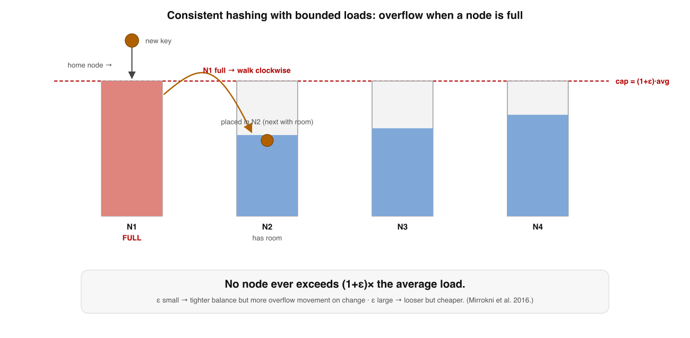

# Consistent Hashing — Deep Dive

*A supplement to Book 5, Lessons 6 and 8. The intro drew the ring: nodes on a circle, each key owned by the next node clockwise, "adding a node remaps only one arc." Correct, and it skips the three things that decide whether your ring works in production: why the obvious alternative is catastrophic, why a plain ring is badly unbalanced (and how virtual nodes fix it), and what to do when one key still runs hot. It also skips the fact that you may not want a ring at all. This goes to the floor.*

Dense. Read it after Lessons 6 and 8 have settled.

---

## Where Lessons 6 and 8 stopped: `mod N` is the enemy

Before the ring, understand what it is escaping. The obvious way to spread `K` keys across `N` nodes is **`hash(key) mod N`**. It is perfectly balanced and O(1) — and it falls apart the instant `N` changes. Add one node (`N → N+1`) and for almost *every* key, `hash(key) mod (N+1) ≠ hash(key) mod N`. The expected fraction of keys that stay put is about `1/(N+1)` — so **nearly all keys move.** For a sharded store that means re-shuffling almost the entire dataset across the network on every scaling event. For a cache it is worse: every key now hashes to the wrong node, every lookup misses, and the stampede hits your database at once (Book 5, Lesson 6).

> **Consistent hashing exists for one property:** when a node is added or removed, only about **`K/N`** keys move — one node's worth — instead of nearly all of them. Everything else about it is in service of that, and of keeping the load even while doing it.

---

## 1. The ring: what actually moves on a membership change

Map both nodes and keys into the **same** hash space — a circle of, say, `0 … 2³²−1` (Dynamo uses `2¹⁶⁰`). A node is placed at `hash(node_id)`; a key is owned by the **first node clockwise** from `hash(key)`. A lookup is a *successor search*: binary-search the sorted list of node positions for the next one clockwise — `O(log N)`.

The defining behaviour is local:

- **Add a node** at position `p`: it claims only the keys in the arc between `p` and the node *counter-clockwise* of it (its new predecessor). Those keys — about `K/N` of them — move *from one existing node* to the newcomer. **Every other key stays put.**
- **Remove a node**: its arc's keys fall to its clockwise successor. Again ~`K/N` keys move, to *one* node.

That locality is the whole win over `mod N`, which has no notion of "neighbour" — it scatters every key on every change. But the ring has bought the locality at a price the intro glossed over: **the arcs are not equal.**

---

## 2. The load-imbalance problem, and virtual nodes

Drop `N` nodes at random positions on the ring and you do **not** get `N` equal arcs. Random placement produces arcs of wildly different lengths, so the node owning the biggest arc owns far more than its share. The precise result: with `N` randomly placed nodes, the largest arc is `Θ((log N)/N)` of the ring with high probability — the most-loaded node can hold a factor of **`log N`** times the average. With a handful of nodes the imbalance is brutal: one node routinely owns 2–3× another. A ring of plain nodes is a hot-spot generator.

The fix is **virtual nodes** (vnodes, or "tokens"). Each *physical* node is hashed to many positions on the ring — say `V = 100–200` of them — so `N` physical nodes scatter `N·V` points around the circle.

A physical node's load is now the *sum* of its `V` little arcs, and summing `V` independent random pieces is an averaging machine: the per-node load concentrates around `1/N` with a standard deviation that shrinks like `1/√V`. In practice `V ≈ 100–200` brings every node within a few percent of uniform. Vnodes pay three dividends at once:

1. **Balance** — the `1/√V` smoothing above.
2. **Graceful failure** — when a physical node dies, its many vnodes' arcs are inherited by many *different* successors, so its load is spread across the cluster rather than dumped entirely onto one unlucky neighbour (which would just move the hot spot).
3. **Heterogeneity** — a machine with twice the capacity simply gets twice as many vnodes, so weighting is free.

This is why every real system — Dynamo, Cassandra, Riak — uses tokens/vnodes, never a bare ring. (Cassandra historically defaulted to 256 tokens per node, later reduced with a smarter allocation algorithm.)

---

## 3. Bounded loads: when one key still runs hot

Vnodes balance the *keyspace*, but they assume keys are uniformly popular. They are not. A single viral key, or a skewed access pattern, can hammer one node no matter how evenly the ring is divided — because that one key has exactly one home. Worse, in a cache or load-balancer setting the "items" are live connections or requests, and their count per node can drift far from average even with vnodes.

**Consistent Hashing with Bounded Loads** (Mirrokni, Thorup & Zadimoghaddam, Google, 2016) adds a hard cap. Pick a slack `ε > 0` and cap every node at `(1 + ε) ×` the average load. Place a key at its normal ring position — but if that node is **already at capacity**, walk clockwise to the next node that has room.

This guarantees **no node ever exceeds `(1+ε)` times average**, while preserving the consistency property (a membership change still moves only a bounded fraction of keys). The knob is `ε`: small `ε` gives tight balance but more overflow reassignment when things change; large `ε` is looser but cheaper. Google Cloud's load balancing and HAProxy's `balance` modes use exactly this idea. It is the answer to "vnodes balanced my keyspace but node 7 is still on fire."

---

## 4. You don't actually need a ring

The ring is the famous answer, not the only one — and for many problems it is not even the best one.

**Rendezvous hashing (Highest Random Weight, HRW)** (Thaler & Ravishankar, 1998) skips the ring entirely. For a key `k`, compute `w = hash(k, node)` for *every* node and assign `k` to the node with the **highest** weight. That is it — no ring, no vnodes, no token bookkeeping.

- **Minimal disruption, for free:** removing a node only affects the keys whose *highest* weight was that node; each is recomputed to its next-highest — exactly `K/N` keys move, the same guarantee as the ring.
- **Balance, for free:** weights are independent uniform, so the argmax is uniform — no `log N` imbalance, no vnodes needed.
- **Weighting:** a weighted-HRW variant supports heterogeneous nodes.
- **Cost:** `O(N)` per lookup. Fine for tens or low-hundreds of nodes (the common case); for very large `N` you go back to a ring or a hierarchy.

For small-to-medium clusters, HRW is often *simpler and more balanced* than a vnode ring, which is why it shows up in replica selection and many proxies. Know it; it is frequently the right tool.

**Jump consistent hash** (Lamping & Veach, Google, 2014) is a different trade. It is five lines, uses **no memory**, is extremely fast, perfectly balanced, and remaps minimally — but it maps a key to a bucket in `0 … N−1` and you can only grow or shrink at the **high end**. You cannot pull out an arbitrary middle node and leave the rest fixed, and there are no per-node weights. So jump hash is ideal for **resharding a numbered range of shards** (going from 8 shards to 10) and wrong for **arbitrary cluster membership** where any node may fail. Picking it for the wrong job is a classic mistake — it is gorgeous and narrow.

| Scheme | Lookup | Balance | Arbitrary removal | Weights |
|---|---|---|---|---|
| Ring + vnodes | O(log N) | good (needs vnodes) | yes | yes (more vnodes) |
| Rendezvous (HRW) | O(N) | excellent | yes | yes |
| Jump hash | O(log N) | perfect | **no** (high-end only) | **no** |

---

## 5. Replication: the preference list (and racks)

One last piece the intro waved at. In a key-value store (Book 5, Lesson 8) a key isn't stored on one node but replicated on `N`. The replicas are the **next `N` nodes clockwise** — but with a catch vnodes create: you must walk to `N` **distinct *physical* nodes**, skipping any additional vnodes that belong to a physical node you already picked. Otherwise all your "replicas" could land on the same machine, and a single failure loses the key. Better still, skip to distinct *racks / availability zones* so a rack power loss doesn't take all `N` replicas. This ordered list of distinct physical targets is Dynamo's **preference list**, and it is precisely the set of nodes the `R + W > N` quorum from Book 1 operates over. Consistent hashing decides *which* nodes hold a key; the quorum decides *how many must agree* — the two ideas compose into the whole storage layer.

---

## Self-Check — Consistent Hashing Deep Dive

Answer from memory before the key.

**Q1.** Adding one node under `hash(key) mod N` is catastrophic because…

- (a) nearly every key remaps, since mod (N+1) differs for almost all
- (b) the new node is placed at a random position on the hash ring
- (c) the hash function must be recomputed for the whole keyspace
- (d) keys are moved one extra hop clockwise to the nearest node

**Q2.** Virtual nodes reduce load imbalance on a hash ring because…

- (a) they shrink the hash space so fewer collisions ever happen
- (b) a node's load is a sum of many arcs, so variance falls as 1/√V
- (c) they let each key be owned by several nodes simultaneously
- (d) they remove the need to search clockwise for a key's owner

**Q3.** Consistent hashing with bounded loads handles a hot node by…

- (a) rehashing every key with a brand-new hash function instantly
- (b) overflowing keys clockwise once a node hits its capacity cap
- (c) deleting the least-recently-used keys from the busy node
- (d) splitting the hot key across two adjacent nodes on the ring

**Q4.** Jump consistent hash is the wrong choice when you need to…

- (a) reshard a numbered range of shards from eight up to ten
- (b) remove an arbitrary failed node and keep the others fixed
- (c) map keys to buckets with zero memory and high speed
- (d) keep remapping minimal as the bucket count grows at the end

## Answer Key

- **Q1 → (a).** `mod N` has no notion of locality; changing `N` changes the result for almost every key, so nearly the whole keyspace moves.
- **Q2 → (b).** Each physical node owns `V` small arcs; averaging `V` independent pieces concentrates load around `1/N` with std dev shrinking like `1/√V`.
- **Q3 → (b).** A per-node cap of `(1+ε)×` average; a key whose home node is full walks clockwise to the next node with capacity, bounding the max load.
- **Q4 → (b).** Jump hash only grows/shrinks at the high end of a `0…N−1` range; it cannot remove an arbitrary middle node while leaving the rest stable.

---

## Sources

- **Karger, Lehman, Leighton, Panigrahy, Levine & Lewin — "Consistent Hashing and Random Trees" (STOC 1997).** The original.
- **DeCandia et al. — "Dynamo: Amazon's Highly Available Key-value Store" (2007).** Virtual nodes / tokens and the preference list in practice.
- **Mirrokni, Thorup & Zadimoghaddam — "Consistent Hashing with Bounded Loads" (2016/2018).** The capacity-cap refinement.
- **Thaler & Ravishankar — "A Name-Based Mapping Scheme for Rendezvous" (HRW, 1998).** Rendezvous hashing.
- **Lamping & Veach — "A Fast, Minimal Memory, Consistent Hash Algorithm" (Jump hash, Google, 2014).**
- **Kleppmann — DDIA, Chapter 6** ("Partitioning"): hash partitioning, rebalancing, and why fixed `mod N` is avoided.
