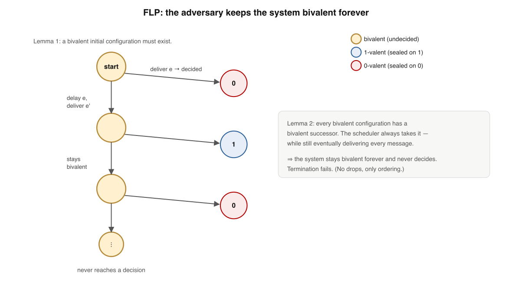
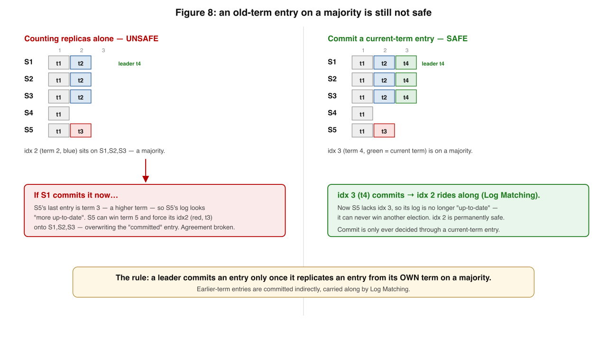
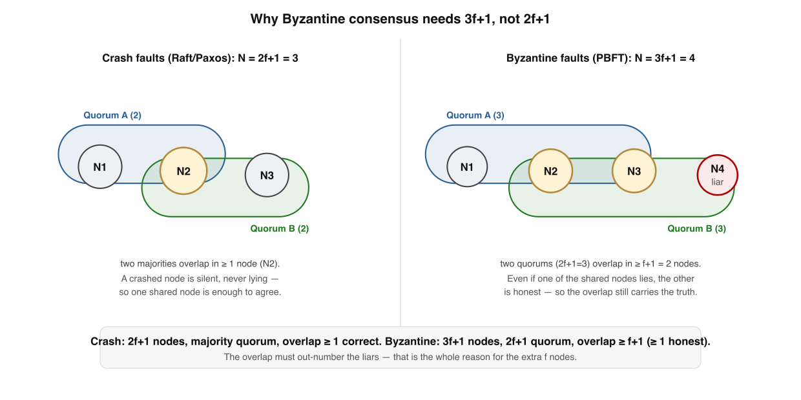

# Consensus — Deep Dive

*A supplement to Book 1, Lesson 8. The intro gave you the consensus problem, the FLP headline, quorums, and the shape of Raft. This goes to the floor: why FLP is actually true, exactly what makes Raft safe, the one commitment rule everyone gets wrong, how clusters change membership without splitting in two, and what changes when nodes don't just crash but lie.*

This is dense. Read it after Lesson 8 has settled, and take the diagrams slowly.

---

## Where Lesson 8 stopped

Lesson 8 told you consensus must satisfy **agreement** (no two correct nodes decide differently), **validity** (a decided value was proposed), and **termination** (every correct node eventually decides) — and that **FLP** says you cannot guarantee all three, deterministically, in an asynchronous system where even one node may crash. It told you Raft elects a leader by majority vote and replicates a log, committing an entry once a majority store it.

All true, and all incomplete. Each of those sentences hides a subtlety that separates "I read the Raft paper" from "I could implement it without a safety bug." Five of them, in order.

---

## 1. FLP, actually proved: the bivalence argument

The intuition in Lesson 8 — "an adversary can delay the deciding message forever" — is the *shape* of the proof, but the real argument (Fischer, Lynch & Paterson, *JACM* 1985) is sharper and worth seeing, because it tells you precisely *where* the impossibility lives.

Model the whole system as a **configuration**: every node's internal state plus every message currently in transit. A configuration is:

- **0-valent** if *every* run reachable from it decides 0 — the outcome is already sealed, even if no node knows it yet.
- **1-valent** — symmetrically sealed on 1.
- **bivalent** if *both* 0 and 1 are still reachable. The future is genuinely undecided.

The proof is two lemmas.

> **Lemma 1 — a bivalent start exists.** Line up all the initial input vectors so neighbours differ in one node's input. The all-0 input is 0-valent, the all-1 is 1-valent, so somewhere along the line two neighbours have *different* valence. They differ in one node's input — so if that one node crashes immediately, the two runs are indistinguishable to everyone else and must decide the same value. That forces at least one of the neighbours to be **bivalent**.

> **Lemma 2 — bivalence is inescapable.** Take a bivalent configuration and any message `e` that is pending. Claim: you can always deliver some (possibly empty) sequence of *other* messages first and then deliver `e`, landing in *another* bivalent configuration. Suppose not — suppose past some point every way of delivering `e` leads to a univalent configuration. Then there is a single **critical step** where delivering `e` versus delivering some other message `e'` sends the system to *opposite* valences. But `e` and `e'` either touch different nodes (so they commute — deliver both, contradiction) or the same node (so that node could crash right after, making the two outcomes indistinguishable to everyone else — contradiction). Either way the "critical step" cannot exist.

Put them together: start bivalent (Lemma 1); from any bivalent configuration the adversary can keep the system bivalent while still delivering every message eventually (Lemma 2), so it never reaches a univalent — never decides. **Termination fails, while every message is still eventually delivered.** That last clause is the dagger: the adversary isn't allowed to drop messages or crash more than one node; it only chooses *order*. Impossibility comes from asynchrony alone.

What FLP does **not** say: it does not say consensus is impossible in practice. It says no *deterministic* protocol can *guarantee termination* in a *purely asynchronous* model. Relax any one of those — add randomisation (Ben-Or), or assume **partial synchrony** (the network is eventually well-behaved, Dwork–Lynch–Stockmeyer 1988) — and consensus becomes solvable. Every real protocol below takes the partial-synchrony escape: it keeps safety *always* and gets liveness *once the network calms down*.

---

## 2. Raft is safe because of five properties — and one of them is subtle

Raft (Ongaro & Ousterhout, USENIX ATC 2014) guarantees correctness through five invariants that always hold:

| # | Property | Plain meaning |
|---|----------|---------------|
| 1 | **Election Safety** | at most one leader per term |
| 2 | **Leader Append-Only** | a leader never overwrites or deletes its own log, only appends |
| 3 | **Log Matching** | if two logs hold an entry with the same index *and* term, all entries before it are identical |
| 4 | **Leader Completeness** | if an entry is committed in some term, it is present in the log of every leader of every later term |
| 5 | **State Machine Safety** | no two servers ever apply a *different* command at the same log index |

Properties 1–3 are mechanical. **Leader Completeness (4) is the one that makes the whole thing work**, and it is not obvious — why should a brand-new leader necessarily already contain every committed entry? It is never told what was committed.

The answer is the **election restriction**. When a follower receives a `RequestVote`, it refuses its vote unless the candidate's log is *at least as up-to-date* as its own — compare the term of the last entry first, then the index. Now the argument:

- A committed entry sits on a **majority** of nodes (that is what "committed" means).
- To win, a candidate needs votes from a **majority**.
- Two majorities overlap (Lesson 8's quorum trick), so at least one voter holds the committed entry.
- That voter only grants its vote if the candidate is at least as up-to-date — i.e. the candidate's log also contains that entry (or something strictly newer that supersedes it).

So a candidate that is *missing* a committed entry can never assemble a majority. **The up-to-date check, run at vote time, is what guarantees a leader is never missing committed history.** Raft moves the hard safety work into the *election*, not the replication.

---

## 3. The commitment gotcha — Raft's Figure 8

Here is the rule almost everyone states wrong on a first reading, and the single most important subtlety in Raft.

**Naive (wrong) rule:** "an entry is committed once it is stored on a majority of nodes." That is the rule for an entry from the *current* leader's term. It is **not safe** for an entry from a *previous* term — such an entry can sit on a majority and *still be overwritten later*.

Walk the canonical scenario (five nodes, S1–S5), following the diagram:

- **(a)** S1 is leader in term 2 and replicates entry `idx2` to S1, S2.
- **(b)** S1 crashes. S5 wins term 3 (votes from S3, S4, S5 — their logs are short, so the up-to-date check passes) and accepts a *different* `idx2` in term 3, on S5 only.
- **(c)** S5 crashes. S1 restarts, wins term 4, and re-replicates its old `idx2` (term 2) to a majority — S1, S2, S3 now all hold `idx2(term 2)`.

At this moment `idx2(term 2)` is on **three of five nodes — a majority**. If S1 declared it committed here, disaster:

- **(d)** S1 crashes. S5 can win term 5 (votes from S2, S3, S4 — S5's last entry is `idx2(term 3)`, which is a *higher term* than their `idx2(term 2)`, so S5's log is "more up-to-date" and the votes are granted). New leader S5 then forces its `idx2(term 3)` onto everyone, **overwriting the entry we just called committed.** Agreement violated.

The fix is one sentence in the paper and easy to miss:

> **A leader only counts an entry as committed once it has stored an entry from its *own* current term on a majority.** Earlier-term entries are then committed *indirectly*, carried along by Log Matching.

So in step (c), S1 must *not* commit `idx2(term 2)` by replica count. It waits until it replicates a fresh `idx3(term 4)` on a majority. The instant `idx3(term 4)` commits, the up-to-date check makes it impossible for S5 to ever win again (S5 lacks `idx3`), so `idx2` is now safe too. **Commitment is only ever decided through a current-term entry; the past rides along.** Miss this and you will ship a consensus implementation that loses committed data under a specific crash sequence — and it will pass every test that does not reproduce exactly this interleaving.

---

## 4. Changing the cluster without splitting it in two

A cluster's membership is not fixed — nodes are added and retired. The danger: if you switch every node from the old set `C_old` to the new set `C_new` at slightly different moments, there is an instant when `C_old` and `C_new` can each form a **majority independently**, elect **two leaders**, and diverge. Membership change is itself a consensus problem, and a naive change breaks Election Safety.

Raft's answer is **joint consensus**. The cluster transitions through an intermediate configuration `C_old,new` in which every decision — elections and commits alike — requires a majority of `C_old` **and** a majority of `C_new`, separately and simultaneously. Because any decision needs both, two disjoint majorities cannot form during the transition. The sequence is: commit `C_old,new` (now both old and new nodes participate jointly), then commit `C_new` (the old-only nodes can retire). At no single point does the system allow two independent majorities. (Simpler single-server-at-a-time changes were added later; the joint-consensus idea is the one to understand.)

---

## 5. The landscape: you do not have to use Raft

Raft is one point in a design space dominated for decades by **Paxos** (Lamport, 1998 / "Paxos Made Simple", 2001). The map:

| Protocol | Idea | Trade-off |
|----------|------|-----------|
| **Paxos (single-decree)** | agree on *one* value via prepare/promise then accept/accepted, around a quorum of acceptors | proven minimal, famously hard to understand and to turn into a real system |
| **Multi-Paxos** | a stable leader runs a *sequence* of Paxos instances — i.e. a replicated log | the practical form; what most "Paxos" systems mean |
| **Raft** | the same guarantees, redesigned for understandability: a strong leader, terms, the election restriction | easier to implement correctly; the strong-leader bottleneck is a throughput ceiling |
| **EPaxos / leaderless** | no fixed leader; exploit that *commuting* commands need no agreed order | lower latency and no leader hotspot, at the cost of real complexity |

They all provide the same safety. Raft and Multi-Paxos are *crash-fault-tolerant* (CFT): they assume nodes fail by stopping, not by lying. Which is the last, biggest step.

---

## 6. When nodes lie: Byzantine consensus and the 3f+1 wall

Everything so far assumed the **crash-fault** model: a node is either correct or stopped. Drop that. A **Byzantine** node (Lamport, Shostak & Pease, 1982) can do *anything* — send conflicting messages to different peers, forge values, collude. This is the model for systems that cross trust boundaries: blockchains, and any protocol where a participant might be compromised.

The headline number changes. To tolerate `f` faulty nodes:

| Fault model | Nodes needed | Quorum | Why |
|-------------|-------------|--------|-----|
| **Crash** (CFT — Raft, Paxos) | **2f + 1** | f + 1 (a majority) | any two majorities overlap in ≥ 1 node, which is correct (it didn't lie) |
| **Byzantine** (BFT — PBFT) | **3f + 1** | 2f + 1 | any two quorums overlap in ≥ f + 1 nodes, so ≥ 1 of the overlap is *honest* |

The reason for the jump: under crash faults, a quorum that overlaps another in *one* node is enough, because that one shared node is trustworthy. Under Byzantine faults the shared node might be the liar, so you need the overlap to contain **more honest nodes than faulty ones** — which forces quorums of `2f+1` out of `3f+1`, intersecting in `f+1`, of which at least one is honest. **PBFT** (Castro & Liskov, 1999) made this practical with a three-phase protocol (pre-prepare, prepare, commit). Nakamoto consensus (Bitcoin) reaches a *probabilistic* Byzantine agreement through proof-of-work instead of fixed quorums; modern chains (Tendermint, HotStuff) are descendants of PBFT.

You will almost never implement BFT inside one company's datacenter — there, crash faults are the honest model and 2f+1 Raft is right. Reach for the `3f+1` machinery only when participants genuinely cannot trust each other.

---

## Self-Check — Consensus Deep Dive

Answer from memory before the key.

**Q1.** FLP proves consensus is impossible specifically when the system is…

- (a) deterministic, asynchronous, and one node may crash
- (b) randomised, synchronous, and every node stays alive
- (c) leaderless, partitioned, and messages may be dropped
- (d) Byzantine, partly synchronous, and clocks are skewed

**Q2.** In Raft, a brand-new leader is guaranteed to hold every committed entry because…

- (a) the previous leader hands its full log over before it stops
- (b) voters deny their vote unless the candidate's log is up-to-date
- (c) committed entries are broadcast to every node before commit
- (d) the candidate replays the whole log from the first offset

**Q3.** A Raft leader must treat an entry as committed only once it has…

- (a) stored that entry on every single follower in the cluster
- (b) replicated an entry from its own current term on a majority
- (c) received an acknowledgement from the previous term's leader
- (d) written the entry to its local disk and called fsync on it

**Q4.** Byzantine consensus needs 3f+1 nodes rather than 2f+1 because…

- (a) the extra nodes give the protocol a faster commit path
- (b) quorum overlap must contain at least one honest member
- (c) lying nodes consume twice the network bandwidth budget
- (d) the leader has to sign every message that it broadcasts

## Answer Key

- **Q1 → (a).** FLP is about a *deterministic* protocol in a *purely asynchronous* model tolerating a *single* crash; relax any of those and consensus becomes solvable.
- **Q2 → (b).** The election restriction: a vote is granted only to an at-least-as-up-to-date candidate, and majority overlap forces that candidate to already hold every committed entry.
- **Q3 → (b).** Counting replicas is safe only for a *current-term* entry; earlier-term entries on a majority can still be overwritten (Figure 8) until a current-term entry commits and carries them.
- **Q4 → (b).** With Byzantine faults the shared node in a quorum overlap might be the liar, so the overlap must be large enough (f+1) to contain an honest node — which forces 2f+1 quorums out of 3f+1.

---

## Sources

- **Fischer, Lynch & Paterson — "Impossibility of Distributed Consensus with One Faulty Process" (*JACM* 1985).** The bivalence proof.
- **Dwork, Lynch & Stockmeyer — "Consensus in the Presence of Partial Synchrony" (1988).** The escape hatch every real protocol uses.
- **Ongaro & Ousterhout — "In Search of an Understandable Consensus Algorithm (Raft)" (2014).** §5.4 is Leader Completeness and Figure 8; read it after this.
- **Lamport — "The Part-Time Parliament" (1998) / "Paxos Made Simple" (2001).**
- **Lamport, Shostak & Pease — "The Byzantine Generals Problem" (1982);** **Castro & Liskov — "Practical Byzantine Fault Tolerance" (1999).**
- **Kleppmann — DDIA, Chapter 9** ties consensus to total-order broadcast and linearizability.
