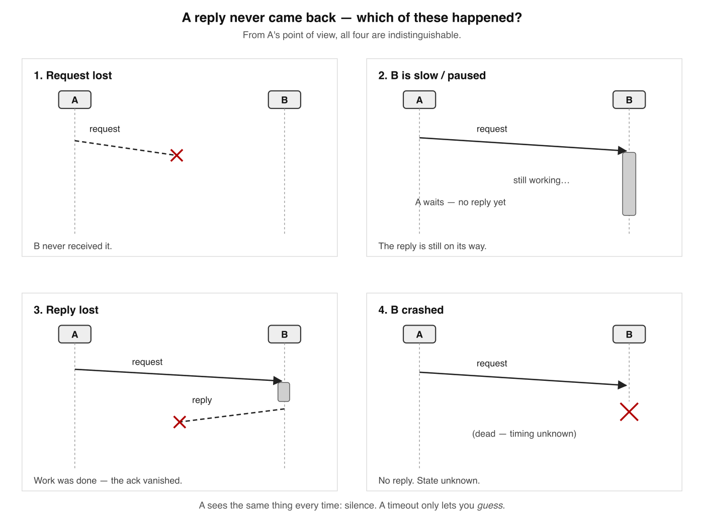
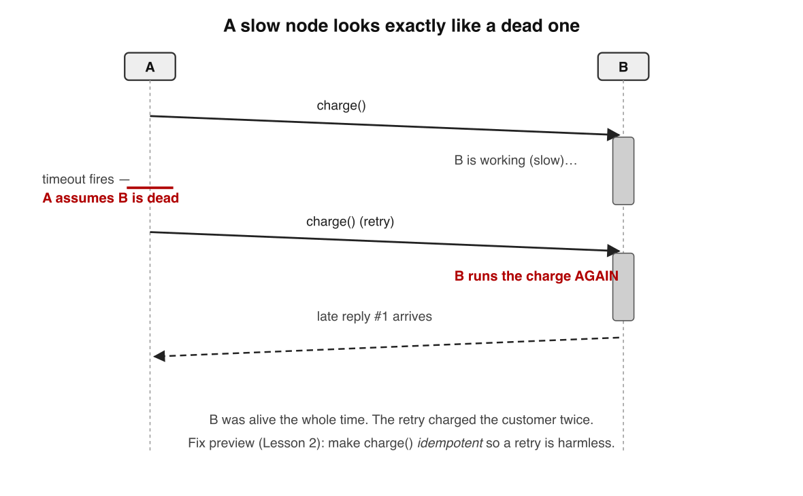
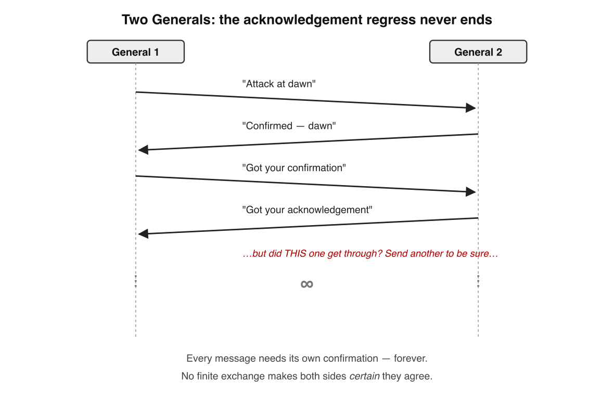
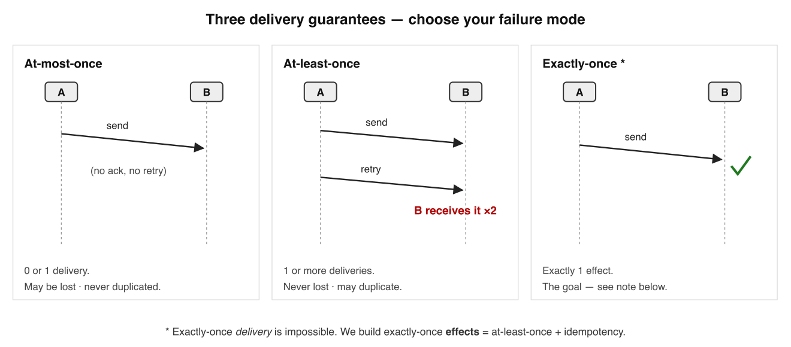
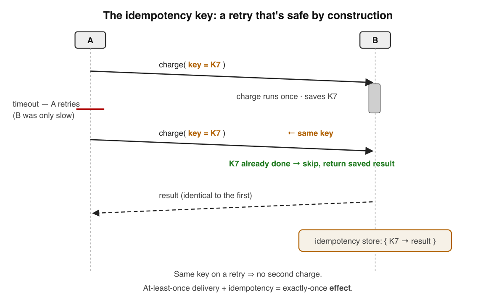
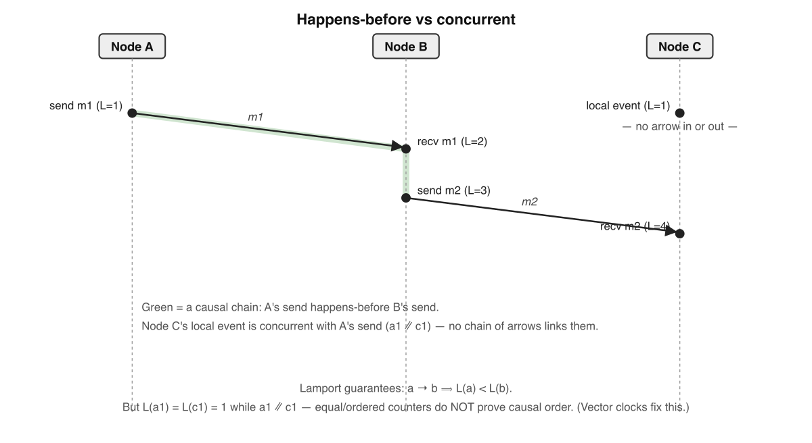
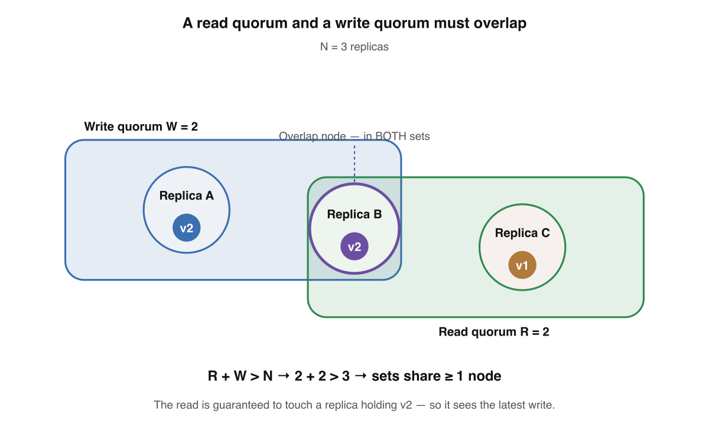
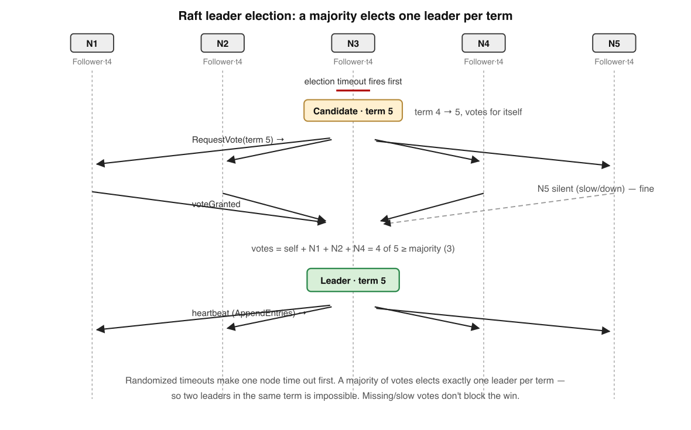
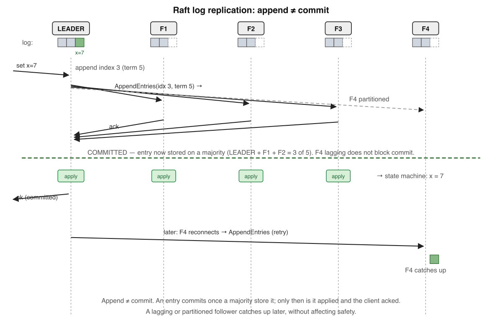

# Distributed Systems — Fundamentals

*A guided, multi-session learning track. One tight win per lesson — not a textbook to swallow in one sitting.*

---

## How to use this document

**Mission.** You're learning general distributed-systems theory to build deep, durable intuition and become a stronger backend engineer. Not to cram for an interview, not tied to any one codebase — the portable fundamentals that make every async, multi-service system make sense.

**Method.** Each lesson teaches *one* idea, gives you a concrete win, and ends with a short self-check. The self-check is the point: recalling an answer from memory builds far stronger retention than re-reading. Always try the questions *before* you look at the answer key. Diagrams use the standard **space-time notation**: time flows *downward*, each vertical line is a node, and arrows are messages. A short **expert corner** at the end of each lesson adds senior-level depth you can skip on a first pass.

**I'm your teacher.** This document is a starting point, not the whole story. When something is unclear, or you want a worked example, or you want to go deeper — ask. That conversation is where the real learning happens.

**Reading on Kindle.** This is delivered as EPUB so the text reflows to your font size. Use the table of contents to jump between sections.

---

## Course Map — the full path

Where this series is going, lesson by lesson. Skim it now to see the shape of the journey; come back to it to track progress. Each lesson builds on the one before, so the order matters — and each ships as a refreshed version of this book.

**How every lesson is built:** prose → **space-time diagrams** → a **self-check** (recall before peeking) → an **expert corner** for senior-level depth → new **glossary** terms.

| #  | Lesson | The single win | Status |
|----|--------|----------------|--------|
| 1  | **The One Hard Truth** | Why you can never tell "slow" from "dead" | ✅ Built |
| 2  | Talking Across the Gap | Delivery guarantees + **idempotency** | ✅ Built |
| 3  | What Time Is It? | No global clock; logical time | ✅ Built |
| 4  | Order & Causality | Partial order; broadcast | ✅ Built |
| 5  | Replication | Leader/follower, multi-leader, leaderless | ✅ Built |
| 6  | Consistency Models | Eventual → causal → linearizable | ✅ Built |
| 7  | CAP & PACELC | The real trade-offs | ✅ Built |
| 8  | Consensus | FLP impossibility + **Raft** | ✅ Built |
| 9  | Partitioning / Sharding | Splitting data without hot spots | ✅ Built |
| 10 | Putting It Together | The resilience pattern toolkit | ✅ Built |

### The steps inside each lesson

**Lesson 1 — The One Hard Truth** ✅ *(this book)*
Partial failure → the four indistinguishable causes → timeouts are a guess → the Two Generals Problem → the 8 Fallacies → why it matters at work → *expert corner:* end-to-end argument, failure detectors, FLP, the exactly-once myth.

**Lesson 2 — Talking Across the Gap** ✅ *(this book)*
RPC vs messaging → delivery guarantees (at-most-once / at-least-once / exactly-once) → why exactly-once *delivery* is impossible → **idempotency** and idempotency keys → deduplication → *expert corner:* idempotent vs commutative, "effectively-once", the outbox teaser.

**Lesson 3 — What Time Is It?** ✅ *(built)*
No global clock & clock skew → physical vs logical time → the happens-before relation → Lamport clocks → vector clocks → *expert corner:* Spanner's TrueTime, hybrid logical clocks.

**Lesson 4 — Order & Causality** ✅ *(built)*
Total vs partial order → causal order → broadcast abstractions (best-effort → reliable → FIFO → causal → total) → *expert corner:* state-machine replication.

**Lesson 5 — Replication** ✅ *(built)*
Why replicate (fault tolerance, latency, throughput) → single-leader → multi-leader & conflicts → leaderless quorums (R + W > N) → replication lag and its anomalies → *expert corner:* chain replication, anti-entropy.

**Lesson 6 — Consistency Models** ✅ *(built)*
The spectrum → eventual consistency → session guarantees (read-your-writes, monotonic reads) → causal consistency → linearizability and its cost → *expert corner:* consistency vs isolation (two different words).

**Lesson 7 — CAP & PACELC** ✅ *(built)*
What CAP actually says (and the myths) → CP vs AP under partition → PACELC (the latency/consistency trade *even without* partitions) → *expert corner:* CAP critiques, how real databases classify themselves.

**Lesson 8 — Consensus** ✅ *(built)*
The consensus problem → FLP impossibility (callback to Lesson 1) → quorums & majorities → Raft leader election → Raft log replication → *expert corner:* Paxos vs Raft, Byzantine fault tolerance.

**Lesson 9 — Partitioning / Sharding** ✅ *(built)*
Why partition → key-range vs hash partitioning → rebalancing → hot spots & skew → request routing → *expert corner:* consistent hashing, partitioning secondary indexes.

**Lesson 10 — Putting It Together** ✅ *(built)*
Retries + backoff + jitter → idempotency keys revisited → the outbox pattern → sagas → the exactly-once illusion (effects vs delivery) → the end-to-end argument as a design rule → *expert corner:* a resilient-pipeline checklist you can reuse at work.

---

## Lesson 1 — The One Hard Truth: You Can Never Know

### Why this is lesson one

Almost everything in distributed systems — timeouts, retries, idempotency, quorums, leader election, consensus, the whole zoo of consistency models — exists to work around **one** fundamental limitation. If you learn the techniques first, they feel like arbitrary trivia. If you learn the limitation first, the techniques become *obvious responses to an obvious problem*.

So we start with the problem. By the end of this lesson you'll have one durable mental model that the rest of the series hangs off.

### The defining trait: partial failure

In a normal program running on one machine, failure is **total and knowable**. The process either runs or it crashes, and when it crashes, *it* is the thing that stopped — you find out immediately, in the same place, with a stack trace.

A distributed system is different. It is a set of **nodes** (separate machines or processes) that can only interact by sending **messages** over a network. And now failure becomes **partial**: one node can die while every other node keeps running, perfectly healthy, completely unaware.

> **Partial failure** is the defining characteristic of a distributed system: some parts work while others have failed, and the working parts often *cannot tell which is which*.

This is the source of nearly all the difficulty. (Kleppmann calls his chapter on this, fittingly, "The Trouble with Distributed Systems" — *Designing Data-Intensive Applications*, Ch. 8.)

### The four indistinguishable causes

Here is the crux. You are Node A. You send a request to Node B and wait. The deadline passes and you've heard **nothing back**. What happened?

It is exactly one of these — and **you have no way to tell which**:

1. **The request was lost.** It never reached B.
2. **B is slow.** The request arrived, but B is overloaded, paused (e.g. a long garbage-collection stall), or still working. The reply is coming — eventually.
3. **The reply was lost.** B received it, did the work, sent a response — and *that* message vanished on the way back.
4. **B is dead.** It crashed before, during, or after handling your request.

From A's seat, all four produce the **identical** observation: *"I sent something and heard nothing."* The network gives you no signal that distinguishes them. (This is the "unreliable networks" argument in DDIA Ch. 8.)

Notice the trap in cases 3 and 4: **the work may already be done.** B might have charged the credit card, written the row, sent the email — and you, the caller, will never know. This is why "just retry on error" is a *loaded* statement, and why Lesson 2 is about idempotency.

### Timeouts are a guess, not a truth

Since you can't wait forever, you pick a **timeout**: wait *N* seconds, then *assume* failure and act. But notice what a timeout actually is — **a guess dressed up as a fact.** It does not detect failure; it *declares* it.

And there's no correct value for *N*:

- **Too short** → you declare a node that was merely *slow* to be *dead* (a false positive). You retry or fail over — and now the original operation and your "replacement" might **both** run. Double charges. Split brain.
- **Too long** → you sit there hanging while a genuinely dead node holds up the system. Slow failure detection, frustrated users, cascading queues.

Why can't we just compute the right *N*? Because a real network is, for practical purposes, an **asynchronous** system: there is **no guaranteed upper bound** on how long a message can take or how long a node can pause. A synchronous model *assumes* such a bound; reality doesn't grant one. With no upper bound on delay, no timeout can ever be *provably* correct — only a pragmatic trade-off. (DDIA Ch. 8, "Timeouts and Unbounded Delays.")

### The Two Generals Problem

You might hope a cleverer protocol — more acknowledgements, more handshakes — could escape this. It can't, and there's a clean proof: the **Two Generals Problem**.

Two allied generals are camped on hills on opposite sides of a city they want to capture. They will win *only if they attack at the same time*. Their *only* way to communicate is to send a messenger through the valley below — where the enemy may capture the messenger (the message is lost).

General A sends: *"Attack at dawn."* Should he now attack? Not yet — he doesn't know the messenger got through. So B, on receiving it, sends back: *"Confirmed, dawn."* But now **B** can't attack with confidence — *B* doesn't know *that* confirmation arrived. So A must acknowledge the acknowledgement… which itself might be lost… requiring an acknowledgement of *that*…

The regress never ends. **No finite exchange of messages can ever make both generals *certain* they agree.** This was the first problem proven *unsolvable* in computer communication.

> **The lesson:** guaranteed, certain agreement over an unreliable channel is **impossible** — not "hard," *impossible*. (Kleppmann, Cambridge Distributed Systems, Lecture 2.)

What we do in practice is *not* solve it — we make agreement **probable enough**: retries, acknowledgements, and timeouts push the odds of a successful round-trip arbitrarily high, while accepting that "certain" is off the table. Engineering distributed systems is the craft of building reliably on top of this permanent uncertainty.

### The 8 Fallacies of Distributed Computing

The same hard truth shows up in a famous checklist. In the 1990s, engineers at Sun Microsystems (Deutsch, Gosling, and others) listed the **false assumptions** newcomers reliably make. They are still the single most-cited sanity check in the field:

| # | Fallacy | What bites you |
|---|---------|----------------|
| 1 | The network is reliable | Messages get lost; "it sent" ≠ "it arrived" |
| 2 | Latency is zero | A remote call is *thousands* of times slower than a local one |
| 3 | Bandwidth is infinite | Big payloads choke; chattiness saturates links |
| 4 | The network is secure | Anything on the wire can be read or forged unless you protect it |
| 5 | Topology doesn't change | Nodes, routes, and IPs move; hard-coding them breaks |
| 6 | There is one administrator | Many owners, many configs, many ways to be misaligned |
| 7 | Transport cost is zero | Serialization, bandwidth, and infra all cost real money and CPU |
| 8 | The network is homogeneous | Mixed hardware, protocols, and versions never behave uniformly |

Every fallacy is a special case of *"the network is not the friendly, instant, reliable thing your single-machine intuition assumes."* (See the [Wikipedia summary](https://en.wikipedia.org/wiki/Fallacies_of_distributed_computing) and Rotem-Gal-Oz's ["Fallacies Explained" PDF](https://arnon.me/wp-content/uploads/Files/fallacies.pdf).)

### The single win

If you take **one** thing from this lesson, take this:

> When a remote call doesn't answer, you **cannot know** whether it failed, succeeded, or is still running. Every distributed-systems technique you will ever learn is a strategy for making good decisions *despite* that permanent uncertainty.

You should now be able to, without looking:

- name the **four indistinguishable causes** of a missing reply, and
- explain why the **Two Generals Problem** means certain agreement over a lossy channel is impossible.

### Why this matters for your day job

This isn't academic. The "can't tell slow from dead" truth is the root of real, expensive bug classes:

- A payment call **times out** — but the charge actually went through. Your retry double-charges the customer. (Fix: idempotency — Lesson 2.)
- A health check marks a *slow* node **dead** and triggers a failover. Now two nodes think they're the leader. (Split brain — Lessons 7–8.)
- A "send confirmation email" request times out, you retry, and the user gets the email **twice**.

A senior engineer reads code that says `await chargeCard()` and immediately asks: *"What happens if this times out but succeeds?"* That instinct — treating every network boundary as a place where the four causes lurk — is exactly what this lesson installs.

### Going deeper — expert corner

*Optional depth. Skip it on a first pass; come back once the core idea is solid. Every lesson ends with one of these.*

- **TCP doesn't rescue you.** TCP gives reliable, ordered bytes *within a live connection* — but connections break, and a TCP-level ACK means "the kernel received bytes," not "the application processed your request." The four causes live at the *application* layer no matter how reliable the transport. This is the **end-to-end argument**: correctness checks belong at the endpoints, not in the network (Saltzer, Reed & Clark, 1984).
- **You can't *detect* failure — only *suspect* it.** Theory captures this with **failure detectors**, rated by *completeness* (do dead nodes eventually get suspected?) and *accuracy* (are live nodes wrongly suspected?). Production systems often use an **accrual** detector — e.g. the φ-accrual detector in Cassandra and Akka — that emits a continuous *suspicion level* instead of a binary alive/dead, turning the timeout into a tunable knob (Chandra & Toueg, 1996; Hayashibara et al., 2004).
- **This has a deeper, computational cousin.** Two Generals is the *communication* impossibility. Its *computation* counterpart is the **FLP result** (Fischer, Lynch & Paterson, 1985): in a fully asynchronous system, no deterministic protocol can guarantee it reaches consensus if even one node may crash. Real consensus (Raft, Paxos) sidesteps FLP by using timeouts and randomness to get termination *in practice*, not in theory. We unpack this in Lesson 8.
- **"Exactly-once" is a marketing word.** Exactly-once *delivery* is impossible for exactly the reasons above. Exactly-once *effects* are achievable — through idempotency keys and deduplication. Keeping that distinction sharp separates engineers who *say* "exactly-once" from those who can *build* it (Lessons 2 and 10).

---

### Self-Check — Lesson 1

Answer all four from memory **before** opening the answer key below. Effortful recall is what makes this stick.

**Q1.** You call another service and your timeout fires with no reply. How many fundamentally different, indistinguishable causes could be responsible?

- (a) Two distinct causes
- (b) Three distinct causes
- (c) Four distinct causes
- (d) Five distinct causes

**Q2.** A timeout in an asynchronous network is best described as…

- (a) a proof that the remote node has crashed
- (b) a guess that trades false alarms against latency
- (c) a guarantee the request was never delivered at all
- (d) a feature that removes the need for any retries

**Q3.** The Two Generals Problem proves that over an unreliable channel you cannot guarantee…

- (a) that any single message will be delivered once
- (b) that two parties reach certain, shared agreement
- (c) that messages will arrive in the order they were sent
- (d) that the underlying network will remain fully secure

**Q4.** *(Spot the fallacy.)* A teammate says: *"Just retry on every error — the extra calls don't really cost anything."* Which fallacy is that?

- (a) The network is secure as designed
- (b) The system topology will never change
- (c) Transport cost is effectively always zero
- (d) There is exactly one administrator here

---

### Answer Key — Lesson 1

*Scroll-stop: make sure you've answered all four above first.*

- **Q1 → (c) Four.** Lost request · node slow/paused · lost reply · node dead. All look identical from the caller's side.
- **Q2 → (b) A guess that trades false alarms against latency.** A timeout *declares* failure, it doesn't *detect* it. Too short → false positives; too long → slow detection. With unbounded network delay there is no provably-correct value.
- **Q3 → (b) Two parties reaching certain, shared agreement.** Each acknowledgement could itself be lost, so no finite message exchange yields mutual certainty. We settle for "probable enough," never "certain."
- **Q4 → (c) Transport cost is effectively zero** (with a side of *latency is zero* / *bandwidth is infinite*). Retries consume CPU, bandwidth, and downstream load — and worse, they can re-run work that already succeeded.

If any answer surprised you, that's the signal for where to ask me a follow-up.

---

## Lesson 2 — Talking Across the Gap: At-Least-Once and Idempotency

### Where we left off

Lesson 1 ended on a cliffhanger: a request that times out might have *already succeeded*, so a blind retry can run the work twice — the double-charge. This lesson is the fix. We'll see what guarantees the network can actually give you, why "exactly-once" is a myth in the form people usually mean it, and how **idempotency** turns an unsafe retry into a safe one.

### Two ways nodes talk

Before guarantees, two communication styles worth naming:

- **RPC (remote procedure call)** — you call a remote node like a local function and wait for the response. Synchronous, request/response. Familiar — but every call is a network boundary where Lesson 1's four causes lurk.
- **Messaging** — you hand a message to a **broker** (a queue or log, like a mailbox) and the receiver picks it up later. Asynchronous, decoupled in time. The sender waits only for the broker to *accept* the message, not for the work to finish.

Different shapes, *same underlying problem*: the sender still can't be certain the far side processed the message. So both need a delivery guarantee.

### The three delivery guarantees

When you send something and might not hear back, you get to pick **one** of three guarantees — and each trades away a different failure mode:

- **At-most-once** — send and forget. No acknowledgement, no retry. Arrives zero or one times: it may be **lost**, but is **never duplicated**. Cheapest; fine for throwaway data (metrics, telemetry) where a gap doesn't matter.
- **At-least-once** — retry until you get an acknowledgement. **Never lost** — but because a retry can follow a reply that was merely *slow* (Lesson 1!), it may be **delivered more than once**. This is the default in most real systems: Kafka consumers, SQS, webhooks.
- **Exactly-once** — delivered and processed precisely once. The dream — and, as a *delivery* guarantee over an unreliable network, **impossible**. Here's why.

### Why exactly-once *delivery* is impossible

Return to Lesson 1. When your message goes unacknowledged, you have exactly two moves: **resend** or **don't**.

- Resend → you risk a **duplicate** (the original may have gotten through). That's at-least-once.
- Don't → you risk a **loss** (it may not have). That's at-most-once.

There is no third door. The network won't tell you which case you're in, so no protocol can hand you "delivered, exactly once" purely at the delivery layer. (It's the Two Generals result wearing work clothes.)

So practitioners stop chasing exactly-once *delivery* and instead build exactly-once **effects**: choose at-least-once (never lose anything), then make the *processing* tolerate duplicates. That second half is **idempotency**.

### Idempotency: the duplicate-proof property

> An operation is **idempotent** if doing it many times has the same effect as doing it once.

That's the whole idea — and it's the most useful single property in distributed systems. Some operations are naturally idempotent; some aren't:

| Idempotent | Not idempotent |
|---|---|
| `balance = 100` (absolute set) | `balance = balance + 10` (relative) |
| `DELETE /orders/42` | `POST /orders` (makes a new one each call) |
| "mark invoice #7 as paid" | "increment the login counter" |
| add an element to a set | append a row to a log |

The HTTP spec bakes this in: **GET, PUT, and DELETE are idempotent; POST is not.** If an operation is *already* idempotent, a duplicate delivery is harmless and you're done. The interesting case is the one that isn't — like "charge $10."

### Idempotency keys: making any operation safe to retry

You can give a non-idempotent operation an idempotent *interface* with an **idempotency key**:

1. The **client** generates a unique key for each *logical* operation (a UUID) and reuses that **same key** on every retry of it.
2. The **server**, before doing the work, checks a store — *have I seen this key?*
   - **No** → do the work, save `key → result`, return the result.
   - **Yes** → skip the work, return the **saved** result.

Now the timed-out retry from Lesson 1 is harmless: it carries the same key, the server recognises it, and returns the original result *without charging twice*. This is exactly how Stripe's payment API works (the `Idempotency-Key` header), and why every serious payment and webhook integration uses one.

### Deduplication: the same idea, receiver-side

In messaging, the mirror image is **deduplication**. A broker delivering at-least-once tags each message with an ID; the consumer records the IDs it has already processed and **drops repeats**. You get exactly-once processing *within the dedup window* — the span of history the consumer still remembers. Remember forever and storage grows without bound; remember for an hour and a very late duplicate could slip through. The window is the knob.

### Why this matters for your day job

Idempotency is the workhorse you'll reach for constantly:

- **Payment endpoints** — an idempotency key is the difference between one charge and an angry customer.
- **Webhook handlers** — Stripe, GitHub, and others deliver each event *at-least-once*; your handler must act on `event.id` once and ignore repeats.
- **Queue / stream consumers** — Kafka and SQS are at-least-once by default. "We'll just retry on failure" is only safe when the consumer is idempotent.

The senior instinct from Lesson 1 — *"what if this times out but succeeded?"* — now has a senior answer: *"make it idempotent so I can retry without fear."*

### Going deeper — expert corner

*Optional depth. Skip on a first pass.*

- **Idempotent ≠ commutative ≠ associative.** Idempotency defends against *duplicates*, not *reordering*. If two *different* operations can arrive out of order, idempotency won't save you — you need ordering (Lessons 3–4) or genuinely order-independent operations (CRDTs). Don't conflate "safe to repeat" with "safe in any order."
- **"Exactly-once" in real systems is scoped, not magical.** Kafka's exactly-once semantics (an idempotent producer via producer-ID + sequence number, plus transactions) hold *within Kafka's own read-process-write boundary*. The instant you cause an external side effect — charge a card, send an email — you're back to idempotency keys. Always ask: *exactly-once across which boundary?*
- **The dual-write problem (outbox teaser).** Writing to your database *and* publishing to a broker as two separate steps is a trap: either can fail (Lesson 1), leaving them inconsistent. The **outbox pattern** writes the event into an outbox table *in the same DB transaction* as the state change, and a separate relay publishes it at-least-once. Two unreliable writes become one atomic write + one idempotent publish. Full treatment in Lesson 10.
- **Idempotency keys have sharp edges.** The key must identify the *logical operation* and be generated **once by the client**, not regenerated per attempt. Two concurrent retries with the same key can both pass the "seen it?" check before either writes — a race that double-executes. Defend with a unique constraint or a lock on the key, and give the key store a deliberate TTL.

### Self-Check — Lesson 2

Answer all four from memory before opening the key.

**Q1.** At-least-once delivery never loses a message, but in exchange it may…

- (a) deliver the very same message more than once
- (b) silently drop messages whenever traffic is heavy
- (c) demand a network with a known upper delay bound
- (d) stop the sender from ever retrying a failed send

**Q2.** "Exactly-once delivery" over an unreliable network is best understood as…

- (a) the standard guarantee that message brokers ship
- (b) impossible — so we build exactly-once effects instead
- (c) reachable only by turning off all network retries
- (d) just another name for at-most-once with no acks

**Q3.** Which one of these operations is **idempotent**?

- (a) add ten dollars to the current account balance
- (b) set the account balance to one hundred dollars
- (c) append one more row onto the orders table log
- (d) create a brand-new charge for ten dollars each

**Q4.** An idempotency key keeps a retry safe because the server…

- (a) runs the operation faster on the second attempt
- (b) returns the saved result instead of re-running it
- (c) refuses any request that omits a valid key value
- (d) signs the payload so that it can never be replayed

### Answer Key — Lesson 2

*Scroll-stop: answer all four first.*

- **Q1 → (a) Deliver the same message more than once.** A retry can follow a reply that was only slow, so the receiver sees a duplicate — the price of never losing anything.
- **Q2 → (b) Impossible — build exactly-once effects instead.** An unacknowledged send forces you to risk either a duplicate or a loss; there's no delivery-layer escape. Exactly-once = at-least-once + idempotency.
- **Q3 → (b) Set the balance to 100.** An absolute set lands on the same value no matter how many times it runs; the others accumulate or create something new each call.
- **Q4 → (b) Returns the saved result instead of re-running it.** The first request does the work and stores `key → result`; any retry with that key gets the stored result, with no re-execution.

The double-charge from Lesson 1 is now closed. Next we ask the question quietly underneath all of this: *in what order did things actually happen?*

---

## Lesson 3 — What Time Is It? (No Global Clock; Logical Time)

### Where we left off

In Lesson 1 you accepted that a message can be lost, delayed, or duplicated, and you cannot tell which. In Lesson 2 you made operations safe against that uncertainty with idempotency keys. Now a subtler question: when two of your nodes both did something, *which happened first?* You will discover there is no honest answer in terms of wall-clock time, and that the fix is to stop asking about time and start asking about cause.

### No global clock & clock skew (why NTP is not enough)

Every machine has a quartz crystal driving its clock. Crystals drift with temperature and age, so two clocks that agree now will disagree later. The rate of disagreement is *clock drift*; the accumulated difference between two clocks at a moment is *clock skew*. Typical quartz drift is on the order of tens of parts per million — roughly 200 ppm, about 17 seconds per day if uncorrected (Kleppmann, *DDIA*, Ch. 8, "Unreliable Clocks").

NTP (the Network Time Protocol) exists to pull each machine back toward a reference clock by exchanging timestamps with a server. It helps, but it does not give you a shared instant. NTP's own accuracy is bounded by the round-trip time to the server and is asymmetric when the network path differs in each direction; in practice synchronization error over the public internet is commonly tens of milliseconds and can spike far higher under load (Kleppmann, *DDIA*, Ch. 8). Worse, NTP can step the clock *backwards*, so a later reading can be *smaller* than an earlier one — a monotonicity violation that quietly breaks any code comparing two `Date.now()` values.

The trap is the "last write wins" conflict resolution: two replicas accept writes, each stamps its write with its local wall clock, and the larger timestamp wins. With even a few milliseconds of skew, the write that genuinely happened *second* can carry the *smaller* timestamp and be silently discarded. The data loss is invisible — no error, no log line.

> **There is no global clock in a distributed system.** Wall-clock timestamps from different machines are not comparable to decide ordering, because clock skew can make a later event carry an earlier timestamp. (Lamport, 1978; Kleppmann, *DDIA*, Ch. 8.)

### Physical vs logical time

Distinguish two things a clock can tell you.

| Kind | What it answers | Failure mode |
|---|---|---|
| Physical / time-of-day | "What is the wall-clock instant?" | Skew, drift, backward jumps |
| Monotonic | "How much time has elapsed locally?" | Only valid within one machine |
| Logical | "What is the order of events?" | Carries no real-time meaning |

A *monotonic clock* (e.g. `System.nanoTime`, `CLOCK_MONOTONIC`) only ever moves forward and is perfect for measuring a local duration — but its value is meaningless across machines. A *logical clock* abandons real time entirely. It is just a counter, designed to capture *order*, not *duration* (Lamport, 1978, "Time, Clocks, and the Ordering of Events in a Distributed System"). For most coordination problems — who held the lock first, which update supersedes which — you do not actually need real time. You need order. Logical time gives you order without lying about the clock.

### The happens-before relation (Lamport)

Lamport's insight was to define ordering from things the system can actually observe. He defined a relation, written `a → b` and read "*a* happens before *b*", by three rules:

1. If *a* and *b* are events on the **same node** and *a* comes first, then `a → b`.
2. If *a* is the **sending** of a message and *b* is the **receipt** of that same message, then `a → b`.
3. **Transitivity**: if `a → b` and `b → c`, then `a → c`.

Happens-before is a *partial* order: some pairs of events are simply unordered. If neither `a → b` nor `b → a`, the events are **concurrent**, written `a ∥ b`. Concurrent does *not* mean "at the same wall-clock time" — it means *causally independent*: no chain of local steps and messages connects one to the other, so neither could have influenced the other (Lamport, 1978; Kleppmann, *Cambridge Distributed Systems* lectures, "Time and clocks").

In the diagram, A's send of `m1` happens-before B's send of `m2`, because B sends `m2` only after it received `m1` — there is a causal chain `send(m1) → recv(m1) → send(m2)`. But C's local event is concurrent with A's send: trace any path of arrows and you can reach neither from the other. That distinction — *ordered by cause* vs *concurrent* — is the whole game.

### Lamport clocks

A *Lamport clock* is the smallest mechanism that respects happens-before. Each node keeps an integer counter `L`, and:

- On any local event, increment: `L = L + 1`.
- On send, increment then attach `L` to the message.
- On receive of a message carrying timestamp `t`, set `L = max(L, t) + 1`.

The guarantee is one-directional: **if `a → b`, then `L(a) < L(b)`** (Lamport, 1978). The `max` step is what propagates causal knowledge — a receiver's clock jumps ahead so it can never appear "earlier" than a message it has already seen.

But the converse is false. `L(a) < L(b)` does **not** imply `a → b`; they might be concurrent and just happen to have different counters. In the diagram, C's event and A's send both sit at small Lamport values with no causal link. So a Lamport clock lets you build a *total* order (break ties by node id) that never contradicts causality — useful for a tie-break in a distributed lock — but it *cannot tell you whether two events were concurrent*. The information was thrown away the moment everything collapsed into a single integer.

### Vector clocks (and how they detect concurrency)

To recover concurrency detection, give each node not one counter but a *vector* of counters — one slot per node. This is the vector clock (Fidge, 1988; Mattern, 1989, independently). With `N` nodes, each node holds `V[1..N]`:

- On a local event, increment your own slot: `V[self] += 1`.
- On send, increment your own slot, then attach the whole vector.
- On receive of vector `W`, take the element-wise max — `V[i] = max(V[i], W[i])` for every `i` — then increment your own slot.

Compare two vectors element-wise:

- `V(a) ≤ V(b)` in **every** slot (and they differ) ⟹ `a → b`.
- `V(b) ≤ V(a)` in every slot ⟹ `b → a`.
- Neither dominates — some slot bigger in `a`, another bigger in `b` ⟹ `a ∥ b`, **concurrent**.

Now the test is exact: `a → b` **if and only if** `V(a) < V(b)`, and incomparability *is* the definition of concurrency (Mattern, 1989; Kleppmann, *DDIA*, Ch. 5, "Detecting Concurrent Writes"). Where a Lamport clock answers "is this order consistent with causality?", a vector clock answers the stronger "were these two events causally related, or genuinely concurrent?" The cost is size: the vector grows with the number of participating nodes. That is exactly how a system like Dynamo decides that two replica versions conflict and must be merged or handed to the application, rather than blindly picking the larger wall-clock timestamp.

### Going deeper — expert corner

*Optional depth. Skip on a first pass.*

- **Lamport clocks give a consistent *total* order, vector clocks give the *partial* causal order.** They answer different questions; neither is "better." Lamport's 1978 paper actually uses the total order to build a fully distributed mutual-exclusion algorithm — the timestamp is the queue priority. (Lamport, 1978.)
- **Vector clocks cost O(N) per message.** Real systems prune dormant entries or use *dotted version vectors* to bound growth and avoid false conflicts under client churn. (Preguiça et al., "Dotted Version Vectors," 2010.)
- **You can have physical-ish time *and* causality.** Google's *TrueTime* exposes clock uncertainty as an interval `[earliest, latest]` and makes Spanner *wait out* the uncertainty to deliver externally-consistent ordering — buying with bounded latency what skew otherwise steals. (Corbett et al., "Spanner," OSDI 2012.)
- **Hybrid Logical Clocks (HLC)** fuse a physical timestamp with a Lamport counter, so values stay close to wall time yet never violate happens-before — the practical default in many modern stores. (Kulkarni et al., "Logical Physical Clocks," 2014.)

### Self-Check — Lesson 3

**Q1. Why are wall-clock timestamps from two different machines unsafe for deciding which event happened first?**
(a) Clocks tick too slowly to resolve the gap between events
(b) Clock skew can make the later event carry the smaller timestamp
(c) Timestamps use different epochs on each operating system
(d) The network reorders the timestamps while they are in flight

**Q2. Two events `a` and `b` are *concurrent* under happens-before when:**
(a) they were recorded at the same wall-clock instant
(b) they ran on the same node within one millisecond
(c) neither one can be reached from the other by causal links
(d) both events touched the same key on the same replica

**Q3. A Lamport clock guarantees that if `a → b` then `L(a) < L(b)`. What can it *not* do?**
(a) order two events that occurred on the same node
(b) propagate a counter forward across a sent message
(c) decide whether two events were concurrent or causal
(d) provide a total order once ties are broken by node id

**Q4. What does a vector clock provide that a Lamport clock does not?**
(a) a smaller message footprint as the cluster grows
(b) real wall-clock time accurate to the millisecond
(c) immunity to clock drift on the underlying hardware
(d) an exact test distinguishing causal order from concurrency

### Answer Key — Lesson 3

- **Q1 — (b).** Skew between independent clocks can invert the timestamp order, so the later write may carry the smaller value and be silently dropped under last-write-wins.
- **Q2 — (c).** Concurrency is causal independence — no chain of local steps and messages connects the two events — not wall-clock coincidence.
- **Q3 — (c).** Collapsing causality into one integer loses the information needed to tell concurrency from causal order; `L(a) < L(b)` does not imply `a → b`.
- **Q4 — (d).** Element-wise vector comparison makes `a → b` hold *iff* `V(a) < V(b)`, so incomparable vectors precisely identify concurrent events.

---

## Lesson 4 — Order & Causality: Broadcasting Without a Clock

### Where we left off

Lesson 3 gave you the *happens-before* relation: a way to say "event A could have caused event B" without trusting any clock. That relation is only useful if your system actually *respects* it. This lesson is where the abstract ordering of happens-before turns into a concrete delivery rule — and where you meet the ladder of **broadcast** guarantees that every replicated system is secretly climbing.

### Total vs partial order

Start with what "order" even means once you have many machines.

A **total order** is a single line: every pair of events is comparable, so for any two events you can always say which came first. Your wristwatch imposes a total order on your own day. A single-threaded program has one too — line 1 before line 2, always.

A **partial order** is weaker and more honest. Some pairs are ordered; others are genuinely **incomparable** — neither happened before the other, because no chain of cause-and-effect connects them. The happens-before relation from Lesson 3 *is* a partial order. If Alice posts a comment and, on the other side of the world, Bob (who never saw it) posts an unrelated one, the two posts are **concurrent**: not "simultaneous on a clock," but causally unrelated. Forcing them into a total order would be inventing an ordering the universe never supplied.

> A **total order** makes every pair of events comparable; a **partial order** orders only the pairs connected by cause-and-effect and leaves **concurrent** events deliberately unordered.

Hold onto that word *concurrent* — it is the load-bearing idea. Distributed systems are partial orders by nature, and the whole game is deciding how much *extra* ordering you are willing to pay for. (Kleppmann, *Designing Data-Intensive Applications*, Ch. 9, "Ordering Guarantees"; Cambridge Distributed Systems notes, Lecture 4.)

### Causal order: preserving cause-and-effect

The minimum order worth preserving is **causal order**: if A *happens-before* B, then everyone must observe A before B. Concurrent events may be seen in any order — and crucially, in *different* orders by different nodes — and that is fine, because no one could tell the difference.

Why insist on this? Because violating it produces observably broken behavior. The canonical example is the reply that overtakes its question:

1. Alice broadcasts: *"Has anyone seen my keys?"* (message M1)
2. Bob receives M1 and broadcasts a reply: *"They're on the table."* (message M2)

M1 *happens-before* M2 — Bob's reply causally depends on the question. Now consider Carol. If the network delivers M2 to Carol *before* M1, Carol reads *"They're on the table"* with no idea what "they" are. The reply arrived before the message it answers. Nothing crashed; the system is simply **incoherent**.

Causal broadcast is the rule that says: *don't deliver M2 to Carol until you've delivered M1.* The receiver holds back a message until everything it causally depends on has already been delivered. This is precisely the guarantee Birman and Joseph built into the ISIS system's causal broadcast — track each message's causal dependencies and **delay delivery** until they are satisfied (Birman & Joseph, "Reliable Communication in the Presence of Failures," 1987). Note what it does *not* do: it makes no promise about the order of concurrent messages, because there is no right answer to invent.

### Broadcast abstractions as a hierarchy

"Broadcast" means one node sends a message and every node in the group should receive it. That single phrase hides a ladder of guarantees, each rung adding exactly one promise on top of the one below. This is the spine of Kleppmann's broadcast lectures, and it is worth memorising as a ladder rather than a list — because each step is *strictly stronger* and *strictly more expensive* than the last.

| Rung | Adds this promise | Concretely |
|---|---|---|
| **Best-effort** | nothing — try once | senders may crash mid-send; some nodes get it, others don't |
| **Reliable** | all-or-nothing | if *any* correct node delivers it, *every* correct node eventually does |
| **FIFO** | per-sender order | messages from the *same* sender arrive in send order |
| **Causal** | happens-before order | if A happened-before B, every node delivers A before B |
| **Total order** | one global order | *all* nodes deliver *all* messages in the **same** sequence |

Read it bottom-up. **Best-effort** broadcast simply forwards once and hopes; a sender crash can leave the group split. **Reliable** broadcast closes that gap — it guarantees the *set* of delivered messages is the same everywhere, but says nothing about order. **FIFO** broadcast adds that one sender's messages keep their relative order (but two senders can still interleave freely). **Causal** broadcast is strictly stronger than FIFO: it preserves order across senders whenever a causal chain links them — and it *contains* FIFO, since a sender's own messages are always causally ordered. **Total-order** broadcast (also called **atomic broadcast**) is the top: every node agrees on one identical sequence for *every* message, even concurrent ones.

The jump from causal to total order is the expensive one. Causal order can be enforced *locally* — each node carries enough dependency metadata (think vector clocks from Lesson 3) to decide when to deliver, with no agreement needed. Total order cannot. To make every node agree on a single sequence for concurrent messages, the nodes must *agree* — and agreement, as you'll see, is the hard problem of the whole field.

### Teaser: total-order broadcast ≈ state-machine replication ≈ consensus

Here is the punchline that makes this lesson matter for everything ahead.

Suppose you want a fault-tolerant service: several replicas, each holding a copy of the same state, that must never disagree. The classic recipe is **state-machine replication** — start every replica from the same initial state and feed all of them the *same sequence of commands in the same order*. A state machine is deterministic, so identical inputs in an identical order yield identical state. Every replica ends up a perfect copy of every other (Schneider, "Implementing Fault-Tolerant Services Using the State Machine Approach," 1990).

But "the same sequence of commands in the same order, delivered reliably to every replica" *is* total-order broadcast. The two are not similar — they are the **same problem wearing two hats**. And it turns out a third hat fits the same head: solving **consensus** (getting nodes to agree on one value) lets you build total-order broadcast, and total-order broadcast lets you solve consensus. They are **equivalent** — each can be reduced to the other (DDIA Ch. 9, "Total Order Broadcast" and "Consensus"; Kleppmann Cambridge notes, Lecture 6).

That equivalence is why total order is the costly top rung. It is also why Lesson 1's impossibility results haunt us here: if consensus is provably impossible in a fully asynchronous system that can lose a node (the FLP result, Lesson 1's expert corner), then so is total-order broadcast in that same model. Real systems — Raft, ZooKeeper's atomic broadcast, Kafka's controller — escape *in practice* with timeouts and leaders, which is exactly the territory of Lesson 8. For now, carry one mapping: **need every replica to agree on one order → you need total-order broadcast → you need consensus.**

### Why this matters for your day job

You climb this ladder constantly without naming it:

- A **Kafka partition** gives you total order *within a partition* (one log, one sequence) but only FIFO-per-producer guarantees across the topic — which is why "order matters" features must land on one partition.
- A **replicated database** that stays consistent is doing state-machine replication under the hood; its replication log *is* a total-order broadcast.
- A **collaborative editor** or an eventually-consistent store often needs only *causal* order — cheaper, no consensus — and tolerates concurrent edits via merge rules. Reaching for total order there is over-engineering.

The senior instinct: when someone says "the events came out of order," your first question is *which* order did they need — FIFO, causal, or total? Picking the lowest rung that still satisfies the requirement is the entire art.

### Going deeper — expert corner

*Optional depth. Skip on a first pass.*

- **Causal broadcast does not need consensus; total order does.** This is the sharp dividing line. Causal delivery is enforceable with local metadata (vector clocks / dependency sets) and zero agreement, so it stays available under network partitions. Total order requires the nodes to *agree* on a sequence, which is consensus, which is unavailable under partition. This split is the seed of the CAP theorem (Lesson 7). See Kleppmann Cambridge notes, Lecture 6, and DDIA Ch. 9.
- **Causal is the strongest order you can have while staying always-available.** A landmark result (Mahajan, Alvisi & Dahlin, "Consistency, Availability, and Convergence," 2011; foreshadowed by Birman) shows causal consistency is, in a precise sense, the *most* you can guarantee without sacrificing availability under partition. That is why so many "AP" stores top out at causal.
- **FIFO ⊂ causal ⊂ total, but each is a real algorithm with real cost.** FIFO needs only a per-sender sequence number; causal needs a vector of them; total needs a leader or a consensus round per message (or per batch). The metadata grows with the strength of the guarantee — a concrete reason not to over-order.
- **Total-order broadcast is *non-blocking* consensus.** Plain consensus decides one value, once. Total-order broadcast is consensus run *repeatedly* to agree on an unbounded stream of messages — which is exactly why Raft's log and ZooKeeper's Zab are described as atomic-broadcast protocols rather than one-shot consensus (Junqueira et al., "Zab: High-performance broadcast for primary-backup systems," 2011).

### Self-Check — Lesson 4

Answer all four from memory before opening the key.

**Q1.** Two events are **concurrent** in a distributed system precisely when…

- (a) they are stamped with the exact same wall-clock time
- (b) neither one happened-before the other in causal order
- (c) they were produced by two threads on a single machine
- (d) they were broadcast to the group within the same second

**Q2.** Causal broadcast guarantees that a reply is delivered after its question, but it makes **no** promise about…

- (a) the relative order of two concurrent, unrelated messages
- (b) whether a causally-prior message is delivered first
- (c) that a happens-before chain is respected by every node
- (d) the delivery of a message that a later one depends on

**Q3.** Moving from **causal** broadcast up to **total-order** broadcast is the costly step because total order additionally requires…

- (a) a per-sender counter attached to each outgoing message
- (b) the nodes to agree on one sequence for concurrent messages
- (c) each receiver to drop any message it has already delivered
- (d) a reliable channel that never loses or duplicates a message

**Q4.** State-machine replication keeps replicas identical by feeding them…

- (a) the same commands in the same order from a shared log
- (b) periodic full snapshots taken from the current leader
- (c) only the commands that changed since the last sync point
- (d) independent command streams merged later by a resolver

### Answer Key — Lesson 4

*Scroll-stop: answer all four first.*

- **Q1 → (b) Neither one happened-before the other.** Concurrency is the absence of a causal link, not closeness on a clock — two events stamped seconds apart can still be concurrent, and two at the same instant can be causally ordered.
- **Q2 → (a) The order of two concurrent, unrelated messages.** Causal broadcast only constrains pairs linked by happens-before; concurrent messages may be delivered in any order, even different orders on different nodes.
- **Q3 → (b) The nodes to agree on one sequence for concurrent messages.** Causal order is enforceable locally with no agreement, but a single global order over concurrent messages demands consensus — the expensive ingredient.
- **Q4 → (a) The same commands in the same order from a shared log.** A deterministic state machine fed identical, identically-ordered inputs lands in identical state; that ordered log is exactly total-order broadcast.

Next we ask what happens when you actually *copy* that ordered log onto many machines — the trade-offs of leaders, followers, and quorums. That's replication.

---

## Lesson 5 — Replication: Single-Leader, Multi-Leader, Leaderless

### Where we left off

In Lessons 1 and 2 you held one machine talking to another and learned that even a single message is a guess. Now you have the same data living on *several* machines at once. Replication is the discipline of keeping those copies in useful agreement despite the partial failures, lost messages, and timeouts you already know are unavoidable. Everything that follows is a consequence of those earlier truths — read this as "what idempotency and unreliable networks force on you once there is more than one copy."

> **Replication** means keeping a copy of the same data on multiple machines connected by a network. The hard part is never storing the bytes — it is *propagating writes* so that the copies stay close enough to consistent to be useful. (DDIA, Ch. 5, "Replication".)

### Why replicate

There are exactly three reasons, and naming them keeps you honest about which one you are buying.

- **Fault tolerance.** If one replica dies, another can serve the data. A single machine has a hard availability ceiling; copies raise it.
- **Latency.** Put a replica geographically near each user and reads travel a shorter distance. Speed-of-light delay is one of the eight fallacies from Lesson 1 ("latency is zero" is false), and replication is the main weapon against it.
- **Throughput.** Many replicas can serve reads in parallel, multiplying read capacity beyond what one machine's disk and CPU allow.

DDIA Ch. 5 frames all replication strategies as variations on one question: *when a client writes, which replicas must acknowledge before the write is considered done, and how do the rest catch up?* The three architectures below are three answers.

### Single-leader replication

The default, and the one almost every relational database ships with. Designate one replica the **leader** (also "primary" or "master"). All writes go to the leader. Each other replica is a **follower** (also "secondary" or "read replica"). When the leader applies a write, it sends the change to every follower over a **replication log**; followers apply changes in the same order. Reads can be served by any replica.

This is appealing because there is exactly one place where write ordering is decided, so there are **no write conflicts** — the leader serializes everything. The cost is that the leader is a single point of failure for writes. If it crashes, you must run a **failover**: promote a follower to leader. Failover is where the demons live — detecting the leader is actually dead (Lesson 1's four indistinguishable causes mean you can never be *sure*), choosing a sufficiently up-to-date follower, and preventing **split brain**, where two nodes both believe they are leader and accept conflicting writes (DDIA, Ch. 5, "Handling Node Outages").

Replication can be **synchronous** (the write waits for the follower to confirm — durable but slow, and one stalled follower blocks the write) or **asynchronous** (the leader confirms immediately and follow­ers catch up later — fast, but a leader crash can lose acknowledged writes). Most systems run **semi-synchronous**: one synchronous follower for durability, the rest async.

### Multi-leader replication and write conflicts

Sometimes one leader is not enough — you run a leader in each datacenter so writes are local and fast, or you let an offline client (a phone, a collaborative editor) act as its own leader and sync later. Now **more than one node accepts writes**, and each propagates to the others.

The new problem is unavoidable: two leaders can accept **conflicting writes** to the same record concurrently, and neither saw the other's write at the time. There is no single serialization point to prevent it, so the conflict must be *resolved after the fact*. Your options (DDIA, Ch. 5, "Handling Write Conflicts"):

| Strategy | What it does | The catch |
|---|---|---|
| Last-write-wins (LWW) | Keep the write with the highest timestamp | Silently discards data; clocks disagree |
| Application merge | App code reconciles both versions | More logic, but no silent loss |
| Conflict-free types (CRDTs) | Data structures that merge deterministically | Limited to certain data shapes |

Note that "last write" assumes you can order events by time across machines — and Lesson 1 told you clocks across machines are not trustworthy. LWW is the easy default and the one that quietly loses writes. Prefer it only when losing a concurrent write is genuinely acceptable.

### Leaderless replication and quorums

The third architecture, made famous by **Amazon's Dynamo** (DeCandia et al., "Dynamo: Amazon's Highly Available Key-value Store," SOSP 2007), drops the leader entirely. Any replica accepts writes directly. To avoid going stale, the client (or a coordinator) sends each write to *several* replicas and each read *to several* replicas, then uses **quorums** to guarantee freshness.

Let **N** be the number of replicas holding a key, **W** the number that must acknowledge a write, and **R** the number queried on a read. The freshness guarantee is a single inequality:

> **R + W > N.** If the set of nodes a read contacts and the set a write contacted must together exceed N, then by the pigeonhole principle they share at least one node — so every read overlaps every recent write and sees the latest value. (DDIA, Ch. 5, "Quorums for Reading and Writing"; Dynamo, 2007.)

A concrete worked example with **N = 3, W = 2, R = 2** (so R + W = 4 > 3): a write succeeds once two of the three replicas confirm it. A later read queries two of the three. Whichever two the read picks, at least one of them was in the write set — so the read returns the new value (using a version number to pick the freshest among the responses). You get fault tolerance (one node can be down and both quorums still succeed) without a leader. Set **W = N, R = 1** for fast reads at the cost of fragile writes, or **W = 1, R = N** for the reverse. Dynamo's insight was that **W and R are tunable knobs**, not fixed laws.

Two cautions. Quorum overlap guarantees a read *sees* a latest write — it does not by itself give you linearizability (the strict "every read sees the latest write, globally" guarantee), because edge cases like concurrent writes and failed writes that partially applied still leak older values (DDIA, Ch. 5, "Limitations of Quorum Consistency"; Ch. 9). And replicas that missed a write must heal — Dynamo uses **read repair** (the read updates stale replicas it noticed) and **anti-entropy** (a background process compares replicas).

### Replication lag and read anomalies

Because asynchronous and leaderless replication let a write be acknowledged before *all* replicas have it, there is always a window — the **replication lag** — when different replicas disagree. Read from a lagging replica and you see anomalies. DDIA Ch. 5 ("Problems with Replication Lag") names three you must design against:

- **Read-your-own-writes.** You submit a comment, then reload and the comment is gone — your read hit a replica that has not yet caught up. Fix: route a user's own reads to the leader (or a known-current replica) for a while after they write.
- **Monotonic reads.** You refresh twice; the first read shows new data, the second shows older data because it hit a more-lagged replica — time appears to run backwards. Fix: pin each user to one replica so they never move *backward* through the log.
- **Consistent prefix reads.** You see an answer before the question it replies to, because the two writes propagated to your replica out of causal order. Fix: ensure causally related writes land on the reader in order (often via partition-aware routing).

These are not exotic — they are the routine cost of trading consistency for the latency and throughput you replicated to get. Knowing their names is half the cure, because each has a standard, bounded fix.

### Going deeper — expert corner

*Optional depth. Skip on a first pass.*

- **"Quorum" is weaker than it sounds.** With sloppy quorums and hinted handoff (Dynamo, 2007), W writes can be acknowledged by nodes that aren't even in the key's home set during a partition, so R + W > N no longer guarantees overlap. You traded the read-freshness guarantee for write availability — read DDIA Ch. 5, "Sloppy Quorums and Hinted Handoff," before assuming a quorum means linearizable.
- **Chain replication** (van Renesse & Schneider, "Chain Replication for Supporting High Throughput and Availability," OSDI 2004) arranges replicas in a line: writes enter at the head and flow to the tail; reads are served only by the tail. This gives strong consistency *and* high read throughput with simpler failure handling than primary/backup — the tail having a value means every replica does.
- **Concurrency needs version vectors, not timestamps.** To tell whether two writes are truly concurrent (a real conflict) or causally ordered (safe to keep the later one), leaderless stores use version vectors / dotted version vectors rather than wall-clock LWW (DDIA Ch. 5, "Detecting Concurrent Writes"). This is the machinery that makes "last write wins" honest.
- **Replication lag is the gateway to consistency models.** "Read-your-writes" and "monotonic reads" are the informal names for *session guarantees* formalized by Terry et al. ("Session Guarantees for Weakly Consistent Replicated Data," 1994) — the bridge from this lesson to linearizability and causal consistency in a later one.

### Self-Check — Lesson 5

**Q1.** In single-leader replication, why are write conflicts not possible?

(a) Followers reject any write that disagrees with their own copy
(b) The leader serializes all writes into one ordered log
(c) Synchronous replication forces every replica to agree first
(d) Clients retry until every replica reports the same value

**Q2.** A leaderless store has N = 5 replicas. Which setting of W and R guarantees a read overlaps every recent write?

(a) W = 2 and R = 2
(b) W = 3 and R = 2
(c) W = 2 and R = 3
(d) W = 3 and R = 3

**Q3.** A user posts a comment, reloads the page, and the comment is missing. Which anomaly is this?

(a) A monotonic reads violation
(b) A consistent prefix violation
(c) A read-your-own-writes violation
(d) A split-brain failover violation

**Q4.** What is the main hazard of last-write-wins conflict resolution in a multi-leader system?

(a) It blocks writes until every leader confirms
(b) It requires a leader and defeats the design
(c) It silently discards one of the concurrent writes
(d) It forces every read to contact all replicas

### Answer Key — Lesson 5

**Q1 — (b).** A single leader imposes one total order on writes, so there is no second writer to conflict with; the other options describe mechanisms that don't actually prevent conflicts.

**Q2 — (d).** Only W = 3, R = 3 satisfies R + W > N (6 > 5), forcing the read and write sets to share at least one node; every other option sums to 5 or less.

**Q3 — (c).** The user's own write hasn't reached the replica serving their reload, which is precisely a read-your-own-writes (read-after-write) violation.

**Q4 — (c).** LWW keeps only the write with the highest timestamp and drops the other, losing data — and across machines the "highest timestamp" itself is untrustworthy.

---

## Lesson 6 — Consistency Models (eventual → causal → linearizable)

### Where we left off

Lesson 2 showed why *exactly-once delivery* is impossible and how idempotency saves you. But delivering a write is only half the story. Once a value is replicated across several nodes, a new question appears: **when you read it back, what are you promised?** The honest answer is "it depends on which consistency model the system gives you" — and that is not a single thing but a spectrum.

### Why "consistency" is a spectrum, not one thing

The word *consistency* is overloaded, which causes endless confusion. The "C" in ACID (a transaction preserves application invariants) is unrelated to the "C" in CAP (a recency guarantee for reads). DDIA Ch.9 makes this point sharply: these are different ideas that happen to share a word (Kleppmann, *Designing Data-Intensive Applications*, Ch.9, "Consistency and Consensus"). The family we study here is **replica consistency** — what a read of a replicated object may return.

> A **consistency model** is a contract between the data store and the application: given the reads and writes that have occurred, it defines exactly which return values a read is allowed to produce.

Models form a hierarchy ordered by strength. A *stronger* model permits *fewer* behaviours, so it is easier to program against but more expensive to provide; a *weaker* model permits more anomalies but is cheaper and stays available under partitions. Kyle Kingsbury's Jepsen "consistency models" map renders this as a lattice of guarantees, with implication arrows showing that linearizability implies the session guarantees, which imply eventual consistency, and so on (Jepsen, "Consistency Models", https://jepsen.io/consistency). The point of this lesson is to walk that lattice from the weak end to the strong end so you know what you are buying.

### Eventual consistency

The weakest useful guarantee. **Eventual consistency** promises only that *if writes stop, all replicas eventually converge to the same value.* It says nothing about *when*, and nothing about what you see in the meantime — a read may return any past value, or a stale one, with no ordering promise (Kleppmann, Cambridge *Distributed Systems* notes, §replication, https://www.cl.cam.ac.uk/teaching/2021/ConcDisSys/dist-sys-notes.pdf).

Concretely: you write `x = 1` to replica A, then immediately read `x` from replica B before the write has propagated. Eventual consistency permits B to answer with the old value `x = 0`. That is not a bug in the system; it is the contract. The appeal is operational — under a network partition an eventually-consistent store stays writable on both sides and reconciles later (this is the AP corner of CAP). The cost is that the anomaly above, and worse ones, are all legal, so the application must tolerate stale and out-of-order reads.

### Session guarantees (read-your-writes, monotonic reads)

Pure eventual consistency is often *too* weak to build on. The intermediate fix is a set of **session guarantees** that scope promises to a single client's session rather than the whole system. These come from Terry et al.'s Bayou work (Terry, Demers, Petersen, Spreitzer, Theimer, Welch, "Session Guarantees for Weakly Consistent Replicated Data", 1994). The two you must know:

| Guarantee | Promise | Anomaly it removes |
|---|---|---|
| **Read-your-writes** | After you write a value, your own later reads see that write (or newer). | You post a comment and don't see it on refresh. |
| **Monotonic reads** | If you read a value, later reads never return an *older* value. | Time appears to "go backwards" as you re-read. |

The key word is *your*. These are per-client promises; another client may still see stale data. They are cheap to implement — e.g. pin a session to a sufficiently up-to-date replica, or carry a version high-water mark — yet they eliminate the anomalies users notice most. Two more from the same paper round out the set: *writes-follow-reads* and *monotonic writes*. None of them order operations *across* clients; that requires the next rung.

### Causal consistency

**Causal consistency** is the strongest model that remains available under a network partition (Mahajan, Alvisi, Dahlin, 2011, established that no model strictly stronger than causal+ can stay available). It guarantees that operations related by *cause and effect* are seen by everyone in the same order. The notion of cause is Lamport's *happens-before*: if write A could have influenced write B (because the writer of B had seen A), then every replica must apply A before B (Lamport, "Time, Clocks, and the Ordering of Events in a Distributed System", 1978).

A worked example: Alice posts "I lost my keys." Bob, after reading it, replies "Found them in your jacket." The reply *causally depends* on the post. Causal consistency forbids any reader from seeing Bob's reply before Alice's post — the dangling-reply anomaly cannot happen. What it does *not* order is *concurrent* writes: if Carol independently writes "Hi" with no causal link to Alice's post, two readers may legitimately see those two in different orders. So causal consistency gives a *partial* order, not a single global one. That residual freedom is exactly what lets it stay available — and exactly what the strongest model gives up next.

### Linearizability — the strongest single-object model, and what it costs

**Linearizability** makes a replicated object behave as if there were one single copy, with every operation taking effect *atomically at some instant between its invocation and its response*. Once a write completes, every later read — by *any* client — must return that write or a newer one. There is no staleness window and a single total order consistent with real time. This is the formal model of Herlihy & Wing, "Linearizability: A Correctness Condition for Concurrent Objects", 1990 — the source of the precise definition and of the term itself.

Be careful with two distinctions. Linearizability is a **recency** guarantee about *single objects*; it is not serializability, which is about *transactions over multiple objects* (DDIA Ch.9 stresses this). A store can be one without the other.

The cost is fundamental, not incidental. The CAP theorem says a system providing linearizability ("C" in CAP) cannot also stay available to all nodes during a network partition — it must reject or block requests on the minority side (Gilbert & Lynch, 2002, proving Brewer's conjecture). Even without partitions, linearizability adds latency: a node usually cannot answer from local state alone but must coordinate — via a consensus protocol like Raft or Paxos, or a quorum read-repair — to be sure it is not returning a stale value. Lesson 7 (consensus) is where that coordination machinery comes from. The rule of thumb: **buy the strongest model your correctness actually needs, and not a rung more** — most data is fine with session or causal guarantees, and you reserve linearizability for the few objects (locks, leader election, unique-constraint enforcement) where a stale read is a correctness bug.

### Going deeper — expert corner

*Optional depth. Skip on a first pass.*

- **Linearizability is composable; serializability is not, and the combo has its own name.** A system where each object is linearizable is itself linearizable (Herlihy & Wing 1990 prove this *local* property). The both-at-once guarantee — a total order that respects real time *and* spans multi-object transactions — is **strict serializability**, the top of the Jepsen map (Jepsen, "Consistency Models").
- **CAP is coarse; PACELC is the better lens.** CAP only describes behaviour during a partition. Abadi's **PACELC** adds: *else* (no partition), you still trade Latency against Consistency. A linearizable store pays a latency tax even on a healthy network (Abadi, "Consistency Tradeoffs in Modern Distributed Database System Design", IEEE Computer, 2012).
- **"Causal+" closes a real gap.** Plain causal consistency lets concurrent writes converge differently on different replicas forever. *Causal+ consistency* adds convergent conflict handling so replicas agree on concurrent writes too — the model implemented by the COPS system (Lloyd, Freedman, Kaminsky, Andersen, "Don't Settle for Eventual", SOSP 2011).
- **Verify, don't assume.** Vendors' claimed models and their delivered models diverge under fault. Jepsen's published analyses repeatedly found stores violating their advertised guarantees during partitions and clock skew; treat any consistency claim as a hypothesis to test (Kingsbury, jepsen.io analyses).

### Self-Check — Lesson 6

**Q1.** What does eventual consistency actually promise?

(a) Reads always return the most recent committed write
(b) Replicas converge to one value once writes stop
(c) Each client sees its own writes immediately on reread
(d) Causally related writes apply in the same order

**Q2.** Read-your-writes and monotonic reads are best described as:

(a) Global orderings imposed across every client
(b) Recency promises scoped to one client's session
(c) Transaction isolation levels over many objects
(d) Convergence rules for resolving concurrent writes

**Q3.** Causal consistency orders which operations relative to each other?

(a) Every pair of operations in the whole system
(b) Only writes issued by one single client session
(c) Operations linked by a happens-before relation
(d) All reads but leaves writes entirely unordered

**Q4.** A defining property of linearizability is that it:

(a) Spans transactions touching several objects atomically
(b) Stays fully available to all nodes during a partition
(c) Makes one object appear as a single real-time copy
(d) Lets each replica answer reads from local state alone

### Answer Key — Lesson 6

- **Q1 — (b).** Eventual consistency only guarantees convergence after writes cease; it makes no recency or ordering promise in the meantime.
- **Q2 — (b).** Session guarantees (Terry et al. 1994) are per-client promises, not system-wide orderings or transaction isolation.
- **Q3 — (c).** Causal consistency enforces Lamport's happens-before order on related operations while leaving concurrent ones unordered.
- **Q4 — (c).** Linearizability (Herlihy & Wing 1990) makes a single object behave as one copy with effects at a real-time instant; it is single-object and sacrifices availability under partition.

---

## Lesson 7 — CAP & PACELC: The Trade-off You Cannot Escape

### Where we left off

Lesson 5 gave you replicated data on more than one node; Lesson 6 gave you a *language* for how consistent those copies can be — eventual, causal, linearizable. This lesson collapses both into the single trade-off everyone quotes and almost everyone misquotes: **CAP**. We'll state what it actually says, kill the myths, and then meet its grown-up successor, **PACELC**, which catches the cost you pay even on a perfectly healthy network.

### What CAP actually states — and the myths

You have heard it: "**C**onsistency, **A**vailability, **P**artition tolerance — pick two." That slogan is responsible for more confusion than almost any phrase in the field, because the "pick two" framing is wrong. Let's define the three precisely first.

- **Consistency (C)** — here it means **linearizability** (Lesson 6): every read sees the most recent write, as if there were a single copy of the data. *Note:* this is a stricter, different "C" than the one in ACID transactions. Same letter, unrelated meaning.
- **Availability (A)** — every request to a *non-failed* node receives a non-error response. Not "fast" — just "answers instead of erroring out."
- **Partition tolerance (P)** — the system keeps operating when the network drops or delays messages between nodes, splitting them into groups that can't talk (Lesson 1's lost messages, at the scale of a whole link).

Now the correction that makes you sound like you've read the paper instead of the tweet:

> CAP is not a free choice among three. In any system that replicates data over a network, **partitions can happen whether you want them or not** — so P is not optional. CAP's real content is a forced choice between **C and A**, and *only during a partition*. (Gilbert & Lynch, "Brewer's Conjecture and the Feasibility of Consistent, Available, Partition-Tolerant Web Services," 2002 — the formal proof.)

Two myths fall out of this:

- **Myth: "you choose two of three."** You don't get to drop P. A network partition is an event the world inflicts on you, not a design knob. Eric Brewer, who coined CAP, said exactly this a decade later: the "2 of 3" formulation is misleading, and the only real decision is C-vs-A *when a partition occurs* (Brewer, "CAP Twelve Years Later: How the 'Rules' Have Changed," IEEE Computer / InfoQ, 2012).
- **Myth: "CAP describes your system at all times."** It does not. CAP says **nothing** about behaviour when the network is healthy. A "CP system" is not consistent-and-unavailable as a personality trait — it is a system that, *if and when partitioned*, will sacrifice availability to stay consistent. The rest of the time CAP is silent. That silence is exactly the hole PACELC fills.

### CP vs AP: the choice under partition

Make it concrete. You run two replicas, `R1` and `R2`, of a bank balance. The link between them dies — a partition. A client can still reach `R1`; another client can still reach `R2`. A write lands on `R1`. Now a read hits `R2`. What does `R2` do?

It has exactly two honest options, and they are the entire content of CAP:

| Choice | What the partitioned node does | What it gives up |
|---|---|---|
| **CP** (consistency) | refuse to answer (error or block) until it can confirm it has the latest write | **availability** — that request fails |
| **AP** (availability) | answer with the data it has, possibly stale | **consistency** — that read may be wrong |

There is no third option that keeps *both* — that's the part Gilbert & Lynch *proved*, not merely observed. If `R2` answers without coordinating, it can serve a stale balance (lost consistency); if it insists on coordinating, it can't answer while the link is down (lost availability).

| System | Partition behaviour |
|---|---|
| **CP** — HBase, MongoDB (default), ZooKeeper, etcd | minority side stops serving; correctness over uptime |
| **AP** — Cassandra, DynamoDB, Riak | every reachable node keeps answering; uptime over correctness |

Neither is "better." A bank ledger wants CP — a wrong balance is worse than a brief error. A shopping cart or a "likes" counter wants AP — a slightly stale count is fine, an outage is not. The senior move is to ask *per piece of data*, not per system: which failure hurts more here, a stale answer or no answer?

### PACELC: the trade you pay even without a partition

CAP's blind spot: partitions are **rare**. If CAP only speaks during partitions, it says nothing about the 99.9% of the time the network is fine — yet you're making a consistency trade-off in that time too. Daniel Abadi named the missing half in 2012.

> **PACELC** — *if* there is a **P**artition, trade **A**vailability against **C**onsistency (that's CAP); **E**lse, trade **L**atency against **C**onsistency. (Daniel Abadi, "Consistency Tradeoffs in Modern Distributed Database System Design," *IEEE Computer*, 2012.)

Why is there still a trade with no partition? Because **strong consistency requires coordination**, and coordination costs round-trips. To make a read linearizable, the node serving it must confirm with enough replicas that it isn't returning stale data (a quorum, Lesson 5) — and every confirmation is a network message, with all of Lesson 1's latency. So even on a flawless network:

- **EL** (else, latency) — skip the coordination, answer from the nearest replica *now*. Fast, possibly stale.
- **EC** (else, consistency) — coordinate first, answer only once you're sure it's current. Correct, slower.

This is why PACELC describes a system with **two letters**: its partition behaviour *and* its everyday behaviour. The combination is the honest classification:

| System | PACELC class | Plain reading |
|---|---|---|
| **DynamoDB, Cassandra** (default) | **PA/EL** | stay up under partition; favour low latency otherwise |
| **MongoDB** | **PC/EC** | favour consistency under partition; coordinate for consistency otherwise |
| **VoltDB / H-Store, BigTable/HBase** | **PC/EC** | consistency in both regimes |
| **PNUTS** (Yahoo) | **PC/EL** | consistent under partition, but low-latency (stale-tolerant) normally |

That `PC/EL` row is the one CAP literally cannot express, and it's a *real, shipped* design — proof that "CP vs AP" was always too small a vocabulary.

### Why this matters for your day job

You will be handed a database and asked "is it consistent?" The amateur answer is "it's CP" or "it's AP." The senior answer is two-dimensional:

- *What happens to the minority side during a partition* — does it serve stale data (AP) or stop serving (CP)? This decides whether a network blip shows up as wrong answers or as errors.
- *What does it cost to read your own writes on a healthy day* — does the default read path coordinate (EC, slower) or not (EL, possibly stale)? This is the latency you pay on every single request, partition or no partition, and it dwarfs the partition case in total impact because it's *always on*.

Most real outages and most "why did my read not see my write?" tickets live in the **E** half, not the **P** half. PACELC trained you to look there.

### Going deeper — expert corner

*Optional depth. Skip on a first pass.*

- **CAP's "A" is binary and absolute, which limits it.** Gilbert & Lynch's availability means *every* request to a non-failed node eventually returns — a yes/no property. Real systems live on a spectrum (some requests fast, some slow, some failing). This rigidity is part of why CAP under-serves practitioners and why latency-aware models like PACELC and the "harvest and yield" framing (Fox & Brewer, 1999) read closer to reality.
- **The C-vs-C trap.** The "C" in CAP (linearizability, a *replication/consistency* property) is unrelated to the "C" in ACID (a *transaction-isolation/integrity* property). Conflating them produces nonsense like "my SQL database is CP so it's ACID." Lesson 6's expert corner already flagged consistency-the-replication-word vs isolation-the-transaction-word; this is the same hazard with a CAP costume.
- **Partition is not the only coordination cost — geography is.** Even Abadi's EL/EC is a *latency* story rooted in physics: a cross-region quorum can't beat the speed of light. Google Spanner's answer is to pay the latency openly (TrueTime + commit-wait), choosing EC and engineering the latency down with atomic clocks and GPS rather than pretending it's free (Corbett et al., "Spanner," OSDI 2012). There is no free strong consistency across distance — only a chosen, bounded cost.
- **Tunable consistency blurs the labels per request.** Cassandra and DynamoDB let you pick `ONE` vs `QUORUM`/strongly-consistent *per query*, so one cluster can behave EL for a feed read and EC for a balance read. The PACELC class is then really the *default*, not a cluster-wide law — which is exactly the "consistency per piece of data" instinct, exposed as an API knob (DynamoDB `ConsistentRead`; Cassandra consistency levels).

### Self-Check — Lesson 7

Answer all four from memory before opening the key.

**Q1.** The CAP theorem forces a real choice between C and A only…

- (a) when the system spans more than one datacenter
- (b) during a network partition between the nodes
- (c) whenever a single replica node has crashed
- (d) at every read that touches more than one row

**Q2.** Calling a database "a CP system" means that, under a partition, it will…

- (a) sacrifice availability to keep data consistent
- (b) sacrifice consistency to keep every node answering
- (c) sacrifice partition tolerance to stay both fast
- (d) sacrifice durability to keep its latency very low

**Q3.** PACELC adds to CAP the observation that, with **no** partition, you still trade…

- (a) availability against the system's total throughput
- (b) consistency against per-request read-and-write latency
- (c) durability against the cost of storing extra replicas
- (d) partition tolerance against the number of live nodes

**Q4.** Why does strong consistency cost latency even on a healthy network?

- (a) because encryption of every message adds fixed overhead
- (b) because coordinating replicas requires extra network round-trips
- (c) because consistent systems must keep more copies of the data
- (d) because the disk flush on each write blocks the reply

### Answer Key — Lesson 7

*Scroll-stop: answer all four first.*

- **Q1 → (b) During a network partition.** CAP is silent when the network is healthy; the forced C-vs-A choice exists only while nodes can't reach each other (Gilbert & Lynch 2002; Brewer 2012).
- **Q2 → (a) Sacrifice availability to keep data consistent.** A CP system lets the partitioned (minority) side stop answering rather than serve a possibly-stale result.
- **Q3 → (b) Consistency against read-and-write latency.** That is PACELC's "Else" half: skip coordination for speed, or coordinate for correctness (Abadi 2012).
- **Q4 → (b) Coordinating replicas requires extra round-trips.** A linearizable read must confirm with a quorum that it isn't stale, and each confirmation is a network message.

CAP told you what breaks during a partition; PACELC told you what you pay the rest of the time. Both assumed you *could* keep replicas in agreement when the network cooperates. Next we earn that assumption: **Lesson 8 — Consensus**, where nodes reach genuine, provable agreement despite Lesson 1's uncertainty — the machinery behind every CP system you just met.

---

## Lesson 8 — Consensus (FLP + Raft)

### Where we left off

Lesson 2 gave you idempotency so a *single* operation could survive being retried across the unreliable network of Lesson 1. But a real system has many replicas, and at some point they must **agree** on something — who is the leader, what order writes happened in, whether a transaction committed. That agreement, reached despite the four indistinguishable failures of Lesson 1, is **consensus**. It is the hardest problem in this course, and the one with the most elegant solutions.

### The consensus problem — what "agree" formally requires

Strip away the war stories and consensus has a precise definition. A set of nodes each *propose* a value; the protocol must have every non-faulty node *decide* on a single value, subject to three properties.

> **Consensus** is a protocol where each node proposes a value and all correct nodes eventually **decide** on one value, satisfying: **Agreement** — no two correct nodes decide differently; **Validity** (a.k.a. integrity) — the decided value was proposed by some node (you can't decide a value nobody offered); and **Termination** — every correct node eventually decides. (Kleppmann, Cambridge *Distributed Systems* notes, §"Consensus"; DDIA ch. 9.)

The trap is that the first two are *safety* properties (nothing bad ever happens — you never disagree, never invent a value) and the third is a *liveness* property (something good eventually happens — you finish). Safety you must never violate, even for a moment. Liveness you are allowed to delay during chaos and recover later. Almost every real consensus system sacrifices a little liveness to protect safety absolutely. Hold that distinction; the next section is built on it.

Why does anyone need this? Because total-order broadcast, distributed locks, leader election, and single-leader replication are all *equivalent* to consensus — solve one and you can build the others (Kleppmann notes; DDIA ch. 9). Consensus is the bedrock primitive.

### FLP impossibility — intuition only

Here is the result that haunts the field. Fischer, Lynch & Paterson proved in 1985 that **no deterministic protocol can guarantee consensus in an asynchronous system if even one node may crash** ("Impossibility of Distributed Consensus with One Faulty Process", *JACM* 1985).

You don't need the proof, only the intuition, and it comes straight from Lesson 1. In a fully *asynchronous* system there is no bound on message delay, so a node that has gone silent is **indistinguishable** from a node that is merely slow — the same four-causes ambiguity. Now suppose the protocol is poised at a moment where one more message decides the outcome. An adversary scheduler can delay exactly that message, forcing the system to either wait forever (violating Termination) or guess (risking Agreement). There is always such a knife-edge moment, so the adversary can keep the protocol undecided forever.

The honest reading of FLP is narrow but profound: you cannot have **safety + liveness + tolerance of one crash, guaranteed, in a purely asynchronous model**. Something must give. Real systems give on the assumption: they add *timeouts* (a partial-synchrony assumption — eventually the network behaves) and *randomness*. This doesn't break FLP — under adversarial scheduling these systems can still stall — it sidesteps it by betting the network is *eventually* well-behaved. They keep safety always, and get liveness *whenever the network is calm*. Every protocol below is that bet made concrete.

### Quorums and majorities

Before any protocol, one idea makes agreement possible: the **quorum**. A quorum is a subset of nodes large enough that any two quorums *must overlap* in at least one node. With N nodes, a **majority** quorum of ⌈(N+1)/2⌉ does this — two majorities of an odd-sized cluster always share a member.

| Cluster size N | Majority quorum | Failures tolerated |
|---|---|---|
| 3 | 2 | 1 |
| 5 | 3 | 2 |
| 7 | 4 | 3 |

That overlap is the whole trick. If every *decision* must be witnessed by a majority, then two conflicting decisions would each need a majority, and those majorities would share a node — a node that would have had to vote for both, which it refuses. Overlap turns "remember what was decided" into a property no network partition can violate. It is also why consensus clusters are sized at odd numbers: a 4-node cluster tolerates the same one failure as a 3-node cluster but needs a larger quorum, so you pay for a node that buys nothing (DDIA ch. 5, §"Quorums"; Kleppmann notes). Quorums are how a partitioned minority is *prevented* from acting — and why a system can survive losing a minority of its nodes.

### Raft leader election — terms, votes, randomized timeouts

Paxos (Lamport, "Paxos Made Simple", 2001) was the first proven-correct consensus algorithm, but it is famously hard to understand. **Raft** (Ongaro & Ousterhout, "In Search of an Understandable Consensus Algorithm", USENIX ATC 2014; <https://raft.github.io/>) was designed for comprehensibility and now backs etcd, Consul, and TiKV. Raft splits the problem into *leader election* and *log replication*. Start with election.

Time in Raft is divided into **terms** — monotonically increasing integers, each beginning with an election. A term has at most one leader. Every node is a *follower*, *candidate*, or *leader*. A follower that hears nothing from a leader before its **election timeout** suspects the leader is dead (Lesson 1: it cannot tell *dead* from *slow* — so the timeout is, as always, a guess). It increments the term, becomes a **candidate**, votes for itself, and requests votes from the rest.

A node grants its vote *at most once per term*, and only to a candidate whose log is at least as up-to-date as its own. A candidate that collects votes from a **majority** wins and becomes leader, immediately sending heartbeats to suppress further elections. The deep problem is *split votes* — several followers time out at once, split the vote, and nobody wins. Raft's fix is disarmingly simple: each node picks its election timeout **randomly** from a range (e.g. 150–300 ms), so one candidate almost always starts first and wins before others wake. This is FLP's randomness escape hatch in miniature — it doesn't *guarantee* an election ends, it makes endless split votes vanishingly unlikely. The single-vote-per-term rule plus the majority requirement is the quorum safety property: two leaders in the same term would each need a majority, an impossibility.

### Raft log replication & commitment on a majority

The leader's job is to replicate an ordered **log** of commands. A client request becomes a log entry tagged with the current term and an index; the leader appends it locally and sends `AppendEntries` to every follower.

The pivotal word is **committed**. An entry is committed once the leader has stored it on a **majority** of the cluster — at that point it is durable, because any future leader must win a majority vote, that majority overlaps the one that stored the entry, and Raft refuses to elect a candidate missing committed entries. Only after an entry is committed does each node **apply** it to its **state machine** (the actual key-value store, the actual config). Crucially, the leader applies and *then* replies to the client only after commitment — so the client never sees an acknowledged write that a later leader could lose.

Consistency between logs is enforced by the **Log Matching** property: `AppendEntries` carries the index and term of the entry *preceding* the new ones, and a follower rejects the append if that preceding entry doesn't match. On rejection the leader walks backward until the logs agree, then overwrites the follower's divergent tail. This guarantees that if two logs hold an entry with the same index and term, the entire prefix up to that point is identical (Ongaro & Ousterhout 2014, §5.3). Safety first, always: a follower that fell behind during a partition gets its conflicting suffix overwritten on reconnect — its un-committed guesses discarded, never its committed history.

### Going deeper — expert corner

*Optional depth. Skip on a first pass.*

- **The committed-entry-from-a-prior-term subtlety.** A new leader may *not* mark an entry from an *earlier* term committed merely because it now sits on a majority; it must first commit an entry from *its own* term, which carries the older ones with it. Skipping this lets a committed entry be overwritten — the bug Raft's §5.4.2 "Figure 8" scenario exists to rule out (Ongaro & Ousterhout 2014).
- **FLP vs. CAP are different theorems.** FLP is about *guaranteed termination* under asynchrony with crash faults; CAP (Lesson 7's neighbour) is about *availability under partition*. A system can be CP and still, strictly, be subject to FLP's liveness loophole. Don't conflate them (Gilbert & Lynch 2002 prove CAP separately).
- **Crash-stop vs. Byzantine.** Raft and Paxos assume nodes *fail by stopping*, not by lying. Tolerating malicious or arbitrary nodes needs Byzantine consensus (PBFT, Castro & Liskov 1999) and a 3f+1 quorum to survive f liars — strictly costlier than the 2f+1 here.
- **Multi-Paxos ≈ Raft.** Raft's "strong leader" design is essentially Multi-Paxos with the ambiguity removed; the algorithms are equivalent in power. If a system cites Paxos, mentally map leader/term/log onto it (Ongaro & Ousterhout 2014, §"Conclusion"; Howard et al., "Paxos vs Raft", 2020).

### Self-Check — Lesson 8

**Q1.** Which trio of properties defines consensus?
(a) Agreement, validity, and termination
(b) Atomicity, isolation, and durability
(c) Consistency, availability, and partition tolerance
(d) Ordering, delivery, and acknowledgement

**Q2.** What does the FLP result actually prove?
(a) Consensus is impossible whenever the network can drop messages
(b) Deterministic consensus can't be guaranteed in async systems with one crash
(c) Majorities cannot overlap once a partition splits the cluster evenly
(d) Randomized protocols always terminate within a fixed time bound

**Q3.** Why do production consensus clusters use odd node counts like 3 or 5?
(a) An even count cannot form any majority quorum at all
(b) Leaders require an odd number of followers to send heartbeats
(c) An added even node enlarges the quorum without tolerating more failures
(d) Randomized timeouts only function on odd-sized rings of nodes

**Q4.** In Raft, when is a log entry considered committed?
(a) As soon as the leader appends it to its own local log
(b) After it is stored on a majority of nodes in the cluster
(c) When every single follower has acknowledged the entry
(d) Once the client retries the request a second time

### Answer Key — Lesson 8

- **Q1 — (a).** Agreement (no two decide differently), validity (decide a proposed value), and termination (all correct nodes eventually decide) are the three defining properties.
- **Q2 — (b).** FLP shows no *deterministic* protocol can guarantee consensus in an *asynchronous* model if even one node may crash — narrower than "any dropped message".
- **Q3 — (c).** A 4-node cluster needs a quorum of 3 yet tolerates only 1 failure, the same as 3 nodes, so the extra even node buys no fault tolerance.
- **Q4 — (b).** An entry is committed once a majority have persisted it; majority overlap guarantees no future leader can lose it, and only then is it applied to the state machine.

---

## Lesson 9 — Partitioning / Sharding

### Where we left off

Lessons 7 and 8 taught you how to *copy* data — replication — so that a node failure does not lose it and reads can spread across replicas. But replication answers "how do I survive losing a node?", not "what do I do when my dataset is larger than any single node can hold?" Replication makes copies; it does not divide the work. For that you need **partitioning** — cutting one dataset into pieces and giving each piece to a different node. (In MongoDB, Elasticsearch, and Cassandra the word is *sharding*; the idea is identical.)

### Why partition — scaling beyond one node

A single machine has a ceiling: finite disk, finite RAM, finite write throughput. Replication does not raise that ceiling — every replica still holds the *whole* dataset, so ten replicas of a 50 TB database each need 50 TB of disk. Worse, every write must eventually hit every replica, so adding replicas does nothing for write throughput; it can hurt it.

Partitioning attacks the ceiling directly. You split the data into *partitions* (also called shards), and each node owns a subset. Now ten nodes can hold a 500 TB dataset, and ten nodes can absorb ten times the write rate, because each write lands on only the one partition that owns its key.

> **Partitioning** is splitting a single dataset into independent pieces (partitions/shards), each assigned to a node, so that storage and load scale roughly linearly with the number of nodes. Each piece is itself a small database. *(Kleppmann, DDIA, Ch. 6.)*

Partitioning and replication are orthogonal and almost always used together: you partition for scale, then replicate *each partition* for fault tolerance. A node typically stores some partitions as leader and others as follower. This lesson is only about the split; the per-partition replication is Lesson 7's machinery applied to each piece.

### Key-range vs hash partitioning

The central design choice is *how you decide which key goes to which partition*. There are two dominant strategies, and the trade-off between them is the heart of this lesson.

**Key-range partitioning** assigns a contiguous range of keys to each partition — like the volumes of a paper encyclopedia. Keys A–H on node 0, I–P on node 1, Q–Z on node 2. Within each partition you keep keys sorted.

**Hash partitioning** runs each key through a hash function first, then assigns ranges of the *hash* (not the key) to partitions. Because a good hash scatters even adjacent keys to wildly different outputs, the load spreads evenly — but the original ordering is destroyed.

The trade-off is sharp and goes in opposite directions:

| Property | Key-range | Hash |
|---|---|---|
| Range scan (`key BETWEEN x AND y`) | Cheap — one or few adjacent partitions | Expensive — must scatter to *all* partitions |
| Load distribution | Uneven — prone to hot spots | Even — by design |
| Example systems | HBase, Bigtable | Cassandra, Dynamo (by default) |

A concrete case: you key a sensor table by `timestamp`. With **key-range**, a `SELECT * WHERE day = today` scan reads one partition — fast. But *all of today's writes* go to the single partition holding the newest timestamps, so one node bears the entire write load while the rest sit idle. That is the classic time-series hot spot DDIA Ch. 6 warns about. With **hash** partitioning on `timestamp`, today's writes scatter across every node — but now "give me today's readings" must query every partition and merge. You buy even load by paying for scans. (Kleppmann, DDIA, Ch. 6; Cambridge *Distributed Systems* notes, §on partitioning, https://www.cl.cam.ac.uk/teaching/2021/ConcDisSys/dist-sys-notes.pdf.)

There is no free lunch here. Choose key-range when your access pattern is dominated by range scans and your keys arrive in a non-sequential order; choose hash when you do mostly point lookups and need writes spread evenly.

### Rebalancing as the cluster grows

Partitions are not static. When you add nodes (for capacity or throughput) or a node dies, data must move so the load stays balanced. This is **rebalancing**, and how you do it determines whether scaling is smooth or catastrophic.

The naive scheme is `partition = hash(key) mod N`, where `N` is the node count. It is fatal: changing `N` from 10 to 11 changes the result of `mod N` for *almost every key*, forcing nearly the whole dataset to move at once. (DDIA, Ch. 6, "Why not just use mod N?")

Two better schemes:

- **Fixed number of partitions.** Create *many more* partitions than nodes up front — say 1,000 partitions for 10 nodes, so each node holds ~100. When you add an 11th node, it simply steals a few whole partitions from each existing node. The *number* of partitions never changes; only their *assignment* to nodes does. This is what Elasticsearch and Couchbase do. The catch: you must guess the partition count at creation time, and it caps how large the cluster can ever grow.

- **Consistent hashing.** Place both nodes and keys on a hash ring (a circle of hash values); each key is owned by the next node clockwise. Adding or removing a node only relocates the keys between that node and its neighbour — on average `K/N` keys for `K` keys and `N` nodes, rather than all of them. This is the Karger et al. (1997) result, *"Consistent Hashing and Random Trees"*, and it is exactly what Amazon's **Dynamo** uses to add and remove nodes without a global reshuffle. (DeCandia et al., *Dynamo: Amazon's Highly Available Key-value Store*, SOSP 2007.)

A warning DDIA stresses: rebalancing should be *deliberate*, not fully automatic. An automatic rebalance triggered by a node that merely *looks* dead (recall Lesson 1 — you cannot distinguish dead from slow) can start a storm of data movement that overloads the cluster and makes the false-positive real.

### Hot spots and skew, and how to avoid them

Even with hash partitioning, one key can be far hotter than the rest — a celebrity user, a viral post, a flash-sale SKU. All operations for that key hash to *one* partition, so that partition melts while the others idle. This is **skew**, and the overloaded partition is a **hot spot**. (DDIA, Ch. 6, "Skewed Workloads and Relieving Hot Spots.")

Hashing the key does not help here, because *every* request is for the *same* key, so they all hash identically. The standard remedy is to **add a random suffix** to the hot key — split `celebrity_id` into `celebrity_id_00` … `celebrity_id_99`, spreading its writes across 100 partitions. The cost: every *read* must now query all 100 sub-keys and combine the results, and you must track which keys are hot. Most systems apply this only to the handful of keys known to be hot, not universally. There is no automatic, free fix; relieving a hot spot is application work.

### Request routing — how a client finds the right partition

You have split the data across nodes. Now a client holding a key needs to reach the *one* node that owns it. This is **request routing**, an instance of the general *service discovery* problem. There are three approaches (DDIA, Ch. 6, "Request Routing"):

1. **Any node, then forward.** The client contacts any node; if that node does not own the key, it forwards the request to the right one and relays the reply. (Cassandra and Riak use a gossip protocol so every node knows the layout.)
2. **Routing tier.** A dedicated proxy sits in front, knows the partition map, and forwards every request. The proxy holds no data — it is pure routing.
3. **Partition-aware client.** The client itself knows the partition assignment and connects directly to the owning node, skipping a hop.

Whichever you pick, the hard part is the same: keeping everyone's view of "which partition lives on which node" *consistent* as rebalancing moves partitions around. Many systems delegate this to a separate coordination service — typically **ZooKeeper** (or etcd) — which holds the authoritative partition→node map and notifies routers when it changes. That coordination service is itself a small replicated, consensus-backed cluster — the subject of upcoming lessons.

### Going deeper — expert corner

*Optional depth. Skip on a first pass.*

- **Virtual nodes (vnodes) fix consistent hashing's load variance.** Plain consistent hashing places each physical node at *one* random point on the ring, which produces uneven splits and means a departing node dumps all its load on a single neighbour. Dynamo gives each physical node *many* points on the ring ("virtual nodes"), averaging the load out and spreading a failed node's keys across many survivors. (DeCandia et al., *Dynamo*, SOSP 2007, §4.2.)
- **Secondary indexes don't partition cleanly.** A local (document-partitioned) secondary index lives with its partition, so a query by the indexed field must scatter to all partitions ("scatter/gather"); a global (term-partitioned) index partitions the *index* by term, making reads fast but writes cross-partition and harder to keep consistent. (DDIA, Ch. 6, "Partitioning and Secondary Indexes.")
- **Range partitioning can rebalance dynamically.** HBase and MongoDB split a partition in two when it grows past a threshold and merge sparse ones, so you don't have to fix the partition count up front — at the cost of split/merge machinery and transient unavailability of the splitting range. (DDIA, Ch. 6, "Dynamic partitioning.")
- **Cross-partition transactions are the real tax.** A single-partition operation is just a local database operation; the moment a transaction spans partitions you need a multi-node atomic commit (two-phase commit or similar), which reintroduces the coordination and failure modes partitioning was meant to escape. This is why partition keys are chosen to keep related data co-located. (DDIA, Ch. 9, on distributed transactions — previewed here.)

### Self-Check — Lesson 9

**Q1.** Why does adding read replicas fail to raise the storage ceiling that partitioning raises?

(a) Replicas only serve reads, never writes  
(b) Each replica must store the entire dataset  
(c) Replicas use a different hash function  
(d) Replicas always lag behind the leader  

**Q2.** You key a table by `timestamp` and use key-range partitioning. What is the predictable failure mode?

(a) Range scans must query every partition at once  
(b) Reads return stale data after a leader fails  
(c) All current writes land on a single partition  
(d) Adding a node moves nearly all of the keys  

**Q3.** Why is `partition = hash(key) mod N` a poor scheme when the cluster grows?

(a) Modulo destroys the ordering needed for scans  
(b) Hashing the key creates a single hot spot  
(c) It needs ZooKeeper to compute the modulo  
(d) Changing N reassigns almost every key at once  

**Q4.** A single celebrity account's key overloads one partition even under hash partitioning. Which remedy actually spreads its load?

(a) Switch that table to key-range partitioning  
(b) Add a random suffix to split the hot key  
(c) Increase the replication factor of the partition  
(d) Route the key through a dedicated proxy tier  

### Answer Key — Lesson 9

**Q1 — (b).** Every replica holds the full dataset, so replication multiplies copies of the *same* size rather than dividing the data the way partitioning does.

**Q2 — (c).** Monotonically increasing timestamps push all recent writes into the single partition owning the newest range, creating a write hot spot.

**Q3 — (d).** Because `mod N` changes for almost every key when N changes, the scheme forces a near-total reshuffle of the data on every resize.

**Q4 — (b).** Since all requests are for the same key, only splitting that key (e.g. a random suffix) distributes its operations across multiple partitions.

---

## Lesson 10 — Putting It Together: The Resilience Pattern Toolkit

### Where we left off

Nine lessons have handed you the raw truths: you can't tell slow from dead (Lesson 1), exactly-once delivery is a myth (Lesson 2), there's no global clock (Lesson 3), and data has to be split and replicated to scale (Lessons 5, 9). This lesson assembles those truths into a small set of **patterns you reach for at work** — the moves that turn "the network is unreliable" from a philosophy problem into a checklist. Nothing here is new theory; it's the engineering that falls out of theory you already own.

### Retries + exponential backoff + jitter

A retry is the obvious response to Lesson 1's silence: you heard nothing, so you ask again. But a naive retry loop is a loaded weapon, and the way it backfires is worth internalising.

The first rule is **only retry idempotent operations**. A retry can follow a reply that was merely *slow*, so the original work may already be done (Lesson 1). If the call isn't idempotent (Lesson 2), a retry is a double-charge waiting to happen — the retry mechanism and idempotency are not two separate concerns; one is unsafe without the other.

The second rule is **back off exponentially**. If a service is failing because it's overloaded, a fleet of clients all retrying immediately — and again, and again — pours fuel on the fire. Each client doubles its wait after each failure: 1s, 2s, 4s, 8s, capped at some ceiling. This drains pressure instead of adding it.

The third rule is the one beginners miss: **add jitter**. Pure exponential backoff still *synchronises* the callers — a thousand clients that all failed at the same instant will all retry at the same instant, producing a thundering-herd spike at 1s, then 2s, then 4s. Jitter spreads each client's retry to a *random* point inside its backoff window, smearing the herd into a smooth load. Marc Brooker's analysis in the AWS Builders' Library ("Timeouts, retries, and backoff with jitter") shows that *full jitter* — picking a uniform random delay in `[0, cap]` — both minimises competing calls and completes work fastest under contention.

> **Backoff with jitter:** retry after a delay that grows exponentially *and* is randomised, so that independent failing clients do not retry in lockstep.

A fourth move belongs here too — the **circuit breaker**. After enough consecutive failures, stop calling the downstream entirely for a cooldown, then let a single trial request test the water. Retries assume a *transient* fault; the breaker handles the *sustained* one, so you fail fast instead of hammering a service that's down.

### Idempotency keys revisited

Everything above rests on a foundation from Lesson 2: the retry is only safe because the operation is **idempotent**. Recall the mechanism — the client generates one key per *logical* operation (a UUID), reuses that **same key** on every retry, and the server checks "have I seen this key?" before acting. Seen it → return the saved result; haven't → do the work and store `key → result`.

The key lesson to carry forward: the key identifies the *logical operation*, generated **once by the client**, never regenerated per attempt. Backoff decides *when* you retry; the idempotency key decides whether retrying is *safe*. The two patterns are a matched pair — you almost never want one without the other.

### The outbox pattern

Now a sharper problem, the one the Lesson 2 expert corner teased. Your service often needs to do two things in response to a request: **change its own database** (mark the order paid) *and* **tell the rest of the system** (publish an `OrderPaid` event to a broker). The trap is doing them as two separate writes — the **dual-write problem**.

Think through the four causes (Lesson 1). You write the DB row, then publish the event — but the publish times out, or the process crashes in between. Now the order is paid in your database and *no one downstream knows*. Reverse the order — publish first, then write — and a crash leaves an event claiming the order is paid when your own database says otherwise. There is **no ordering of two independent writes** that is crash-safe, because the gap between them is exactly where partial failure lives.

The **outbox pattern** (also called the *transactional outbox*) dissolves the dual write into a single atomic one:

1. In **one local database transaction**, the service writes *both* the business row (`order.status = PAID`) *and* an **outbox row** holding the event to publish. Either both commit or neither does — your database's own ACID transaction guarantees it. No network, no second system, no gap.
2. A separate **relay** (a poller, or a change-data-capture tail of the database log) reads unsent outbox rows and **publishes them to the broker**, then marks each row sent.

The publish is **at-least-once**: if the relay crashes after publishing but before marking the row sent, it republishes on restart. That's fine — consumers already dedupe by event ID (Lesson 2). You have traded two unreliable cross-system writes for **one atomic local write plus one idempotent publish**, and pushed the only remaining uncertainty into a layer that's built to absorb it.

### Sagas

The outbox makes *one* service's state-change-plus-publish atomic. But a business operation often spans *several* services — book a flight, charge a card, reserve a hotel — and you cannot wrap a single ACID transaction around databases on different machines (Lessons 5, 9). So how do you keep a multi-service workflow consistent?

The answer, from Garcia-Molina & Salem's 1987 paper, is the **saga**: model the long operation as a *sequence of local transactions*, one per service, each publishing an event that triggers the next. Crucially, every step has a paired **compensating transaction** — an action that *semantically undoes* it. If step 4 fails, you don't roll back (you can't — earlier steps already committed and may be visible); instead you run the compensations for steps 3, 2, 1 in reverse, walking the system back to a consistent state.

| Forward step | Compensating step |
|---|---|
| Reserve seat | Release seat |
| Charge card | Refund card |
| Reserve hotel | Cancel hotel |

The trade-off is explicit: a saga gives up **isolation**. Between "charge card" and a later "refund card," the charge is briefly *visible* — another reader sees money that's about to be returned. Sagas buy availability and cross-service scope at the cost of atomicity and isolation; you design compensations and tolerate the intermediate states, rather than pretending the whole thing is one transaction.

### The exactly-once illusion

Step back and the recurring theme snaps into focus. Lesson 2 drew the line between **delivery** and **effects**; every pattern in this lesson lives on the *effects* side.

- Retries give you **at-least-once delivery** — you'll never lose the request, but it may arrive twice.
- Idempotency keys and dedup make the **effect** happen once even when delivery happens twice.
- The outbox publishes **at-least-once**; consumers dedupe to a once-only effect.
- Sagas don't even attempt once-ness — they make *partial* execution recoverable through compensation.

> **The exactly-once illusion:** there is no exactly-once *delivery* to be had. What systems actually ship is at-least-once delivery plus idempotent effects — "effectively-once" — and every resilience pattern is a variation on that single trade.

When a vendor says "exactly-once," the senior question is always: *exactly-once across which boundary, and at the delivery layer or the effect layer?* Almost always the honest answer is at-least-once delivery with idempotent processing — and now you can name the whole machine.

### The end-to-end argument as a design rule

One principle unifies all of it. Saltzer, Reed & Clark's 1984 paper, "End-to-End Arguments in System Design," states that a function — reliability, deduplication, correctness — can be **completely and correctly implemented only with the knowledge held at the endpoints** of a communication. Lower layers can't fully guarantee it; at best they make the common case faster.

This is why the patterns sit where they do. TCP gives reliable bytes *within a connection*, but it can't make your *payment* exactly-once — only the payment endpoint, holding the idempotency key, can (Lesson 1's expert corner). The broker can redeliver, but only your *consumer* knows whether it already processed event `abc-123`. Reliability is an **application-level property**; the network is a best-effort accelerator underneath it.

The rule for your day job: **don't trust a lower layer to provide a correctness guarantee that only the endpoints can.** Put the idempotency check in the handler, the dedup in the consumer, the compensation in the workflow. That instinct — placing each guarantee at the layer that actually has the knowledge to enforce it — is the whole of resilient design compressed into one sentence, and it closes the loop opened in Lesson 1.

### Going deeper — expert corner

*Optional depth. Skip on a first pass.*

- **Retry budgets and retry amplification.** In a deep call chain, each layer retrying independently *multiplies*: three layers each retrying three times is up to 27 calls to the bottom service. Production systems impose a per-client **retry budget** (e.g. retries capped at 10% of request volume) and retry only at one layer. See Google's *SRE Book*, "Handling Overload" and "Addressing Cascading Failures."
- **Orchestration vs choreography for sagas.** *Choreographed* sagas have each service react to events (decentralised, no coordinator, but the global flow is implicit and hard to trace). *Orchestrated* sagas use a central coordinator that issues commands and tracks state — more visible, easier to debug, at the cost of a coordinator to run. Chris Richardson's *Microservices Patterns* (Ch. 4) contrasts the two.
- **CDC outbox beats polling.** Tailing the database's replication log (change-data-capture) instead of polling an outbox table — e.g. Debezium reading the Postgres WAL or MongoDB oplog — removes poll latency and load. The transactional guarantee is identical; only the relay's read mechanism changes.
- **Sagas are ACD, not ACID.** A saga preserves Atomicity (via compensation), Consistency, and Durability, but deliberately sacrifices **Isolation** — the original Garcia-Molina & Salem insight. Mitigate the leaked intermediate state with *semantic locks* (a `PENDING` status that downstream readers respect) or *commutative updates* that survive reordering. Idempotency defends duplicates, not this.

### Self-Check — Lesson 10

Answer all four from memory before opening the key.

**Q1.** Adding jitter to exponential backoff matters mainly because it…

- (a) makes each individual retry attempt finish faster
- (b) spreads synchronised retries so herds stop colliding
- (c) guarantees that every retried request eventually succeeds
- (d) removes the need to cap the maximum backoff delay

**Q2.** The dual-write problem occurs when a service tries to…

- (a) write one row inside a single atomic transaction
- (b) update its database and publish an event separately
- (c) retry the same idempotent call after a timeout fires
- (d) read from a follower replica that lags the leader

**Q3.** In a saga, a step that fails after earlier steps committed is handled by…

- (a) rolling the whole distributed transaction back atomically
- (b) running compensating actions that semantically undo them
- (c) blocking all readers until the failed step finally succeeds
- (d) retrying the failed step forever until it eventually passes

**Q4.** The end-to-end argument says a correctness guarantee like dedup…

- (a) belongs in the transport layer for the best performance
- (b) is fully enforceable only by the communication endpoints
- (c) should be split evenly across every layer in the stack
- (d) becomes unnecessary once the network is made reliable

### Answer Key — Lesson 10

*Scroll-stop: answer all four first.*

- **Q1 → (b) Spreads synchronised retries so herds stop colliding.** Pure exponential backoff still lets clients that failed together retry together; jitter randomises each one's delay, smearing the spike into smooth load (Brooker, AWS Builders' Library).
- **Q2 → (b) Update its database and publish an event separately.** Two independent writes have a gap where a crash leaves them inconsistent; the outbox pattern collapses them into one atomic local transaction.
- **Q3 → (b) Running compensating actions that semantically undo them.** Earlier local transactions already committed and may be visible, so you can't roll back — you walk forward through compensations instead (Garcia-Molina & Salem, 1987).
- **Q4 → (b) Is fully enforceable only by the communication endpoints.** Lower layers can speed the common case, but only the endpoints hold the knowledge to guarantee correctness (Saltzer, Reed & Clark, 1984).

That's the toolkit. You now hold the truths *and* the moves that answer them — the rest of distributed systems is depth on these same foundations.

---

## Glossary (seed — grows each lesson)

These terms will be used consistently throughout the series.

- **Node** — one machine or process in the system. It shares no memory with the others; it can interact *only* by sending and receiving messages.
- **Message** — the sole means of interaction between nodes. A message can be delayed, lost, duplicated, or reordered.
- **Partial failure** — the situation where some nodes have failed while others keep running, and the survivors can't reliably tell which is which. The defining trait of distributed systems.
- **Latency** — the time for a single message to travel end-to-end. On a network this is thousands of times larger than a local function call.
- **Throughput** — the number of operations or messages handled per unit of time. *Distinct from latency:* a system can be high-throughput yet high-latency, and vice versa.
- **Synchronous network model** — an idealized model that *assumes* a known upper bound on message delay and processing time.
- **Asynchronous network model** — a model with **no** bound on delays; messages may take arbitrarily long. Real networks behave much closer to this.
- **Timeout** — a fixed wait after which a node *assumes* that no reply means failure. A heuristic guess, never a fact.
- **Idempotency** — a property where applying an operation many times has the same effect as applying it once. The standard defense against retries under unreliable delivery.

*Added in Lesson 2:*

- **At-most-once / at-least-once / exactly-once** — the three delivery guarantees: zero-or-one (may lose), one-or-more (may duplicate), and precisely-one (impossible as *delivery*; achievable only as an *effect*).
- **Delivery vs processing** — *delivery* is the message arriving; *processing* is the effect of handling it. "Exactly-once" is realistic only about processing/effects, never raw delivery.
- **Idempotency key** — a unique, client-generated identifier for a logical operation, reused across retries, that lets the server return a saved result instead of re-executing.
- **Deduplication** — receiver-side dropping of already-seen message IDs, giving exactly-once processing within a remembered window.
- **Message broker** — an intermediary (a queue or log) that accepts messages from senders and delivers them to receivers, decoupling them in time.
- **Acknowledgement (ack)** — a receiver's signal that it got (or processed) a message; the *absence* of an ack is what triggers a retry.

### Lesson 3 — What Time Is It?

- **Clock drift** — The rate at which a machine's clock gains or loses time relative to a reference, caused by quartz oscillator imperfection (~tens of ppm).
- **Clock skew** — The accumulated difference between two clocks' readings at a given instant.
- **NTP (Network Time Protocol)** — Protocol that syncs a machine's clock to a reference server; bounded by round-trip time and can step the clock backward — it reduces but never eliminates skew.
- **Physical clock** — A time-of-day clock reporting a wall-clock instant; subject to skew, drift, and backward jumps.
- **Monotonic clock** — A locally non-decreasing clock for measuring elapsed duration on one machine; its absolute value is meaningless across machines.
- **Logical clock** — A counter that captures the order of events rather than real time, immune to skew because it makes no wall-clock claim.
- **Happens-before (a → b)** — Lamport's partial order: a precedes b if they are ordered on one node, or a is a message send and b its receipt, closed under transitivity.
- **Concurrent (a ∥ b)** — Two events that are causally independent — neither happens-before the other; not a statement about wall-clock simultaneity.
- **Lamport clock** — A single integer counter, max-merged on receive, guaranteeing a → b implies L(a) < L(b); cannot detect concurrency.
- **Vector clock** — A per-node vector of counters, element-wise max-merged on receive; a → b iff V(a) < V(b), so incomparable vectors mean the events are concurrent.

### Lesson 4 — Order & Causality

- **Total order** — An ordering in which every pair of events is comparable, so the whole set forms a single agreed sequence.
- **Partial order** — An ordering that relates only the pairs connected by cause-and-effect, leaving concurrent events deliberately unordered.
- **Concurrent events** — Two events where neither happened-before the other; causally unrelated, regardless of their wall-clock times.
- **Causal order** — A delivery rule guaranteeing that if A happened-before B, every node observes A before B; concurrent events may be seen in any order.
- **Broadcast** — A primitive where one node sends a message intended for every node in the group.
- **Best-effort broadcast** — The weakest broadcast: send once, no recovery; some nodes may receive a message while others do not.
- **Reliable broadcast** — A broadcast guaranteeing that if any correct node delivers a message, every correct node eventually delivers it — with no ordering promise.
- **FIFO broadcast** — Reliable broadcast plus the guarantee that messages from the same sender are delivered in the order that sender sent them.
- **Causal broadcast** — Broadcast that delivers messages respecting the happens-before relation across all senders; strictly stronger than FIFO.
- **Total-order (atomic) broadcast** — Broadcast in which every node delivers all messages in the same single sequence; equivalent to consensus.
- **State-machine replication** — Keeping replicas identical by starting from the same state and applying the same commands in the same order via a deterministic state machine.
- **Consensus** — The problem of getting a set of nodes to agree on a single value; equivalent in power to total-order broadcast.

### Lesson 5 — Replication

- **Replication** — Keeping copies of the same data on multiple machines and propagating writes so the copies stay usefully consistent.
- **Leader (primary)** — In single-leader replication, the one replica that accepts all writes and decides their order.
- **Follower (replica/secondary)** — A replica that receives the leader's changes via the replication log and can serve reads but not writes.
- **Replication log** — The ordered stream of changes a leader sends to followers so they apply writes in the same order.
- **Failover** — Promoting a follower to leader after the leader fails; the source of split-brain and lost-write hazards.
- **Split brain** — A failure where two nodes both believe they are leader and accept conflicting writes.
- **Synchronous vs asynchronous replication** — Whether a write waits for follower confirmation (durable, slow) or is acknowledged immediately (fast, can lose writes on crash).
- **Multi-leader replication** — An architecture where more than one node accepts writes and propagates them, introducing unavoidable write conflicts.
- **Write conflict** — Two leaders accepting concurrent writes to the same record without seeing each other, requiring after-the-fact resolution.
- **Last-write-wins (LWW)** — A conflict-resolution rule that keeps the write with the highest timestamp and silently discards the others.
- **Leaderless replication** — A Dynamo-style design with no leader; clients write to and read from several replicas directly, using quorums for freshness.
- **Quorum (N, W, R)** — N replicas per key, W acknowledgements required per write, R replicas queried per read.
- **R + W > N** — The quorum condition guaranteeing every read set overlaps every recent write set by at least one node.
- **Read repair / anti-entropy** — Mechanisms that heal stale replicas — read repair fixes nodes noticed during a read; anti-entropy is a background comparison.
- **Replication lag** — The window during which replicas disagree because a write was acknowledged before all replicas applied it.
- **Read-your-own-writes** — A guarantee that a user always sees writes they themselves submitted; violated by reading a lagging replica.
- **Monotonic reads** — A guarantee that successive reads never move backward in time; violated when later reads hit a more-lagged replica.
- **Consistent prefix reads** — A guarantee that causally ordered writes are seen in order; violated when an answer appears before its question.

### Lesson 6 — Consistency Models

- **Consistency model** — A contract defining exactly which return values a read of a replicated object is permitted to produce, given the writes that have occurred.
- **Replica consistency** — The family of guarantees about what reading a replicated value may return, distinct from ACID consistency (application invariants).
- **Eventual consistency** — The weakest useful model: replicas converge to the same value only after writes stop, with no recency or ordering promise meanwhile.
- **Session guarantees** — Per-client promises (read-your-writes, monotonic reads, monotonic writes, writes-follow-reads) scoped to one session rather than the whole system (Terry et al. 1994).
- **Read-your-writes** — A session guarantee: after a client writes a value, that client's later reads return that write or a newer one.
- **Causal consistency** — Operations related by happens-before are seen in the same order by all replicas; concurrent operations may be ordered differently. The strongest model available under partition.
- **Linearizability** — The strongest single-object model: each operation appears to take effect atomically at one instant between invocation and response, so the object behaves as a single real-time copy (Herlihy & Wing 1990).
- **Strict serializability** — The combination of linearizability (real-time, single-object) and serializability (multi-object transactions), the top of the consistency lattice.
- **PACELC** — Abadi's refinement of CAP: under Partition, trade Availability vs Consistency; Else (no partition), trade Latency vs Consistency.

### Lesson 7 — CAP & PACELC

- **CAP theorem** — In a replicated system, a network partition forces a choice between Consistency (linearizability) and Availability; partition tolerance is not optional. Proved by Gilbert & Lynch (2002).
- **Consistency (CAP sense)** — Linearizability — every read returns the most recent write as if one copy existed. A different, stricter 'C' than the C in ACID.
- **Availability (CAP sense)** — Every request to a non-failed node returns a non-error response; concerns answering at all, not answering fast.
- **Partition tolerance** — The system keeps operating when the network splits nodes into groups that cannot exchange messages.
- **Network partition** — A failure where a link drops or delays messages so nodes split into groups that cannot communicate; the event CAP is entirely about.
- **CP system** — Under a partition, chooses consistency over availability — the minority side refuses to serve rather than return stale data (e.g. MongoDB default, etcd, ZooKeeper).
- **AP system** — Under a partition, chooses availability over consistency — every reachable node keeps answering, possibly with stale data (e.g. Cassandra, DynamoDB, Riak).
- **EL / EC** — The no-partition (Else) half of PACELC: EL favours low latency by skipping replica coordination; EC favours consistency by coordinating a quorum first.

### Lesson 8 — Consensus

- **Agreement** — The safety property of consensus that no two correct nodes ever decide on different values.
- **Validity (integrity)** — The safety property that any decided value must have been proposed by some node — you cannot decide a value nobody offered.
- **Termination** — The liveness property of consensus that every correct node eventually reaches a decision.
- **Safety vs. liveness** — Safety = nothing bad ever happens (agreement, validity); liveness = something good eventually happens (termination). Safety is never relaxed; liveness may be delayed.
- **FLP impossibility** — Fischer-Lynch-Paterson (1985): no deterministic protocol can guarantee consensus in a fully asynchronous system if even one node may crash.
- **Majority quorum** — A quorum of ceil((N+1)/2) nodes; two majorities of a cluster always share at least one member.
- **Term (Raft)** — A monotonically increasing integer dividing Raft time; each term begins with an election and has at most one leader.
- **Candidate (Raft)** — A node that, after its election timeout, increments the term, votes for itself, and requests votes to try to become leader.
- **Election timeout** — A randomized per-node interval; if a follower hears no leader heartbeat within it, the follower starts an election.
- **Committed entry (Raft)** — A log entry that has been persisted on a majority of nodes, making it durable; only committed entries are applied to the state machine.
- **Log Matching property** — Raft invariant that if two logs hold an entry with the same index and term, all preceding entries are identical.
- **State machine (replicated)** — The deterministic application (e.g. a key-value store) to which each node applies committed log entries in order, yielding identical state everywhere.

### Lesson 9 — Partitioning / Sharding

- **Partitioning (sharding)** — Splitting one dataset into independent pieces, each assigned to a node, so storage and load scale roughly linearly with node count.
- **Partition (shard)** — One subset of the data, owned by a node and behaving as a small self-contained database.
- **Key-range partitioning** — Assigning contiguous, sorted ranges of keys to each partition; cheap range scans but prone to hot spots.
- **Hash partitioning** — Hashing each key and assigning ranges of the hash to partitions; even load distribution but no cheap range scans.
- **Rebalancing** — Moving partitions between nodes when nodes are added or removed so that load stays balanced.
- **Consistent hashing** — Placing nodes and keys on a hash ring so adding/removing a node relocates only ~K/N keys instead of all of them (Karger et al. 1997).
- **Skew** — Uneven load in which some partitions carry far more data or traffic than others.
- **Hot spot** — A single partition overloaded because one key (or key range) attracts a disproportionate share of requests.
- **Request routing** — How a client locates the node owning a given key; an instance of the service-discovery problem.
- **Virtual node (vnode)** — Giving each physical node many points on the consistent-hashing ring to even out load and spread a failed node's keys.

### Lesson 10 — Putting It Together

- **Exponential backoff** — A retry strategy where the wait between attempts grows exponentially (1s, 2s, 4s…) up to a cap, draining pressure off an overloaded downstream instead of adding to it.
- **Jitter** — Randomisation added to a backoff delay so independent clients that failed together do not retry in lockstep, smearing a thundering-herd spike into smooth load.
- **Circuit breaker** — A guard that stops calling a downstream after repeated failures for a cooldown, then lets one trial request test recovery — failing fast on sustained, not transient, faults.
- **Dual-write problem** — The inconsistency that arises when a service updates its database and publishes an event as two separate writes; a crash in the gap leaves the two systems disagreeing.
- **Outbox pattern (transactional outbox)** — Writing an event into an outbox table in the SAME database transaction as the state change, then having a separate relay publish it at-least-once — collapsing a dual write into one atomic write plus an idempotent publish.
- **Relay** — The component (a poller or change-data-capture log tail) that reads unsent outbox rows, publishes them to the broker, and marks them sent.
- **Saga** — A long-running cross-service operation modelled as a sequence of local transactions, each with a compensating transaction that semantically undoes it if a later step fails (Garcia-Molina & Salem, 1987).
- **Compensating transaction** — An action that semantically reverses a previously committed saga step (refund a charge, release a seat) — used instead of rollback, which is impossible once a step has committed and become visible.
- **End-to-end argument** — The design principle that a correctness guarantee can be completely and correctly enforced only by the communication endpoints; lower layers can at best optimise the common case (Saltzer, Reed & Clark, 1984).
- **Effectively-once** — The honest realisation of "exactly-once": at-least-once delivery combined with idempotent effects, so the observable result happens once even though messages may arrive more than once.

---

## Resources

Verified, high-trust sources. The first two carry most of this series.

1. **Martin Kleppmann — Distributed Systems lecture series (University of Cambridge).** Eight lectures, free video, plus excellent free [lecture notes (PDF)](https://www.cl.cam.ac.uk/teaching/2021/ConcDisSys/dist-sys-notes.pdf). The best beginner on-ramp; Lecture 2 covers the Two Generals Problem directly. *Primary source for Lessons 1–4.*
2. **Martin Kleppmann — *Designing Data-Intensive Applications* (DDIA).** The practitioner's bible. Chapter 8, "The Trouble with Distributed Systems," is this lesson in book form. Threaded through the whole series.
3. **MIT 6.5840 (formerly 6.824) — Distributed Systems.** [Course site](https://pdos.csail.mit.edu/6.824/) and YouTube `@6.824`. Graduate-level, case-study heavy (GFS, Raft, Spanner). A "level 2" resource for later lessons.
4. **The 8 Fallacies of Distributed Computing.** [Wikipedia overview](https://en.wikipedia.org/wiki/Fallacies_of_distributed_computing) and Arnon Rotem-Gal-Oz's ["Fallacies Explained" (PDF)](https://arnon.me/wp-content/uploads/Files/fallacies.pdf).
5. **Raft.** The [interactive visualization](https://raft.github.io/) and the original paper — we'll use these when we reach consensus in Lesson 8.

---

## What's next — you have the whole arc

All ten lessons are now in this book. You went from *"a remote call's outcome is unknowable"* to consensus, sharding, and the resilience patterns that hold real systems together. The thread that ran through everything: **every technique is a disciplined response to partial failure.**

A suggested way to work through it:

1. **Read in order.** Each lesson assumes the one before it. The callbacks (idempotency → ordering → replication → consistency → consensus) are deliberate.
2. **Do every self-check from memory** before peeking — that retrieval is what makes it stick.
3. **Re-read the expert corners on a second pass.** They're where senior-level depth lives, and they land better once the core is solid.
4. **Anchor it in the canon.** Kleppmann's *Designing Data-Intensive Applications* and his Cambridge lectures cover this whole arc; the per-lesson citations point at the seminal papers when you want the source.

When you've worked through them, tell me where you want to go deeper — a worked example, a harder problem set on any lesson, or a new track (transactions & isolation, or a systems-design case study) built the same way.
