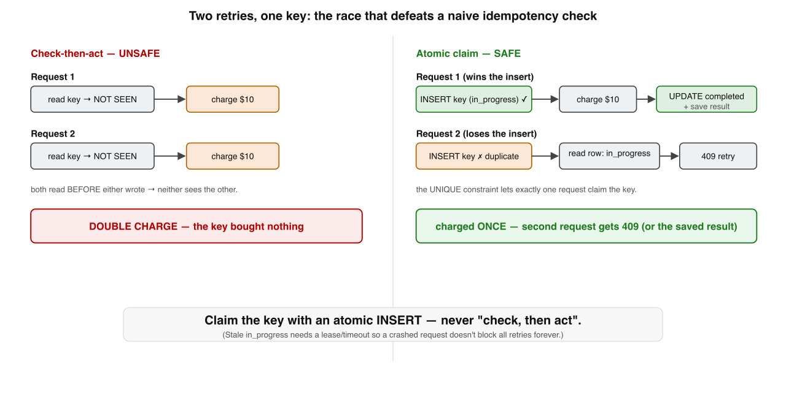
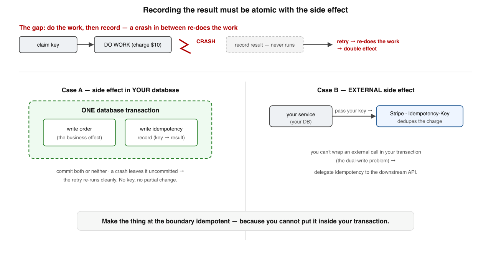

# Idempotency Keys — Deep Dive

*A supplement to Book 1, Lesson 2. The intro showed the happy path: the client attaches a key, the server checks a store — "seen this key? return the saved result; new? do the work and save it." That two-line algorithm is correct and hides every hard part. What happens when **two** retries with the same key run at the same time? What if the server crashes **between** doing the work and saving the result? What if the side effect isn't in your database at all? What if the client reuses a key for a different request? Get any of these wrong and you double-charge a customer. This goes to the floor.*

Dense. Read it after Lesson 2 has settled.

---

## Where Lesson 2 stopped

You learned the shape: at-least-once delivery means retries, retries mean duplicates, and an **idempotency key** turns a non-idempotent operation (like "charge $10") into one that's safe to retry — the client generates a unique key per logical operation, the server records `key → result`, and a repeat with the same key returns the saved result instead of re-executing. True. But "the server records `key → result`" is doing enormous work in that sentence. *When* it records, *how atomically*, *what it stores*, and *what it does when a second request with the same key shows up while the first is still running* — those are the difference between a design that works in the demo and one that survives production. Four of them, in order.

---

## 1. The race: two retries, one key

The naive implementation is **check-then-act**, and it has the oldest bug in the book. Read the store ("have I seen this key?"); if not, do the work and save. Now run two copies concurrently — a client that retried because the first response was slow, hitting two app servers behind a load balancer:

Both requests read the store; **both see "not seen"** (neither has written yet); both proceed to charge the card. The key bought you nothing — you charged twice. Check-then-act across two actors is never safe (you met this exact shape in Book 2's lost-update and write-skew lessons).

The fix is to make **claiming the key atomic.** Store the key in a table with a `UNIQUE` constraint on `(account_id, idempotency_key)` and a status column, then:

1. `INSERT` the key row with `status = in_progress` — *before* doing any work. The unique constraint guarantees **exactly one** of the racing requests succeeds.
2. **Insert succeeded** → you own this request. Do the work, then `UPDATE status = completed`, storing the response.
3. **Insert failed** (duplicate key) → another request already claimed it. Read the existing row:
   - `status = completed` → return its saved response. (The normal retry-after-success case.)
   - `status = in_progress` → a concurrent request is *still running*. Return **`409 Conflict`** — "a request with this key is in flight, retry shortly" — rather than risk a second execution. (This is exactly what Stripe's API does.)

The atomic `INSERT` is the linchpin: it converts "check, then act" into "act (claim) atomically, then branch." The same idea works with `SELECT ... FOR UPDATE` or an advisory lock keyed by the idempotency key, but the unique-constraint insert is the simplest correct primitive.

One sharp edge: a request can crash *after* claiming the key (`in_progress`) but *before* completing it, leaving a stuck row that blocks all future retries with a permanent `409`. So `in_progress` needs a **recovery path** — a `locked_at` timestamp with a lease/timeout, so a sufficiently old `in_progress` record can be reclaimed and retried. (Stripe models this with explicit *recovery points* that let a retry resume a half-finished request.)

---

## 2. Atomicity: the result must be recorded *with* the side effect

Solve the race and a deeper problem remains. Look at the sequence: claim the key, **do the work**, **record the result**. What if the server crashes *between* doing the work and recording the result?

The work happened (the row was written, the email sent, the card charged) — but no completed record exists. The retry finds `in_progress` (or, after recovery, re-claims the key) and **does the work again.** You're back to a double effect, despite the key. The lesson:

> **Recording "this key is done, here is the result" must be atomic with the side effect itself.** If they can be torn apart by a crash, the key does not protect you.

Whether you can achieve that depends entirely on *where the side effect lives* — and this splits into the two cases that govern every real idempotency design:

**Case A — the side effect is in your own database.** Then it's clean: wrap the **business mutation** and the **idempotency record** in **one database transaction.** Commit both or neither. A crash mid-way leaves the transaction uncommitted, so the retry re-runs from scratch with no key recorded and no partial change — exactly the all-or-nothing of Book 2's atomicity. The idempotency record is, in effect, a ledger entry committed alongside the work it describes.

**Case B — the side effect is external** (charge a card, call a third-party API, send to another service). You *cannot* make an external network call atomic with your local database write — the dual-write problem from Book 2. There is no transaction that spans Stripe and your Postgres. So you do the one thing that works: **delegate idempotency to the downstream system.** Pass *your* idempotency key (or a deterministic derivation of it) straight through to the external API's own idempotency mechanism — Stripe's `Idempotency-Key` header, for instance. Now even if you crash and retry the whole flow, Stripe deduplicates the charge on its side, and you record the result when it returns. The rule that falls out: **make the thing at the boundary idempotent, because you can't wrap it in your transaction.** Where the downstream offers no idempotency support, you're forced into reconciliation (detect and refund the double) — which is why "is this API idempotent?" is the first question a senior engineer asks of any payment or messaging integration.

---

## 3. What to store, and the same-key-different-body trap

A key alone is not enough state. A robust idempotency record holds:

| Field | Why |
|---|---|
| `idempotency_key` + `account_id` | the unique claim (scoped, never global) |
| `request_fingerprint` | a hash of the request parameters |
| `status` | `in_progress` / `completed` (the §1 state machine) |
| `response_code`, `response_body` | the saved result to replay |
| `locked_at`, `created_at` | recovery lease (§1) and TTL (§4) |

The `request_fingerprint` exists to catch a specific client bug. Suppose a client reuses an idempotency key it already used — but for a **different request** (different amount, different recipient). The naive server would happily return the *first* request's saved response, silently giving the wrong answer to the second. So on every repeat you compare fingerprints:

- **fingerprint matches** → it's a genuine retry of the same operation → apply the §1 logic (return saved / `409` in-progress).
- **fingerprint differs** → the client is misusing the key → **reject with an error** (Stripe returns a `400`: a key can only be reused with identical parameters).

This turns the idempotency key into a *contract*: one key names one specific operation, and the server enforces it. Without the fingerprint, idempotency keys can return confidently wrong results — the worst kind of bug.

---

## 4. The key's lifecycle: scope, generation, and the TTL hazard

Pull it together as a lifecycle, and two more decisions surface.

**Generation and scope.** The client generates **one key per logical operation** — a UUID — and **reuses the same key on every retry of that operation.** The two classic bugs are (a) generating a *fresh* key per attempt (then retries don't dedupe — you've defeated the whole mechanism) and (b) reusing one key across *different* operations (collisions). Keys must be **scoped**, typically per `(account, endpoint)`, never a single global namespace — both to avoid cross-tenant collisions and to bound the keyspace you store. And keys are only for **unsafe** operations: `POST`-style creates and charges. `GET`, `PUT`, and `DELETE` are already idempotent by definition; adding a key there is noise.

**The TTL hazard.** You cannot keep idempotency records forever — storage is finite — so they have a **retention window** (Stripe keeps them ~24 hours). After it expires, a request with that same key is treated as **brand new.** Here is the trap: if a retry arrives *after* the TTL expires — a message stuck in a queue for 25 hours then redelivered, a client retrying on a very long backoff — the key is gone, and **the operation executes again.** A double charge, weeks of careful idempotency undone by a late redelivery.

> **The retention window must comfortably exceed your worst-case retry horizon** — your queue's maximum redelivery delay, your client's retry-backoff cap, your DLQ replay window. Too short and late retries resurrect the side effect; too long and you store more state. Pick the TTL from your *actual* redelivery bounds, not a round number.

---

## 5. Where idempotency keys stop helping

They are not magic, and knowing the edges is the senior part.

- **They cover one operation against one store.** An idempotency key makes *one* call safe to retry against *one* system that participates in the key check. It is **not** a distributed-transaction substitute and does **not** give you exactly-once across a *chain* of services — each hop needs its own idempotency (its own key or consumer-side dedup). String three together and you have three places to get it right.
- **If the operation is already idempotent, you may not need a key.** An absolute `SET balance = 100`, a `DELETE /orders/42`, "mark invoice paid" — these are naturally repeat-safe (Book 1, Lesson 2). Keys are for the operations that *aren't*, like "charge $10" or "create a new order." Don't add the machinery where the operation already has the property.
- **When the producer can't be made safe, dedupe at the consumer.** If a side effect is non-idempotent, external, and the downstream offers no idempotency hook, you cannot make the *sender* exactly-once. Move the guarantee to the **receiver**: have it process each event id once (the dedup store from Lesson 2). Exactly-once is always built as at-least-once **plus** an idempotent or deduplicating endpoint — the key is just the most common way to *be* that endpoint.

The whole topic is one idea applied with discipline: **claim atomically, record atomically with the effect, fingerprint the request, retain longer than you retry — and remember the key only protects the one boundary it guards.**

---

## Self-Check — Idempotency Keys Deep Dive

Answer from memory before the key.

**Q1.** Two concurrent retries with the same key both double-execute when the server…

- (a) reads the store, sees "not seen" in both, then each acts
- (b) inserts the key row first and branches on the unique error
- (c) returns a 409 conflict while the first request is running
- (d) compares the request fingerprint before doing any of the work

**Q2.** If the server crashes between doing the work and recording the result, the key fails to protect you unless those two steps are…

- (a) executed by two separate threads for extra parallelism
- (b) atomic — committed together, or delegated to the downstream
- (c) retried automatically by the client with a fresh new key
- (d) logged to a file before the database transaction commits

**Q3.** A client reuses an idempotency key but with different parameters. A correct server should…

- (a) return the first request's saved response for the new one
- (b) reject the request because the fingerprint no longer matches
- (c) execute the new request and overwrite the stored response
- (d) generate a new key for the client and proceed with the call

**Q4.** A double charge occurs long after careful idempotency because…

- (a) the unique constraint on the key table was briefly dropped
- (b) a retry arrived after the key's retention window had expired
- (c) the client generated one shared key for several operations
- (d) the downstream API ignored the idempotency header it was sent

## Answer Key

- **Q1 → (a).** Check-then-act lets both racing requests see "not seen" before either writes; the fix is an atomic claim (unique-constraint `INSERT`) so only one wins.
- **Q2 → (b).** Recording the result must be atomic with the side effect — one DB transaction when the effect is local, or delegated to the downstream's idempotency when it's an external call.
- **Q3 → (b).** The request fingerprint catches key reuse with different parameters; mismatched fingerprint → reject, so you never return a confidently-wrong cached result.
- **Q4 → (b).** After the retention TTL expires the key is treated as new, so a late retry re-executes — the window must exceed the worst-case redelivery/retry horizon.

---

## Sources

- **Kleppmann — DDIA, Chapter 8** ("The Trouble with Distributed Systems") and Chapter 11: idempotence, deduplication, exactly-once semantics.
- **Stripe — "Designing robust and predictable APIs with idempotency" (Brandur Leach, stripe.com/blog)** and the Stripe API idempotency docs: the unique-key + `in_progress`/`409`, recovery points, request-fingerprint rejection, and 24-hour retention.
- **AWS Builders' Library / API design guides** on idempotency tokens for safe retries.
- **Book 1, Lesson 2** (at-least-once + idempotency) and **Book 2** (the outbox, atomic writes, the dual-write problem) — the foundations this builds on.
