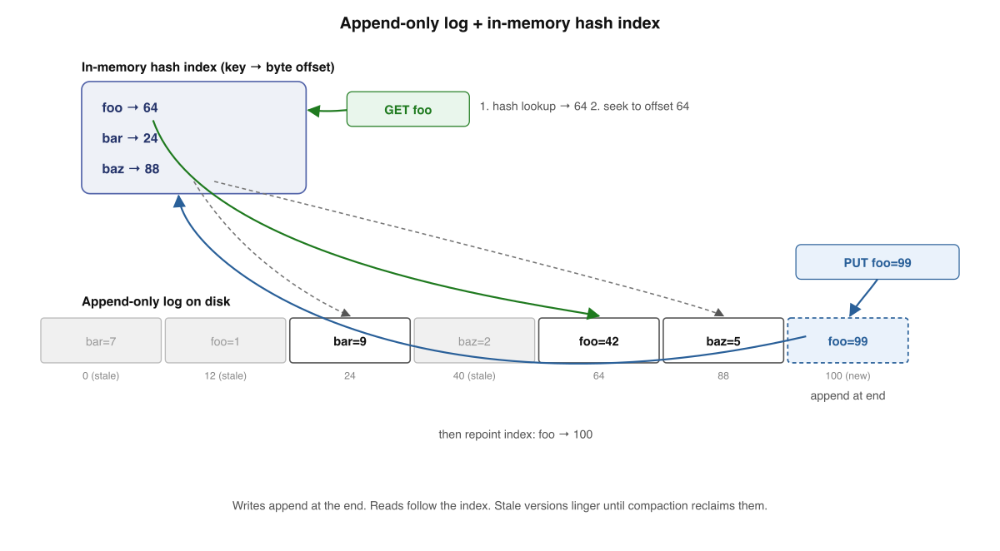
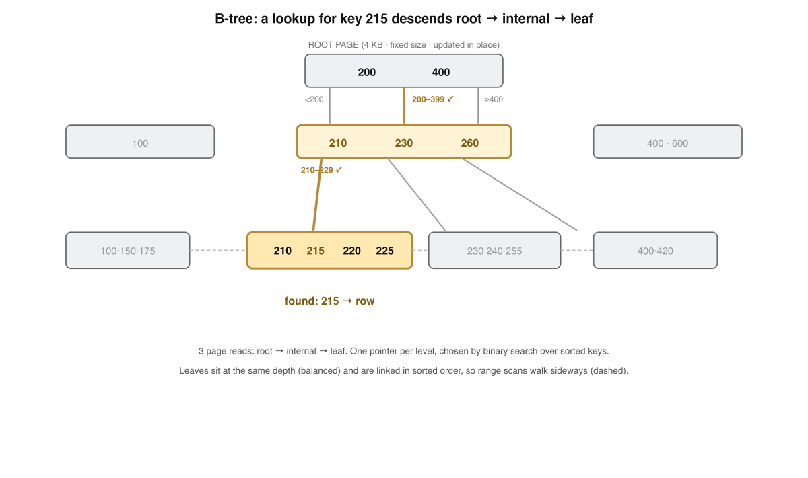
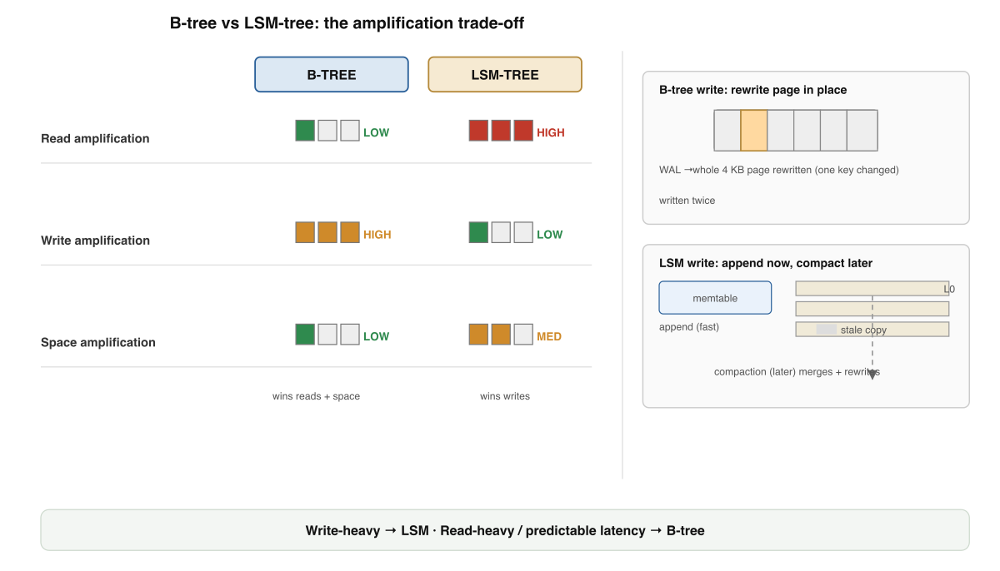
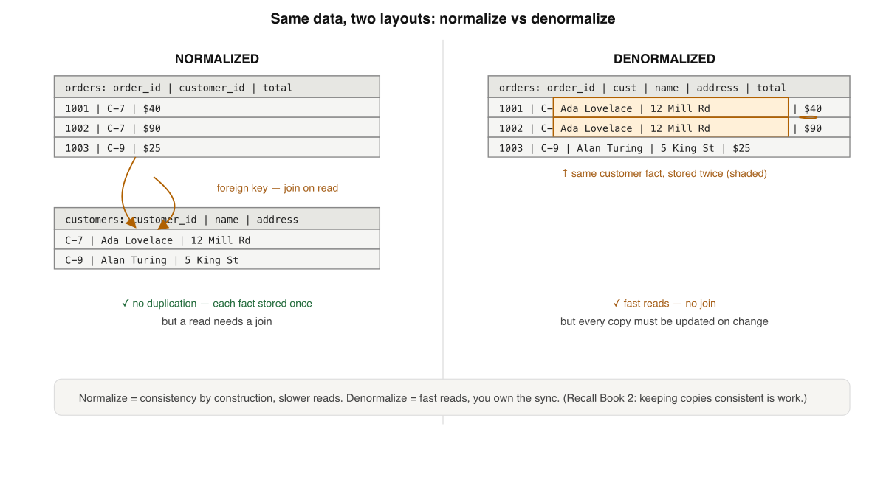
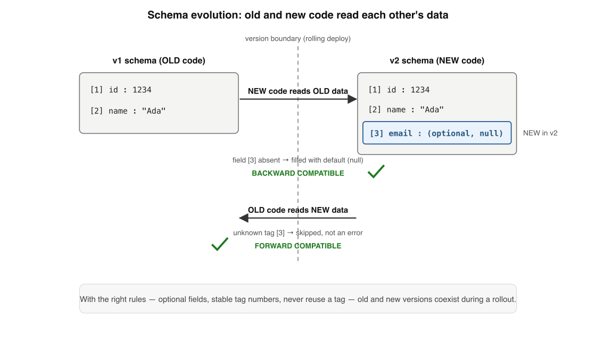

# Storage Engines & Data Modeling — Fundamentals

*Book 3 of a guided learning track. One tight win per lesson — not a textbook to swallow in one sitting.*

---

## How to use this document

**Mission.** You're learning how a database actually stores and finds your data underneath — so you can choose engines, indexes, and data models with judgment instead of cargo-culting. This is the layer below Book 1 (*Distributed Systems*) and Book 2 (*Transactions & Isolation*): it grounds both in real machinery.

**Method.** Each lesson teaches *one* idea, gives a concrete win, and ends with a self-check — answer it from memory before peeking. Diagrams here are mostly **structural** (on-disk layouts, trees, indexes), not space-time. A short **expert corner** closes each lesson with senior-level depth (real-engine behaviour) you can skip on a first pass.

**I'm your teacher.** This is a starting point. When something is unclear or you want a worked example, ask.

---

## Course Map — the full path

| # | Lesson | The single win | Status |
|---|--------|----------------|--------|
| 1 | How a Database Stores Bytes | The log + index, and the read/write tension | ✅ Built |
| 2 | B-Trees: The Default | The read-optimized workhorse | ✅ Built |
| 3 | LSM-Trees: Write-Optimized | Memtable, SSTables, compaction | ✅ Built |
| 4 | B-Tree vs LSM | The amplification trade-off | ✅ Built |
| 5 | Indexes: Finding Data Fast | Clustered vs secondary, the write cost | ✅ Built |
| 6 | Data Models | Relational, document, graph | ✅ Built |
| 7 | Schema Design | Normalization vs denormalization | ✅ Built |
| 8 | Encoding & Evolution | Forward/backward compatibility | ✅ Built |
| 9 | OLTP vs OLAP & Column Storage | Row vs column, by workload | ✅ Built |

**How every lesson is built:** prose → a structural diagram → a self-check → an expert corner.

---

## Lesson 1 — How a Database Stores Bytes

Book 2 ended at the write-ahead log: every durable database appends each change to a sequential log before touching anything else, so a crash can be replayed. This book starts there and goes one layer down. If a log is the most natural thing to *write*, what is the most natural thing to *read from*? It turns out you can build a complete, working storage engine out of almost nothing — and watching it strain teaches you the single tension that governs every index you will ever choose.

### The simplest real storage engine

Here is a key-value store you can write in two lines of bash. DDIA chapter 3 opens with exactly this, and it is worth taking seriously, not as a toy.

```bash
db_set () { echo "$1,$2" >> database; }
db_get () { grep "^$1," database | sed -e "s/^$1,//" | tail -n 1; }
```

`db_set foo 42` appends the line `foo,42` to a file. `db_get foo` scans the file and returns the last value written for `foo`. That is a real storage engine: durable (it is on disk), correct (last-write-wins via `tail -n 1`), and it never overwrites old data — it only appends. The file *is* a log, the same append-only structure Book 2 leaned on for durability.

The problem is `db_get`. It uses `grep`, which reads the entire file from front to back. Writes are wonderful; reads are a linear scan. To fix reads we add an **index**: a separate data structure, kept off to the side, that tells you *where* a key lives without looking at the data itself.

The simplest index is an in-memory hash map from each key to the **byte offset** of its latest record in the file. This is precisely the design of **Bitcask**, the default storage engine of Riak (Justin Sheehy and David Smith, "Bitcask: A Log-Structured Hash Table for Fast Key/Value Data," 2010; DDIA ch.3). Every write appends a record to the log *and* updates the hash map: `key → offset`. Every read looks the key up in the hash map, seeks straight to that offset on disk, and reads one record.



> **Hash index over a log.** Store data as an append-only sequence of `key=value` records. Keep an in-memory hash map from each key to the byte offset of that key's *most recent* record. Reads do one hash lookup plus one disk seek; writes append one record and update one map entry.

### Why appends are fast

The append-only design is not laziness — it is a deliberate bet on how disks behave. A spinning disk pays a large fixed cost (seek + rotational latency) to position its head, then streams bytes cheaply once positioned. **Sequential** writes — always to the end of one file — pay that positioning cost once and then stream; **random** writes pay it again and again. The gap is often two orders of magnitude. SSDs have no heads, but they too strongly prefer sequential, large writes: random small writes amplify into extra flash erase-and-rewrite cycles and wear the device faster (DDIA ch.3 discusses both). Appending is also concurrency-friendly: there is exactly one write position, so you rarely contend over where bytes go. The append-only log is the fastest write pattern a disk offers, which is why the WAL from Book 2 and this storage engine share the same shape.

### Why you need an index to read

Without an index, the only way to find a key is to scan. For a 10 GB log that is 10 GB of I/O per `GET` — fine for a demo, ruinous for production. The hash index collapses that to two operations: a hash lookup in RAM (constant time) and a single seek to a known offset. The data file can be terabytes; the read cost does not grow with it. This is the whole job of an index — to convert "search the data" into "consult a small structure, then go straight to the answer." Bitcask keeps the *entire* keyset in memory, which makes it blisteringly fast but caps you at as many distinct keys as fit in RAM (DDIA ch.3). Later lessons replace the hash map with on-disk structures — B-trees, sorted string tables — that lift that cap. The principle does not change: a read should never scan what an index could have located.

### The fundamental tension

Now the idea that runs through this entire book. The hash index made reads O(1), but it did not come free: **every write must now update the index too.** One `PUT` is no longer one append — it is an append *plus* an index mutation, kept consistent with the data. Add a second index (say, by value) and every write updates two structures. Add ten and every write fans out to ten.

> **The read/write tension.** Every index you add speeds up reads that can use it and slows down every write that must keep it current. Storage-engine design is the art of choosing *which* indexes are worth that tax.

This is not a footnote; it is the central trade-off of storage and retrieval (DDIA ch.3 states it directly). B-trees, LSM-trees, covering indexes, column stores — every structure in this book is a different point on the curve between "reads are cheap, writes pay" and "writes are cheap, reads pay." Hold this tension in mind; we will return to it in every lesson.

### Log segments and compaction

The append-only log has one obvious flaw: it never reclaims space. Write `foo,1`, then `foo,2`, then `foo,3`, and the file holds all three even though only the last matters. Run long enough and the disk fills with dead versions of live keys.

The fix — Bitcask's, and the seed of everything in Lesson 4 — is **segmentation plus compaction**. Stop appending to one infinite file; close the current file at a size threshold and open a fresh **segment**. Each segment is immutable once closed. A background process then **compacts**: it reads one or more closed segments, keeps only the latest value for each key, and writes a new, smaller segment, after which the old ones are deleted. Because each segment carries its own hash index, compaction can also *merge* segments, collapsing scattered updates to a key into a single entry.

| Step | Disk state | Live bytes |
|------|-----------|-----------|
| append `foo,1` `bar,9` `foo,2` `foo,3` | one segment, 4 records | 2 keys |
| close segment, start a new one | segment is now immutable | — |
| compact the closed segment | new segment: `bar,9` `foo,3` | 2 records |

Two properties make this safe and is why the pattern recurs throughout the book. Compaction never modifies a live file — it writes a *new* segment and atomically swaps it in, so a crash mid-compaction loses only wasted work, never data (recall idempotency and partial-failure safety from Book 1). And because segments are immutable, reads and compaction never block each other; the writer appends to the newest segment while compaction rewrites older ones in the background. You have just met, in its simplest form, the log-structured idea that Lesson 4 generalizes into the LSM-tree.

### Going deeper — expert corner

*Optional depth. Skip on a first pass.*

- **Bitcask's crash recovery is bounded by the hash index, not the log.** Because the in-memory map is lost on crash, the engine must rebuild it. Scanning every segment would be slow, so Bitcask writes a *hint file* per segment — a compact list of `key → offset` — and rebuilds the map from hints, not from the data (Sheehy & Smith 2010). The lesson: an in-memory index needs a fast reconstruction path, or recovery time grows with your data.
- **Deletes in a log are themselves appends.** You cannot erase a record in place, so a deletion appends a special *tombstone* record; compaction later drops the key and its tombstone together. RocksDB and Cassandra use the same mechanism, where premature tombstone removal can resurrect deleted data — a real, recurring production bug.
- **PostgreSQL's heap is append-friendly but not a pure log.** An `UPDATE` writes a new row version and marks the old one dead (MVCC, from Book 2); `VACUUM` later reclaims the dead tuples — compaction by another name. See the PostgreSQL docs on "Routine Vacuuming" and the visibility map, which tracks pages with no dead tuples so vacuum can skip them.
- **Sequential-write advantage is why WALs and LSM engines dominate write-heavy systems.** RocksDB and Cassandra append to a memtable + WAL and flush sorted segments, then compact — the exact Bitcask pattern at scale. The trade studied as *write amplification* (bytes written to disk per byte of user data) is the cost of buying read speed, and it is the tension above made measurable (DDIA ch.3, "B-Trees vs LSM-Trees").

### Self-Check — Lesson 1

**1. In the bash key-value store, why is `db_get` slow while `db_set` is fast?**
(a) `db_set` appends one line sequentially, but `db_get` greps the whole file front to back.
(b) `db_set` buffers in memory, but `db_get` must flush the entire page cache first.
(c) `db_set` compresses each record, but `db_get` has to decompress every line it reads.
(d) `db_set` writes in parallel threads, but `db_get` is forced to run single-threaded.

**2. What does the Bitcask-style in-memory hash index actually map?**
(a) Each value to a checksum used to verify the record on every read.
(b) Each key to the byte offset of that key's most recent record on disk.
(c) Each segment file to the range of keys it currently contains in order.
(d) Each key to the total number of times that key has been written.

**3. What is the fundamental tension introduced in this lesson?**
(a) Sequential writes are fast on disk but always slower than writes to RAM.
(b) Larger segments compact more efficiently but take longer to rebuild on crash.
(c) Each index speeds the reads that use it but slows every write that maintains it.
(d) Hash indexes are fast to look up but cannot answer range queries over keys.

**4. Why can compaction run safely in the background without blocking reads?**
(a) It pauses all writers briefly while it rewrites the live segment in place.
(b) It locks each key in the hash index until the merged segment is durable.
(c) It writes a new segment and atomically swaps it in; old segments stay immutable.
(d) It runs only during idle windows when no read or write is in flight.

### Answer Key — Lesson 1

1. **(a)** — `db_set` is a single sequential append; `db_get` does a full linear scan with `grep`, so its cost grows with file size.
2. **(b)** — The hash index maps each key to the byte offset of its latest record, turning a read into one lookup plus one seek.
3. **(c)** — Every index accelerates reads that use it at the cost of extra work on every write, the trade-off that governs the whole book.
4. **(c)** — Compaction writes a fresh segment and atomically swaps it in while closed segments remain immutable, so it never blocks concurrent reads.

---

## Lesson 2 — B-Trees: The Default

### Where we left off

Lesson 1 introduced the storage engine as the layer that turns "find me row 42" into disk seeks, and split the world into two index families: structures optimized for fast reads and structures optimized for fast writes. This lesson takes the read-optimized side seriously, because it is the one you almost certainly already depend on. When you `CREATE INDEX` in PostgreSQL or define a primary key in MySQL, you get a B-tree — the structure that has been the default database index since Bayer and McCreight first described it in 1972.

### The page-oriented B-tree

A B-tree organizes data into fixed-size **pages**, typically 4 KB or 8 KB, the same unit the operating system and disk move at. Each page is a node in a balanced tree. Inside a page sits a sorted run of keys interleaved with references — disk addresses — to child pages. A node holding the keys `[100, 200, 300]` therefore defines four child pointers, covering the ranges `< 100`, `100–199`, `200–299`, and `≥ 300`.

> A **B-tree** is a balanced, page-oriented search tree: every node is a fixed-size page of sorted keys plus pointers to child pages, and all leaves sit at the same depth (DDIA ch.3; Bayer and McCreight 1972).

The number of children a single page can hold is its **branching factor** — for a 4 KB page holding modest keys, that is in the low hundreds. This is the property that makes B-trees fast. With a branching factor of, say, 256, a tree only four levels deep already addresses 256⁴ ≈ 4 billion keys. Depth grows logarithmically, so the tree stays shallow even at enormous scale, which is exactly what you want when every level down is a potential disk read.



### A lookup walks root to leaf

To find a key, you start at the **root page** and descend. Read the root, binary-search its sorted keys to pick the one child range that contains your key, follow that pointer to the next page, and repeat. You stop at a **leaf page**, which holds either the row itself (or a reference to it) or the answer that the key is absent.

Walk through a lookup for key `215` in a three-level tree. The root holds `[200, 400]`; `215 ≥ 200` and `< 400`, so you take the middle pointer. That internal page holds `[210, 230, 260]`; `215` falls between `210` and `230`, so you follow the second pointer. The leaf page holds `[210, 215, 220, 225]` — you find `215` and read its value. Three page reads, each one a binary search inside a sorted array already in memory. That is the whole algorithm, and it costs O(log n) pages regardless of table size.

### Writes update pages in place

A B-tree is **mutable**: to change a key's value you overwrite the bytes in the page where it lives. Find the leaf, modify it, write the 4 KB page back to the same location on disk. This update-in-place discipline is what distinguishes B-trees from the log-structured family of Lesson 1 — there is exactly one canonical location for every key, and writes go there.

Inserts are nearly as simple, until a page fills. When a leaf has no room for a new key, the B-tree **splits** it: the page divides into two half-full pages, and the parent gains a new key and pointer to track the boundary. If the parent is also full, the split propagates upward; a split that reaches the root grows the tree by one level. This split-on-overflow rule, balanced symmetrically, is precisely how Bayer and McCreight keep every leaf at the same depth (Bayer and McCreight 1972). The cost is real: a single logical insert can dirty several pages, and a split touches at least three.

### Crash safety via the write-ahead log

Here the durability machinery from Book 2 earns its keep. Update-in-place is dangerous on its own. Overwriting a 4 KB page is not atomic at the hardware level — a crash mid-write can leave a page half-old and half-new, **corrupting the index**. Worse, a split modifies several pages at once, and a crash between them leaves the tree structurally broken: an orphaned page, a parent pointing nowhere.

The fix is the **write-ahead log (WAL)** you met in Book 2 as the foundation of durability. Before touching any data page, the engine appends the intended change to an append-only log on disk and flushes it. Only then does it modify the tree. If the process crashes, recovery replays the WAL to bring every page to a consistent state. PostgreSQL calls this its WAL and additionally writes a **full-page image** the first time a page changes after a checkpoint — its defence against exactly the torn-write problem above (PostgreSQL documentation, "Write-Ahead Logging"). MySQL's InnoDB uses a redo log for the same purpose, plus a doublewrite buffer that writes each page twice so a torn write can always be recovered (MySQL Reference Manual, InnoDB). The B-tree gives you fast lookups; the WAL is what makes those in-place writes survive a power cut.

### Read-optimized, and the default for a reason

Step back and the trade-off is clear. A point lookup is a handful of page reads down a shallow tree. A range scan — `WHERE created_at BETWEEN x AND y` — is even more natural: find the start key, then walk the leaves in sorted order, since the B-tree keeps keys sorted on disk. This sorted, in-place layout is why B-trees dominate read-heavy and mixed workloads, and why they are the default index in PostgreSQL (`btree`), MySQL InnoDB (where the table itself *is* a B-tree, clustered on the primary key), and essentially every relational database since the 1970s (DDIA ch.3; Codd's relational model of 1970 gave the queries, the B-tree gave the access path).

The price is write amplification: every update may rewrite a full page and, on a split, several. Lesson 3 takes the opposite bet — the log-structured merge-tree, which trades read cost for write throughput. But the B-tree is the baseline you measure everything against, and for most workloads it is simply correct.

### Going deeper — expert corner

*Optional depth. Skip on a first pass.*

- **PostgreSQL stores the row, not the index, as the source of truth.** Its B-tree leaf points into a separate *heap*; visibility (which row version a transaction may see, from Book 2's MVCC) is resolved via tuple headers and the visibility map, which is why an index-only scan still consults that map. See the PostgreSQL docs on index access methods and the visibility map.
- **InnoDB's table is its primary-key B-tree (the clustered index).** Rows live in the leaves, sorted by primary key. Secondary indexes store the primary-key value, not a row pointer, so every secondary lookup is two B-tree descents — and a poorly chosen primary key bloats every secondary index (MySQL Reference Manual, "Clustered and Secondary Indexes").
- **Right-most insert hotspots and `fillfactor`.** Monotonic keys (auto-increment, timestamps) concentrate all splits at the right edge; tuning page fill factor or choosing append-friendly keys trades space for fewer splits. Both PostgreSQL (`fillfactor`) and InnoDB expose this.
- **The branching factor is set by key size, not row count.** Fat composite or string keys shrink fan-out, deepen the tree, and add disk reads per lookup — a concrete reason to keep indexed keys narrow (DDIA ch.3 discusses the leaf-page reference layout that governs this).

### Self-Check — Lesson 2

1. What makes a B-tree lookup require only a few disk reads even for a billion-row table?
   - (a) The tree caches every leaf page permanently in memory
   - (b) The high branching factor keeps the tree only a few levels deep
   - (c) The keys are hashed so lookups skip the intermediate nodes
   - (d) The root page stores a direct pointer to every leaf page

2. When a B-tree leaf page has no room for a new key, the engine:
   - (a) appends the key to a separate overflow log on disk
   - (b) rewrites the entire tree to rebalance every level at once
   - (c) splits the page in two and adds a key to its parent
   - (d) moves the oldest key down to a freshly allocated child

3. Why does a B-tree need a write-ahead log to update pages safely?
   - (a) Because overwriting a page in place is not crash-atomic on its own
   - (b) Because reads and writes would otherwise compete for the same lock
   - (c) Because the log is what keeps the leaf pages sorted by key
   - (d) Because replicas can only stay in sync by reading the log

4. Which workload does a B-tree's on-disk layout serve most naturally?
   - (a) High-volume random writes with very few subsequent reads
   - (b) Append-only logs that are never queried by key at all
   - (c) Wide aggregate scans over a single column of a huge table
   - (d) Point lookups and ordered range scans over a sorted key

### Answer Key — Lesson 2

1. **(b)** A branching factor in the hundreds means depth grows logarithmically, so even billions of keys sit only a few page reads from the root.
2. **(c)** A full leaf splits into two pages and pushes a separator key up to the parent, propagating upward only if the parent is also full.
3. **(a)** Overwriting a 4 KB page (or several, on a split) can tear on a crash, so the WAL records the intent first and recovery replays it.
4. **(d)** Keys are kept sorted in place, making single-key lookups cheap and range scans a simple in-order walk across the leaves.

---

## Lesson 3 — LSM-Trees: Write-Optimized

### Where we left off

Book 2 ended at durability: the write-ahead log (WAL) makes a transaction survive a crash by appending its changes to a sequential file *before* touching the real data structures. That idea — that an append-only log is the cheapest, safest way to record a change — is the seed of this lesson. The log-structured merge tree takes the log and asks a radical question: what if the log *is* the database, and we never update data in place at all?

We will spend this book on two storage engine families. This lesson covers the write-optimized one; Lesson 4 covers the read-optimized one (B-trees). Knowing both, and *why* an engine picks one, is the senior intuition you are building.

### The log-structured merge tree

Start with the problem an LSM-tree solves. Random writes to disk are slow because they force the disk (or the SSD's flash translation layer) to seek or to read-modify-write a block. Sequential writes are an order of magnitude faster. The LSM-tree is a structure that turns *every* write into a sequential one and pays for it later, in the background.

> A **log-structured merge tree (LSM-tree)** buffers writes in an in-memory sorted structure (the **memtable**); when it fills, it is flushed as an immutable, sorted file on disk (an **SSTable**). Reads merge the memtable with the SSTables; a background **compaction** process periodically merges SSTables and discards superseded entries.

The structure was named and analysed by O'Neil, Cheng, Gawlick, and O'Neil, *"The Log-Structured Merge-Tree (LSM-Tree)"* (1996). Google's Bigtable paper (2006) brought the design to production scale, and its open lineage — LevelDB, then RocksDB at Facebook, and Apache Cassandra — is what most engineers actually run today. Kleppmann's *Designing Data-Intensive Applications* (DDIA) chapter 3 is the canonical modern walkthrough.

The two on-disk pieces:

- **Memtable** — an in-memory ordered map (typically a red-black tree or skip list). Writes go here; it keeps keys sorted so the flush is cheap. A WAL alongside it (exactly the WAL of Book 2) makes the memtable crash-safe, since RAM is volatile.
- **SSTable** (Sorted String Table) — a file on disk holding key-value pairs sorted by key. Once written, it is *never modified*. Because keys are sorted, you can find a key with a sparse in-memory index plus a small scan, and you can merge two SSTables with a single linear pass.

### Writes are fast because everything is sequential

A write is: append to the WAL (sequential), then insert into the in-memory memtable (fast, no disk). That is the entire write path. There is no read of the existing value, no in-place block update, no index rebalancing on disk.

When the memtable exceeds a size threshold, it is written out, in sorted order, as a brand-new SSTable — one long sequential write — and a fresh empty memtable takes over. The old WAL segment can then be discarded, because its contents are now safely on disk in the SSTable.

Crucially, *updates and deletes are also just writes*. Updating key `k` does not find and overwrite the old record; it appends a new entry. Deleting `k` appends a special marker called a **tombstone**. The old value still sits in an older SSTable — it is simply shadowed by the newer entry. Reconciliation is deferred to compaction.


### A read checks the memtable first, then SSTables newest to oldest

Because the newest value for a key lives in the newest place, a read walks from new to old and stops at the first hit:

1. Check the **memtable**. If the key is there, return it — it is the freshest value (or a tombstone, meaning "deleted").
2. Otherwise check each **SSTable from newest to oldest**, returning the first match.

A concrete trace. Suppose these writes arrive over time:

| Time | Operation | Lands in |
|------|-----------|----------|
| t1 | `SET user:42 = "Ann"` | SSTable-1 (oldest) |
| t2 | `SET user:42 = "Bea"` | SSTable-2 |
| t3 | `DELETE user:42` | memtable (tombstone) |

A read of `user:42` hits the memtable first, finds the tombstone, and returns "not found" — even though two live-looking values still exist in older SSTables. This is the cost the LSM-tree trades for fast writes: a read may have to consult several files. That cost — extra reads per logical read — is called **read amplification**, and the next two sections are the engine's two defences against it.

### Compaction merges SSTables in the background, dropping overwritten and deleted keys

Left alone, SSTables accumulate forever: more files to search, more dead data on disk. **Compaction** is the background job that fixes both. It reads several SSTables and merges them — exactly the merge step of merge-sort, made trivial because each input is already sorted — writing a single new sorted SSTable, then deleting the inputs.

During the merge, when the same key appears in multiple inputs, only the **newest** value survives; older ones are dropped. A key whose newest entry is a tombstone is dropped *entirely* once compaction reaches the oldest SSTable, finally reclaiming the space the delete promised. Compacting our trace above yields one SSTable with `user:42` simply gone.

Engines differ in *how* they schedule this. RocksDB and LevelDB default to **leveled compaction** (many small, non-overlapping files organised in size-tiered levels, bounding read amplification); Cassandra also offers **size-tiered compaction** (merge SSTables once enough of similar size accumulate, friendlier to write-heavy loads). The trade-off is the third member of the amplification trio: **write amplification** — bytes rewritten by compaction per byte logically written — versus read and space amplification. There is no free configuration; you pick which amplification to pay.

### Bloom filters let a read skip SSTables that definitely lack a key

A read for a key that does *not* exist is the LSM-tree's worst case: it would check the memtable and then every SSTable, finding nothing, before giving up. A **Bloom filter** turns that into an almost-free answer.

A Bloom filter is a small bit array plus a few hash functions, built per SSTable. To test membership, hash the key and check the corresponding bits. It has one-sided error: it can answer "**probably present**" (worth opening the file) or "**definitely absent**" (skip this SSTable entirely, no disk read). It never produces a false negative, so skipping is always safe. A filter tuned to a ~1% false-positive rate costs roughly 10 bits per key — kilobytes for millions of keys.

With Bloom filters, a lookup for an absent key touches the memtable and only the rare SSTable that false-positives, instead of all of them. LevelDB, RocksDB, Cassandra, and Bigtable all ship Bloom filters for exactly this reason (DDIA ch. 3).

### Going deeper — expert corner

*Optional depth. Skip on a first pass.*

- **RocksDB leveled compaction and the amplification triangle.** RocksDB exposes read/write/space amplification as an explicit, tunable trade-off; leveled compaction bounds reads to roughly one file per level but inflates write amplification, while the experimental tiered/`kCompactionStyleUniversal` mode inverts it. See the RocksDB wiki "Compaction" and the "Leveled Compaction" pages — this knob is a real production decision.
- **Tombstones and the deletion-that-doesn't-delete.** In Cassandra a tombstone persists for `gc_grace_seconds` (default 10 days) so a delete can propagate to all replicas before the space is reclaimed (cf. Book 1's replication and eventual consistency). Reading across many un-compacted tombstones is a notorious latency cliff; the docs warn against queue-like access patterns for this reason.
- **Bloom filter false-positive math.** For `m` bits, `n` keys, `k` hashes, the optimal `k = (m/n)·ln 2` and the false-positive rate is ≈ `(1 − e^(−kn/m))^k`. RocksDB's newer **ribbon filter** achieves the same FPR with ~30% fewer bits — see the RocksDB blog "Ribbon Filter". Knowing the formula lets you size memory deliberately rather than by default.
- **The WAL is the same WAL.** The memtable's commit log is precisely the write-ahead log of Book 2 — same recovery semantics, replayed on restart to rebuild an unflushed memtable. The LSM-tree did not reinvent durability; it reused the log and then turned the *whole* data file into an append-only structure.

### Self-Check — Lesson 3

**1.** Why are writes to an LSM-tree fast compared with in-place updates?

(a) They append to a log and an in-memory sorted map, avoiding random disk writes
(b) They overwrite the target block directly after locating it with a disk index
(c) They rebalance an on-disk tree so later reads need fewer block accesses
(d) They compress each record before writing so fewer bytes reach the disk

**2.** A read for `user:9` returns "not found", yet older SSTables contain a value for it. What most likely happened?

(a) A tombstone for `user:9` shadows the older values until compaction removes them
(b) The Bloom filter produced a false negative and skipped the live SSTable
(c) The memtable was flushed before the key could be written to disk
(d) The compaction process corrupted the index entry for that key

**3.** What does compaction do when the same key appears in several input SSTables?

(a) Keeps the newest value and discards the older ones, dropping tombstoned keys
(b) Keeps the oldest value because it was committed first and is canonical
(c) Concatenates all the values into a single multi-version record on disk
(d) Refuses to merge those files and leaves the duplicate key for a later pass

**4.** What guarantee does a Bloom filter give an LSM-tree read?

(a) "Definitely absent" is always correct, so that SSTable can be skipped safely
(b) "Probably present" is always correct, so the SSTable need not be opened
(c) Both answers are exact, so reads never touch more than one SSTable file
(d) It returns the value directly, so the SSTable scan can be avoided entirely

### Answer Key — Lesson 3

**1. (a)** A write only appends to the WAL and inserts into the in-memory memtable — both sequential or in-RAM — with no random in-place disk write.

**2. (a)** Updates and deletes are appended; a tombstone in a newer location shadows the older live-looking values until compaction reclaims them.

**3. (a)** Compaction keeps only the newest value per key and drops keys whose newest entry is a tombstone, reclaiming the space.

**4. (a)** A Bloom filter has one-sided error: a "definitely absent" answer is never wrong, so the SSTable can be skipped, while "probably present" may be a false positive.

---

## Lesson 4 — B-Tree vs LSM: The Trade-off

### Where we left off

Lesson 3 gave you two ways to build an index. A **B-tree** keeps sorted pages on disk and overwrites them in place. An **LSM-tree** buffers writes in a memtable, flushes immutable sorted runs (SSTables), and merges them later through compaction. Both answer the same query — "find the value for this key" — but they pay for it differently. This lesson names the three currencies they trade in, then tells you which engine to reach for.

The currencies are three kinds of *amplification*: a logical operation costing more than one physical operation. You measure each as a ratio.

> **Amplification** is the ratio of physical work done by the storage engine to the logical work requested by the application. Read, write, and space amplification are the three axes on which every storage engine is judged.

You cannot drive all three to zero at once. Every engine picks a corner of this triangle and accepts the cost in the other two. DDIA ch.3 frames the whole B-tree-versus-LSM comparison exactly this way.

### Read amplification — one logical read may touch several physical reads

You ask for one key. How many disk pages must the engine read to answer?

A B-tree walks root → internal → leaf: for a billion keys at branching factor ~hundred, that is four or five page reads, and the upper levels are almost always cached. So a point lookup costs roughly **one** uncached read — the leaf. Read amplification is low and, crucially, *bounded by tree height*, which barely moves as data grows.

An LSM-tree is worse. A key might live in the memtable, or in any of several on-disk SSTables. To be sure it is *absent*, you must check every level. Bloom filters (Lesson 3) let you skip most SSTables cheaply, but a read that misses the filter, or a range scan that cannot use one, may touch several files. RocksDB's tuning notes call this out directly: read amplification grows with the number of sorted runs, and is the price you pay for cheap writes. ([RocksDB Tuning Guide](https://github.com/facebook/rocksdb/wiki/RocksDB-Tuning-Guide))

### Write amplification — one logical write may cause several physical writes over time

You write one key once. How many times does that byte get written to disk before it settles?

A B-tree's write touches a leaf page. But the page is the unit of I/O — typically 4 to 16 KB — so changing one 20-byte row rewrites the *whole page*. Worse, recall the write-ahead log from Book 2: the change is first written to the WAL, *then* to the page, so the data lands on disk at least twice. Page splits, when a leaf overflows, rewrite more pages still. B-tree write amplification is medium-to-high and the writes are scattered — random I/O.

An LSM-tree appends. The write hits the memtable in memory and the WAL sequentially, and that is it for now. Later, compaction rewrites the key as it merges runs — and a given key may be rewritten several times across compaction levels over its life. So an LSM is not free of write amplification; it *defers and batches* it into large sequential rewrites instead of paying it synchronously as random page writes. On flash, where random writes wear the device and sequential writes do not, this is a large practical win (DDIA ch.3).

### Space amplification — data plus obsolete or duplicate copies on disk

You store one logical dataset. How much disk does it actually occupy?

A B-tree stores each key in exactly one place — its leaf. The overhead is unused slack in partially-full pages (a B-tree leaf is rarely 100% full; ~60-70% is typical after random inserts). Space amplification is low and steady.

An LSM-tree holds **stale versions**. An update writes a new copy to the memtable while the old copy still sits in an older SSTable; a delete writes a *tombstone* that shadows but does not yet remove the value. Both linger until compaction reclaims them. So an LSM can briefly hold several copies of the same key, and a level-style compaction can temporarily double the space of a level mid-merge. The upside: SSTables are immutable and densely packed with no per-page slack, and sorted immutable data compresses extremely well — often offsetting the duplication entirely (DDIA ch.3; RocksDB tuning notes).



### B-trees vs LSM-trees: the shape of each trade-off

Put the three axes in one table.

| Axis | B-tree | LSM-tree |
|---|---|---|
| Read amplification | low — bounded by tree height | medium–high — may probe many runs |
| Write amplification | medium–high — in-place, random, WAL + page | low *now* — deferred into compaction |
| Space amplification | low — one copy, page slack | medium — stale versions until compacted |
| Write I/O pattern | random | sequential |
| Latency profile | predictable | spiky (compaction stalls) |

The B-tree's defining virtue is **predictability**. Reads are a fixed small number of seeks; there is no background process that can suddenly steal your disk. Each key has one home, which also makes range scans and transactional locking (Book 2) straightforward.

The LSM's defining virtue is **cheap, sequential, compressible writes**. The cost is *compaction*: a background process that consumes CPU, disk bandwidth, and I/O budget, and that can stall foreground writes or spike tail latency if it falls behind. RocksDB's tuning guide is largely a manual for keeping compaction from eating your latency.

### Choose by workload

The decision is not about which structure is "better" — it is about which currency your workload spends.

- **Write-heavy, ingest-oriented** — time-series, event logs, metrics, message queues, anything append-dominant. Favor an **LSM** (RocksDB, Cassandra, ScyllaDB, the LSM engines behind many time-series stores). Sequential writes and compression carry the day; you tolerate compaction and read amplification.
- **Read-heavy, latency-sensitive, transactional** — point lookups, OLTP, strict tail-latency SLOs, range scans. Favor a **B-tree** (PostgreSQL, MySQL/InnoDB, most classic relational engines). Predictable reads and stable space win; you accept random write I/O.

A useful heuristic: if your tail latency budget cannot tolerate an occasional compaction stall, lean B-tree; if your write throughput is the bottleneck and reads are filterable, lean LSM (DDIA ch.3).

### Going deeper — expert corner

*Optional depth. Skip on a first pass.*

- **PostgreSQL is a B-tree engine whose MVCC turns space amplification back on.** Heap tuples are versioned (Book 2's MVCC), so updated and deleted rows leave dead tuples behind — the same stale-copy problem you just learned, here solved by `VACUUM` rather than compaction. The *visibility map* lets index-only scans skip the heap when a page is all-visible, cutting read amplification. See the PostgreSQL docs on routine vacuuming and the visibility map.
- **MySQL InnoDB uses a clustered B-tree: the table *is* the primary-key index.** Rows live in the leaves of the PK tree, so a point lookup by PK is one tree walk with no heap fetch — but a *secondary* index stores the PK as its pointer, so a secondary lookup walks two trees. This is why InnoDB PK choice (random UUID vs sequential) dominates write amplification through page splits. See the InnoDB index reference.
- **RocksDB exposes the trade-off as a tuning knob.** Leveled compaction minimizes space amplification but raises write amplification; universal (tiered) compaction does the reverse. The amplification factors are explicit dials in `rocksdb.conf`. See the RocksDB Tuning Guide and compaction wiki.
- **Many "B-tree" databases now ship an LSM option, and vice versa.** MySQL's MyRocks, MongoDB's WiredTiger (which offers both a B-tree and an LSM mode), and Fractal/Bε-trees blur the line — the amplification axes, not the data structure name, are what you actually reason about (DDIA ch.3).

### Self-Check — Lesson 4

**1. A point lookup in an LSM-tree can be slower than in a B-tree mainly because:**
(a) the LSM-tree must rebalance its nodes on every read it performs
(b) the key may sit in any of several sorted runs that all need checking
(c) the LSM-tree keeps its data unsorted and scans the whole file
(d) the LSM-tree always reads from disk and never caches any pages

**2. Why does a B-tree have non-trivial write amplification even for a tiny update?**
(a) it compacts old pages together in a slow background merge process
(b) it stores several stale versions of each key until vacuum runs
(c) it rewrites a whole page plus a WAL record for one small change
(d) it appends the change and only later rewrites it during a flush

**3. Space amplification in an LSM-tree comes mostly from:**
(a) unused slack space left inside partially-filled leaf pages
(b) stale key versions and tombstones held until compaction reclaims them
(c) the extra pointers each internal node stores to reach its children
(d) the write-ahead log retaining every change since the last checkpoint

**4. For an append-heavy event-ingestion workload, you would lean toward an LSM-tree because:**
(a) its reads touch a fixed small number of pages every single time
(b) it keeps exactly one copy of each key with very low space overhead
(c) it stores writes as cheap sequential appends that compress well
(d) it gives the most predictable tail latency with no background work

### Answer Key — Lesson 4

1. **(b)** — a key may live in the memtable or any on-disk SSTable, so a read (especially a filter miss) may probe several runs; that is read amplification.
2. **(c)** — the page is the I/O unit, so a small change rewrites the full page, and the WAL records it too, writing the data at least twice.
3. **(b)** — updates and deletes leave old versions and tombstones that occupy disk until compaction merges them away.
4. **(c)** — LSM writes are sequential appends with excellent compression on sorted immutable runs, which is exactly what an ingest-heavy workload needs.

---

## Lesson 5 — Indexes: Finding Data Fast

### Where we left off

Lesson 4 walked the B-tree from root to leaf and showed how a balanced, page-oriented tree turns a needle-in-a-haystack scan into a handful of disk reads. But a B-tree is only a *mechanism*. A real table has one set of rows and often many ways you want to find them — by id, by email, by `(account_id, created_at)`. Each access path is a separate index, and each one is a structure you build, pay for, and keep in sync. This lesson is about the index as a *design decision*: which ones to create, how their leaves are laid out, and what every one of them costs you on write.

### The primary-key index vs a secondary index

Every table you query by id has a **primary-key index**: a B-tree keyed on the primary key, the access path the database reaches for first. A **secondary index** is any *additional* index on some other column — `email`, `status`, `created_at` — built so that queries filtering on that column don't have to scan every row.

> A **secondary index** is an extra B-tree (or hash) on a non-primary-key column whose job is to map values of that column to the rows that contain them. It is pure redundancy: every entry duplicates data already stored in the table, traded for fast lookup on a new access path.

The mechanical difference between primary and secondary is *uniqueness*. Primary keys are unique by definition, so each key in the primary index points to exactly one row. A secondary index on `email` *might* be unique, but a secondary index on `status` is not — the value `'active'` maps to thousands of rows. Kleppmann notes this directly: secondary index keys are not unique, so the index stores either a list of matching row locations per key, or makes each entry unique by appending the row identifier (DDIA ch.3, "Other indexing structures").

So a table with three indexes is *one* logical set of rows backed by *three* sorted structures, each ordered by a different column, each pointing back at the same rows. The question that decides everything else is: when you follow an index down to its leaf, what is actually *there*?

### Clustered vs non-clustered (heap)

Two answers, and they define the two great families of table storage.

In a **clustered index**, the leaf of the primary-key B-tree *is* the row. There is no separate table — the index and the table are the same structure, with the full row data stored in the index's leaf pages, physically ordered by primary key. MySQL's InnoDB does exactly this: "every InnoDB table has a special index called the clustered index that stores row data" — if you declare a `PRIMARY KEY`, that *is* the clustered index (MySQL Reference Manual, "Clustered and Secondary Indexes").

In a **non-clustered / heap** organization, the rows live in a separate area called the heap, stored in no particular order, and *every* index — including the primary one — has leaves that hold the key plus a **pointer** to the row's location in the heap. PostgreSQL works this way: table rows live in a heap addressed by a tuple id (`ctid` = page number + offset), and every index entry points at a `ctid` (PostgreSQL docs, "Index Access Methods"; DDIA ch.3 calls this row location the "heap file" reference).

The trade-off is concrete:

| | Clustered (InnoDB PK) | Heap + indexes (PostgreSQL) |
|---|---|---|
| Where the row lives | in the PK index leaf | in a separate heap |
| Primary-key lookup | one B-tree walk, row is there | walk index, then fetch from heap |
| Secondary-index leaf holds | the **primary key** | a heap pointer (`ctid`) |
| Secondary lookup | walk secondary → get PK → walk PK tree again | walk secondary → follow `ctid` → heap |
| Cost of moving a row | none (logical PK is the address) | pointer must be re-found / HOT-chained |

Note the subtle asymmetry in the clustered world: because the row's *address* is its primary key, a secondary index in InnoDB stores the **primary key value** in its leaves, not a physical pointer. A secondary lookup therefore does *two* B-tree walks — one in the secondary index to find the PK, a second in the clustered index to find the row. This is why a wide primary key in InnoDB bloats *every* secondary index: each secondary leaf carries a full copy of it.


### Composite (multi-column) indexes and why column order matters

A **composite index** is a B-tree keyed on several columns at once — `(account_id, created_at)`. The critical fact: it is sorted *lexicographically*, by the first column, then the second within each value of the first, like the entries in a phone book sorted by last name then first name (DDIA ch.3, "Multi-column indexes").

That ordering is exactly why column order is not cosmetic. Consider an index on `(account_id, created_at)`:

- `WHERE account_id = 42 AND created_at > '2026-01-01'` — uses the index fully. It seeks to `account_id = 42`, then the second column is already sorted, so the range scan is a contiguous slice.
- `WHERE account_id = 42` — uses the index. The leading column is the prefix.
- `WHERE created_at > '2026-01-01'` — **cannot** use the index efficiently. `created_at` is only sorted *within* each `account_id`, so the matching rows are scattered across the whole tree.

This is the **leftmost-prefix rule**: a composite index serves any query that constrains a left-anchored prefix of its columns, and no others (MySQL Reference Manual, "Multiple-Column Indexes"). Put the column you filter by *equality* first and the column you filter by *range* second — a range on the leading column "uses up" the index's sort order and forces the rest to scan. Get the order wrong and the index sits unused while the planner falls back to a full scan.

### Covering indexes that answer a query from the index alone

Normally a secondary-index hit is two steps: find the pointer in the index, then go fetch the row to read the columns you actually want. A **covering index** eliminates the second step by including every column the query needs *inside the index itself*, so the answer comes from the index alone — the heap (or clustered tree) is never touched.

> An **index covers** a query when the index contains all the columns the query reads — both the filter columns and the selected columns — so the query is answered from the index without fetching the underlying row.

Say `users(account_id, email)` is indexed and you run `SELECT email FROM users WHERE account_id = 42`. If the index is on `(account_id, email)`, every leaf already holds both columns: the planner walks to `account_id = 42` and streams the emails straight off the index leaves. PostgreSQL reports this as an **Index Only Scan**; both PostgreSQL and InnoDB let you add non-key payload columns purely to cover queries (PostgreSQL `INCLUDE` clause; MySQL "covering index"). The win is large for hot read paths because you skip the random I/O of the row fetch entirely — but you pay for it: the index is now wider, so it holds fewer entries per page and costs more to write.

### The standing cost: every secondary index is paid on every write

Here is the bill, and it is the lesson's whole point. An index makes *reads* faster and *writes* slower, always. A row insert is not one write — it is one write to the table plus one write to *every* index on that table, because each index is an independent sorted structure that must now contain the new key in its correct place. An update that changes an indexed column is worse still: the old entry must be removed from that index and a new one inserted at a different position in the tree (DDIA ch.3, "well-chosen indexes speed up read queries, but every index slows down writes").

So indexes are not free lookups you sprinkle on; they are a standing tax on throughput:

- A table with eight indexes turns one logical insert into nine physical writes, each potentially dirtying a different page and forcing more WAL — recall the write-ahead log from Book 2, every one of those page changes is logged before it lands.
- Indexes consume storage and memory. A covering index can be nearly as large as the table it indexes.
- Random-write amplification on B-trees is real; this is precisely the pressure that motivates the LSM-tree's log-structured approach you'll meet in Lesson 6.

The discipline: index the columns you actually filter and sort by in real queries, prefer one well-ordered composite over three single-column indexes when the access patterns allow, drop indexes nothing queries, and measure with the query planner — `EXPLAIN` — rather than guessing. Every index is a bet that the read savings outweigh the write tax. Make the bet deliberately.

### Going deeper — expert corner

*Optional depth. Skip on a first pass.*

- **PostgreSQL's heap-only-tuple (HOT) optimization and the visibility map.** Because Postgres stores row versions in the heap (Book 2's MVCC), an `UPDATE` writes a new tuple. If the updated columns are *not* indexed, HOT lets the new version live on the same page and chain from the old one, so the indexes need *no* update at all — a major reason to avoid indexing churning columns. Index-only scans also consult the **visibility map** to confirm a page is all-visible before trusting the index without a heap fetch (PostgreSQL docs, "Heap-Only Tuples" and "Index-Only Scans").
- **InnoDB change buffering.** InnoDB defers writes to non-unique secondary indexes by buffering them and merging them later when the target page is read, softening the random-write tax on secondary indexes — but only for indexes it can't violate uniqueness on, and only until the buffer fills (MySQL Reference Manual, "Change Buffer").
- **Index bloat and write amplification under MVCC.** Dead index entries from old row versions accumulate until `VACUUM` (Postgres) or purge (InnoDB) reclaims them; a heavily-updated indexed column can make an index grow far larger than its live data — a real operational failure mode, not a footnote.
- **Partial and expression indexes.** Both engines index a *subset* of rows (`WHERE deleted_at IS NULL`) or a *computed* value (`lower(email)`), shrinking the index and cutting its write cost to only the rows or values you query — directly relevant to multi-tenant soft-delete schemas (PostgreSQL "Partial Indexes" and "Indexes on Expressions").

### Self-Check — Lesson 5

1. In InnoDB's clustered-index design, what does a secondary index store in its leaf entries?
   - (a) A direct physical pointer to the row's page and offset on disk
   - (b) The full row data, duplicated from the clustered index leaves
   - (c) The indexed value plus the row's primary-key value
   - (d) A hash of the indexed value plus a heap tuple identifier

2. You have an index on `(account_id, created_at)`. Which query can the index *not* serve efficiently?
   - (a) `WHERE account_id = 42 AND created_at > '2026-01-01'`
   - (b) `WHERE account_id = 42 ORDER BY created_at`
   - (c) `WHERE created_at > '2026-01-01' ORDER BY created_at`
   - (d) `WHERE account_id IN (42, 43) AND created_at < '2026-06-01'`

3. What makes an index a *covering* index for a particular query?
   - (a) It is the clustered index, so the rows are stored in its leaves
   - (b) It contains every column the query filters on and selects
   - (c) It is marked unique, so each lookup returns one row
   - (d) It includes the primary key as its trailing sort column

4. Why does adding a secondary index slow down writes to a table?
   - (a) It locks the whole table for the duration of each insert
   - (b) It must be rebuilt from scratch after each committed write
   - (c) It forces every read to fetch from the heap a second time
   - (d) Each write must also insert or move the key in that index

### Answer Key — Lesson 5

1. **(c)** — In a clustered table the row's address *is* its primary key, so secondary indexes store the PK value and resolve the row with a second walk of the clustered tree.
2. **(c)** — `created_at` is the second column, sorted only within each `account_id`, so a query that constrains only `created_at` has no left-anchored prefix and can't use the index efficiently.
3. **(b)** — An index covers a query when it holds all columns the query reads, letting the engine answer from the index alone without a row fetch.
4. **(d)** — Every index is an independent sorted structure, so each write must place (or relocate) the new key in each index, turning one logical write into many.

---

## Lesson 6 — Data Models: Relational, Document, Graph

### Where we left off

Lessons 1 through 5 of this book took you down to the metal: pages, B-trees, LSM-trees, the WAL that makes a write durable (carried over from Book 2), and the secondary indexes that let you find a row without scanning the heap. You now know *how bytes land on disk and how the engine finds them again*. This lesson climbs back up one floor. Given that storage machinery, how should you *shape* your data — what goes next to what, and which relationships you make cheap versus expensive? That shape is the **data model**, and it is the single most consequential decision in a backend, because it is the hardest to change later. Kleppmann calls data models "perhaps the most important part" of software, because they shape not just how the software is written but how we *think* about the problem (DDIA ch.2).

### The relational model — tables, rows, foreign keys, joins

Start with the durable default. In the relational model, data lives in **relations** (tables), each a set of **tuples** (rows) with the same named, typed columns. A row has no inherent order and no pointers; you relate one row to another by *value* — a column in one table holding a key that identifies a row in another. This is E. F. Codd's 1970 insight ("A Relational Model of Data for Large Shared Data Banks", CACM): separate the logical data from the physical access path, and let a query language assemble relationships on demand rather than baking them into the storage layout.

Model a user, their posts, and their friendships across three tables:

```sql
users(id PK, name, email)
posts(id PK, author_id FK -> users.id, body, created_at)
friends(user_id FK -> users.id, friend_id FK -> users.id)
```

> A **foreign key** is a column whose value must match a primary key in another table; a **join** is the query-time operation that follows that value to combine rows from both tables.

To list a user's posts you write `SELECT * FROM posts WHERE author_id = ?`, and the engine uses the secondary index on `author_id` (Lesson 5) to find them. The strengths are real and they are why relational databases have outlasted every "replacement" for fifty years: **no duplication** — a user's email lives in exactly one row, so updating it is a single write; **referential integrity** — the database refuses a post whose `author_id` points at no user; and **ad-hoc queries** — because relationships are by value, you can join in directions the original designer never anticipated ("which users authored a post on the day they friended someone"). The cost is that assembling a rich object means joining several tables, and a row's related data is scattered across the heap rather than sitting in one place.

### The document model — one self-contained JSON document

The document model inverts the locality trade-off. Instead of normalizing the user across three tables, you store one self-contained document — typically JSON or BSON — that *embeds* its related data:

```json
{
  "id": "u1",
  "name": "Ada",
  "email": "ada@example.com",
  "posts": [
    { "id": "p1", "body": "first!",  "created_at": "2026-06-01" },
    { "id": "p2", "body": "again",   "created_at": "2026-06-03" }
  ],
  "friends": ["u2", "u3"]
}
```

One read returns the whole user-with-posts in a single disk fetch, because the engine stores the document contiguously — excellent **locality** for the common access pattern "load a user and everything to render their profile" (DDIA ch.2; MongoDB document model). It also eases what Kleppmann calls the **object-relational impedance mismatch**: an application object is a nested, variable-shape tree, and a document maps onto it far more directly than a set of flat, foreign-keyed tables that an ORM must stitch back together. The schema is flexible — *schema-on-read* — so different documents can carry different fields without a migration.

The bill comes due on **cross-document** relationships. There is no real join: to answer "show me my friends' posts" you must read your `friends` array, then fetch each friend document separately — N round trips, or an application-side join, or a denormalized copy you now have to keep consistent. And embedding duplicates data: if a friend's name is copied into a post's display snapshot, renaming that friend means rewriting every document that copied it. Embed what you read together and rarely change; reference what is shared and mutable.


### The graph model — nodes and edges

There is a third shape, and it wins precisely where the other two struggle: when the **relationships themselves are the data**. A graph is a set of **nodes** (vertices) and **edges** (relationships), each carrying properties — the *property graph* model popularized by Neo4j (DDIA ch.2). Model the same domain as nodes for users and posts, with directed, labeled edges:

```
(Ada)-[:AUTHORED]->(Post p1)
(Ada)-[:FRIEND_OF]->(Bob)
(Bob)-[:AUTHORED]->(Post p7)
```

The key property is that **an edge is a first-class, traversable thing**, stored as a direct pointer from one node to another rather than a value you re-resolve with an index lookup. This makes *many-hop* traversals cheap. "Friends of friends of friends who authored a post this week" is, in relational terms, a self-join of `friends` against itself three times — quadratic blow-up and a query planner's nightmare. In a graph it is a three-step walk along edges. This is why social graphs, recommendation engines, fraud rings, and permission hierarchies reach for the graph model: the dominant access pattern is "start at a node and traverse relationships of arbitrary, unknown depth", and graph engines index the edges themselves so each hop is O(1) in the local fan-out, not a fresh search of the whole edge set.

The trade-off mirrors the document model's: graphs make traversal cheap and make *aggregate* queries ("average posts per user across the whole dataset") relatively awkward, and they are operationally less ubiquitous than relational engines.

### Choose by the dominant access pattern, not by fashion

The three models are not a ranking. Each makes a *different* relationship cheap and a different one expensive, which is exactly what the diagram is built to show.

| Model | Locality / read shape | Cheap | Expensive |
|---|---|---|---|
| Relational | rows scattered, joined at query time | ad-hoc joins, no duplication, integrity | rich-object assembly = many joins |
| Document | one contiguous document | load-one-aggregate, object mapping | cross-document joins, shared mutable data |
| Graph | nodes + traversable edges | many-hop relationship traversal | global aggregates, less ubiquitous tooling |

So the decision rule is not "documents are modern" or "graphs are cool." It is: **what does your application read most, and which relationship does it traverse most?** If you load self-contained aggregates and rarely join across them, document. If relationships of unknown depth *are* the workload, graph. If you need flexible ad-hoc queries, strong integrity, and one-place-per-fact updates — which is most line-of-business data — relational, the durable default, and the reason it remains the safe choice when you genuinely don't know your access patterns yet. Codd's separation of logical model from physical access path (1970) is what lets the relational engine serve query shapes you didn't foresee; that optionality is its quiet superpower.

### Going deeper — expert corner

*Optional depth. Skip on a first pass.*

- **The line between document and relational is blurring.** PostgreSQL's `jsonb` column stores a binary, indexable JSON document inside a relational row — you can `GIN`-index a path and query inside it — so a single table can hold normalized columns *and* an embedded document. The choice is increasingly per-field, not per-database (DDIA ch.2 notes this convergence explicitly).
- **MongoDB's 16 MB document limit is a modeling forcing-function, not an arbitrary cap.** Because a document is stored and rewritten contiguously, an unbounded embedded array (a user's *entire* post history) eventually blows the limit and makes every update rewrite a huge object. The standard fix is the *subset pattern* or *extended reference* — embed the recent/hot slice, reference the cold tail (MongoDB schema-design guidance).
- **Native-graph storage is what makes traversal O(1) per hop.** Neo4j stores fixed-size relationship records as doubly linked lists hanging off each node ("index-free adjacency"), so a hop chases a pointer instead of searching an index — the cost of a multi-hop query depends on the *path length*, not the *graph size* (Neo4j Graph Databases, Robinson/Webber/Eifrem).
- **You can simulate any model on any engine, but you inherit the engine's locality.** A graph encoded as a relational `edges(from, to)` table works and integrity is enforced, but deep traversals degrade to recursive `WITH RECURSIVE` CTEs over repeated index probes — fine for two hops, painful at six. The recursive-query support exists; the per-hop cost is what differs from a native graph.

### Self-Check — Lesson 6

**1.** In the relational model, how is one row related to another row in a different table?

- (a) By a stored pointer to the row's physical disk address
- (b) By a value in one row that matches a key in another
- (c) By nesting the second row inside the first row
- (d) By a labeled edge connecting the two rows directly

**2.** What is the primary locality advantage of embedding posts inside a user document?

- (a) Updating a shared field touches exactly one place
- (b) The database enforces that every post has a valid author
- (c) One read fetches the user and posts in a single fetch
- (d) Arbitrary-depth relationship traversals become cheap

**3.** Why does a graph model handle "friends of friends of friends" better than a relational one?

- (a) Edges are stored once and never need to be duplicated
- (b) Graph engines keep the entire dataset cached in memory
- (c) Each hop follows a stored edge instead of a fresh lookup
- (d) Graphs forbid cycles, so traversals always terminate fast

**4.** Which factor should most drive the choice among the three models?

- (a) Which model the newest databases happen to promote
- (b) The dominant read and traversal pattern of the app
- (c) Whichever model your current team already knows best
- (d) The model that stores each fact in the fewest bytes

### Answer Key — Lesson 6

**1.** (b) — Relational rows relate by *value*: a foreign key holds a value matching another table's primary key, with no physical pointers.

**2.** (c) — Embedding stores the aggregate contiguously, so a single disk fetch returns the user and their posts together.

**3.** (c) — A graph stores each edge as a direct traversable pointer, so a multi-hop walk costs per-hop fan-out rather than repeated index searches.

**4.** (b) — Pick the model whose cheap operation matches what your application reads and traverses most; fashion, familiarity, and byte-count are weaker signals.

---

## Lesson 7 — Schema Design: Normalization & Denormalization

### Where we left off

Lessons 1–6 took you from data models down to the bytes: B-trees, LSM-trees, secondary indexes, the heap, and how the engine finds a row fast. Book 2 left you with a sharper worry than speed — *invariants*. ACID exists to keep a fact consistent across concurrent writers. This lesson asks a question one layer above the engine: **where should each fact live?** Store it once and the database protects it for you. Copy it for speed and you inherit the job of keeping every copy honest — the same update-anomaly problem Book 2 fought with locks and transactions, now baked into your table layout.

### Normalization — store each fact once

Normalization is the discipline of arranging columns so that every fact is recorded in exactly one place. Codd introduced it with the relational model and developed the normal forms to eliminate redundancy and the anomalies it causes (Codd 1970, "A Relational Model of Data for Large Shared Data Banks"; the higher forms in his 1971–72 papers).

You don't need the formal definitions on day one. The intuition climbs in three steps:

| Form | Plain-English rule | Fixes |
|------|--------------------|-------|
| **1NF** | Each cell holds one atomic value; no repeating groups or arrays-in-a-column. | "three phone numbers crammed in one field" |
| **2NF** | Every non-key column depends on the *whole* key, not part of it. | a column that really belongs to half a composite key |
| **3NF** | Non-key columns depend on the key *and nothing but the key* — no column derived from another non-key column. | customer name living in the orders table |

> **Normalization** arranges data so that each independent fact is stored in exactly one row of one table; everything else references it by key. There is no second copy to fall out of sync.

The payoff is consistency by construction. If a customer changes their address, you update one row. There is no second copy to forget.

### The cost of normalization: reads must join

The price is paid at read time. Because the customer's name lives only in `customers`, any query that wants "orders with the customer's name" must *join* — follow the foreign key from each order row to the matching customer row. As Lesson 6 showed, that lookup is a secondary-index probe plus a heap fetch per matching row. A normalized model can turn one logical read into a fan-out of index walks, and a deeply normalized schema (order → customer → region → tax-jurisdiction) chains several of them (DDIA ch.2, "Many-to-One and Many-to-Many Relationships").

For a write-heavy system or one where the joins are cheap and cached, this is the right default. It is the relational model's core bargain: pay a little on every read to never pay an anomaly on a write.



### Denormalization — duplicate data to make reads fast

Denormalization is the deliberate reverse: copy a fact into the place that reads it, so the read needs no join. The orders table stops storing only `customer_id` and starts carrying its own `customer_name` and `customer_address` columns. Now "show this order with the customer's name" is a single-row read — no second table, no pointer chase.

The cost migrates from read time to write time. The moment a customer changes their address, *every* order row that copied it is stale. You now own an invariant the database used to own for you: keep all copies in sync. This is precisely the **update anomaly** Book 2 named — a single logical change that must touch many physical places, and is only correct if it touches *all* of them atomically.

So denormalization doesn't make the consistency problem disappear; it moves it into your application and your transactions. The fan-out update must run under the transactional guarantees from Book 2, or a crash between copy #3 and copy #4 leaves the data lying. The managed, disciplined form of this is the **materialized view**: a denormalized result the database itself maintains and refreshes, so the duplication stays correct without hand-written fan-out (DDIA ch.3, "Aggregation: Data Cubes and Materialized Views").

| | Normalized | Denormalized |
|---|---|---|
| Each fact stored | once | many times |
| Read for "order + customer" | join | single row |
| Customer address change | one update | fan-out update |
| Who owns consistency | the database | you (or a materialized view) |

### Schema-on-write vs schema-on-read

This trade-off pairs with a second axis: *when* the structure is enforced.

A relational database is **schema-on-write**. The columns, types, and constraints are declared up front; every write is validated against them before it lands. You cannot insert an order without a valid `customer_id` if a foreign key says so. The structure is a contract the engine enforces on the way in.

A document store (and most data-lake formats) is **schema-on-read**. The bytes are written as-is — a JSON document, a log line — and structure is *interpreted* at read time by whatever code reads them. There is no single declared shape; different documents in the same collection can carry different fields (DDIA ch.2, "Schema flexibility in the document model"; ch.4 on encoding and evolution).

Neither is "schemaless" — schema-on-read just means the schema lives in the reading code, implicitly, and can drift between versions. Schema-on-write catches a malformed record at insert; schema-on-read defers that cost, and the risk, to every reader. The relational model favours up-front validation; the document model favours flexibility when the shape is genuinely heterogeneous or still evolving.

### Pick based on the read/write ratio and access pattern

There is no globally correct answer — only a fit to your workload. Three questions decide it:

- **Read/write ratio.** A fact read a thousand times per write rewards denormalization: pay the sync cost rarely, harvest the join-free read often. A fact written as often as it's read does not — you'd pay the fan-out constantly. (This is the read-vs-write trade-off Lesson 4 framed for B-trees vs LSM-trees, now at the schema level.)
- **Access pattern.** If every read pulls an order *together with* its customer, embedding the customer is natural — that's how the document model wins. If customers and orders are queried independently and joined occasionally, keep them separate (DDIA ch.2's locality argument).
- **Consistency tolerance.** How wrong can a stale copy be, and for how long? A cached display name that lags a minute is fine; a copied account balance is not. The lower your tolerance, the more the duplication has to run inside a transaction — and the more attractive normalization or a database-maintained materialized view becomes.

The senior move is to start normalized — correct by construction — and denormalize *specifically*, against a measured read pattern, with eyes open about which invariant you've just taken ownership of.

### Going deeper — expert corner

*Optional depth. Skip on a first pass.*

- **PostgreSQL materialized views are not auto-refreshed.** `CREATE MATERIALIZED VIEW` stores a denormalized snapshot, but it goes stale until you run `REFRESH MATERIALIZED VIEW` (even `CONCURRENTLY` takes a full pass). Unlike some engines, Postgres does not incrementally maintain it — the "database keeps your copy in sync" promise is only as fresh as your refresh cadence (PostgreSQL docs, "Materialized Views").
- **MongoDB's embed-vs-reference is exactly this trade-off, plus the 16 MB document cap.** Embedding the customer into each order is denormalization for locality; referencing by `_id` is normalization with an application-side join (`$lookup`). MongoDB's own schema-design guidance frames the choice by access pattern and warns against unbounded embedded arrays — a denormalized copy that grows without limit eventually blows the document-size ceiling (MongoDB "Data Model Design" / schema-design anti-patterns).
- **Foreign keys are the database enforcing a normalized invariant for you.** In MySQL InnoDB a foreign-key constraint is checked on every write and backed by an index; drop it for write throughput and you've silently moved referential integrity into application code — denormalization of the *constraint*, not just the data (MySQL Reference Manual, "FOREIGN KEY Constraints").
- **3NF vs star schemas in analytics is a deliberate denormalization.** OLTP systems lean 3NF; data warehouses flatten into wide, denormalized fact and dimension tables because analytic queries scan and aggregate rather than update single facts — the read/write ratio is extreme, so duplication is nearly free (DDIA ch.3, "Stars and Snowflakes: Schemas for Analytics"). Lesson 8's column stores are where this pays off most.

### Self-Check — Lesson 7

**1.** What problem does normalization primarily eliminate?
(a) Redundant copies of a fact that can drift out of sync
(b) The need for any secondary indexes on a table
(c) Slow disk seeks caused by poor block alignment
(d) Lock contention between concurrent read transactions

**2.** A schema stores each customer's address only in the `customers` table. What is the main cost of this design?
(a) Reads that need the address must join from another table
(b) Writes that change the address must update many rows
(c) The address can disagree across copies after a crash
(d) Each customer row exceeds the maximum document size

**3.** You denormalize by copying `customer_name` into every order row. Which invariant do you now own?
(a) Every order's foreign key must reference a valid customer
(b) Every copy of the name must update when the customer changes
(c) Every order row must be validated against a declared schema
(d) Every read must follow a pointer from order to customer

**4.** What does "schema-on-read" mean for a document store?
(a) Structure is declared up front and validated on each insert
(b) Structure is interpreted by the reading code at query time
(c) Structure is fixed by foreign keys the engine enforces
(d) Structure is refreshed on a cadence you control manually

### Answer Key — Lesson 7

**1.** (a) — Normalization stores each fact once, so there is no second copy to fall out of sync; the other options are storage, indexing, or concurrency concerns.

**2.** (a) — With the address stored only once, any query wanting it must follow the foreign key and join; the fan-out update and stale-copy risks belong to *de*normalization.

**3.** (b) — Copying the name into every order means a single customer change must propagate to all copies, the update anomaly from Book 2; (a) and (d) describe the normalized design.

**4.** (b) — Schema-on-read writes bytes as-is and lets the reading code interpret their shape, deferring validation from write time to every reader.

---

## Lesson 8 — Encoding & Evolution

### Where we left off

Lessons 5 through 7 lived inside one running process: a B-tree node, an LSM SSTable, a column block — all already-decoded structures the database manipulates in memory. But the database also has to get those bytes *onto disk* and *across the network*, and the program that wrote them is rarely the same version as the program that reads them back. This lesson is about that boundary: how an in-memory object becomes a byte sequence, and how you change the shape of that sequence over months and years without breaking the readers that still expect the old shape.

### Why in-memory objects must be encoded to bytes

In memory, an object is a graph of pointers. A `User` struct holds an address that points to a `string` buffer somewhere else on the heap, which points to a `list` somewhere else again. Those pointers are only meaningful to *this* process: they are raw memory addresses in *this* address space. Hand the same bytes to another process — or write them to disk and read them back tomorrow — and the addresses point to garbage (DDIA, ch. 4, "Formats for Encoding Data").

So to store an object durably or send it over a wire, you must translate the pointer-laced in-memory representation into a *self-contained, linear sequence of bytes*. That translation is **encoding** (also called serialization or marshalling); the reverse is **decoding** (deserialization, parsing).

> **Encoding** is the conversion of an in-memory object — a graph of values connected by pointers — into a self-contained byte sequence that can be written to disk or sent over a network, and **decoding** is its reconstruction in a possibly different process, on a possibly different machine, possibly months later.

This is the same WAL bytes-on-disk concern from Book 2, generalized: the write-ahead log encoded each change as a byte record precisely so a *recovering* process could decode it. Recovery is just one process reading bytes another process wrote.

### Text formats versus binary schema formats

The encodings you'll meet split into two camps.

**Text formats** — JSON, XML, CSV — are human-readable. The field names travel *inside every message* (`{"userId": 1234, "name": "Ada"}`), so the data is self-describing and any tool can parse it without a schema. The cost is size and speed: you ship the string `"userId"` with every record, numbers are stored as decimal text (the 64-bit integer `1234` costs four ASCII bytes here, but a large integer can cost far more than its 8-byte binary form), and parsing text into typed values is comparatively slow (DDIA, ch. 4, "JSON, XML, and Binary Variants").

**Binary schema formats** — Protocol Buffers, Apache Thrift, Apache Avro — take a different deal. You declare the shape once in a *schema* (a `.proto` for Protocol Buffers and Thrift, a `.avsc`/IDL for Avro). The encoder then emits only the *values*, tagged compactly, and relies on the schema to say what each value means. Field names do not travel in the bytes — in Protocol Buffers and Thrift each field is identified by a small integer **tag number**; Avro goes further and writes *no* per-field identifier at all, relying on the reader holding the matching schema (Protocol Buffers, "Encoding"; Apache Avro, "Specification").

| | Field names in bytes | Typical size | Parse speed | Needs schema to read |
|---|---|---|---|---|
| JSON / XML | yes, every record | larger | slower | no |
| Protocol Buffers / Thrift | no, tag numbers | smaller | faster | yes |
| Avro | no identifiers at all | smallest | fast | yes (writer + reader) |

The trade-off is human-readability and schema-freedom (text) versus compactness and decode speed (binary). For an internal RPC or a high-volume column store, the binary win is large; for a config file a human edits, JSON is the right call.

### Schema evolution: backward and forward compatibility

Here is the real problem. A schema is never frozen. You add a field, rename one, drop one. Meanwhile two things outlive any single schema version: **stored data** (written months ago, read today) and a **fleet mid-rollout** (some nodes running v1, some running v2 at the same instant). For the system to keep working you need compatibility in *both directions* (DDIA, ch. 4, "Modes of Dataflow").

> **Backward compatibility:** newer code can read data written by older code. **Forward compatibility:** older code can read data written by newer code.

Backward is the intuitive one — new readers handle old data. Forward is the subtle one and the reason rolling deploys are safe: during a deploy a v1 process *will* receive a message a v2 process just wrote, and v1 must not choke on the field it has never heard of.



### The rules that preserve both

Compatibility is not automatic — it follows from a handful of discipline rules, enforced by how these binary formats are designed:

- **New fields must be optional, or carry a default.** When new code reads old data, the new field is simply absent; the reader fills in the default. That is what makes the read *backward* compatible. A new *required* field with no default breaks old data instantly (Protocol Buffers, "Updating A Message Type").
- **Identify fields by stable tag numbers, not names.** In Protocol Buffers and Thrift the tag integer is the field's identity in the bytes. You may rename a field in the schema freely — the bytes don't change — as long as the tag stays put.
- **Never reuse a tag number, never change a field's type.** When old code reads new data and meets an *unknown* tag, the format's wire encoding lets it *skip* that field and keep going — that is *forward* compatibility. But if you recycle a retired tag for a new meaning, old code silently misreads the new field as the old one. So tags are retired permanently, never reissued (Protocol Buffers, "Reserved Fields"; Apache Thrift, "Types").
- **Removing a field is the mirror of adding one.** You may only remove an *optional* field, and you must tombstone its tag so it is never reused.

Avro reaches the same destination by a different road: it has no tag numbers at all. The reader is handed *both* the writer's schema and its own reader's schema and resolves them field-by-field by name — a field the writer omitted is filled from the reader's declared default, a field the reader doesn't know is skipped. This makes Avro especially well suited to data whose schema is generated from a database, where columns come and go (Apache Avro, "Schema Resolution").

### Why this governs safe rolling deploys and long-lived data

Connect it back to Book 1's replication and rolling-upgrade story. You never deploy to a whole fleet atomically; you replace nodes one at a time, so for a window *both versions run and exchange messages*. Forward compatibility is exactly what lets the not-yet-upgraded nodes survive messages from the already-upgraded ones; backward compatibility lets the upgraded nodes read everything still in flight. Break either, and a routine deploy becomes a partial outage.

The same two properties govern *stored* data. A row written into your LSM-tree (Lesson 6) or heap (Lesson 5) two years ago is decoded by today's code — backward compatibility. A row written by a canary running next quarter's schema may be read by a reporting job still on the current one — forward compatibility. Encoding choices made at write time constrain every reader for the lifetime of the data, which can far exceed the lifetime of any one service version (DDIA, ch. 4, "The Merits of Schemas").

### Going deeper — expert corner

*Optional depth. Skip on a first pass.*

- **Protocol Buffers has no "required" anymore.** proto3 removed the `required` keyword entirely *because* a required field is a forward-compatibility landmine — once any producer omits it, every old consumer that demands it breaks. The lesson was learned the hard way at scale; see the Protocol Buffers proto3 language guide and the "field presence" notes.
- **Avro's writer-schema-with-the-data trick.** In an Avro object container file the writer's schema is embedded once in the file header, not per record, so a single schema describes millions of rows at near-zero per-row overhead — the design that makes Avro the default for Hadoop/Kafka data lakes (Apache Avro, "Object Container Files").
- **Parquet pairs encoding with the column layout of Lesson 7.** A Parquet file stores its schema in the footer and uses Thrift to encode that metadata; each column chunk carries its own type so schema evolution (adding a column) is a metadata-only change with no rewrite of existing column chunks (Apache Parquet, "File Format").
- **Postgres stores a per-table schema, not per-row.** Unlike a self-describing JSON document, a Postgres heap tuple holds only values in column order; the column names and types live in the `pg_attribute` catalog. `ALTER TABLE ... ADD COLUMN` with a constant default is metadata-only and instant since PostgreSQL 11 — old tuples are read back with the default materialized at read time, the relational form of backward compatibility (PostgreSQL docs, "ALTER TABLE", "Fast default").

### Self-Check — Lesson 8

**1. Why can't you just write an in-memory object's raw bytes to disk and read them back in another process?**
(a) Disk byte order always differs from memory byte order
(b) The object's internal pointers refer to addresses only valid in the writer's process
(c) Operating systems forbid writing heap memory to files
(d) Encoded bytes are always smaller than the in-memory form

**2. What is the core trade-off between JSON and Protocol Buffers?**
(a) JSON supports nesting while Protocol Buffers is strictly flat
(b) JSON is binary-safe while Protocol Buffers is text-only
(c) JSON is readable and schema-free; Protobuf is compact and faster
(d) JSON is forward-compatible while Protocol Buffers is backward-only

**3. Old code receives a message written by new code that added a field. What makes this read succeed?**
(a) The reader rejects the record and requests a re-send in the old shape
(b) The reader skips the unknown tagged field and parses the rest
(c) The reader upgrades itself to the new schema before parsing
(d) The reader copies the unknown field into a catch-all string

**4. Which rule, if broken, silently corrupts reads of newer data by older code?**
(a) Giving every new field an explicit default value
(b) Renaming an existing field while keeping its tag number
(c) Reusing a retired field's tag number for a new field
(d) Marking a newly added field as optional rather than required

### Answer Key — Lesson 8

1. **(b)** — In-memory pointers are addresses meaningful only in the writer's address space, so the bytes must be encoded into a self-contained sequence.
2. **(c)** — Text formats trade readability and schema-freedom for size and parse speed; binary schema formats make the opposite trade.
3. **(b)** — Forward compatibility works because the wire format lets a reader skip an unknown tag number and continue parsing the rest of the record.
4. **(c)** — Reusing a retired tag makes old code interpret a new field as the old one, a silent misread; the other three rules preserve compatibility.

---

## Lesson 9 — OLTP vs OLAP & Column Storage

### Where we left off

Lessons 2 and 3 built the two engines that serve a single record by key — the B-tree (update in place) and the LSM-tree (append and merge). Both are tuned to find *one row, or a few*, fast. But there is a whole class of queries they serve badly: "sum revenue across every order in 2025, grouped by region." That query touches millions of rows but only two columns. This final lesson asks the question the whole book has been circling: *which layout matches which workload?* The answer reorganizes the bytes on disk entirely.

### Two opposite access patterns

Databases get used in two fundamentally different shapes. Kleppmann names them in DDIA ch.3 (the section "Transaction Processing or Analytics?").

**OLTP** — *online transaction processing* — is the user-facing pattern. A request comes in keyed by an identifier ("load order #4821", "deduct one credit from account A"), the engine fetches or writes a small number of rows, and returns. Reads and writes are *many, small, and addressed by key*. Latency is measured per request; the working set is the rows users are currently touching. Every endpoint in this codebase that does `findOne(ctx, { _id })` is an OLTP access.

**OLAP** — *online analytical processing* — is the pattern behind dashboards, reports, and business intelligence. A query scans an enormous number of rows — often the whole table or a date range of it — but reads only a *handful of columns*, then aggregates (`SUM`, `COUNT`, `AVG`, `GROUP BY`). There are few such queries, they are written by analysts not end users, and each one may chew through gigabytes. Latency is measured per query, and seconds-to-minutes is acceptable.

> **OLTP** serves many small key-addressed reads and writes for an application's users; **OLAP** serves a few large scans that read most rows but only a few columns for analytics. The two impose opposite demands on the storage layout.

| | OLTP | OLAP |
|---|---|---|
| Read pattern | few rows, by key | millions of rows, scan |
| Columns touched | all (the whole record) | 2–5 of many |
| Write pattern | random inserts/updates | bulk load / append |
| Who issues it | the application | analysts, dashboards |
| Bottleneck | seek latency | scan bandwidth |

### Row-oriented storage suits OLTP

The engines from Lessons 2 and 3 are *row-oriented*: all values of one row are stored adjacent to each other on disk. A page holds whole rows end to end. This is exactly right for OLTP. When you fetch order #4821, you want *all* of its fields, and they arrive in a single page read — one seek, one block, the whole record. Writing a new row appends one contiguous chunk. The locality matches the access: the unit you store together is the unit you retrieve together.

Now run an OLAP query against the same layout. "Sum the `amount` column across ten million orders." A row store must read every page that holds those rows — which means dragging the customer name, address, status, timestamp, and every other column off disk too, just to look at one number per row. You pay scan bandwidth for columns the query never names. The wider the table, the more you waste.

### Column-oriented storage suits OLAP

Column stores flip the layout: store all values of *one column* contiguously, in its own file or block, rather than all values of one row. The idea is old — it traces to the C-Store research prototype (Stonebraker et al., "C-Store: A Column-oriented DBMS", VLDB 2005), which became the commercial Vertica — and Google's Dremel (Melnik et al., "Dremel: Interactive Analysis of Web-Scale Datasets", VLDB 2010) brought it to nested, web-scale data; Dremel's storage format is the ancestor of Apache Parquet. DDIA ch.3 covers the design under "Column-Oriented Storage."

![Bold: the same six-column table stored row-wise versus column-wise, and why an analytic query reads far less under columnar. Left, ROW STORAGE: rows R1..R6 each shown as a contiguous run of all six cells (id, region, status, ts, qty, amount); a scan of amount must touch every block. Right, COLUMN STORAGE: six separate column blocks stacked, each holding one field's values down the table; the region and amount blocks are shaded to show an analytic query reads only those two blocks, leaving the other four untouched.](diagrams/09-row-vs-column.png)

The crucial constraint: the *i*-th value in every column file is the same row. Column 0 file holds `id` for rows 1..N in order; column 4 file holds `amount` for rows 1..N in the same order. To reconstruct a row you read position *i* from each file. That makes single-row fetches expensive — which is why column stores are for OLAP, not OLTP.

### Why columnar wins for analytics

Two compounding effects.

**Read only the columns the query needs.** "Sum `amount` by `region`" reads exactly two column files and skips the other four entirely. On a table with 50 columns where the query names 3, a column store moves a fraction of the bytes a row store would. The scan is bounded by columns-touched, not table-width (DDIA ch.3).

**Similar values sit together, so they compress hard.** A single column is a run of values of *one type* drawn from *one domain* — a `region` column is "us-east, us-east, eu-west, us-east…", a `status` column is one of four enum values. Adjacent similar values compress far better than the heterogeneous mix you get scanning across a row. Column stores lean on this: run-length encoding for long repeats, dictionary encoding for low-cardinality strings, and bitmap encoding for the dictionary (DDIA ch.3, "Column Compression"; C-Store, VLDB 2005). Better compression means fewer bytes off disk *and* more rows per cache line — the win stacks on the column-pruning win. Recall the LSM compression theme from Lesson 3: here compression is not a side benefit but the central reason columnar scans are fast.

### Data warehouses and the star schema

Companies don't run OLAP queries against the live OLTP database — heavy scans would starve user requests for I/O, and the schemas differ. Instead they extract, transform, and load (ETL) data into a separate **data warehouse** built on a column store, refreshed periodically (DDIA ch.3, "Data Warehousing").

Warehouses are modeled with a recurring shape Ralph Kimball named the **star schema** (Kimball, *The Data Warehouse Toolkit*). At the center sits one huge **fact table** — one row per event (a sale, a click, a page view), narrow but billions of rows deep. Each fact row carries foreign keys out to **dimension tables** — `date`, `product`, `customer`, `region` — which hold the descriptive attributes. Drawn out, the fact table is the hub and the dimensions radiate like points of a star. Queries scan the fact table (column store shines) and join to small dimensions for labels. This is a deliberate denormalization for read speed — the opposite instinct from the normalized OLTP schema (Codd's relational model, Lesson 8) that minimizes redundancy for safe writes.

### The capstone rule: match the storage layout to the workload

That is the whole book in one line. There is no universally best storage engine — only an engine that fits an access pattern.

- Many small key-addressed reads and writes → **row store** (B-tree or LSM), Lessons 2–3.
- A few wide scans over few columns → **column store**, this lesson.
- The same logical table can — and at scale *should* — live in both, in two systems, each laid out for its workload.

Every choice in Lessons 2 through 8 was an instance of this: B-tree vs LSM (read vs write amplification), index selection (Lesson 4), normalize vs denormalize (Lesson 8). The senior skill isn't memorizing engines; it's reading a workload and recognizing which layout its bytes want.

### Going deeper — expert corner

*Optional depth. Skip on a first pass.*

- **PostgreSQL is row-oriented to its core** — the heap stores whole tuples per page, and MVCC visibility (Lesson 6, Book 2) is checked per-tuple via the visibility map. This is why analytics on Postgres is slow at scale, and why columnar extensions (Citus, the `cstore`/`columnar` access method) and external warehouses exist. See the PostgreSQL docs on "Database Page Layout" and the visibility map.
- **The same row-store reality holds in MySQL InnoDB**: the table *is* its clustered index, B-tree-ordered by primary key, with full rows in the leaf pages — great for primary-key OLTP point reads, poor for wide column scans. See the MySQL Reference Manual, "Clustered and Secondary Indexes."
- **Column stores aren't free for writes** — you can't update one value in place across N compressed column files cheaply. C-Store and its descendants buffer writes in a small row-oriented write store and merge into the compressed column store in the background (C-Store, VLDB 2005) — structurally the LSM merge idea from Lesson 3, applied across columns.
- **Apache Parquet is Dremel's format made open.** It stores data column-by-column in row groups, with per-column statistics (min/max) that let engines skip whole groups, plus definition/repetition levels to encode nested fields — exactly the Dremel record-shredding scheme (Dremel, VLDB 2010). It's the de-facto on-disk format for modern lakehouse analytics.

### Self-Check — Lesson 9

**1. What most distinguishes an OLAP query from an OLTP query?**
(a) It scans many rows but reads only a few columns
(b) It locks more rows for a longer duration each
(c) It always runs inside a serializable transaction
(d) It writes more rows than it reads per call

**2. Why does column-oriented storage make analytic scans faster?**
(a) It reads only the needed columns and compresses them well
(b) It keeps every whole row inside a single disk page
(c) It avoids building any secondary indexes at all
(d) It stores newer column values ahead of older ones

**3. In a star schema, what does the central fact table hold?**
(a) One row per event, with keys out to dimension tables
(b) One row per customer, with all attributes inlined
(c) The descriptive labels shared across many events
(d) A cached copy of the most frequent query results

**4. What is the single rule this book closes on?**
(a) Match the storage layout to the workload it serves
(b) Always prefer LSM-trees over B-trees for writes
(c) Normalize every schema to remove all redundancy
(d) Keep OLTP and OLAP inside one database engine

### Answer Key — Lesson 9

1. **(a)** OLAP queries scan huge row counts but touch only a few columns, which is exactly what motivates columnar storage (DDIA ch.3).
2. **(a)** Column stores read only the columns a query names and compress same-domain values hard, so far fewer bytes leave disk (DDIA ch.3; C-Store).
3. **(a)** The fact table is one narrow row per event with foreign keys radiating to small dimension tables (Kimball star schema).
4. **(a)** No engine is universally best; you pick the layout — row or column — that fits the access pattern, the capstone of the whole book.

---

## Glossary (grows each lesson)

Kept in the source for reference; left out of the EPUB to keep the read lean.

### Lesson 1 — Storing Bytes

- **Storage engine** — The component of a database that decides how records are laid out on disk and retrieved — the layer below queries and transactions.
- **Hash index** — An in-memory map from each key to the byte offset of its latest record, turning a read into one lookup plus one disk seek.
- **Byte offset** — A record's position in a file measured in bytes from the start, so a reader can seek straight to it.
- **Segment** — A closed, immutable slice of the append-only log; the engine starts a fresh segment once the current one reaches a size threshold.
- **Compaction** — A background process that rewrites segments keeping only the latest value per key, reclaiming space from overwritten records.

### Lesson 2 — B-Trees

- **Page** — The fixed-size block (typically 4 KB or 8 KB) that a B-tree reads, writes, and treats as one tree node.
- **Branching factor** — The number of child pointers one page holds; high fan-out keeps the tree shallow and lookups cheap.
- **Leaf page** — A bottom-level B-tree page holding the actual keys (and values or row references) where a lookup terminates.
- **Page split** — Dividing a full page into two and adding a separator key to the parent, which keeps all leaves at equal depth.
- **Update-in-place** — Overwriting a key's existing page on disk rather than appending a new version; the defining write discipline of B-trees.

### Lesson 3 — LSM-Trees

- **Memtable** — The in-memory sorted map that buffers all writes before they are flushed to disk as an SSTable.
- **SSTable (Sorted String Table)** — An immutable on-disk file of key-value pairs sorted by key; once written it is never modified, only merged away by compaction.
- **Tombstone** — A special marker appended to record a deletion; it shadows older values until compaction removes the key and reclaims its space.
- **Bloom filter** — A small probabilistic bit-array per SSTable that answers 'definitely absent' or 'probably present', letting a read skip files that cannot contain the key.

### Lesson 4 — B-Tree vs LSM

- **Read amplification** — Ratio of physical page reads to logical reads; how many disk pages one lookup must touch.
- **Write amplification** — Ratio of bytes physically written to bytes logically written; one update may be rewritten several times over its life.
- **Space amplification** — Ratio of disk space used to logical dataset size, inflated by stale versions, tombstones, or unused page slack.

### Lesson 5 — Indexes

- **Secondary index** — An extra index on a non-primary-key column that maps that column's values to the rows containing them; pure redundancy traded for a fast new access path.
- **Clustered index** — An index whose leaf pages store the full row data itself, physically ordering the table by the index key (e.g. InnoDB's primary key).
- **Heap** — A table area where rows are stored in no particular order, addressed by a row identifier; every index leaf holds a pointer into it (e.g. PostgreSQL's ctid).
- **Composite index** — A B-tree keyed on multiple columns sorted lexicographically, usable only for queries that constrain a left-anchored prefix of those columns (leftmost-prefix rule).
- **Covering index** — An index that contains every column a query filters on and selects, letting the query be answered from the index alone with no row fetch.

### Lesson 6 — Data Models

- **Foreign key** — A column whose value must match a primary key in another table, linking rows by value rather than by pointer.
- **Join** — The query-time operation that follows a foreign-key value to combine rows from two or more relational tables.
- **Object-relational impedance mismatch** — The friction between an application's nested object tree and the flat, foreign-keyed tables a relational store splits it into.
- **Document (embedded)** — A self-contained JSON/BSON record that nests its related data inline, stored contiguously for single-read locality.
- **Property graph** — A data model of nodes and labeled directed edges, each carrying properties, where edges are first-class and directly traversable.

### Lesson 7 — Schema Design

- **Normalization** — Arranging columns so each independent fact lives in exactly one row of one table, referenced elsewhere by key.
- **Denormalization** — Deliberately duplicating a fact into the rows that read it, trading write-time sync cost for join-free reads.
- **Update anomaly** — When one logical change must touch many copies of a fact, and is only correct if it touches all of them.
- **Materialized view** — A denormalized query result the database stores and maintains, so the duplication stays correct without hand-written fan-out.
- **Schema-on-read vs schema-on-write** — Whether record structure is interpreted by reading code at query time (document stores) or validated up front on every insert (relational).

### Lesson 8 — Encoding & Evolution

- **Encoding (serialization)** — Converting an in-memory object graph into a self-contained byte sequence for storage or transmission; decoding is the reverse.
- **Schema evolution** — Changing a data format's shape over time (adding, removing, or renaming fields) while keeping existing readers and writers working.
- **Backward compatibility** — Newer code can correctly read data that was written by older code.
- **Forward compatibility** — Older code can correctly read data written by newer code, typically by ignoring fields it does not recognize.
- **Tag number** — A small stable integer that identifies a field in the wire bytes of Protocol Buffers or Thrift, decoupling field identity from field name.

### Lesson 9 — OLTP vs OLAP

- **OLTP** — Online transaction processing: many small, key-addressed reads and writes serving an application's users.
- **OLAP** — Online analytical processing: a few large scans that read most rows but only a few columns, for analytics and reporting.
- **Column-oriented storage** — A layout that stores all values of one column contiguously (rather than one row), so scans read only needed columns and compress well.
- **Data warehouse** — A separate, column-store database loaded by ETL from OLTP systems and dedicated to analytic queries.
- **Star schema** — A warehouse model with one large central fact table (one row per event) joined to small descriptive dimension tables.

---

## Resources

The canon behind this book.

1. **Martin Kleppmann — *Designing Data-Intensive Applications* (DDIA).** Chapter 2 (data models & query languages), chapter 3 (storage & retrieval), chapter 4 (encoding & evolution). The primary spine.
2. **Bayer & McCreight — "Organization and Maintenance of Large Ordered Indices" (1972).** The original B-tree.
3. **O'Neil, Cheng, Gawlick & O'Neil — "The Log-Structured Merge-Tree (LSM-Tree)" (1996).** The write-optimized structure behind LevelDB/RocksDB/Cassandra.
4. **Codd — "A Relational Model of Data for Large Shared Data Banks" (1970).** The relational model and normalization.
5. **Stonebraker et al. — "C-Store: A Column-Oriented DBMS" (2005)** and **Melnik et al. — "Dremel" (2010).** Column storage for analytics.
6. **Sheehy & Smith — "Bitcask" (2010).** The log + hash-index engine from Lesson 1.
7. Format docs: **Protocol Buffers**, **Apache Avro**, **Apache Thrift** — for encoding & schema evolution.

---

## What's next

**Book 4 — Streaming & Event-Driven Architecture.** You now understand how data is stored, modeled, and encoded. Next: how data *moves* and is processed as it arrives — Kafka and the log as a source of truth, event sourcing, CQRS, stream processing, and exactly-once in streams. It pulls together the messaging/idempotency thread from Book 1, the outbox from Book 2, and the encoding/evolution from this book.

When you've worked through these nine lessons, tell me and I'll build Book 4 the same way — or point me at any lesson here to go deeper.
