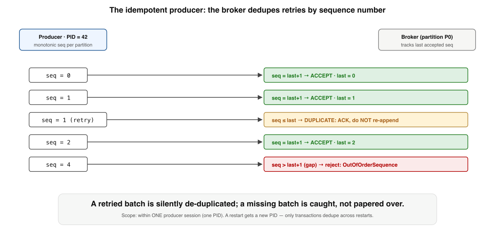

# Exactly-Once in Kafka — Deep Dive

*A supplement to Book 4, Lesson 3. The intro told you Kafka's exactly-once semantics come from "an idempotent producer (producer-ID + sequence number) plus transactions over the read-process-write cycle" and that they hold "only within Kafka's boundary." Both true, and both doing a lot of unexplained work. How does the sequence number actually dedupe? What does a transaction wrap, and why does committing the **consumer's input offset** inside the producer's transaction make the whole loop exactly-once? What stops a zombie producer from breaking it? And where, precisely, does the guarantee evaporate? This goes to the floor.*

Dense. Read it after Lesson 3 has settled.

---

## Where Lesson 3 stopped

First, the framing, sharper than the intro put it. Kafka's exactly-once semantics (EOS) deliver **exactly-once *processing* for the read-process-write pattern, entirely within Kafka.** That is: consume records from Kafka, process them, produce results back to Kafka — and have each input affect the output exactly once, even across crashes and retries. It is **not** exactly-once *delivery* (impossible, Lesson 2), **not** exactly-once across a chain of *external* systems, and **not** a way to make "charge a card" happen once. It is a precise guarantee about one common shape, built from three mechanisms that have to interlock: the idempotent producer, transactions, and the consumer's isolation level. Miss how they fit and you'll ship a pipeline that *thinks* it's exactly-once and quietly isn't.

---

## 1. The idempotent producer: producer-ID + sequence numbers

Start with the smaller problem: a producer retries a send after a network blip — did the first one land? At-least-once says "send again," which duplicates. The idempotent producer (`enable.idempotence=true`, the default since Kafka 3.0) removes that duplicate at the broker.

On startup the producer is assigned a **Producer ID (PID)** by the broker. Every record batch it sends to a partition carries a monotonically increasing **sequence number**, per `(PID, partition)`, starting at 0. The broker remembers the last sequence number it accepted for each `(PID, partition)` and checks every incoming batch:



- **`seq == last + 1`** → the expected next batch → **accept**, advance the counter.
- **`seq ≤ last`** → a **duplicate** (the producer retried a batch the broker already wrote) → the broker **ACKs the producer but does not append again.** The retry is silently de-duplicated.
- **`seq > last + 1`** → a **gap**: a batch was lost in between → the broker rejects with `OutOfOrderSequence`, because silently accepting it would leave a hole.

That's it — duplicate producer retries vanish, and ordering is preserved (which is why idempotence requires `acks=all` and `max.in.flight.requests ≤ 5`, so the broker can dedupe the last few batches and keep them in order). But note the scope: this dedupes retries **within a single producer session** — the life of one PID. If the producer process *restarts*, it gets a **new PID**, the broker's old per-PID state no longer matches, and duplicates across the restart are not caught. Closing that gap — and making writes atomic across partitions — is what transactions add.

---

## 2. Transactions: the read-process-write loop, made atomic

The idempotent producer makes one producer's retries safe. Transactions make a *set* of writes — across multiple partitions, **plus the consumer's input offset** — commit all-or-nothing. That last clause is the whole trick.

Set a **`transactional.id`** (a stable, user-chosen name that survives restarts) and the producer can run transactions. `initTransactions()` registers it with a **transaction coordinator** (a broker, backed by the internal `__transaction_state` topic). Then the read-process-write loop looks like this:


```
beginTransaction()
  produce(outputTopic, result)              // 1+ output partitions
  sendOffsetsToTransaction(inputOffsets, …)  // the consumer's progress
commitTransaction()
```

Read the middle line carefully. **`sendOffsetsToTransaction` writes the consumer's input offsets into the `__consumer_offsets` topic *as part of the producer's transaction*.** So the transaction atomically contains both: *the output records* and *the fact that we consumed those inputs*. On `commitTransaction()`, the coordinator writes **commit markers** (control records) into every involved partition — the output partitions and `__consumer_offsets` — and the whole thing becomes visible together. On a crash or `abortTransaction()`, **neither** the output nor the offset commit takes effect.

That atomicity is what makes the loop exactly-once. Trace a crash: the producer processes a batch, produces output, but dies *before* committing. The transaction is aborted (§4 explains how the *new* instance forces this). The input offsets were never committed, so on restart the consumer **reprocesses from the last committed offset** — and the partial output it wrote before crashing is marked **aborted**, invisible to downstream (§3). No input is lost; no output is double-counted. The offset commit and the output rise or fall together, which is exactly the property the dual-write problem (Book 2) says you can't normally get — Kafka gets it *because both writes are inside Kafka*, in one transaction.

---

## 3. `read_committed` and the Last Stable Offset

Producing transactionally is only half of it. If a downstream consumer reads aborted or in-flight records, the "exactly-once" output leaks duplicates anyway. The consumer must opt in.

Set **`isolation.level=read_committed`** and the consumer will:

- only deliver records from transactions that have **committed**, and
- never read past the **Last Stable Offset (LSO)** — the offset just before the first still-*open* transaction — so it never exposes records whose fate is undecided, and
- **filter out aborted records** using the abort markers the broker maintains.

The default, `read_uncommitted`, returns *everything* — committed, aborted, and in-flight alike. So a pipeline that produces transactionally but consumes with the default isolation level is **not** exactly-once; it sees the aborted duplicates the transaction was supposed to hide. EOS is a property of the *whole* pipeline: transactional producer **and** `read_committed` consumer. One without the other is a half-measure that looks right in testing and duplicates in production. (One consequence worth knowing: `read_committed` adds read latency, because a consumer can't advance past an open transaction — a long-running transaction stalls its consumers at the LSO.)

---

## 4. Zombie fencing: the `transactional.id` and the epoch

Here is the genuinely hard, genuinely distributed part — and it is Book 1's "you can't tell slow from dead" in a new costume.

A transactional producer with `transactional.id = "tx-1"` suffers a long GC pause or a network partition. Its orchestrator (Kafka Streams, a job scheduler) concludes it died and starts a **replacement** with the *same* `transactional.id`. Now there are two producers that both believe they own `tx-1`. If the original — a **zombie** — wakes up and commits its half-finished transaction, it corrupts the exactly-once guarantee: a duplicate, or a torn commit.


Kafka prevents this with an **epoch**. When the replacement calls `initTransactions()` for `"tx-1"`, the coordinator keeps the same PID but **bumps the epoch** (say 5 → 6) and aborts any transaction the old epoch had open. From that moment, **every request carrying the old epoch is rejected** with `ProducerFenced` / `InvalidProducerEpoch`. So when the zombie finally wakes and tries to produce or commit at epoch 5, the coordinator refuses it. The zombie is **fenced** — it cannot touch the output, no matter how confused the failure detector was.

This is why `transactional.id` must be *stable* across restarts (so the new instance reclaims the same identity and bumps the epoch) and why exactly-once tolerates the fundamental impossibility from Lesson 1: it never has to *correctly detect* that a producer died. It just guarantees that only the **latest** epoch can act, so a wrongly-declared-dead producer can do no harm.

---

## 5. The boundary: where Kafka's exactly-once stops

Now the part that keeps people honest. Everything above is **exactly-once from Kafka, through processing, back to Kafka.** Step outside that and it does not apply.

- **External side effects are not covered.** The instant your processing does something *outside* Kafka — write to a SQL database, charge a card, send an email, call a third-party API — it is not in the transaction, and a crash-and-retry can repeat it. You are back to the dual-write problem and its answers from Books 1–2: **idempotency keys** on the external call, or the **outbox pattern** (write to your DB and an outbox in one local transaction, relay to Kafka). Kafka EOS does not span Kafka and your database; nothing does, in one transaction.
- **Kafka Streams wraps it for you.** `processing.guarantee=exactly_once_v2` makes a Streams app manage the transactional producer, the `sendOffsetsToTransaction`, **and** its state-store changelog writes — all inside the transaction — so even *stateful* processing (aggregations, joins) is exactly-once. EOS v2 (KIP-447) uses one producer per stream thread instead of one per input partition, which is what made it scale to large topologies. If you're doing read-process-write, prefer Streams over hand-rolling the transaction loop.
- **It costs, but less than you'd fear.** Transactions add coordinator round-trips and commit markers, and the `commit.interval.ms` (default 100 ms under EOS) trades latency against overhead — smaller interval, lower latency, more transactions. Confluent's benchmarks put the steady-state throughput hit in the low single-digit percent with reasonable batching; the real cost is *latency*, bounded by the commit interval, plus the `read_committed` stall behind open transactions.

> **The honest summary:** Kafka EOS is exactly-once *effects* for *Kafka-to-Kafka read-process-write*, built from producer dedup, an atomic transaction that includes the input offset, a `read_committed` reader, and epoch fencing of zombies. It is real and it is excellent — and it stops at the first byte that leaves Kafka. For that byte, you still owe an idempotency key or an outbox.

---

## Self-Check — Exactly-Once in Kafka Deep Dive

Answer from memory before the key.

**Q1.** The idempotent producer dedupes a retried batch when the broker sees a sequence number that is…

- (a) equal to or below the last one it already accepted there
- (b) exactly one greater than the last one it has accepted
- (c) more than one greater than the last accepted sequence
- (d) reset to zero after the producer reconnects to the broker

**Q2.** What makes the read-process-write loop exactly-once is that the transaction atomically includes…

- (a) the output records plus the consumer's input offset commit
- (b) every record the producer has ever sent to that partition
- (c) a full copy of the input topic alongside the new output
- (d) the consumer group rebalance plus the broker's commit log

**Q3.** A consumer reading a transactional topic with the default `read_uncommitted` isolation level…

- (a) blocks at the Last Stable Offset until transactions commit
- (b) sees aborted and in-flight records, so it isn't exactly-once
- (c) automatically filters out every aborted record using markers
- (d) only ever delivers records from committed transactions

**Q4.** A zombie producer cannot corrupt exactly-once because the replacement's initTransactions…

- (a) deletes the zombie's process and all its in-flight buffers
- (b) bumps the epoch, so the old epoch's requests are fenced
- (c) waits for the zombie to time out before it produces anything
- (d) copies the zombie's open transaction and finishes it cleanly

## Answer Key

- **Q1 → (a).** A sequence at or below the last accepted is a duplicate retry — the broker ACKs but doesn't re-append. (`seq = last+1` is the normal next batch; `> last+1` is a gap → `OutOfOrderSequence`.)
- **Q2 → (a).** `sendOffsetsToTransaction` commits the consumer's input offset *inside* the producer's transaction, so output and input-progress commit together — or neither does.
- **Q3 → (b).** `read_uncommitted` returns everything including aborted/in-flight records; EOS needs the consumer set to `read_committed`.
- **Q4 → (b).** The same `transactional.id` re-registers and bumps the epoch; the coordinator then rejects the old epoch (`ProducerFenced`), so the zombie can't commit.

---

## Sources

- **Apache Kafka documentation** — "Idempotent Producer", "Transactions", `isolation.level` / `read_committed`, and the EOS configuration reference.
- **KIP-98** (Exactly Once Delivery and Transactional Messaging) and **KIP-447** (producer-per-thread scalability for Streams EOS).
- **Confluent — "Exactly-Once Semantics Are Possible: Here's How Kafka Does It" (Jay Kreps / Apurva Mehta & Jason Gustafson)** — the canonical write-up of PIDs, sequences, transactions, fencing, and the benchmarks.
- **Kleppmann — DDIA, Chapter 11** — stream processing, exactly-once, and the boundary argument.
- **Book 1, Lesson 2** (at-least-once + idempotency) and **Book 2** (the outbox, the dual-write problem) — what you still need for the byte that leaves Kafka.
