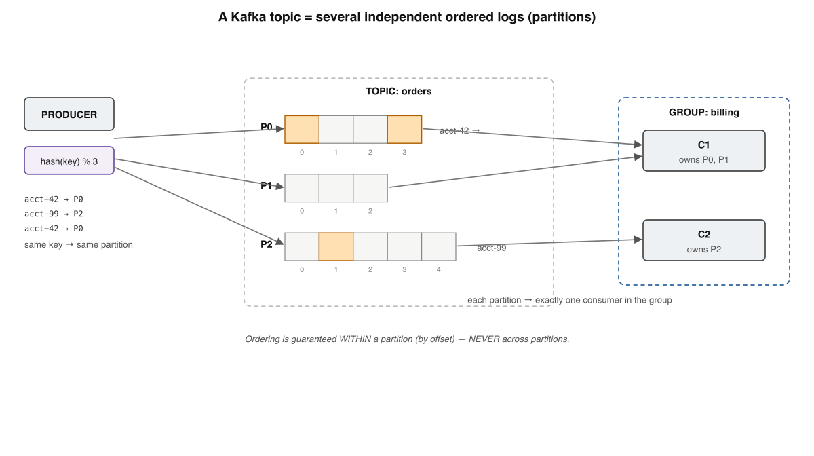
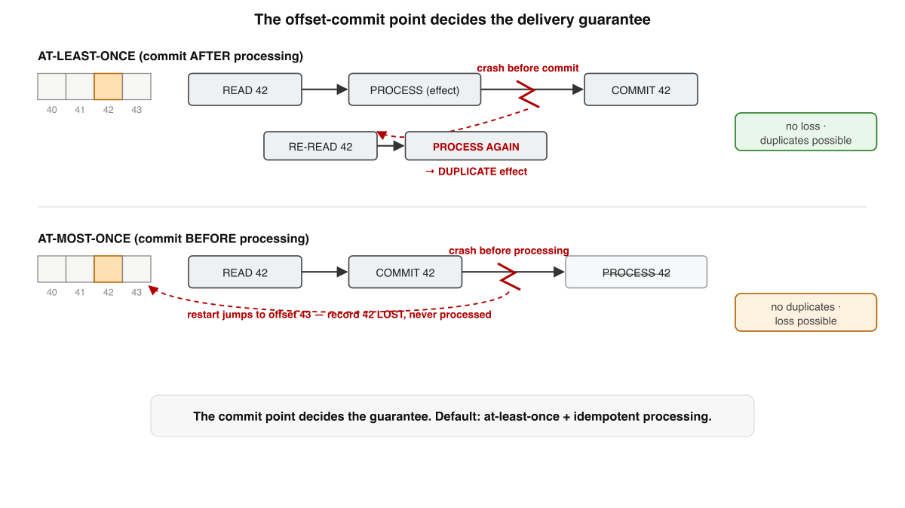
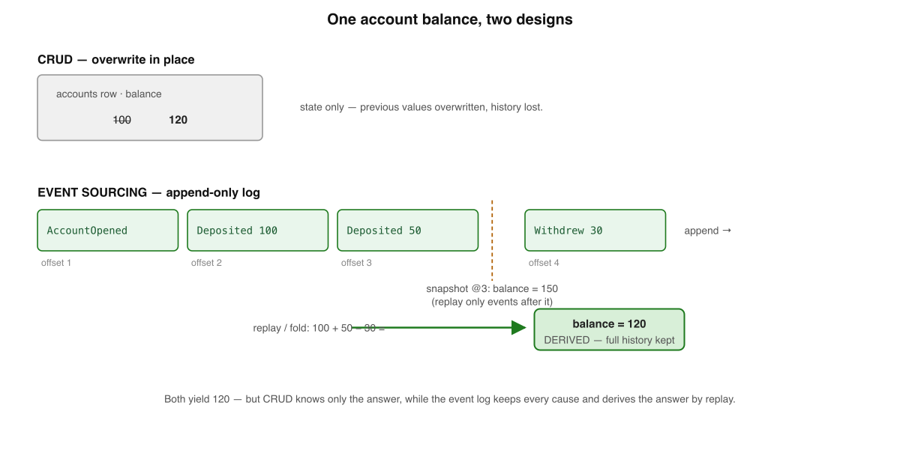
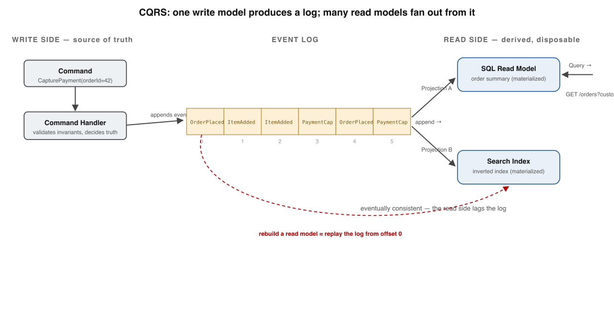
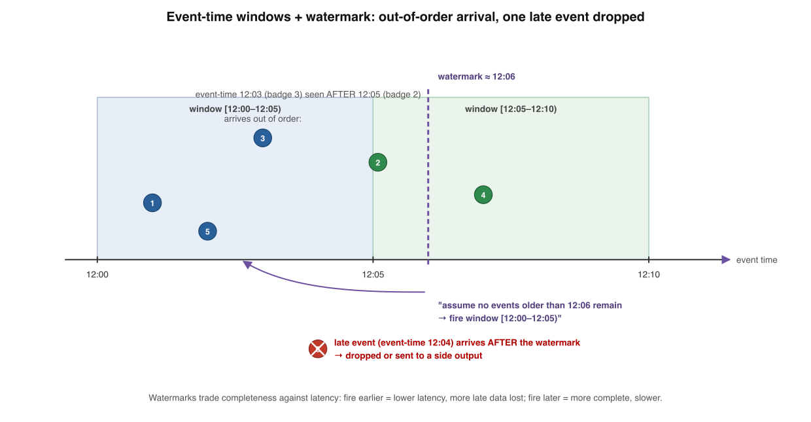

# Streaming & Event-Driven Architecture — Fundamentals

*Book 4 of a guided learning track. One tight win per lesson — not a textbook to swallow in one sitting.*

---

## How to use this document

**Mission.** You're learning how data *moves* and is processed as it arrives — the log as a unifying abstraction, Kafka, event sourcing, CQRS, and stream processing — so you can design event-driven systems with judgment. It pulls together the idempotency of Book 1, the outbox of Book 2, and the encoding/log machinery of Book 3.

**Method.** Each lesson teaches *one* idea, gives a concrete win, and ends with a self-check — answer it from memory before peeking. Diagrams are mostly **logs, dataflows, and event-time timelines**. A short **expert corner** closes each lesson with senior-level depth (real-system behaviour) you can skip on a first pass.

**I'm your teacher.** This is a starting point. When something is unclear or you want a worked example, ask.

---

## Course Map — the full path

| # | Lesson | The single win | Status |
|---|--------|----------------|--------|
| 1 | The Log: An Append-Only Source of Truth | Why the log is the unifying abstraction | ✅ Built |
| 2 | Kafka: The Distributed Log | Topics, partitions, offsets, consumer groups | ✅ Built |
| 3 | Delivery Guarantees in Streams | The offset-commit point decides everything | ✅ Built |
| 4 | Events vs Commands vs State | Thin notification vs fat state transfer | ✅ Built |
| 5 | Event Sourcing | Events as the source of truth | ✅ Built |
| 6 | CQRS | One write model, many read models | ✅ Built |
| 7 | Stream Processing | Stateless vs stateful dataflow | ✅ Built |
| 8 | Time, Windows & Watermarks | Event time, late data, completeness vs latency | ✅ Built |
| 9 | Building It Right | Patterns & pitfalls (the checklist) | ✅ Built |

**How every lesson is built:** prose → a diagram → a self-check → an expert corner.

---

## Lesson 1 — The Log: An Append-Only Source of Truth

### Where we left off

Book 3 left you holding a structure you met three times under three names. The WAL that made a write durable before the page moved. The commit log that fed an LSM-tree's memtable. The outbox row that turned a state change into a fact other systems could read. Each was the same shape: records appended at the end, never edited in place, read back in order. This book takes that shape and makes it the protagonist. Before Kafka, before event sourcing, before stream processing, you need to see the log clearly as an abstraction in its own right — because everything in Book 4 is built on it.

### What a log is

Strip away the database that wrapped it. A log, on its own, is the simplest possible storage structure.

> A **log** is an append-only, totally-ordered, immutable sequence of records. New records can only be added at the end; existing records are never modified or reordered; and each record is assigned a monotonically increasing **offset** — an integer that is both its identity and its position.

Four properties, each load-bearing. *Append-only*: writers add at the tail and nowhere else, which is why a single disk seek and a sequential write are all it costs. *Totally ordered*: there is one definitive sequence, so "what happened first" is never ambiguous — the log itself is the order. *Immutable*: a record, once written, is a fact; you do not go back and change history, you append a correction. *Offset-addressed*: record 4 is always record 4, for every reader, forever. A reader's entire position in the world collapses to a single number.

That last point is subtler than it looks. The offset is a logical clock for one log. Recall from **Book 1** that there is no global clock across machines — but *within a single ordered log*, the offset gives you exactly the total order Book 1 said you usually cannot have. The log buys ordering by giving up distribution: one writer, one sequence. Much of the rest of this book is about how Kafka recovers scale (partitions) without throwing that ordering away.


### You have already met this shape three times

Look back at Book 3 and Book 2 with this definition in hand. The log was never a niche trick — it was the same structure wearing different hats.

| Structure | Book | What "append a record" means | What the offset/position does |
|---|---|---|---|
| Write-ahead log (WAL) | Book 2 | Record the change before applying it | Recovery replays from the last checkpoint forward |
| LSM commit log | Book 3 | Durably capture a write before it hits the memtable | Replayed on crash to rebuild in-memory state |
| Outbox | Book 2 | Record a fact in the same transaction as the state change | A relay reads forward and publishes each row once |

This is not a coincidence worth a footnote — it is the central insight of Jay Kreps's "The Log: What every software engineer should know about real-time data's unifying abstraction" (2013). His observation: the log a database keeps internally for *its own* durability and replication is *the same thing* you want for moving data *between* systems. Replication is just a follower replaying the leader's log (Book 1, leaders and followers). The outbox is just exposing that log to the outside. Once you see it, the log stops being an implementation detail and becomes an interface.

### A log is not a message queue

Engineers often reach for "it's like a queue" and get the model subtly wrong. The two solve different problems, and the difference is exactly what makes the log powerful.

A traditional message queue (think classic RabbitMQ work-queue semantics) is *destructive and point-to-point*. A message sits in the queue until a consumer acknowledges it; on ack, the broker **deletes** it. The queue's job is to hand each unit of work to *one* worker and forget it. That is excellent for task distribution — ten workers draining one queue, each grabbing different jobs — but the message is gone the moment it is consumed, and there is no notion of "read it again" or "let a second, independent system also see it."

A log inverts both properties. Reading does **not** delete. Records are **retained** — by time or size policy, not by consumption — so the log holds history, not just pending work. And consumption is *non-destructive and multi-reader*: each consumer keeps its **own offset**, an independent bookmark into the same shared sequence. Consumer A can be caught up at offset 7 while B replays from 4 and C is still at 2, all reading the *same* records, none interfering with the others. This is the diagram above: one producer, one immutable strip, three readers at three positions.

| | Message queue | Log |
|---|---|---|
| On read | deletes the message | retains the record |
| Consumers per message | one (competing) | many (independent) |
| Reader's position | held by the broker | held as an offset per consumer |
| Replay history | not possible | seek to any offset |

DDIA Chapter 11 draws exactly this line, calling the log-based approach **log-based message brokers** to distinguish them from traditional ones. (Kafka can also emulate the queue's competing-consumer pattern *within* one consumer group — you will see how in Lesson 3 — but the underlying store still retains everything.)

### Why an immutable ordered log unifies everything

Now the payoff, and the thread for the rest of this book. Because the log retains and is offset-addressed, it becomes a *shared source of truth* that any number of systems can subscribe to without coordinating with each other. Add a new data warehouse, a search indexer, a cache, an analytics job — each just starts reading from offset 0 (or wherever it likes) and catches up at its own pace. You do not modify the producers. You do not build N×M point-to-point pipelines between every pair of systems; you build N producers and M consumers against one log in the middle. Kreps's argument is that this single abstraction collapses the integration tangle of an organization into a hub-and-spoke around the log.

And because the log is *immutable* and *ordered*, it is **deterministically replayable**. Replaying the same records in the same order through the same logic yields the same result — every time. That single property is the foundation of nearly everything ahead: replication (a follower replays the leader's log), recovery (a crashed consumer resumes from its last committed offset, leaning on the idempotency you learned to demand in Book 1), event sourcing (rebuild state by replaying every event), and stream processing (reprocess history by rewinding the offset). The log is not just a transport. It is a *durable, ordered, re-readable record of everything that happened* — and that is the substrate the next eight lessons stand on.

### Going deeper — expert corner

*Optional depth. Skip on a first pass.*

- **Retention is a policy, not a guarantee of forever.** Kafka deletes or compacts old segments by `retention.ms` / `retention.bytes`. A consumer that falls behind the retention window loses records it never read — the dreaded `OffsetOutOfRange`. "The log retains everything" means *within the configured window*. See the Apache Kafka docs on topic retention configuration.
- **Log compaction is a second retention mode** where Kafka keeps the *latest* record per key rather than trimming by age, turning the log into a durable, replayable snapshot of current state per key. This is the bridge from "stream of events" to "table" you will lean on in Lessons 5–8. See the Kafka "Log Compaction" design docs.
- **The offset is a per-partition logical position, not a wall-clock time.** Two records at the same offset in different partitions are unrelated; total order holds *only within a partition*. Kreps and DDIA Ch. 11 are explicit that partitioning is the price of scaling the single ordered log — Lesson 2 unpacks it.
- **Sequential append is why the log is fast, but `fsync` is the real durability boundary.** A record acknowledged but not yet flushed can vanish on a crash — the same WAL/`fsync` tension from Book 3's storage engines reappears here as Kafka's `acks` and `flush` settings. See the Kafka producer `acks` documentation.

### Self-Check — Lesson 1

**1. What does the offset of a record in a log identify?**
(a) The wall-clock time at which the record was written to disk
(b) Both the record's identity and its ordered position in the log
(c) The consumer group currently responsible for processing it
(d) The number of consumers that have acknowledged the record

**2. When a consumer reads a record from a log-based broker, the record is:**
(a) deleted once the consumer sends an acknowledgement
(b) moved to a separate queue for the next consumer in line
(c) retained, and other consumers can still read it independently
(d) locked until every registered consumer has read it once

**3. Why is an immutable, ordered log a strong abstraction for moving data between systems?**
(a) It compresses records so less data crosses the network between systems
(b) It lets each system replay the same records in order and stay consistent
(c) It encrypts every record so that only trusted systems can read it
(d) It guarantees each record is delivered to exactly one downstream system

**4. The WAL, the LSM commit log, and the outbox are all examples of:**
(a) message queues that delete each entry after a single consumer reads it
(b) caches that store the most recently accessed records for fast reads
(c) consensus protocols that elect a leader among competing replicas
(d) the same append-only, ordered, immutable log shape in different roles

### Answer Key — Lesson 1

1. **(b)** — The offset is a monotonically increasing integer that serves as both the record's unique identity and its position in the total order.
2. **(c)** — A log retains records on read and lets many consumers track their own offsets independently, unlike a queue that deletes on consume.
3. **(b)** — Immutability plus total order makes the log deterministically replayable, so any system can re-read it and converge to the same state.
4. **(d)** — Kreps's core insight is that all three are the same append-only, totally-ordered, immutable log used for durability, recovery, and integration.

---

## Lesson 2 — Kafka: The Distributed Log

### Where we left off

In Lesson 1 you saw the log become a unifying abstraction — the same append-only structure you met in Book 3 as the WAL, the LSM commit log, and the outbox, now repurposed as the backbone of data movement. A single log on a single machine is a fine idea and a terrible one: it cannot hold more than one disk, and it cannot be read faster than one reader can read. Kafka's whole design is the answer to that constraint. Take the log, cut it into pieces, spread the pieces across machines, and you get a log that scales in both directions at once. This lesson is how that cut is made and what it costs you.

### Topics and partitions — one log becomes many

A **topic** is a named stream of records — `orders`, `payments`, `account-events`. But a topic is not one log. Kafka splits each topic into a fixed number of **partitions**, and each partition is an independent, ordered, append-only log living on disk. A topic named `orders` with 6 partitions is six separate logs that happen to share a name.

> A partition is the unit of parallelism, ordering, and replication in Kafka. It is a single append-only log; a topic is just a set of partitions grouped under one name.

This is exactly the *partitioned (sharded) log* DDIA describes in Chapter 11: you take the log abstraction and shard it so throughput is no longer bounded by one machine. Each partition can sit on a different broker (a Kafka server), so the topic's total write and read capacity is the sum of its partitions, not the limit of any one disk. The number of partitions is the dial you turn for throughput. (Apache Kafka documentation, "Topics and Logs"; DDIA ch. 11.)

### Offsets and ordering — order lives inside a partition, nowhere else

Every record appended to a partition gets a monotonically increasing integer: its **offset**. Offset 0, then 1, then 2, forever. The offset is the record's address within that one partition — `(topic, partition, offset)` uniquely identifies any record Kafka holds.

Because each partition is a single append-only log, Kafka guarantees that records within a partition are read in exactly the order they were written. That is the entire ordering guarantee, and the boundary matters enormously:

| Scope | Ordering guarantee |
|---|---|
| Within one partition | Strict, total, by offset |
| Across partitions of a topic | None whatsoever |

There is no global offset, no topic-wide sequence number, no way to ask "what was the 5,000th record across the whole topic". This should feel familiar from Book 1: there is no global clock and no free total order across machines. Kafka does not pretend otherwise. It gives you cheap total order *inside* a partition and nothing across them. Designing a Kafka system is largely the work of deciding what must be ordered together — and therefore what must share a partition.



### Producers pick a partition — hash the key, keep the key ordered

When a producer sends a record, it must choose *which* partition the record lands in. The default rule: if the record has a key, Kafka hashes the key and takes that hash modulo the partition count. Same key, same hash, same partition — every time. (If there is no key, records are spread across partitions for load balance, typically in sticky batches.) See the Apache Kafka documentation, "Producer" / `DefaultPartitioner`.

This is the lever that turns "no order across partitions" from a limitation into a tool. Choose your key to be the entity whose history must stay ordered. Key `orders` by `accountId`, and every event for one account — `OrderPlaced`, `PaymentCaptured`, `OrderShipped` — lands on the same partition, in the same log, read in the order it happened. Two different accounts may land on different partitions and have no order between them, and that is correct: their histories are genuinely independent.

```
record(key="acct-42")  -> hash("acct-42") % 6 = 3  -> partition P3
record(key="acct-99")  -> hash("acct-99") % 6 = 1  -> partition P1
record(key="acct-42")  -> hash("acct-42") % 6 = 3  -> partition P3  (after the first acct-42)
```

The same-key-same-partition rule is also what makes Kafka a viable change-data-capture and event-sourcing transport: a per-entity event stream stays correctly ordered for free. (Kreps, "The Log: What every software engineer should know about real-time data's unifying abstraction," 2013.)

### Consumer groups — how reading scales

Writing scaled by adding partitions. Reading scales through **consumer groups**. A consumer group is a set of consumer instances sharing a group id. Kafka divides the partitions of a topic among the members so that **each partition is read by exactly one consumer in the group**. Add a consumer, Kafka reassigns partitions to spread the load; lose a consumer, its partitions are handed to the survivors.

Suppose `orders` has 3 partitions and a group has 2 consumers. Kafka might assign P0 and P1 to C1, and P2 to C2. Each partition has exactly one reader, so each record is processed once by the group, and the two consumers work in parallel. The hard ceiling: **a group can have at most one active consumer per partition**. A topic with 3 partitions saturates at 3 working consumers in a group; a fourth sits idle. Partition count is the upper bound on consumer parallelism — another reason to choose it deliberately. (Apache Kafka documentation, "Consumer Groups.")

Two independent groups read the *same* topic fully and independently — a billing group and an analytics group each see every order. That is the same data feeding many consumers, the fan-out you met in Lesson 1, with each group tracking its own progress by committing offsets.

### Replication for durability — leaders and followers

A partition that lives on one broker dies with that broker. So Kafka replicates each partition across several brokers, with a **replication factor** (commonly 3) setting how many copies exist. For each partition, one replica is the **leader** and the rest are **followers**. All reads and writes go to the leader; followers continuously pull from the leader to stay current, forming the in-sync replica (ISR) set.

This is precisely the leader–follower replication from Book 1, applied per partition. If the broker holding a leader fails, Kafka elects a new leader from the in-sync followers, and the partition keeps serving with no data loss for anything that was acknowledged. With `acks=all`, a producer's write is acknowledged only once it is replicated to all in-sync replicas — durability bought at the price of a little latency, exactly the trade-off Book 1 framed. Note that leadership is *per partition*: a single broker is leader for some partitions and follower for others, so the load spreads evenly rather than piling onto one machine. (Apache Kafka documentation, "Replication"; DDIA ch. 11.)

Put together: a topic is many ordered logs (partitions), addressed by offset, with order only inside each one; producers route by key to keep an entity's history together; consumer groups divide partitions to scale reads; and replication keeps every partition alive across broker failure. Every later idea in this book — event sourcing, stream joins, exactly-once — is built on these five facts.

### Going deeper — expert corner

*Optional depth. Skip on a first pass.*

- **Repartitioning breaks key locality.** `hash(key) % N` means changing the partition count `N` sends existing keys to new partitions, so old and new events for one key can split across two logs and lose their relative order. This is why partition count is treated as near-immutable in production; teams over-provision partitions up front rather than grow them later. (Apache Kafka documentation, "Adding partitions.")
- **Rebalancing has a cost.** When group membership changes, the classic protocol triggers a "stop-the-world" rebalance where consumers pause while partitions are reassigned. Cooperative/incremental rebalancing (KIP-429) and static membership (KIP-345) reduce this churn so a brief restart no longer reshuffles the whole group. (Apache Kafka documentation, "Consumer rebalance protocol.")
- **Log compaction makes a topic a table.** With `cleanup.policy=compact`, Kafka retains the latest record per key and garbage-collects superseded ones, turning a partition into a durable keyed snapshot. This is the bridge between an event log and current-state storage you will use heavily in CQRS. (Apache Kafka documentation, "Log Compaction"; Kreps 2013.)
- **`acks=all` durability is only as strong as `min.insync.replicas`.** If the ISR set shrinks below that threshold, an `acks=all` producer blocks rather than silently accepting under-replicated writes — and `unclean.leader.election` left enabled can elect a stale follower and lose acknowledged data. The durable configuration is `acks=all` plus `min.insync.replicas=2` plus unclean election disabled. (Apache Kafka documentation, "Replication" / broker configs.)

### Self-Check — Lesson 2

**1. Within a single Kafka topic, what does Kafka guarantee about record ordering?**
(a) Records are ordered by offset within each partition, but not across partitions
(b) Records are ordered globally across the topic by a shared sequence number
(c) Records are ordered by the wall-clock time at which each broker received them
(d) Records are ordered across partitions whenever they share the same offset value

**2. A producer sends records with the same key to a keyed topic. Where do they land?**
(a) On randomly chosen partitions, balanced evenly across all of them
(b) On a partition picked by round-robin so each one gets equal load
(c) On the same partition every time, chosen by hashing the key
(d) On the leader broker's first partition until that partition fills up

**3. A topic has 3 partitions and one consumer group with 5 consumers. What happens?**
(a) Each partition is split so all 5 consumers share every partition's records
(b) Three consumers each read one partition; the other two stay idle
(c) All 5 consumers read all 3 partitions, so each record is processed five times
(d) Kafka rejects the group because consumers outnumber the partitions

**4. How does Kafka keep a partition available when its broker fails?**
(a) It replays the partition from a backup file written to object storage
(b) It rebuilds the partition by re-reading every producer's local buffer
(c) It rehashes the partition's keys onto the remaining healthy brokers
(d) It elects a new leader from the partition's in-sync follower replicas

### Answer Key — Lesson 2

1. **(a)** — Each partition is an independent ordered log addressed by offset; Kafka provides no ordering across partitions and no global topic sequence.
2. **(c)** — The default partitioner hashes the key modulo partition count, so identical keys deterministically map to the same partition and stay ordered.
3. **(b)** — At most one consumer per partition in a group, so 3 partitions allow 3 active consumers and the extra 2 remain idle.
4. **(d)** — Each partition is replicated with a leader and in-sync followers; on leader failure Kafka promotes an in-sync follower with no loss of acknowledged data.

---

## Lesson 3 — Delivery Guarantees in Streams

### Where we left off

In Lesson 2 you watched a consumer read a partition by advancing an **offset** — a cursor into the append-only log you first met in Book 3 (as the WAL and the LSM commit log) and in Book 2 (as the outbox). The offset looks innocent: a single integer per partition. But *when* the consumer saves that integer relative to *when* it does its work decides the entire delivery semantics of your pipeline. This lesson is about that one choice.

### The three guarantees, seen again in a consumer

Book 1 named three delivery guarantees for messages crossing a network under partial failure. They reappear, unchanged, inside a streaming consumer reading one partition.

> **At-most-once** delivers each record zero or one times (losses allowed, no duplicates). **At-least-once** delivers it one or more times (duplicates allowed, no losses). **Exactly-once** delivers the *effect* of each record once — no loss, no duplicate.

DDIA chapter 11 frames stream processing as exactly this problem: a consumer that may crash mid-flight, restart, and must decide what to redo. The naming is the same as Book 1 because the underlying enemy is the same — partial failure means a crash can land *between* any two steps, and you don't get to choose where.

The trap is the phrase "exactly-once delivery." A record genuinely delivered to your process exactly once is not achievable over an unreliable channel — the sender can't tell a lost message from a lost acknowledgement (Book 1, the two-generals problem). What systems actually provide is exactly-once *processing*: the observable effect happens once even though the record may be redelivered. Hold that distinction; it is the whole game.

### The crux: when you commit the offset

A consumer loops over two operations per record — **process** (apply the effect: write a row, charge a card, increment a counter) and **commit** (persist the offset so a restart resumes past this record). A crash can fall between them. The order you choose is the guarantee you get.



**Commit *after* processing → at-least-once.** Read record at offset 42, process it, then commit 42. If you crash after processing but before the commit lands, the restart re-reads 42 (the committed offset still says 41) and processes it a second time. No record is ever lost, but you can get duplicates. This is the safe direction: you never drop data.

**Commit *before* processing → at-most-once.** Read record at offset 42, commit 42, then process it. If you crash after the commit but before processing finishes, the restart resumes at 43 and record 42 is gone forever. No duplicates, but data can vanish.

| Order | Crash falls between | Outcome | Guarantee |
|---|---|---|---|
| process → commit | process and commit | record re-read, reprocessed | at-least-once |
| commit → process | commit and process | record skipped | at-most-once |

This is why Kafka's defaults matter. When you enable `enable.auto.commit`, offsets are committed on a timer *as records are handed to you* — effectively before your processing finishes — which leans toward at-most-once on a crash. To get at-least-once you disable auto-commit and call `commitSync` only after your work is durably done (Apache Kafka consumer documentation). Most teams who think they have at-least-once and discover silent data loss got the commit point wrong.

### The practical default: at-least-once plus an idempotent consumer

At-least-once is the right default because losing data is usually worse than reprocessing it — and reprocessing is a problem you can *engineer away*. The fix is the idempotency you learned in Book 1: design the processing step so that applying the same record twice has the same effect as applying it once.

Concretely, for an `OrderPaid{ orderId, paymentId, amount }` event, the naive consumer does `balance += amount` — a duplicate double-charges. The idempotent consumer keys the effect on a stable identifier and makes the write a no-op the second time:

- **Dedup table / idempotency key** (Book 1): record `paymentId` in a processed-set inside the same transaction as the balance update (Book 2's atomic write); on a duplicate, the insert conflicts and you skip the increment.
- **Natural idempotency**: `UPDATE balance SET amount = :final WHERE ...` (an absolute set, not a relative `+=`) is replay-safe by construction.
- **Upsert by event id**: writing a row keyed on `paymentId` collapses duplicates.

With idempotent processing bolted onto at-least-once delivery, you get exactly-once *effects* without any special broker magic. DDIA chapter 11 calls this out explicitly: idempotence is the most broadly applicable route to exactly-once semantics, and it works across any sink, not just Kafka.

### Kafka exactly-once semantics and its boundary

Kafka also offers exactly-once *within Kafka* — useful when your consumer is itself a producer (the read-process-write pattern of stream processing). It rests on two mechanisms (Apache Kafka EOS documentation; Confluent, "Exactly-Once Semantics Are Possible," 2017).

1. **Idempotent producer.** Each producer gets a **producer id (PID)** and stamps every record with a per-partition **sequence number**. The broker remembers the last sequence it accepted per `(PID, partition)` and silently drops a retry that repeats a sequence — so a producer retrying after a network hiccup (Book 1) doesn't write the record twice. Enable with `enable.idempotence=true`.

2. **Transactions over read-process-write.** A transactional producer wraps the *consume → transform → produce* cycle atomically: the output records *and* the consumer's offset commit are written to Kafka under one transaction id, then committed together. Either both land or neither does. Downstream consumers reading with `isolation.level=read_committed` never see records from an aborted transaction.

Now the boundary, which is the senior-level point. Kafka's exactly-once holds **only for state that lives in Kafka** — output topics and committed offsets. It cannot make an *external* side effect exactly-once. If your processing step charges Stripe or writes to Mongo, the broker transaction does not enroll that system; a crash can still leave an external write done with the Kafka transaction aborted, or vice versa. For those, you are back to idempotency keys and the outbox pattern (Book 2). Kafka EOS is a closed-world guarantee; the moment you reach outside Kafka, the responsibility returns to you.

### Going deeper — expert corner

*Optional depth. Skip on a first pass.*

- **Transactional offset commits are the real trick.** `sendOffsetsToTransaction` writes consumer offsets through the *producer's* transaction, not the consumer's commit path — that is what makes read-process-write atomic. See the Kafka `KafkaProducer` Javadoc and KIP-98 ("Exactly Once Delivery and Transactional Messaging").
- **Idempotent producer caps in-flight requests.** With idempotence on, `max.in.flight.requests.per.connection` must stay ≤ 5 so the broker can detect out-of-order sequences; exceed it and the dedup window breaks. Apache Kafka producer configuration documentation.
- **Zombie fencing.** Transactions add an **epoch** to the transaction id so a hung-then-resurrected producer (a "zombie," Book 1's split-brain) is fenced off when a new instance claims the same transaction id. Confluent's EOS design post details the epoch-bump protocol.
- **EOS is not free.** Transactions add commit-coordination latency and a transaction-marker write per commit; Confluent's benchmarks put the throughput cost in the single-digit-percent range for reasonable batch sizes, but tail latency rises. Measure before assuming it's negligible.

### Self-Check — Lesson 3

**1. A consumer reads offset 42, processes the record, then commits 42, and crashes between processing and the commit. On restart, what happens?**
(a) The record at 42 is re-read and processed a second time
(b) The record at 42 is skipped and never processed
(c) The consumer resumes at offset 43 with no replay
(d) The broker rolls back the processing side effect

**2. Which ordering of operations yields at-most-once delivery?**
(a) Process the record first, then commit the offset
(b) Commit the offset first, then process the record
(c) Commit and process inside one broker transaction
(d) Process twice and deduplicate on the second pass

**3. Why is at-least-once plus an idempotent consumer the recommended default?**
(a) It guarantees the broker delivers each record exactly one time
(b) It avoids data loss and makes duplicate processing a no-op
(c) It removes the need to ever commit consumer offsets
(d) It extends Kafka transactions to external databases too

**4. What is the boundary of Kafka's exactly-once semantics?**
(a) It applies only to records within a single partition
(b) It applies only to state inside Kafka, not external side effects
(c) It applies only when auto-commit is left enabled
(d) It applies only to consumers, never to producers

### Answer Key — Lesson 3

1. **(a)** — The commit hadn't landed, so the committed offset still points before 42; the restart re-reads and reprocesses it (at-least-once).
2. **(b)** — Committing before processing means a crash after the commit skips the record entirely, losing it (at-most-once).
3. **(b)** — At-least-once never drops data, and an idempotent processing step makes the inevitable duplicates harmless, yielding exactly-once effects.
4. **(b)** — Kafka EOS is a closed-world guarantee over output topics and offsets; external writes (Stripe, Mongo) need idempotency keys or the outbox pattern.

---

## Lesson 4 — Events vs Commands vs State

### Where we left off

In Book 3 you met the log three times — as the WAL that makes a write durable before the page is updated, as the LSM-tree's commit log, and as the outbox row that records "this happened" inside the same transaction as the business change (Book 2). In all three the log holds *facts that already occurred*. This lesson sharpens that intuition into a vocabulary. The thing you put on a Kafka topic is not arbitrary data — it is one of two categories, and choosing the wrong one is the most common modelling mistake in event-driven systems.

### A command is a request; an event is a fact

Start with the distinction that organises everything else.

> A **command** is an imperative request to do something — it names an intended action, may be rejected, and is addressed to a specific handler. An **event** is a past-tense statement that something *already happened* — it is immutable, cannot be rejected, and is broadcast to whoever cares.

`PlaceOrder` is a command. It might fail validation, hit an out-of-stock item, or be refused because the card declined. It expects exactly one handler and usually a response. `OrderPlaced` is an event. By the time it exists, the order *was* placed — there is nothing to reject, no single recipient, no return value. The tense is the tell: imperative verb for commands (`ReserveInventory`, `ChargeCard`), past participle for events (`InventoryReserved`, `CardCharged`).

This matters because the two have opposite coupling. A command couples the sender to *one* receiver and a contract for success or failure. An event couples the producer to *nothing* — it announces a fact and walks away, and zero, one, or ten consumers may react. Martin Fowler, in "What do you mean by Event-Driven?", warns against the anti-pattern of dressing a command up as an event: if `OrderPlaced` is only ever consumed by the shipping service and shipping *must* run, you have written a command with past-tense clothing, and you have lost the decoupling that events buy. The honesty rule is simple — an event must remain true and meaningful even if no one is listening.

### Two styles of event: notification vs state transfer

Once you commit to emitting an event, a second choice appears: how much does it carry? Fowler names two patterns.

An **event notification** is thin. `OrderPlaced { orderId: 42 }` says "something happened, here is its identity" and nothing more. A consumer that needs the line items and shipping address must call *back* to the order service to fetch them.

**Event-carried state transfer** is fat. `OrderPlaced { orderId: 42, items: [...], address: {...}, total: 199.00 }` ships the data the consumer needs *with* the event, so the consumer reacts without a single follow-up call.


Both panels above show the *identical* business fact — an order was placed — flowing from Order to Shipping. The difference is entirely in the envelope. On the left, Shipping reads `{ orderId: 42 }`, then makes a synchronous HTTP call back to Order to learn what to ship. On the right, Shipping reads `{ orderId: 42, items, address }` and proceeds; the Order service may already be down and Shipping still works.

### The trade-off

Neither style is correct in the abstract; they trade the same two forces against each other.

| | Event notification (thin) | State transfer (fat) |
|---|---|---|
| Payload | small, just an id | large, full record |
| Coupling | loose — consumer pulls only what it needs | tighter — consumer binds to the payload schema |
| Runtime cost | a callback per consumer | self-contained, no callback |
| Availability | consumer fails if producer is down | consumer survives producer downtime |
| Staleness | always reads latest on callback | reads the snapshot frozen in the event |

Thin events keep producers ignorant of what consumers want — you can add a fraud-check consumer tomorrow without changing the event — but every consumer pays a network round-trip back to the source, and that source becomes a synchronous dependency you tried to escape. Fat events remove the callback and let consumers process offline, but they bind every consumer to the *shape* of the payload, and they embed a *snapshot*: if the address is corrected after `OrderPlaced` is emitted, the shipping service holds the old one until a later event corrects it (echoing the no-global-clock reality of Book 1 — there is no single "now" everyone reads). DDIA chapter 11 frames fat events as building a local, read-optimised replica inside each consumer — powerful, but now you own a derived copy and its consistency.

A common middle path: emit a thin notification but include a few hot fields (a `total`, a `status`) so the most frequent consumers skip the callback while rare ones still pull detail.

### Designing good events: schema must evolve safely

Here is the property that makes event design harder than API design. An HTTP request lives for milliseconds; an event lives **forever**. It sits in a Kafka topic for the retention period, it gets replayed when you add a new consumer or rebuild a downstream store, and a consumer written next year will read an event produced today. That collides directly with Book 3's encoding and schema-evolution rules — and the collision is the whole reason those rules exist.

Concretely: never remove or repurpose a field a consumer might still read; add new fields as optional with defaults so old consumers ignore them and new consumers tolerate their absence (forward and backward compatibility, exactly as in Book 3). This is why teams put event payloads behind Avro, Protobuf, or JSON Schema with a registry rather than ad-hoc JSON — the registry mechanically rejects an incompatible change before it poisons a topic that may be replayed years later. Fat events feel the pain most: more fields means more surface area to evolve, and a breaking change to a fat `OrderPlaced` ripples to every consumer that froze a copy of its shape. The discipline you learned for storage-on-disk is the *same* discipline for data-in-motion — a log is a log.

### Going deeper — expert corner

*Optional depth. Skip on a first pass.*

- **Log compaction turns a stream of events into a snapshot store.** With `cleanup.policy=compact`, Kafka retains only the latest event per key, so a topic of `AccountUpdated` events becomes a queryable current-state table — state transfer at the topic level. See the Apache Kafka documentation on log compaction.
- **Thin events plus a callback re-introduce the dual-write problem from Book 2.** If the producer commits the order but the callback later reads a half-applied state, you are back to consistency races; the outbox pattern exists precisely to make the event and the state change atomic. DDIA chapter 11, "Databases and Streams".
- **State-transfer events are change data capture by another name.** Debezium streams a database's row changes as fat events; the design questions (snapshot vs delta, schema evolution, tombstones for deletes) are identical to hand-rolled state-transfer events. See the Debezium and DDIA chapter 11 CDC discussion.
- **Snapshot staleness in fat events needs a correction strategy.** Either emit a follow-up `AddressCorrected` event, or carry a version/timestamp so a late consumer can detect it holds a stale copy — without it, consumers silently diverge. Fowler, "What do you mean by Event-Driven?", on the consistency cost of state transfer.

### Self-Check — Lesson 4

**1.** What most cleanly distinguishes a command from an event?

(a) A command can be rejected and targets one handler; an event is an immutable fact broadcast to any number of consumers
(b) A command is stored in Kafka while an event is sent over HTTP to a single downstream service for processing
(c) A command is always larger in payload size whereas an event is always a thin identifier with no body at all
(d) A command is produced by consumers and an event is produced by databases during their normal replication cycle

**2.** A team emits `OrderPlaced { orderId }` and every consumer immediately calls the order service back for details. What is the main cost of this thin design?

(a) Each consumer pays a network round-trip and the producer becomes a synchronous dependency you tried to avoid
(b) The event payload grows unbounded over time and eventually exceeds the broker's configured maximum message size
(c) Consumers bind tightly to the full payload schema and break whenever any optional field is added or removed
(d) The event stops being a true fact and must be re-validated by every consumer before it can be acted on

**3.** Why does event-carried state transfer increase coupling compared to a notification?

(a) Consumers bind to the shape of the carried payload and to a snapshot that can be stale by read time
(b) Consumers must register with the producer in advance so the producer knows which fields to include
(c) Consumers can no longer be added later because the producer caps the number of allowed subscribers
(d) Consumers must acknowledge each event synchronously so the producer can confirm the transfer succeeded

**4.** Why must event schemas follow Book 3's evolution rules more strictly than a synchronous API?

(a) Events are long-lived and replayed, so an event written today may be read by a consumer written next year
(b) Events are encrypted at rest, so any schema change forces a re-encryption pass over the entire topic
(c) Events are processed in strict order, so adding a field shifts the byte offsets every consumer depends on
(d) Events are deleted after delivery, so a missed compatibility window cannot be recovered by a later replay

### Answer Key — Lesson 4

**1. (a)** A command is an imperative, rejectable request to one handler; an event is an immutable past-tense fact broadcast to any number of consumers.

**2. (a)** Thin events force a callback per consumer, turning the producer into the synchronous dependency you adopted events to escape.

**3. (a)** Fat events bind consumers to the payload's shape and embed a snapshot that may be stale by the time it is read.

**4. (a)** Events sit in the log for the retention period and are replayed, so a producer today must stay readable by a consumer written much later — forward and backward compatibility, exactly as in Book 3.

---

## Lesson 5 — Event Sourcing

### Where we left off

In Book 3 you met the append-only log three times wearing three costumes: the WAL that lets a storage engine recover by replaying writes, the LSM commit log that captures every mutation before it lands in an SSTable, and the outbox row from Book 2 that turns a state change into a publishable fact. In Lesson 1 of this book we lifted the log out of the engine and made it the system's backbone. Event sourcing is what happens when you take that idea to its logical end: stop treating the log as a recovery aid behind your "real" state, and make the log itself the real state.

### The core idea: events as the source of truth

> **Event sourcing** stores every change to application state as an immutable, ordered event in an append-only log, and treats that log — not a mutable record of current state — as the system of record. Current state is *derived* by replaying the events from the beginning. (Martin Fowler, "Event Sourcing," 2005.)

Take a bank account. The conventional design stores one number: `balance = 120`. Event sourcing stores the *causes* instead:

```
1  AccountOpened       {}
2  Deposited           { amount: 100 }
3  Deposited           { amount: 50 }
4  Withdrew            { amount: 30 }
```

There is no `balance` field anywhere. To answer "what is the balance?" you start from zero and *fold* the events left to right — a deposit adds, a withdrawal subtracts — and arrive at 120. The current balance is a computed view of the log, exactly the way an LSM-tree's current value is the most-recent entry found by replaying its log. The events are the truth; the number is an opinion about them.

This is the same inversion Jay Kreps described in "The Log" (Lesson 1) and that DDIA develops in Chapter 11: the durable, ordered sequence of facts is primary, and every queryable structure is a projection of it.

### The contrast with CRUD: overwrite-and-forget vs. remember-everything

Conventional CRUD is *destructive*. When a withdrawal hits, you run `UPDATE accounts SET balance = 90 WHERE id = ...`. The number 120 is overwritten in place and is gone — the database now knows the *what* (90) but has thrown away the *why* and the *when*. The previous value left no trace, exactly the place-overwrite update DDIA contrasts with the append-only log.

Event sourcing never overwrites. A correction is not an `UPDATE`; it is a new event appended to the end (`Withdrew { amount: 30 }`, or later `TransactionReversed { ... }`). The log only grows. This is the crucial structural difference, and it is why the next section's benefits fall out almost for free.



### What you gain: audit, time-travel, and new read models

Three properties that are expensive bolt-ons in a CRUD system are inherent in an event-sourced one (Fowler, "Event Sourcing"; Greg Young's talks on the pattern):

- **A complete audit log, by construction.** The list of events *is* the history. You never wonder who changed what when, because the change and the record of the change are the same object. Regulated domains — banking, ledgers, medical records — get auditability for free instead of stapling on triggers and history tables.
- **Time-travel to any past state.** State at any moment is the fold of all events up to that moment. Want the balance as of last Tuesday? Replay events 1 through *k* and stop. CRUD cannot answer this at all once the row is overwritten.
- **Freedom to build new read models retroactively.** The log is the input; any projection is a pure function of it. Six months from now you can invent a "monthly spend by category" view, replay the *entire* event history through new projection code, and backfill it as if you'd had it all along. This is precisely the CQRS split we take up in Lesson 6 — the events feed multiple, independently shaped read models.

### What it costs: replay and eternal schema versioning

Event sourcing is not free, and the costs are concrete.

**You must replay to get state.** Folding millions of events on every read is absurd, so you keep a **snapshot**: a periodically materialized copy of derived state at a known event offset (say, "balance = 95 as of event 50,000"). To get current state you load the latest snapshot and replay only the events *after* it. The snapshot is an optimization, never the source of truth — you can always delete every snapshot and rebuild from the log. This is the same relationship a Book 3 LSM-tree has between its compacted SSTables and its commit log.

**You must version event schemas forever.** Because the log is immutable and you may replay events written years ago, your code must be able to read *every version of every event it has ever emitted*. You cannot run a migration to "fix" old events — they are historical facts. This is exactly the schema-evolution discipline from Book 3 (backward and forward compatibility), now load-bearing for the life of the system. A renamed field or a changed meaning is a permanent compatibility obligation, not a one-time `ALTER TABLE`. DDIA Chapter 11 is blunt that this is the standing tax of the pattern.

### The aggregate and the event store

Two terms anchor the implementation.

An **aggregate** (the term comes from Domain-Driven Design, the unit Greg Young pairs with event sourcing) is the consistency boundary you rebuild and validate against — here, one `Account`. Events are scoped to an aggregate, and you load an aggregate by replaying *its* event stream. The aggregate is where you enforce invariants: to decide whether a `Withdraw` command is legal, you fold the account's events into the current balance and check it covers the amount *before* appending `Withdrew`. The decision reads state; the result writes an event.

The **event store** is the append-only database that holds these streams, keyed by aggregate id and strictly ordered per aggregate. Its core operations are narrow: `append(events)` to a stream and `read(streamId, fromOffset)` to replay one. The single hard guarantee it must give is per-stream ordering with an optimistic-concurrency check — append only if the stream is still at the offset you read — which is how you prevent two concurrent commands from each appending against a stale view of the same account. That offset check is the same compare-and-set idea behind idempotency keys in Book 1.

### Going deeper — expert corner

*Optional depth. Skip on a first pass.*

- **Snapshots are caches, and caches drift.** A snapshot computed by version 1 of your fold logic is wrong the moment the fold logic changes meaning. Mature systems version snapshots and rebuild them lazily; treating a snapshot as authoritative is the classic event-sourcing footgun. (Young, on snapshotting; Fowler, "Event Sourcing.")
- **Commands vs. events are not the same shape.** A command (`Withdraw`) can be rejected; an event (`Withdrew`) is a fact that already happened and cannot fail. Blurring the two — emitting an event that downstream consumers must then "validate" — leaks the decision out of the aggregate and breaks the model. (Greg Young; DDIA ch. 11, command/event distinction.)
- **External effects are not replayable.** Replaying the log to rebuild a read model must be side-effect-free, but the *original* processing may have sent an email or charged a card. Quarantine effects behind the projection boundary, or replay will re-send them. This is the same "rebuild must be pure" constraint Kafka Streams enforces when it restores state from a changelog topic (Lesson 7).
- **Event sourcing and the outbox are cousins, not twins.** Book 2's outbox publishes events *derived from* a still-authoritative state table; event sourcing makes the events themselves authoritative and has no separate state table to fall out of sync. Knowing which you actually need — auditability and time-travel, or just reliable publication — saves you the schema-versioning tax when you don't need it. (Fowler, "Event-Driven"; DDIA ch. 11.)

### Self-Check — Lesson 5

**1. In an event-sourced account, where does the current balance live?**
(a) In a `balance` column updated on every write
(b) It is derived by folding the account's events
(c) In the most recent snapshot, authoritatively
(d) In a cache that the event store keeps in sync

**2. What is the primary purpose of a snapshot?**
(a) To replace the event log as the source of truth
(b) To record who changed the aggregate and when
(c) To enforce per-stream ordering on appends
(d) To avoid replaying the full history on each read

**3. Why must event schemas be versioned indefinitely?**
(a) Because old events are migrated to the newest shape
(b) Because the event store rejects unversioned events
(c) Because replay must read every event ever written
(d) Because snapshots embed the schema of each event

**4. What does the aggregate provide in this pattern?**
(a) The transport that ships events to consumers
(b) The consistency boundary where invariants are checked
(c) The cache layer that serves derived read models
(d) The global ordering across all event streams

### Answer Key — Lesson 5

1. **(b)** — Event-sourced state is computed by replaying (folding) the stream; the balance is a derived view, not a stored field.
2. **(d)** — A snapshot materializes derived state at an offset so you replay only later events, while the log stays authoritative.
3. **(c)** — Immutable old events are never migrated, so code must read every historical version it has emitted.
4. **(b)** — The aggregate is the unit you rebuild and validate against, enforcing invariants before appending a new event.

---

## Lesson 6 — CQRS: One Write Model, Many Read Models

### Where we left off

In Lesson 5 you built an event-sourced system: state is the fold of an append-only event log, and the log is the source of truth. That raised a question you may have already felt — if everything is stored as a stream of `OrderPlaced`, `ItemAdded`, `PaymentCaptured` events, how do you serve a dashboard that needs "all orders for this customer, sorted by date, with a running total"? Folding the whole log on every query would be absurd. CQRS is the answer, and it falls out of event sourcing almost for free.

### Command Query Responsibility Segregation: split the write model from the read model

The name is a mouthful, but the idea is one sentence: stop using the same model for changing data and for reading it.

> **CQRS (Command Query Responsibility Segregation)** is the separation of the model that handles *commands* (writes that change state) from the model(s) that serve *queries* (reads). Each side gets its own data shape, its own store, and its own code path. (Martin Fowler, "CQRS," 2011; Greg Young, who coined the term.)

The **write model** receives commands — `PlaceOrder`, `CapturePayment` — validates them against business rules, and on success appends **events** to the log. It is the only thing allowed to decide what is true. The **read model** never decides anything; it consumes those events and maintains data structures shaped for fast lookup. A query like `GET /orders?customerId=42` hits the read model directly and never touches the write model or the raw log.

Note the asymmetry built into the name. "Responsibility Segregation" means the two sides answer to different masters: the write side answers to *correctness and invariants*, the read side answers to *query latency and shape*. You are no longer forcing one schema to be good at both.



### Why split: the shape you write is rarely the shape you read

Recall normalization from Book 3. You normalize a write schema to kill redundancy: one fact, one place, so an update can never leave two copies disagreeing. That makes writes safe — but it makes reads expensive, because answering a real question means joining `orders`, `order_lines`, `customers`, and `products` back together, every single time.

Reads want the opposite. A dashboard wants a wide, **denormalized** row with the customer name, the line-item count, and the total already computed — no joins. A search box wants an inverted index. A "monthly revenue" panel wants a pre-aggregated rollup. These are not three views of one schema; they are three genuinely different data structures, each optimal for one access pattern and terrible for the others.

The classic non-CQRS compromise is to pick one schema and bolt indexes, caches, and materialized views onto it until reads are tolerable. CQRS makes the split explicit instead: **keep exactly one write model, and derive as many read models as you have query shapes.** DDIA Chapter 11 frames this as *derived data* — the write log is the system of record, and everything else is a deterministic function of it that you are free to throw away and recompute. The read models are not a second source of truth; they are caches you happen to keep in a database.

| Concern | Write model | Read model(s) |
|---|---|---|
| Optimized for | invariants, correctness | query latency, shape |
| Schema | normalized, one place per fact | denormalized, one shape per query |
| Count | exactly one | as many as you have query patterns |
| Source of truth? | yes | no — derived, disposable |

### Read models are projections built by consuming the event log

Each read model is a **projection**: a consumer that reads the event log in order and applies each event to its own store. This is the same mechanical step as folding in event sourcing (Lesson 5), except the fold writes into a query-optimized table instead of rebuilding one aggregate in memory.

A projection is just a function of `(current read state, next event) → new read state`. For an order-summary table the dashboard reads:

- `OrderPlaced` → `INSERT a row (orderId, customerId, status='placed', total=0)`
- `ItemAdded` → `UPDATE total = total + price, itemCount = itemCount + 1`
- `PaymentCaptured` → `UPDATE status = 'paid'`

A *different* projection consuming the *same* log feeds a search index, emitting `index.put(orderId, {customerName, items})` on the relevant events and ignoring the rest. Two projections, one log, two stores, zero coordination between them — each subscribes independently, exactly like two Kafka consumer groups on one topic (Lesson 2). This is what DDIA calls a **materialized view**: a query result kept physically materialized and incrementally maintained as new events arrive, rather than computed on demand.

### The consequence: the read side is eventually consistent with the write side

A projection consumes the log *after* events are written. There is always a gap — however small — between "the write model appended `PaymentCaptured` at offset 5,000" and "the dashboard projection has processed offset 5,000." During that gap the read model is stale. This is **eventual consistency**, and in CQRS it is not a bug to be papered over; it is the defining trade-off you accept in exchange for the split. It is the same lag you saw in follower replication in Book 1 — a projection is, in effect, a follower of the log.

The practical consequences are real and you must design for them. A user who submits a command and immediately re-queries may not see their own write yet — the "read-your-writes" problem from Book 1. Mitigations exist: return the new state synchronously from the command handler, have the client poll until the projected offset catches up, or surface a "processing…" state. What you must *not* do is pretend the read model is instantly consistent. Martin Fowler is blunt that CQRS adds this complexity and is only worth it where the read/write asymmetry is severe; defaulting to it everywhere is a classic over-application.

### Rebuilding a read model by replaying the log

Here is the payoff that makes the whole arrangement durable. Because every read model is a pure function of the log, and the log is retained, you can **delete a read model entirely and rebuild it by replaying the log from offset zero.**

This turns a normally terrifying class of operations into routine ones:

- **A projection has a bug** — it double-counted totals for a month. Fix the projection code, truncate its store, replay from the beginning. The log is untouched; the corrupted derived data is regenerated correctly.
- **A new query shape arrives** — product wants a "revenue by region" panel that no existing read model can serve. Write a *new* projection, replay the full log into it, and it is caught up to the present with no migration of the write side. This is the superpower DDIA highlights: adding a new derived view requires no change to the system of record.
- **You want to switch read stores** — move the dashboard from Postgres to a column store. Stand up the new projection alongside the old, replay, cut over.

The discipline this demands: projections must be **deterministic** and **idempotent**. Replaying the same events must always yield the same read state, and reprocessing an event you have already seen (after a crash, or a rebuild) must not double-apply it. That is the same idempotency-key thinking from Book 1, now applied to every projection you write. Get that right and a corrupted read model stops being an incident and becomes a `DROP TABLE` followed by a replay.

### Going deeper — expert corner

*Optional depth. Skip on a first pass.*

- **Kafka log compaction makes the log itself a queryable read store.** A compacted topic retains only the latest event per key, so the log doubles as a current-state snapshot you can bootstrap a projection from without replaying full history (Apache Kafka docs, "Log Compaction"). Kafka Streams' `KTable` is exactly this: a materialized view over a compacted changelog.
- **Tracking the projected offset is how you do read-your-writes correctly.** A command handler can return the log offset it just wrote; the client passes that offset to the read side, which blocks (or 202s) until its projection has consumed past it. This "wait for offset N" pattern is the principled fix for the staleness window, far better than a blanket sleep.
- **Projections and the write side rarely share a transaction**, so you face the dual-write problem from Book 2 — append the event *and* update the read store atomically is impossible across two systems. The resolution is to make the log the single commit point and treat the projection as a downstream consumer that may be redriven; never write to the read store as the source of truth (DDIA ch. 11, "The Unbundled Database").
- **Replaying a giant log is the operational cost CQRS hides.** A multi-terabyte log can take hours to replay into a fresh projection, during which the new read model is incomplete. Production systems mitigate with periodic snapshots (replay from the last snapshot, not offset zero) and by running the rebuild in parallel partitions — the same partitioned-replay strategy Kafka and Flink use for stateful recovery.

### Self-Check — Lesson 6

**1. In CQRS, what is the relationship between the write model and the read models?**
(a) The read models are the source of truth and the write model caches them.
(b) The write model is the source of truth and the read models are derived from it.
(c) The write and read models are kept in lockstep by a shared transaction.
(d) The read models validate commands before the write model stores them.

**2. Why does CQRS keep one write model but many read models?**
(a) Because writes are slower than reads and need extra copies.
(b) Because each read model is owned by a different team for security.
(c) Because the normalized write shape is rarely the shape a query wants.
(d) Because the log can only be consumed by one projection at a time.

**3. What does it mean that a read model is "eventually consistent" with the log?**
(a) The read model may briefly lag behind the latest appended events.
(b) The read model occasionally drops events and loses them forever.
(c) The read model and write model can disagree about validated invariants.
(d) The read model rejects queries until every projection has caught up.

**4. How do you fix a read model whose projection had a counting bug?**
(a) Edit the affected rows in the read store by hand to correct them.
(b) Replay the events backward to subtract the over-counted values.
(c) Rewrite the events in the log so the bad totals are corrected.
(d) Fix the projection code, clear its store, and replay the log into it.

### Answer Key — Lesson 6

1. **(b)** — The write model appends events to the log, which is the system of record; read models are derived, disposable views of it.
2. **(c)** — A normalized write schema is good for invariants but bad for queries, so you derive a denormalized read model per query shape.
3. **(a)** — A projection consumes the log after events are written, so it trails the latest offset by a small, transient gap.
4. **(d)** — Because a projection is a deterministic function of the log, you correct the code and rebuild the read model by replaying from the start.

---

## Lesson 7 — Stream Processing

### Where we left off

In Lesson 6 you saw the log as a delivery mechanism: producers append, consumers read at their own offsets, and Kafka stores the partitioned, ordered record of what happened. That gives you events *moving*. This lesson is about events being *processed* — turning a continuous stream of records into running counts, joined views, and derived topics, all while the data is still in flight. The log is the same log; now we put a computation on top of it.

### Continuous processing, not nightly batches

The old shape of data work was the batch job. A cron fired at 2 a.m., scanned yesterday's table, computed a report, and wrote it to another table. The dataset was bounded and static; the job ran once over all of it and stopped. Stream processing inverts this: the input is unbounded, the job never finishes, and each record is handled shortly after it arrives. DDIA chapter 11 frames this directly as the difference between *bounded* (batch) and *unbounded* (stream) inputs — the same operations, but one over a fixed file and one over a never-ending sequence.

> **Stream processing** is the continuous computation over an unbounded sequence of events, where each record is consumed and acted upon close to the time it is produced, rather than accumulated and processed in a single bounded pass.

The payoff is latency. A fraud signal, a live click count, a balance update — none of these want to wait until 2 a.m. The cost is that a streaming job is a long-running process you must keep healthy, restart correctly, and reason about *while it is still running*. Everything that follows is about managing that running computation, especially the parts that have to *remember*.

### Stateless operations: handle one event, keep nothing

The simplest operators look at one event and emit zero or more outputs, holding no memory between events:

- **map** — transform a record into another (parse a JSON click into a typed object).
- **filter** — drop records that fail a predicate (keep only `valid == true`).
- **enrich** — attach a constant or a lookup that does not depend on prior events.

These are *stateless*. Restart the job mid-stream and a stateless operator loses nothing, because it was holding nothing — replaying the input from a saved offset reproduces the exact same outputs. Most of a pipeline's front end is stateless cleanup: decode, validate, drop garbage, normalize shape. It scales trivially, because any record can go to any worker; there is no per-key memory to keep co-located.

### Stateful operations: aggregations and joins need memory

The moment you ask "how many clicks has *this user* made?" or "match this `payment` event to the earlier `order` event with the same id," one record is no longer enough. The operator must remember things across events. That memory is **local state**, held in a **state store** beside the operator.

A `countByUser` operator keeps a map from user to running count. A stream-to-stream join keeps a buffer of records from each side, waiting for a match. This state can be large and it must survive a crash — if a worker dies, its in-memory counts die with it, and you cannot simply recompute them without replaying the entire history.

The fix should feel familiar from Book 3. Kafka Streams backs each state store with a **changelog topic**: every update to the local store is also appended to a compacted Kafka topic keyed by the store key (Kafka Streams documentation, "State"). On failure, a new instance rebuilds the store by replaying the changelog. This is exactly the **append-only log** and **WAL** idea from Book 3 — the durable truth is the log; the local store is a materialized view of it. The store itself is typically RocksDB, an **LSM-tree** (Book 3 again): writes go to an in-memory memtable, flush to sorted files on disk, and reads merge across levels. Log compaction (Lesson 6) keeps the changelog bounded by retaining only the latest value per key, so recovery replays a snapshot-sized topic rather than all history.


### A streaming job is a dataflow graph

Zoom out and a streaming application is a directed graph: **sources** read from input topics, **operators** transform and aggregate, and **sinks** write results to an output topic or a database. Edges are streams of records flowing downstream. This is the **dataflow** model — Akidau et al., "The Dataflow Model" (2015) — and both major engines compile your code into such a graph before running it.

| Node | Role | State |
|------|------|-------|
| Source | read `clicks` topic | offset only |
| filter(valid) | drop invalid records | none |
| countByUser | running count per user | local store + changelog |
| Sink | write `click-counts` | none |

Thinking in graphs matters because it tells you where the hard parts live. Stateless edges parallelize freely. Stateful nodes need their key's records routed to the same worker (partitioning by key) and need their state checkpointed. The graph also shows *backpressure*: if the sink slows down, the slowdown propagates upstream along the edges, which is how a healthy streaming system avoids unbounded buffering.

### The engines: Kafka Streams and Apache Flink

Two engines dominate, with different centers of gravity.

**Kafka Streams** is a Java library, not a cluster. You embed it in your own service; it reads and writes Kafka topics, keeps state in RocksDB, and backs that state with changelog topics as described above. Parallelism follows Kafka partitions, and fault tolerance is the consumer-group rebalance from Lesson 6 plus changelog replay. It is the natural choice when your data already lives in Kafka and you want stream processing without standing up a separate system (Kafka Streams documentation, "Architecture").

**Apache Flink** is a distributed dataflow engine you deploy as a cluster. It runs the same source/operator/sink graph, but its fault tolerance is the **distributed snapshot**: Flink periodically injects barriers into the streams and checkpoints all operator state consistently to durable storage, so on failure the whole job rewinds to the last checkpoint (Apache Flink documentation, "Stateful Stream Processing"). Flink also gives first-class **event-time** processing and windowing — grouping events by *when they happened*, not when they arrived — which is the subject of the next lesson.

Both realize the same abstraction: a long-running dataflow graph over an unbounded log, with durable state for the operators that must remember. The difference is operational shape — a library you embed versus a cluster you run.

### Going deeper — expert corner

*Optional depth. Skip on a first pass.*

- **Changelog topics are compacted, not retained forever.** Kafka Streams creates each store's changelog with `cleanup.policy=compact`, so the topic holds the latest value per key — bounded recovery time, but tombstones and compaction lag mean restore is not instantaneous (Kafka Streams documentation, "State").
- **Standby replicas trade memory for recovery speed.** Setting `num.standby.replicas` keeps warm copies of a store on other instances, so a rebalance promotes a standby instead of replaying the full changelog — the same leader/follower trade-off you saw in Book 1 (Kafka Streams configuration reference).
- **Flink checkpoints vs. savepoints are different tools.** Checkpoints are automatic and owned by the runtime for failure recovery; savepoints are user-triggered, durable snapshots for upgrades and rescaling — conflating them leads to lost state on redeploy (Apache Flink documentation, "Checkpoints vs. Savepoints").
- **Stateful operators force key-based partitioning.** An aggregation or join only works if all records for a key reach the same worker, so the engine inserts a repartition (shuffle) before such operators — a hidden network step that often dominates a job's cost (DDIA ch. 11, "Stream joins").

### Self-Check — Lesson 7

**1. What fundamentally distinguishes stream processing from batch processing?**
(a) Stream processing always runs faster than batch on the same hardware
(b) Stream processing reads an unbounded input continuously, batch reads a bounded input once
(c) Stream processing avoids the log entirely and reads from databases
(d) Stream processing cannot perform aggregations, only batch can

**2. Why does a stateless operator like filter survive a restart with no special machinery?**
(a) It writes every record it sees to a backup topic before emitting
(b) It checkpoints its memory to RocksDB on each event
(c) It holds nothing between events, so replaying input reproduces its output
(d) It is automatically replicated to three standby workers at all times

**3. How does Kafka Streams make a local state store fault-tolerant?**
(a) It mirrors the store to every other instance synchronously on write
(b) It backs each store with a compacted changelog topic and replays it on recovery
(c) It disables state stores and recomputes from the source on every read
(d) It snapshots the entire cluster to S3 once per record processed

**4. A streaming job is best described as which of the following?**
(a) A single SQL query executed once over a static table
(b) A cron-triggered script that scans yesterday's data and exits
(c) A dataflow graph of sources, operators, and sinks over an unbounded stream
(d) A blocking call that returns when all input has been consumed

### Answer Key — Lesson 7

**1. (b)** Batch processes a bounded, fixed input in one pass; streaming processes an unbounded input continuously as records arrive (DDIA ch. 11).
**2. (c)** A stateless operator keeps no memory across events, so reprocessing the same input from a saved offset yields identical output — no store to restore.
**3. (b)** Each Kafka Streams state store is backed by a compacted changelog topic, and a recovering instance rebuilds its store by replaying that log.
**4. (c)** Both Kafka Streams and Flink compile a program into a directed dataflow graph of sources, operators, and sinks over an unbounded stream.

---

## Lesson 8 — Time, Windows & Watermarks

### Where we left off

In Lesson 7 you computed aggregates over a stream — counting orders, summing payments — and discovered that every aggregate is implicitly *over some span of time*. You waved your hand at "the last five minutes." This lesson is about what that phrase actually means, because in a distributed stream it is dangerously ambiguous. The five minutes of *what clock*?

### Two clocks: event time vs processing time

Every record in a stream carries an implicit pair of timestamps. **Event time** is when the thing actually happened — when the customer clicked "pay," stamped at the source. **Processing time** is when your operator observed the record — wall-clock time at the machine doing the aggregation.

> **Event time** is the timestamp of when an event occurred at its origin; **processing time** is the wall-clock time at which an operator observes it. The gap between them — *skew* — is unbounded and varies per record.

These two clocks diverge for the same reason Book 1 (Distributed Systems) hammered home: **there is no global clock**. A payment event minted on a phone with a flaky connection might sit in an offline buffer for ten minutes, then sync. A Kafka partition might lag because a consumer crashed and a new one is replaying from an old offset (Book 1's *replication and replay*). DDIA ch. 11 ("Stream Processing," Kleppmann) calls this out directly: the producer's clock, the broker's clock, and the consumer's clock are three different, drifting clocks, and you cannot assume any ordering between them.

The consequence: if you bucket by *processing time*, your results are non-deterministic. Re-run the same input and the buckets land differently, because the timing of arrival changed. Bucket by *event time* and the answer is reproducible — a property the Dataflow paper (Akidau et al., VLDB 2015) treats as the whole point of taking event time seriously.

### Events arrive out of order — and sometimes late

Once you commit to event time, you must confront an uncomfortable fact: records do not arrive in event-time order. The phone that buffered for ten minutes delivers a 12:03 event *after* you have already processed a 12:05 event from a well-connected client. Within a single Kafka partition you get a total order *by offset* (Lesson 3's append-only log), but offset order is *arrival* order, not event-time order. Across partitions there is no order at all.

So a stream is a sequence that is roughly, but not strictly, sorted by event time — with stragglers. Some stragglers are merely out of order (they still show up within a reasonable margin). Others are genuinely **late**: they arrive after you have already decided their time bucket was finished and emitted a result. Late data is not an edge case you can engineer away; it is intrinsic to event-time processing over an unreliable network.

### Windowing: bucketing events by event time

To aggregate an unbounded stream you must cut it into finite chunks called **windows**. The Dataflow model (Akidau et al. 2015) and the Flink/Beam docs define three canonical kinds:

| Window type | Definition | Example |
|---|---|---|
| **Tumbling** | Fixed size, non-overlapping; each event in exactly one window | Count orders per 5-minute block: `[12:00, 12:05)`, `[12:05, 12:10)` |
| **Hopping** | Fixed size, fixed advance smaller than the size; windows overlap | 5-minute window every 1 minute; each event lands in 5 windows |
| **Sliding** | Window defined relative to each event, often "last N within gap" | A session that ends after 30 minutes of inactivity |

(Flink names overlapping fixed windows "sliding"; Beam and Kafka Streams call them "hopping." Same idea, different vocabulary — note which system you're in.) For the rest of this lesson, hold onto two tumbling windows over orders: `[12:00, 12:05)` and `[12:05, 12:10)`. An order with event time 12:03 belongs to the first window no matter when it arrives.

### The hard question: when is a window complete?

Here is the crux. You are accumulating the `[12:00, 12:05)` window. Events stream in. At some point you want to emit "47 orders in this window" downstream. But *when* is it safe to emit?

If you wait for processing-time 12:05, you will miss the phone's 12:03 order that syncs at 12:07. If you wait forever, you never emit anything — an unbounded stream never "ends." You are trapped between two failures: emit too early and your result is *incomplete*; emit too late and your result is *useless* because nobody downstream wanted to wait. DDIA ch. 11 frames this precisely: there is no signal in the data itself that says "all events for this window have now arrived." You must *decide* on incomplete information.

### Watermarks: a moving estimate of event-time progress

A **watermark** is the mechanism that makes the decision. It is a special marker flowing alongside the stream that asserts a claim about completeness.

> A **watermark** of timestamp `T` is an assertion that the stream is *probably* complete up to event time `T` — that no (or few) events with event time earlier than `T` will arrive after this point. When the watermark passes the end of a window, that window may fire.

The watermark is an *estimate*, not a guarantee. The runtime advances it heuristically: typically "max event time seen so far, minus a fixed allowed lateness." If you've seen a 12:06 event and you allow 1 minute of lateness, the watermark sits at 12:05 — and the moment it crosses 12:05 it fires the `[12:00, 12:05)` window. The Flink docs and Akidau et al. (2015) both describe watermarks exactly this way: a monotonically advancing lower bound on event-time progress, carried as in-band metadata.



What about the truly late event — the 12:04 order that arrives *after* the watermark already passed 12:05 and fired the window? You have two escape hatches, both standard in Flink and Beam:

1. **Drop it.** Simplest; accept a small completeness loss. Good enough when lateness is rare and the metric is approximate.
2. **Side-output it** (Flink's "late data side output," Beam's *triggers* with *accumulating* mode). Route late records to a separate stream for a correction, or re-fire the window with an updated result and let downstream consumers reconcile — which leans on Book 1's *idempotency*, since a re-emitted window must overwrite, not double-count.

The deep truth is that the watermark is a **tunable knob on a fundamental trade-off**. Advance it aggressively (small allowed lateness) and you get low latency but more dropped data. Advance it conservatively (large allowed lateness) and you get more complete results but every window emits later. There is no correct setting — only a choice about which failure your application can tolerate. Akidau et al. (2015) make this the central thesis of the Dataflow model: completeness, latency, and cost are three axes you trade against each other, and watermarks plus triggers are how you express the trade.

### Going deeper — expert corner

*Optional depth. Skip on a first pass.*

- **Perfect vs heuristic watermarks.** Beam distinguishes a *perfect* watermark (provably no late data — possible only when the source guarantees ordering, e.g. a replayed file) from a *heuristic* watermark (a guess). Production streams from Kafka almost always use heuristic watermarks; late data is therefore a certainty, not a possibility (Akidau et al. 2015; Apache Beam docs).
- **The slowest partition sets the pace.** A streaming operator's watermark is the *minimum* of its input watermarks. One idle or lagging Kafka partition stalls the watermark for the whole operator, freezing all window emission — hence Flink's "idle source" detection and per-partition watermark configuration (Apache Flink docs, "Generating Watermarks").
- **Triggers decouple "fire" from "watermark."** The Dataflow model separates *windowing* (which bucket), *watermarks* (event-time progress), and *triggers* (when to actually emit). Triggers let you emit *early* speculative results before the watermark and *late* refinements after it — accumulating or discarding previous output (Akidau et al. 2015; Beam triggers docs).
- **Watermarks vs Kafka's log-append time.** Kafka can stamp each record with broker *log-append time*, which is processing time, not event time. Treating `LogAppendTime` as event time silently reintroduces all the skew problems of processing-time windowing; event time must come from the payload (Apache Kafka docs, message timestamp types).

### Self-Check — Lesson 8

**1. Why do event time and processing time diverge in a stream?**
(a) Because the broker rewrites timestamps on every record it stores
(b) Because network delays and replay mean arrival lags origin, with no global clock
(c) Because event time is always measured in UTC and processing time in local zones
(d) Because consumers deliberately reorder records to balance partition load

**2. A tumbling window over orders is best described as:**
(a) A fixed-size, overlapping bucket where each event appears several times
(b) A fixed-size, non-overlapping bucket where each event appears once
(c) A variable-size bucket that closes after a gap of inactivity
(d) A bucket sized by record count rather than by any notion of time

**3. What does a watermark of `T` assert?**
(a) That exactly `T` events have been processed since the last window fired
(b) That the stream is probably complete up to event time `T`
(c) That all records after `T` must be dropped without exception
(d) That processing time has now caught up to wall-clock time `T`

**4. An event with event time 12:04 arrives after the watermark passed 12:05 and the window fired. What are the standard options?**
(a) Drop the event or route it to a side output for correction
(b) Rewind the watermark to 12:04 and replay the entire partition
(c) Promote the event into the next window so it still counts
(d) Block the stream until every prior late event has been collected

### Answer Key — Lesson 8

1. **(b)** — Arrival lags origin because of buffering, network delay, and replay, and Book 1 reminds us there is no global clock to reconcile them.
2. **(b)** — Tumbling windows are fixed-size and non-overlapping, so each event falls into exactly one bucket.
3. **(b)** — A watermark is a heuristic assertion that the stream is probably complete up to event time `T`, letting windows up to `T` fire.
4. **(a)** — Late data is either dropped (accepting a small completeness loss) or side-output for a separate correction; both are standard in Flink and Beam.

---

## Lesson 9 — Building It Right: Patterns & Pitfalls

### Where we left off

Lesson 8 left you with a stream-processing engine that maintains event-time windows, watermarks, and managed state. You have now seen the whole arc of Book 4: the log as the unifying abstraction (Lesson 1), Kafka's partitioned commit log (Lessons 2–3), event sourcing and CQRS (Lessons 4–5), and stream processing with event-time semantics (Lessons 6–8). This final lesson is the engineer's checklist — the small set of patterns that, applied together, turn a fragile pipeline into one you can operate at 3 a.m. without fear.

### The capstone checklist

Every production event-driven system that survives contact with reality implements the same handful of patterns. They are not optional polish; each one closes a specific failure mode you have already met in earlier books.

| Pattern | Failure it closes | Earlier callback |
|---|---|---|
| Idempotent consumers | duplicate delivery | Book 1: idempotency keys |
| Transactional outbox | dual-write inconsistency | Book 2: the outbox pattern |
| Replayable events + safe schema evolution | rebuild / new read model | Book 3: append-only log, encoding |
| Dead-letter queue | poison messages | Book 1: partial failure |
| Backpressure | overload collapse | Book 1: resilience patterns |
| Exactly-once *effects* | the delivery illusion | Book 1: idempotency |

> A robust event-driven system assumes **at-least-once delivery** and makes every consumer **idempotent**, so that re-delivery, replay, and recovery are all the *same safe operation*.

Hold that definition. Everything below is a corollary of it.

### Make consumers idempotent — dedupe by event id

At-least-once is not a pessimistic assumption; it is the *default reality* of every queue and log you will use. Kafka, SQS, and Pub/Sub all guarantee at-least-once by design — a consumer can crash after processing a message but before committing its offset, and on restart it will see that message again (DDIA ch.11, "Acknowledgements and redelivery"). Exactly-once delivery across a network is impossible in the general case; the famous Two Generals result from Book 1 tells you why.

So you do not fight duplicates — you absorb them. The mechanism is the **idempotency key** from Book 1, applied per event: give every event a stable, producer-assigned `eventId` (a UUID), and have the consumer record processed ids in the same transaction that applies the effect.

```sql
BEGIN;
  INSERT INTO processed_events (event_id) VALUES ('e-9f3...')
    ON CONFLICT DO NOTHING;          -- already seen? this row count is 0
  -- only apply the effect if the insert was new
  UPDATE accounts SET balance = balance - 50 WHERE id = 'acct-7';
COMMIT;
```

If `eventId` was already in `processed_events`, the conflict makes the insert a no-op and you skip the balance update. The effect lands **exactly once** even though the message arrived twice. This is the ledger-style dedupe Book 2 used for ACID writes, now defending a stream consumer. Note the requirement: the dedupe record and the effect must commit *atomically* — two separate transactions reintroduce the dual-write problem.

### The outbox-to-Kafka bridge

Now the producer side. Your service must do two things when an order is placed: write the order row to its database, *and* publish an `OrderPlaced` event to Kafka. If you do these as two independent operations, any crash between them corrupts the system — order saved but no event (downstream never hears), or event sent but order rolled back (downstream acts on a phantom). This is the **dual-write problem** from Book 2.

The **transactional outbox** solves it the way Book 2 described: write the event into an `outbox` table *in the same local transaction* as the business data. Now both commit or neither does — one atomic write, no distributed transaction (Fowler, "patterns of distributed systems"; DDIA ch.11, "Using logs for message storage").

A separate **relay** (a Debezium-style change-data-capture connector, or a polling publisher) then reads committed outbox rows and produces them to the Kafka topic. The relay is itself at-least-once — it may publish a row, crash before marking it sent, and republish on restart — which is exactly why the consumers downstream had to be idempotent. The two patterns are halves of one design: the outbox guarantees *every* event is eventually published; idempotent consumers guarantee *re-published* events are harmless.


### Reprocessing and replay

Because the Kafka topic is a durable, append-only log (Lesson 1; Book 3's append-only log), you have a capability stateful queues never offered: **replay**. To rebuild a read model from scratch — say you found a bug in your projection, or you want a brand-new materialized view — you do not re-fetch anything. You **reset the consumer group's offset to 0** and let it re-consume the entire history.

```
kafka-consumer-groups --reset-offsets --to-earliest \
  --group order-projector --topic orders --execute
```

This is the operational superpower of event sourcing (Lesson 4; Fowler, "Event Sourcing"): the log *is* the source of truth, read models are disposable functions of it. But replay imposes two disciplines:

1. **Events must stay replayable.** A handler that calls an external API or sends an email on every event will misbehave catastrophically on replay. Keep projection handlers pure — derive state, do not trigger side effects. Side-effecting consumers need a separate guard (e.g. a "this is a replay" flag, or idempotency on the side effect itself).
2. **Schemas must evolve safely.** A consumer replaying a two-year-old topic will meet every historical version of your event. This is exactly Book 3's encoding and schema-evolution problem: use a format with forward/backward compatibility (Avro + Schema Registry, or Protobuf), only ever add optional fields, never repurpose a field's meaning (DDIA ch.4 and ch.11). The log's permanence is a gift that bills you in schema discipline.

### Dead-letter queues and backpressure

Some messages can never succeed. A malformed payload, a referenced entity that was hard-deleted, a bug that throws on one specific record — a **poison message**. In an ordered partition, a poison message that you retry forever is a *head-of-line block*: every event behind it is stuck, and your lag grows without bound.

The escape is a **dead-letter queue (DLQ)**: after N failed attempts, the consumer publishes the offending message (plus error context) to a separate `orders.DLQ` topic, commits its offset, and moves on. The partition keeps flowing; the bad message is quarantined for a human or a repair job (Confluent, "Error Handling Patterns"; Kafka Connect's `errors.tolerance` / `errors.deadletterqueue` settings implement exactly this). The trade-off is explicit: a DLQ *breaks ordering guarantees* for the dead-lettered key, so only use it where you can tolerate that, and always alert on DLQ depth — a silent DLQ is dropped data.

**Backpressure** is the other overload defense. When a consumer cannot keep up, you must not let the producer drown it. A pull-based log handles this naturally: Kafka consumers pull at their own pace, so a slow consumer simply lags rather than collapsing — the broker's retention is the buffer (DDIA ch.11, "logs compared to traditional messaging"). In push systems you need explicit signals: bounded queues, `max.poll.records`, or rejecting work with a retryable error. The principle from Book 1's resilience patterns holds — shed or buffer load deliberately; never let an unbounded inflow exhaust memory.

### The exactly-once illusion

You will hear "Kafka does exactly-once." Read the fine print. Kafka's exactly-once semantics (idempotent producer + transactions) are real but **bounded to Kafka-to-Kafka pipelines** — a Kafka Streams app reading topics and writing topics atomically (Confluent, "Exactly-Once Semantics in Apache Kafka"; DDIA ch.11). The moment an effect crosses a *system boundary* — your Postgres, a payment API, an email — that transactional envelope ends. No protocol can make a charge to Stripe and an offset commit to Kafka one atomic act.

> Across system boundaries you do not get exactly-once *delivery*. You engineer exactly-once **effects** — by making the effect idempotent so that at-least-once delivery produces a once-applied result.

This reframes the whole lesson. "Exactly-once" is not a delivery guarantee you buy; it is a property you *build*, and the tool is the idempotency key from Book 1. Every pattern here — outbox, dedupe, DLQ, replay — exists because delivery is at-least-once and you have chosen to make that safe rather than wish it away.

### Going deeper — expert corner

*Optional depth. Skip on a first pass.*

- **Log compaction makes a topic a durable key-value store.** With `cleanup.policy=compact`, Kafka retains only the latest value per key indefinitely, so a compacted topic *is* a replayable snapshot of current state — the backbone of Kafka Streams changelog topics and the CQRS read-model rebuild from Lesson 5 (Kafka docs, "Log Compaction").
- **Kafka Streams state stores are backed by changelog topics.** Local RocksDB state is durably mirrored to a compacted Kafka topic; on a node failure the store is restored by replaying the changelog — the same WAL-and-replay idea from Book 3, now distributed (Confluent, "Kafka Streams Architecture").
- **Flink checkpoints give exactly-once *within* the dataflow, not at the sinks.** Chandy–Lamport barrier snapshots make Flink's internal state exactly-once, but end-to-end exactly-once still requires a *transactional or idempotent sink* (two-phase-commit sink connectors) — the boundary problem made concrete (Flink docs, "Fault Tolerance via State Snapshots").
- **The outbox relay's ordering is per-partition, not global.** CDC connectors preserve order within a Kafka partition (keyed by, say, `orderId`), but events for *different* keys may interleave arbitrarily downstream — design consumers to need only per-key ordering, never a global sequence (Debezium docs, "Outbox Event Router").

### Self-Check — Lesson 9

**1. Why must every event-driven consumer be designed to be idempotent?**
(a) Because Kafka topics are deleted after each consumer reads them once
(b) Because at-least-once delivery means any message can legitimately arrive twice
(c) Because idempotent consumers run measurably faster than stateful ones
(d) Because event ordering is impossible to preserve inside a partition

**2. What problem does the transactional outbox pattern solve?**
(a) It compacts old events so a topic stays a bounded key-value store
(b) It throttles producers when a downstream consumer falls behind
(c) It quarantines poison messages so a partition keeps flowing
(d) It removes the dual-write gap between the database and the message broker

**3. To rebuild a read model from a Kafka topic, you primarily rely on which property of the log?**
(a) It is a durable append-only history you can re-read by resetting offsets
(b) It silently upgrades every old event to your newest schema version
(c) It re-issues all the side effects each handler performed originally
(d) It guarantees exactly-once delivery to every external downstream system

**4. What does "exactly-once" realistically mean across system boundaries?**
(a) The broker delivers each message to the consumer precisely one time
(b) A network protocol commits the effect and the offset as one atomic act
(c) Idempotent effects make at-least-once delivery apply the result once
(d) Duplicate messages are detected and dropped automatically by the topic

### Answer Key — Lesson 9

1. **(b)** — Delivery is at-least-once by design (a consumer can crash after acting but before committing its offset), so re-delivery is normal and the consumer must absorb it.
2. **(d)** — Writing the event into an outbox table in the same local transaction as the business data makes both commit atomically, closing the dual-write inconsistency from Book 2.
3. **(a)** — The topic is a durable append-only log, so resetting the consumer group's offset re-consumes the full history to rebuild the projection.
4. **(c)** — No protocol gives exactly-once delivery across a boundary; you engineer exactly-once *effects* by making the effect idempotent.

---

## Glossary (grows each lesson)

Kept in the source for reference; left out of the EPUB to keep the read lean.

### Lesson 1 — The Log

- **Log** — An append-only, totally-ordered, immutable sequence of records, each addressed by an offset.
- **Offset** — A monotonically increasing integer that is both a record's identity and its position in the log's order.
- **Append-only** — A write pattern where records are only added at the tail; existing records are never modified or reordered.
- **Retention** — The policy (by time or size) governing how long a log keeps records, independent of whether they have been consumed.
- **Log-based message broker** — A broker that stores records in a retained log and lets many consumers each track their own offset, rather than deleting on read.

### Lesson 2 — Kafka

- **Topic** — A named stream of records in Kafka, physically split into a fixed set of independent partitions.
- **Partition** — A single append-only ordered log; the unit of parallelism, ordering, and replication within a topic.
- **Consumer group** — A set of consumers sharing a group id, among which a topic's partitions are divided so each partition is read by exactly one member.
- **Leader / follower (Kafka)** — Per-partition replication roles: the leader handles all reads and writes; in-sync followers replicate it and can be promoted on failure.

### Lesson 3 — Delivery Guarantees

- **Offset commit** — The act of durably saving a consumer's offset; its timing relative to processing determines the delivery guarantee.
- **Exactly-once processing** — The observable effect of each record occurs once despite redelivery — achieved via idempotency or transactions, not via once-only delivery.
- **Idempotent producer** — A Kafka producer that stamps records with a producer id and per-partition sequence number so retried sends are de-duplicated by the broker.
- **Kafka transaction** — An atomic read-process-write unit binding output records and consumer-offset commits together, giving exactly-once semantics within Kafka only.

### Lesson 4 — Events vs State

- **Command** — An imperative request to perform an action, addressed to one handler and able to be rejected.
- **Event** — An immutable past-tense fact that something already happened, broadcast to any interested consumers.
- **Event notification** — A thin event carrying only an identity, requiring consumers to call back for the details.
- **Event-carried state transfer** — A fat event carrying the data consumers need, removing the callback but coupling them to its payload schema.
- **Snapshot staleness** — The risk that a fat event freezes a copy of data that the source later changes, leaving consumers holding an outdated value.

### Lesson 5 — Event Sourcing

- **Event sourcing** — Persisting every state change as an immutable ordered event and deriving current state by replaying the log, rather than storing and overwriting current state.
- **Fold (replay)** — Reducing an ordered event stream left-to-right through a function to compute derived current state.
- **Snapshot** — A materialized copy of derived state at a known event offset, used to avoid replaying the full history on every read; an optimization, never the source of truth.
- **Aggregate** — The consistency boundary (e.g. one Account) whose event stream is replayed to rebuild state and against which invariants are checked before appending new events.
- **Event store** — The append-only database holding per-aggregate event streams, guaranteeing per-stream ordering and an optimistic-concurrency check on append.

### Lesson 6 — CQRS

- **CQRS** — Command Query Responsibility Segregation: separating the model that handles writes (commands) from the model(s) that serve reads (queries), each with its own shape and store.
- **Write model** — The command-handling side that validates business invariants and appends events to the log; the single source of truth.
- **Read model** — A query-optimized, denormalized store derived from the log; disposable and rebuildable, never authoritative.
- **Projection** — A consumer that reads the event log in order and applies each event to a read store, maintaining a materialized view.
- **Materialized view** — A query result kept physically stored and incrementally updated as new events arrive, rather than computed on demand.

### Lesson 7 — Stream Processing

- **Stateless operator** — An operator (map, filter, enrich) that processes one event and keeps no memory between events, so it survives restarts by simply reprocessing the input.
- **Stateful operator** — An operator (aggregation, join) that must remember information across events, held in a local state store.
- **State store** — The local, durable memory beside a stateful operator (often RocksDB) holding per-key state like running counts or join buffers.
- **Changelog topic** — A compacted Kafka topic that records every update to a state store, replayed on recovery to rebuild the store after a crash.
- **Dataflow graph** — The directed graph of sources, operators, and sinks that a streaming engine compiles a job into; edges are streams of records.

### Lesson 8 — Windows & Watermarks

- **Event time** — The timestamp of when an event actually occurred at its origin, carried in the record payload.
- **Processing time** — The wall-clock time at which a stream operator observes a record; drifts unboundedly from event time.
- **Window** — A finite bucket of events grouped by event time so an unbounded stream can be aggregated (tumbling, hopping, or sliding).
- **Watermark** — A moving in-band marker asserting the stream is probably complete up to event time T, allowing windows up to T to fire.
- **Late event** — A record whose event time falls inside a window that already fired because the watermark had passed; it is dropped or side-outputted.

### Lesson 9 — Patterns & Pitfalls

- **Idempotent consumer** — A consumer that dedupes by event id so re-delivered messages apply their effect at most once.
- **Transactional outbox** — Writing an event row in the same DB transaction as the business data, so a relay can publish it reliably without a dual write.
- **Replay** — Resetting a consumer group's offset to re-read a topic's full history and rebuild a read model from the log.
- **Dead-letter queue (DLQ)** — A separate topic where a poison message is quarantined after N failures so the partition keeps flowing.
- **Exactly-once effects** — A once-applied result built by making effects idempotent over at-least-once delivery, as opposed to exactly-once delivery, which is unattainable across system boundaries.

---

## Resources

The canon behind this book.

1. **Martin Kleppmann — *Designing Data-Intensive Applications* (DDIA).** Chapters 11 (stream processing) and 12 (the future of data systems). The primary spine.
2. **Jay Kreps — "The Log: What every software engineer should know about real-time data's unifying abstraction" (2013).** The essay that frames the whole book.
3. **Martin Fowler — "Event Sourcing", "CQRS", and "What do you mean by Event-Driven?"** The canonical pattern write-ups.
4. **Akidau et al. — "The Dataflow Model" (VLDB 2015).** Event time, windows, and watermarks done right.
5. **Apache Kafka and Apache Flink documentation** — partitions, consumer groups, exactly-once, Kafka Streams, checkpoints, watermarks.

---

## What's next

**Book 5 — Applied Systems Design** (the capstone). You now hold the full toolkit: distributed-systems fundamentals, transactions & isolation, storage engines & data modeling, and streaming & event-driven architecture. Book 5 applies all of it to design real systems end-to-end under real constraints — a rate limiter, a news feed, a distributed cache, a message queue, a URL shortener — turning four books of theory into design judgment.

When you've worked through these nine lessons, tell me and I'll build Book 5 the same way — or point me at any lesson here to go deeper.
