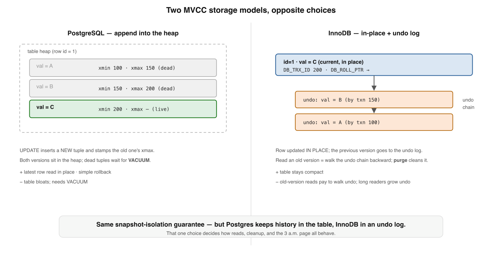
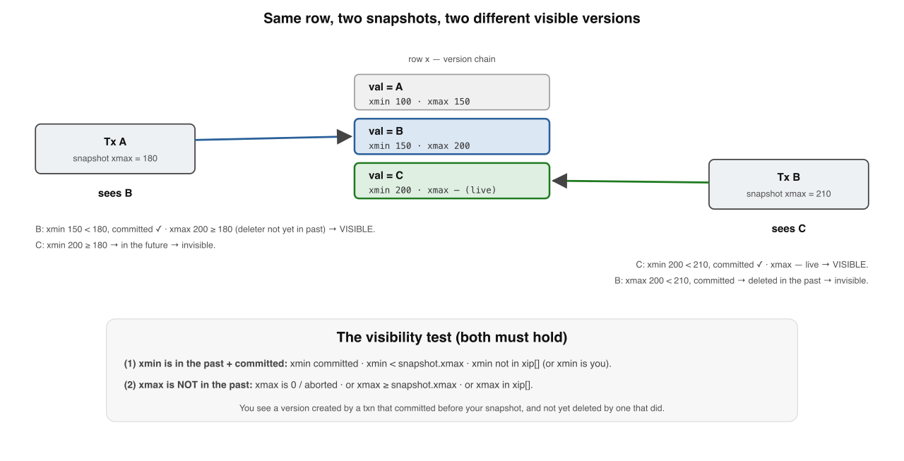

# MVCC Internals — Deep Dive

*A supplement to Book 2, Lesson 4. The intro told you MVCC keeps "a new versioned row tagged by transaction id" and that "writers create new versions while readers keep reading their snapshot." True — and it leaves out the two things that actually matter in production: how the versions are physically stored (and the two databases do it in opposite ways), and what happens to the dead versions afterward. The answer to that second question is the source of the two most famous PostgreSQL outages there are. This goes to the floor.*

Dense. Read it after Lesson 4 has settled.

---

## Where Lesson 4 stopped

You learned the *behaviour*: each write creates a new version of a row, every version carries the transaction id that made it, and a transaction reads from a consistent snapshot so readers never block writers. What Lesson 4 drew as a tidy "version chain" is, underneath, a real on-disk layout with real costs — and PostgreSQL and MySQL's InnoDB make **opposite** choices about where old versions live. That single decision ripples into how reads work, how cleanup works, and which 3 a.m. page you get. Then there is the question Lesson 4 never asked: those old versions don't vanish on their own. Who deletes them, and what happens when they can't?

---

## 1. Two ways to store versions

Both engines give you snapshot isolation; they store the versions in fundamentally different places.

**PostgreSQL — append the new version into the heap.** Every row version is a *tuple* sitting in the table's heap. Each tuple's header carries two transaction ids: **`xmin`** (the xid that created this version) and **`xmax`** (the xid that deleted or superseded it; zero if the version is still live). An `UPDATE` does **not** overwrite — it inserts a brand-new tuple (with `xmin` = the current xid) and stamps the old tuple's `xmax` with the current xid. Both versions are now physically present in the heap. A `DELETE` just sets `xmax`. The consequence: *the table only ever grows on write*; dead tuples accumulate and must be reclaimed later by **VACUUM** (§3). Indexes point at tuples, so most updates also write new index entries — index bloat is a thing too. (DDIA Ch. 7; PostgreSQL docs, "Concurrency Control".)

**InnoDB (and Oracle) — update in place, keep the old version in an undo log.** The clustered-index row is modified **in place**. Each row has two hidden fields: **`DB_TRX_ID`** (the last transaction to touch it) and **`DB_ROLL_PTR`** (a pointer into the **undo log**). Before the in-place change, InnoDB writes an *undo record* capturing the previous version, and `DB_ROLL_PTR` points to it. To read an older version, a transaction walks the undo chain *backward* — applying undo records to the current row — until it reconstructs the version its snapshot is allowed to see. The current row is always the latest; history lives in the undo log, cleaned by a background **purge** thread. (MySQL InnoDB docs, "Multi-Versioning".)

The trade-off in one line:

> **Postgres keeps history in the table (fast in-place reads of the latest row, but the table bloats and needs VACUUM). InnoDB keeps history in an undo log (the table stays compact, but old-version reads pay to walk undo, and long readers grow the undo log).**

Same isolation guarantee, opposite failure modes. Everything below follows from this fork.

---

## 2. The visibility rules: how a snapshot actually decides

A snapshot is not a copy of the data. It is a tiny descriptor that lets a transaction *judge each version it encounters*. In PostgreSQL a snapshot is essentially three things, captured at snapshot time:

- **`xmin`** — the oldest transaction id still running (everything older has finished).
- **`xmax`** — the first id *not yet assigned* (everything ≥ this is in the future, invisible).
- **`xip[]`** — the list of ids **in progress** at the instant the snapshot was taken.

Now, for any tuple it reads, the engine applies the visibility test (using the **commit log**, `pg_xact`/CLOG, to learn whether a given xid committed or aborted):

> **A tuple version is visible to a snapshot when BOTH hold:**
> **(1)** its **`xmin` committed and is in the past** — `xmin` committed, `xmin < snapshot.xmax`, and `xmin` not in `xip[]` (or `xmin` is your own transaction); **and**
> **(2)** its **`xmax` is NOT in the past** — `xmax` is zero/aborted, or `xmax ≥ snapshot.xmax`, or `xmax` is in `xip[]` (the deleter hasn't committed as far as you can see).

In plain English: **you see a version that was created by a transaction which committed before your snapshot, and which has not yet been deleted by any transaction that committed before your snapshot.** That is the whole of snapshot isolation, reduced to two header fields and a commit-log lookup. Read Committed runs this test against a *fresh* snapshot for every statement; Repeatable Read / Snapshot Isolation takes the snapshot *once* at the first read and reuses it for the whole transaction — which is exactly why one sees its own consistent view and the other can see changes between statements.

InnoDB does the same logically with a **read view** (a low-water-mark id, a high-water-mark id, and the set of active ids), but it applies the test *while walking the undo chain*: keep undoing the current row until you reach a version whose `DB_TRX_ID` is visible to your read view.

---

## 3. Cleaning up: VACUUM, purge, and the long-transaction bloat trap

Dead versions are dead weight. A version is removable once it is invisible to **every** snapshot that could ever run again — i.e. its `xmax` committed *before the oldest still-running transaction*. PostgreSQL's **VACUUM** (usually **autovacuum**, triggered by dead-tuple counts) walks tables and reclaims those dead tuples, marking their space free **for reuse within the same table**. (Note: plain VACUUM does not return space to the OS — the file stays the same size; only `VACUUM FULL`, which rewrites the table under an exclusive lock, shrinks it.) InnoDB's **purge** thread does the equivalent for undo records and delete-marked rows.

Here is the trap, and it bites everyone eventually.

VACUUM cannot remove a dead tuple that is still potentially visible to *some* open snapshot. The cutoff is the **`xmin` horizon**: the `xmin` of the oldest transaction still alive. Now picture one connection that opened a transaction an hour ago and is sitting `idle in transaction`, or a giant analytics query that has run for 40 minutes. Its snapshot pins the horizon *back at the moment it started*. **VACUUM cannot clean any tuple that died after that point** — across the *entire database* — so dead tuples accumulate, the table and its indexes grow, sequential scans drag, and the only symptom is "the database got slow and big." This is **bloat**, and a single forgotten transaction causes it.

The same long transaction is doubly dangerous because it *also* holds back **freezing** (§4), nudging you toward wraparound. The defenses are operational, not magical: cap transaction age with `idle_in_transaction_session_timeout`, watch `pg_stat_activity` for ancient `xact_start` / `backend_xmin`, and alert on `n_dead_tup`. In InnoDB the same thing shows up as a growing **history list length** — a long-open read view that purge cannot advance past. **Your cleanup is only ever as current as your oldest open transaction.**

---

## 4. The transaction-ID wraparound time bomb

This one is PostgreSQL-specific, famous, and has taken down real companies. Transaction ids are **32-bit** — about 4.2 billion of them. They are compared in a *circular* space: for any given xid, roughly 2 billion others count as "in the past" and 2 billion as "in the future." That circularity is what makes visibility comparisons work without an ever-growing counter — but it is a landmine.

A tuple created by `xmin = 100` is visible because 100 is "in the past." But once the system has burned through ~2 billion newer xids, the value 100 starts to look like it is **in the future** — and the tuple would abruptly appear *not yet committed* and **vanish**. Silent, catastrophic data loss.

The defense is **freezing**. VACUUM marks sufficiently old tuples as *frozen* — a flag meaning "this version is committed and visible to everyone; ignore its `xmin` entirely." A frozen tuple is immune to wraparound. PostgreSQL schedules aggressive *anti-wraparound* autovacuums as the oldest unfrozen xid ages (`autovacuum_freeze_max_age`, default 200 million). And if freezing falls too far behind — because autovacuum was disabled, starved, or (there it is again) **blocked by a long-running transaction** — Postgres escalates from warnings to a hard stop: it **refuses to assign new xids and goes read-only** rather than risk corruption. "The database stopped accepting writes" is the wraparound emergency, and the postmortems (Sentry, Mailchimp, and others) all read the same: autovacuum couldn't keep up. (PostgreSQL docs, "Routine Vacuuming" → "Preventing Transaction ID Wraparound Failures".)

---

## 5. Loose ends: secondary indexes, SSI, and which model wins

Three things worth knowing before you close the book.

- **Secondary indexes don't carry version info.** A PostgreSQL index entry points at a heap tuple, but the *visibility* lives in the heap, so an index-only scan must consult the **visibility map** to know whether it can trust the index without visiting the heap. InnoDB secondary-index entries carry no `DB_TRX_ID` at all; on an indexed-column update the old entry is **delete-marked** and a new one inserted, and a reader using a secondary index often must drop to the clustered index (and undo) to resolve the correct version. Indexed-column updates are therefore extra-expensive under MVCC in both engines.
- **Serializable is built *on top of* MVCC.** Book 2 Lesson 6's **SSI** (Serializable Snapshot Isolation, PostgreSQL's `SERIALIZABLE`) runs transactions on ordinary MVCC snapshots and *additionally* tracks read/write dependencies, aborting one transaction when it detects the dangerous-structure pattern that causes write skew. MVCC is the substrate; SSI is the safety layer over it.
- **Which storage model wins?** Neither — they trade. Postgres's heap model gives cheap in-place reads of the current row and simple rollback (just ignore the dead tuple), at the price of VACUUM and bloat management. InnoDB's undo model keeps tables compact and rollback localized, at the price of undo-walk cost for old reads and purge lag. Knowing *which* model your database uses tells you *which* operational discipline you owe it: VACUUM/freeze monitoring for Postgres, undo/history-list and purge monitoring for InnoDB. The bug is always the same shape — **a long transaction starves cleanup** — but it wears a different costume in each.

---

## Self-Check — MVCC Internals Deep Dive

Answer from memory before the key.

**Q1.** On an `UPDATE`, PostgreSQL and InnoDB differ in that…

- (a) Postgres appends a new heap tuple; InnoDB updates in place + undo
- (b) Postgres rewrites the page in place; InnoDB appends a new row
- (c) Postgres locks the whole table; InnoDB locks only the one row
- (d) Postgres skips the index; InnoDB always reindexes the new row

**Q2.** A PostgreSQL tuple is visible to your snapshot only when its…

- (a) xmin aborted and its xmax committed before the snapshot began
- (b) xmin committed before the snapshot and xmax has not (or is unset)
- (c) xmin and xmax are both larger than the snapshot's xmax value
- (d) xmin is in the in-progress list and xmax is zero or invalid

**Q3.** A table bloats badly while one connection sits idle-in-transaction because…

- (a) the idle connection keeps rewriting the same rows over and over
- (b) VACUUM cannot remove tuples newer than the oldest snapshot's xmin
- (c) autovacuum is disabled automatically while any transaction is open
- (d) the idle transaction holds an exclusive lock on the whole table

**Q4.** Transaction-ID wraparound is prevented by VACUUM…

- (a) resetting the global transaction counter back to zero periodically
- (b) freezing old tuples so their xmin is ignored for visibility
- (c) widening transaction ids from 32 bits to 64 bits on the fly
- (d) deleting every tuple whose xmin is older than two billion ago

## Answer Key

- **Q1 → (a).** Postgres appends a new tuple into the heap (old one stays for VACUUM); InnoDB updates the clustered row in place and records the prior version in the undo log.
- **Q2 → (b).** Visible = created by a transaction that committed before your snapshot, and not yet deleted by one that committed before your snapshot (xmin past + committed, xmax not-past-or-unset).
- **Q3 → (b).** The oldest open transaction pins the xmin horizon; VACUUM can't reclaim any tuple that died after it, so dead tuples accumulate as bloat — database-wide.
- **Q4 → (b).** VACUUM *freezes* old tuples — marks them committed-and-visible-to-all so their (soon-to-wrap) xmin is ignored. Falling behind triggers anti-wraparound autovacuum and, ultimately, a read-only shutdown.

---

## Sources

- **Kleppmann — DDIA, Chapter 7** ("Transactions"): snapshot isolation, MVCC, visibility.
- **PostgreSQL documentation** — "Concurrency Control" (tuple `xmin`/`xmax`, snapshots, visibility) and "Routine Vacuuming" (VACUUM, freezing, **Preventing Transaction ID Wraparound Failures**).
- **MySQL InnoDB documentation** — "InnoDB Multi-Versioning" (hidden columns, undo logs, purge) and "InnoDB Locking and Transaction Model" (read views).
- **Berenson, Bernstein, Gray et al. — "A Critique of ANSI SQL Isolation Levels" (1995);** **Cahill, Röhm & Fekete — "Serializable Isolation for Snapshot Databases" (2008)** for the SSI layer.
- Postgres wraparound postmortems (Sentry, Mailchimp) — for what "autovacuum couldn't keep up" looks like in production.
