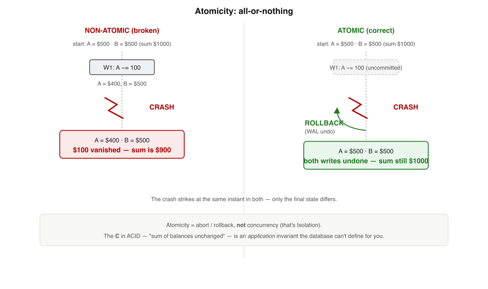
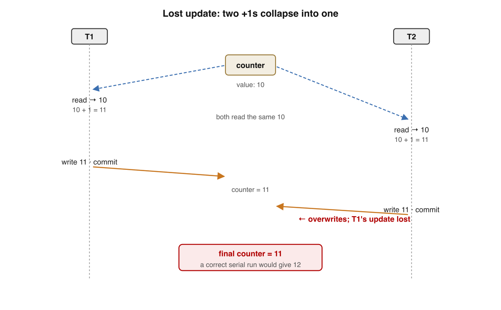
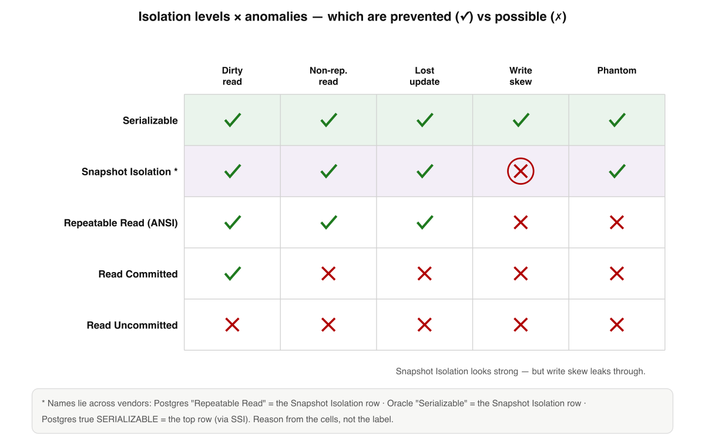
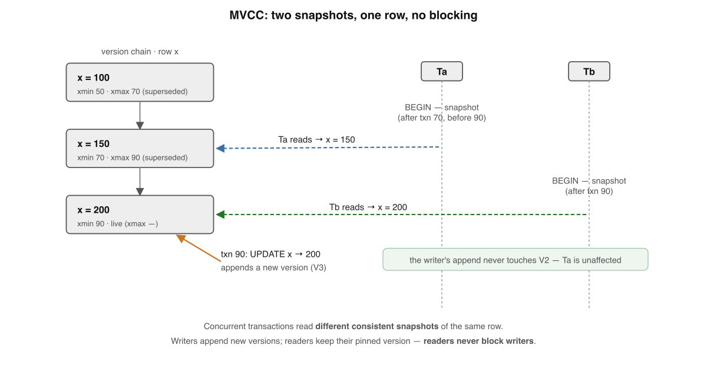
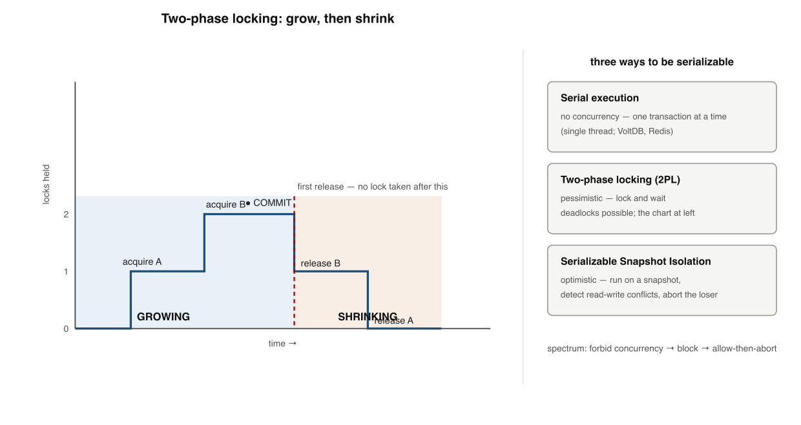
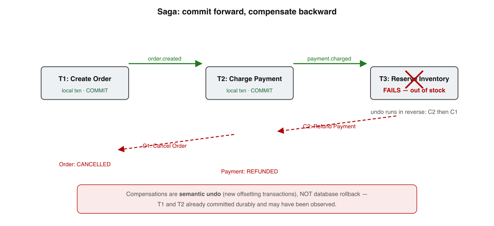

# Transactions & Isolation — Fundamentals

*Book 2 of a guided learning track. One tight win per lesson — not a textbook to swallow in one sitting.*

---

## How to use this document

**Mission.** You're learning how concurrent transactions behave so you can write backend code that doesn't corrupt data under load — the daily, high-leverage half of "consistency" that Book 1 (*Distributed Systems — Fundamentals*) deliberately left for here.

**Method.** Each lesson teaches *one* idea, gives a concrete win, and ends with a self-check — answer it from memory before peeking; that retrieval is what makes it stick. Diagrams use standard transaction-history notation (time flows down; each vertical line is a transaction; reads and writes are marked events). A short **expert corner** closes each lesson with senior-level depth (real-DB gotchas) you can skip on a first pass.

**I'm your teacher.** This is a starting point. When something is unclear or you want a worked example, ask — that conversation is where the learning happens.

---

## Course Map — the full path

Where this book goes, lesson by lesson. Each builds on the one before.

| # | Lesson | The single win | Status |
|---|--------|----------------|--------|
| 1 | What a Transaction Promises (ACID) | What the four promises mean — and don't | ✅ Built |
| 2 | The Anomalies | The catalog of concurrency bugs | ✅ Built |
| 3 | Isolation Levels: The Menu | The levels, and why the names lie | ✅ Built |
| 4 | Snapshot Isolation & MVCC | How Read Committed / SI actually work | ✅ Built |
| 5 | Lost Updates & Write Skew | The subtle invariant-breakers | ✅ Built |
| 6 | Serializability | Serial · 2PL · SSI | ✅ Built |
| 7 | Distributed Transactions & 2PC | Why two-phase commit blocks | ✅ Built |
| 8 | Sagas, Outbox & Idempotency | Eventual consistency for workflows | ✅ Built |
| 9 | Choosing Isolation in Practice | The senior decision tree | ✅ Built |

**How every lesson is built:** prose → a diagram → a self-check → an expert corner.

---

## Lesson 1 — What a Transaction Promises (ACID, really)

### Where we left off

Book 1 spent nine lessons on *replication consistency* — the question of whether copies of the same data on different machines agree. We met partial failure and its four indistinguishable causes, idempotency keys, happens-before, quorums, CAP/PACELC, and the resilience patterns (retries, the outbox, sagas). Now we turn the camera the other way. Forget multiple replicas for a moment. Put one database on one machine. Two users hit it at the same time, both touching the same row. What stops them from corrupting each other? That is *transaction isolation*, and it is the other half of the word "consistency" you kept hearing. This lesson lays the foundation: the four promises a transaction makes, what each actually means, and — just as important — what ACID does *not* buy you.

### What a transaction is

A transaction is a group of reads and writes that the database treats as a single all-or-nothing unit. Either every operation in the group takes effect, or none of them do. You mark the boundaries yourself — `BEGIN`, then your statements, then `COMMIT` (success) or `ROLLBACK` (undo) — and between those boundaries the database owes you a set of guarantees.

> A transaction is a unit of work that the database guarantees to execute as if it were a single, indivisible, all-or-nothing operation, even in the presence of concurrency and faults.

The classic example is a bank transfer: debit $100 from account A, credit $100 to account B. Those are two separate writes, but they form one logical act. It must never be possible for the world to observe the first write without the second. The term **ACID** — Atomicity, Consistency, Isolation, Durability — was coined to name the four promises around exactly this idea by Theo Härder and Andreas Reuter in 1983 ("Principles of Transaction-Oriented Database Recovery"). Kleppmann's *Designing Data-Intensive Applications* (DDIA), chapter 7, is the modern reference and is unusually blunt that ACID is partly a marketing acronym; we will earn that skepticism by the end of the lesson.

### Atomicity — abort and rollback, *not* concurrency

Atomicity is the all-or-nothing promise for a *single* transaction. If anything goes wrong partway through — a constraint violation, a disk error, the process being killed — the database discards everything that transaction did and leaves the data as if the transaction had never started. That undo is called a **rollback** or **abort**.

This matters precisely because of the partial-failure world from Book 1. A crash can strike *after* the debit but *before* the credit. Without atomicity, $100 simply vanishes. With it, the half-done work is erased on recovery.



A common confusion, called out explicitly in DDIA ch.7: "atomic" here has *nothing* to do with concurrency or multithreading. It does not mean "no one else sees my intermediate state" — that is Isolation, below. Atomicity is purely about abortability: the ability to throw away a partial transaction cleanly. Härder and Reuter's name for it survives because that single word ("can I undo it?") is the property recovery code is built around.

### Consistency — the odd letter out

Consistency in ACID means the database moves from one valid state to another, where "valid" is defined by *your application's* invariants — credits equal debits, a username is unique, an account balance never goes negative.

Here is the uncomfortable truth, stated plainly in DDIA ch.7: the C is the odd letter out. The database can enforce some invariants for you (foreign keys, uniqueness, `CHECK` constraints), but the *meaning* of consistency — "the sum of all balances is unchanged by a transfer" — lives in your code. If you write a transaction that debits A without crediting B, the database will happily, durably, atomically commit a wrong answer. Atomicity and Isolation are properties of the database; Durability is a property of the storage layer; **Consistency is a property of the application** that the other three help you preserve. Härder and Reuter included it for the acronym's sake, and Kleppmann notes the letter was arguably added to make "ACID" pronounceable. Keep this straight: when this book says "consistency" from here on, unless stated otherwise, we mean isolation-level guarantees, not this application invariant.

### Isolation — the heart of this book

Isolation is the promise that concurrently executing transactions do not corrupt each other. The gold-standard definition is **serializability**: the database guarantees that the result of running transactions concurrently is identical to *some* serial order — as if they had run one at a time, with no overlap, even though physically they interleaved.

This is where the next eight lessons live. Real databases rarely give you full serializability by default because it is expensive; instead they offer weaker *isolation levels* (Read Committed, Repeatable Read, Snapshot Isolation) that permit specific anomalies in exchange for performance. Each anomaly — dirty reads, non-repeatable reads, lost updates, write skew, phantoms — is a concrete way concurrent transactions can ruin your data, and each will get its own treatment. Jim Gray and Andreas Reuter's *Transaction Processing: Concepts and Techniques* (1992) is the canonical deep text on the locking and concurrency-control machinery underneath all of it. For now, the one-line takeaway: **Isolation is the only one of the four letters that is about more than one transaction at a time**, which is exactly why it is hard and why it gets a whole book.

### Durability — committed means committed

Durability is the promise that once a transaction has committed, its effects survive — even if the machine loses power one millisecond later. The data must be on non-volatile storage and must come back after a crash.

On a single node this is achieved with a **write-ahead log (WAL)**: before changing the actual data pages, the database appends the change to a sequential on-disk log and calls `fsync` to force it past the operating-system cache onto the physical disk. On recovery, the log is replayed to reconstruct any committed work that had not yet been flushed to the main data files. Gray and Reuter cover WAL and recovery exhaustively.

The caveat, sharpened by DDIA ch.9 and by the Jepsen analyses (jepsen.io), is that durability is never absolute. `fsync` can be defeated by a lying disk controller or a misconfigured `fsync=off`. Disks die; a single machine's WAL is no help if the disk is gone. So distributed systems extend durability through *replication* — writing to several nodes before acknowledging the commit — which loops us straight back to Book 1's quorums. There is no perfectly durable system, only systems that survive a stated set of faults. Jepsen exists precisely because vendors' durability claims frequently fail under real partition and crash testing.

### What ACID does — and does not — mean

ACID is a useful promise and a leaky marketing term at the same time. Härder and Reuter gave us a clean four-property model; the industry then stretched "ACID-compliant" to mean "trustworthy", which it does not. Be precise:

| Property | What it actually guarantees | What it does NOT |
| --- | --- | --- |
| Atomicity | A transaction is undoable; partial work is discarded | Anything about concurrency |
| Consistency | Your app invariants hold *if your code is correct* | That the DB knows your invariants |
| Isolation | Concurrent transactions behave as some serial order | That the *default* level gives you that |
| Durability | Committed data survives the faults you planned for | Absolute, against any failure |

Two myths to retire now. First, "ACID" tells you nothing about *which* isolation level a database gives you by default — and the defaults are almost always weaker than serializable, a gap we will exploit in Lesson 2. Second, ACID is single-system vocabulary; it is silent about replication and network partitions, which is why Book 1 needed its own consistency models. ACID and CAP answer different questions. Hold both, and you can reason about a real database honestly.

### Going deeper — expert corner

*Optional depth. Skip on a first pass.*

- **The defaults betray the acronym.** PostgreSQL and MySQL InnoDB both default to weaker-than-serializable isolation (Read Committed and Repeatable Read respectively). "ACID compliant" on the box says nothing about which one you get — see DDIA ch.7 and the official docs (postgresql.org → "Transaction Isolation").
- **Postgres "Repeatable Read" is actually Snapshot Isolation.** Postgres implements its `REPEATABLE READ` as MVCC snapshot isolation, which is *stronger* than the ANSI definition (it prevents non-repeatable reads and phantoms) yet still permits write skew. The level names are a known historical mislabeling we untangle in Lessons 4–6 (Berenson et al., 1995, "A Critique of ANSI SQL Isolation Levels").
- **Atomicity and durability share one mechanism.** The same WAL that lets recovery *redo* committed work also lets it *undo* aborted work — atomicity and durability are two readings of one log, not two subsystems (Gray & Reuter, *Transaction Processing*, on ARIES-style recovery).
- **Vendors' durability claims are routinely wrong.** Jepsen has repeatedly found systems that acknowledge writes which a crash or partition then loses, despite "ACID"/"strong durability" marketing (jepsen.io analyses). Treat durability as a claim to be tested, not a label to be trusted.

### Self-Check — Lesson 1

**Q1. Atomicity, in the ACID sense, primarily guarantees that:**
(a) other transactions never observe a transaction's intermediate writes
(b) a partly-completed transaction is discarded so none of it takes effect
(c) the database state always satisfies every application-level invariant
(d) a committed transaction's effects survive a sudden power loss

**Q2. Why is Consistency often called the "odd letter out" in ACID?**
(a) because it duplicates the guarantee already provided by Isolation
(b) because it applies only to distributed systems, not single nodes
(c) because the invariant is the application's job, not the database's
(d) because it was dropped from the model in later editions of DDIA

**Q3. Which property is the only one fundamentally about more than one transaction at a time?**
(a) Atomicity
(b) Durability
(c) Consistency
(d) Isolation

**Q4. A correct one-line statement about durability on a real system is:**
(a) an `fsync` to local disk makes a commit absolutely permanent forever
(b) durability is guaranteed automatically by the SQL standard alone
(c) WAL plus replication survives a stated set of faults, not all faults
(d) durability and isolation are achieved by the very same WAL mechanism

### Answer Key — Lesson 1

- **Q1 — (b).** Atomicity means abortability — a partial transaction is rolled back; concurrency (a) is Isolation, and (d) is Durability.
- **Q2 — (c).** The valid-state invariant is defined and enforced by application code; the DB only helps preserve it, per DDIA ch.7.
- **Q3 — (d).** Isolation governs how concurrent transactions interact; the other three each concern a single transaction or single committed write.
- **Q4 — (c).** Durability survives only the faults you planned for (WAL + replication); it is never absolute, as Jepsen repeatedly demonstrates.

---

## Lesson 2 — The Anomalies: What Concurrency Breaks

### Where we left off

Book 1 spent its first lesson teaching you to *expect* partial failure — that a message can be lost, delayed, or duplicated, and you cannot tell which. This book opens the same way, but the adversary is different. Here nothing crashes and no packet drops. Two transactions simply run at the same time, touch the same rows, and walk away with the database in a state neither of them intended. This lesson is the catalog of those quiet corruptions — the bugs that *isolation*, the "I" in ACID (Härder & Reuter, 1983), exists to prevent.

### Why isolation exists

A database almost never runs one transaction at a time. Throughput demands that reads and writes from many clients *interleave* — the engine runs a few operations of T1, then a few of T2, then back to T1. If each transaction owned the whole database for its duration (perfect serial execution), there would be no anomalies and no need for this book. But serial execution wastes the machine, so engines overlap transactions and then try to *fake* the illusion that each ran alone.

Isolation is the strength of that illusion. A weak isolation level lets some interleavings through; a strong one forbids them. DDIA ch.7 frames the whole field exactly this way: isolation levels are defined by *which concurrency anomalies they prevent*. So before you can reason about any isolation level, you need the vocabulary of what can go wrong. That vocabulary is below — six named anomalies, each a specific bad interleaving of two transactions over shared data.

> An **isolation anomaly** is an outcome that becomes possible only because transactions interleave, and that could never arise from running those same transactions one after another in *some* serial order.

That last clause is the entire game. "Serializable" — the gold standard — means *some* serial order would have produced this result. Every anomaly below is a counterexample: a state no serial order can explain.

### Dirty write — one transaction overwrites another's uncommitted write

T1 writes a row, has not committed. T2 overwrites the *same* row before T1 commits or aborts. Now if T1 rolls back, what happens to T2's value — does it survive, or does the rollback erase it? The write is "dirty" because it was layered on top of data that was never durable. Berenson et al. (1995), "A Critique of ANSI SQL Isolation Levels," call this **P0** and note that *every* practical isolation level forbids it — it is the one anomaly no real engine permits, because allowing it makes atomic rollback impossible. A booking system that lets two clerks half-write the same seat reservation cannot cleanly undo either.

### Dirty read — reading another transaction's uncommitted write

T1 updates an account balance from $100 to $200 but has not committed. T2 reads $200, acts on it, and then T1 *aborts*. T2 saw a value that never officially existed. This is **P1** in Berenson et al. Forbidding dirty reads is the defining feature of the Read Committed level — you only ever see committed data. Without it, a fraud check could approve a transfer based on a deposit that was rolled back a millisecond later.

### Read skew (non-repeatable read) — the same row reads differently twice

T1 reads row X and gets one value. T2 commits a change to X. T1 reads X again and gets a *different* value — within the same transaction. This is the **non-repeatable read** (Berenson's **P2**). The classic damage shows up across *two* rows: you read account A's balance, a transfer moves money A→B, then you read B — and your snapshot shows the money in neither place, or in both. DDIA calls this *read skew* and stresses it is the motivation for snapshot isolation: a transaction should see one consistent, frozen view of the entire database.

### Lost update — two read-modify-writes clobber each other

This is the canonical one, so look closely. Two transactions both read a counter, both compute a new value from what they read, and both write back. Because each based its write on a *stale* read, one of the two increments simply vanishes.



The fix is not "be careful" — it is structural: atomic operations (`UPDATE counter SET n = n + 1`), explicit locking (`SELECT ... FOR UPDATE`), or letting the engine detect the conflict and abort one transaction. Lost update is **P4** in Berenson et al., and DDIA ch.7 devotes a full section to it precisely because hand-rolled read-modify-write code is so common and so wrong.

### Write skew — disjoint writes that jointly break an invariant

Subtler. T1 and T2 each read an overlapping set of rows, each checks a condition that is currently true, then each *writes a different row*. Individually every write is legal; together they violate an invariant no single transaction could see breaking. The textbook case: a hospital requires *at least one* doctor on call. Two on-call doctors, in separate transactions, each check "is someone else on call? yes" and each take themselves off. Both commit. Now zero doctors are on call — a state neither transaction's check would have allowed. Write skew is the generalization of lost update where the two transactions write *different* objects, and snapshot isolation does **not** prevent it (DDIA ch.7).

### Phantom — a write changes the result of a search

T1 runs `SELECT COUNT(*) WHERE on_call = true` and gets 2. T2 inserts a *new* matching row. T1's query, re-run, now returns 3 — a row appeared that no row-level lock could have guarded, because the row did not exist when T1 looked. This is the **phantom** (Berenson's **P3**), and it is the mechanism behind most write skews: the dangerous condition often depends on the *absence* of rows. Phantoms are why range locks and predicate locks exist, and why serializability is harder than just locking the rows you touched.

Adya's 1999 PhD thesis ("Weak Consistency: A Generalized Theory and Optimistic Implementations") later reformulated all of these without leaning on lock-based language at all, defining them as forbidden cycles in a *dependency graph* of transactions — the framework most modern systems (and DDIA's deeper treatment) actually reason with.

### Going deeper — expert corner

*Optional depth. Skip on a first pass.*

- **The ANSI standard is broken by design.** Berenson et al. (1995) showed the SQL-92 isolation definitions are ambiguous — read literally, they permit anomalies the levels were meant to forbid, and "Repeatable Read" under-specifies whether phantoms are excluded. This is *the* paper that motivated every clarification since.
- **Postgres "Repeatable Read" is actually snapshot isolation.** It gives you a consistent snapshot and even detects lost updates (aborting with a serialization error), but it permits *write skew*. If you need write-skew safety you must use `SERIALIZABLE` (which Postgres implements as SSI) or explicit `SELECT ... FOR UPDATE`. See the PostgreSQL docs, "Transaction Isolation."
- **MySQL InnoDB defaults to Repeatable Read and prevents phantoms** via next-key (gap) locks — a different choice from Postgres, whose Repeatable Read does not gap-lock. Same level *name*, materially different guarantees. Always test, never assume from the label (DDIA ch.7).
- **Adya's cycle theory is the modern lens.** Thinking in terms of read/write/anti-dependency *cycles* (Adya, 1999) rather than P0–P4 explains why MVCC engines abort the transactions they do, and underpins the SSI algorithm you will meet in Lesson 8 (Cahill, Röhm & Fekete, 2008).

### Self-Check — Lesson 2

**Q1.** What makes a result an isolation anomaly rather than a normal outcome?

(a) It occurs whenever two transactions write to the same table at once
(b) It is a state that no serial ordering of the same transactions could produce
(c) It happens only when one of the two transactions later aborts or fails
(d) It arises from a hardware fault that corrupts a row during a write

**Q2.** Two clerks both read `seats=10`, both compute `seats-1`, both write `9`. Two seats were sold but the count dropped by one. Which anomaly is this?

(a) A dirty read of an uncommitted seat count value
(b) A phantom row appearing inside the booking range
(c) A lost update from concurrent read-modify-write
(d) A non-repeatable read of the seat count column

**Q3.** Two on-call doctors each check "is anyone else on call?", see yes, and each remove *themselves* in separate transactions. Both commit; now nobody is on call. Which anomaly is this, and does snapshot isolation stop it?

(a) Write skew, and snapshot isolation does not prevent it
(b) Lost update, and snapshot isolation always prevents it
(c) Dirty write, and read committed already prevents it
(d) Phantom read, and repeatable read fully prevents it

**Q4.** Which statement about real-database behaviour is correct?

(a) Every isolation level permits the dirty write anomaly by default
(b) Postgres "Repeatable Read" prevents write skew on all queries
(c) Postgres "Repeatable Read" is really snapshot isolation underneath
(d) MySQL InnoDB defaults to Read Uncommitted for higher throughput

### Answer Key — Lesson 2

**Q1 — (b).** An anomaly is precisely a result that no serial order of the same transactions could yield; that is the definition of breaking serializability.

**Q2 — (c).** Both transactions wrote a value computed from a stale read, so one decrement was silently overwritten — the textbook lost update (Berenson P4).

**Q3 — (a).** Disjoint writes that each pass a check but jointly break an invariant is write skew, and snapshot isolation explicitly does not prevent it (DDIA ch.7).

**Q4 — (c).** Postgres implements "Repeatable Read" as snapshot isolation — which still permits write skew, contradicting (b); (a) and (d) are false since dirty writes are universally forbidden and InnoDB defaults to Repeatable Read.

---

## Lesson 3 — Isolation Levels: The Menu

### Where we left off

Lesson 2 showed you the anomalies — dirty reads, non-repeatable reads, phantoms, lost updates, write skew — the concrete ways concurrent transactions corrupt each other when nothing keeps them apart. This lesson is the menu of *defenses*. A database doesn't ask you "which anomalies do you want to prevent?"; it asks "which **isolation level** do you want?" and the level is a bundle that forbids some anomalies and tolerates others. Your job is to read the menu correctly — because, as you'll see at the end, the names on it lie.

### The four standard levels

The ANSI SQL-92 standard defines four isolation levels, ordered from weakest to strongest. Each level is a promise about how much concurrency interference a transaction will tolerate. Weaker levels allow more interleaving (more throughput, more anomalies); stronger levels hold more locks or do more conflict-checking (less throughput, fewer anomalies). DDIA ch.7 ("Weak Isolation Levels" and "Serializability") is the canonical modern treatment; the original definitions are in the SQL-92 standard itself.

> **Isolation level**: a contract specifying which concurrency anomalies a transaction is guaranteed *not* to observe. It is defined by what it forbids, not by how it is implemented — two databases can offer "the same" level using entirely different machinery (locks vs. snapshots).

**Read Uncommitted** — the floor. A transaction may read data written by another transaction that has not yet committed. You get to see other people's half-finished work, which can vanish if they roll back.

**Read Committed** — you only ever read committed data, and any data you write is locked until you commit. This is the most common *default* in practice: it is the default in PostgreSQL and in Oracle.

**Repeatable Read** — once you read a row, re-reading it in the same transaction returns the same value. In the ANSI definition this is achieved by holding read locks on rows you've touched for the duration of the transaction.

**Serializable** — the ceiling. The result is guaranteed to be *as if* the transactions ran one at a time, in some serial order. No anomaly is possible. ANSI SQL-92 names this as the strongest level.

### Which anomalies each level forbids

The ANSI standard does not describe levels by implementation. It describes them by the **phenomena** (anomalies) each one prohibits. SQL-92 named three phenomena — dirty read (P1), non-repeatable read (P2), phantom (P3) — and defined each level as the set it forbids:

| Level | Dirty read | Non-repeatable read | Phantom |
|---|---|---|---|
| Read Uncommitted | possible | possible | possible |
| Read Committed | prevented | possible | possible |
| Repeatable Read | prevented | prevented | possible |
| Serializable | prevented | prevented | prevented |

That is the entire ANSI definition: a level is exactly the row of "prevented" boxes it ticks. This matters enormously — it means the standard says nothing about *how* you prevent them, only *that* you do.

But Lesson 2 gave you anomalies ANSI never names: **lost update** and **write skew**. Berenson et al. (1995), "A Critique of ANSI SQL Isolation Levels," is the paper that exposed this gap. They showed the three-phenomenon definition is ambiguous and incomplete — in particular it fails to characterise **Snapshot Isolation (SI)**, a real and popular level that doesn't fit cleanly into any ANSI row. SI prevents dirty reads, non-repeatable reads, and phantoms by giving each transaction a consistent snapshot — yet it still permits write skew, an anomaly the ANSI taxonomy can't even express. So the honest matrix needs more columns than ANSI drew:



Read the grid bottom-up: every step up adds protection, but Snapshot Isolation is the awkward guest — strong enough to block phantoms, yet still open to write skew, which is why it sits below true Serializable rather than equal to it.

### The catch: the names lie

Here is the senior-level point, and it is the one that bites people in production. **The ANSI standard defines levels by anomalies prevented — but database vendors attach those level *names* to whatever their engine actually delivers, and the mapping is inconsistent.** Same words, different guarantees.

- **PostgreSQL "Repeatable Read" is Snapshot Isolation.** The Postgres docs state this outright: its Repeatable Read level provides snapshot isolation, which is *stronger* than the ANSI Repeatable Read (it also blocks phantoms) but *weaker* than Serializable (it still permits write skew). The name says "Repeatable Read"; the behaviour is SI.
- **Oracle "Serializable" is Snapshot Isolation.** Oracle's highest documented isolation level, labelled SERIALIZABLE, is in fact snapshot isolation and therefore *allows write skew*. A transaction running at Oracle's "Serializable" is not serializable in the textbook sense. Berenson et al. (1995) call this out directly.
- **MySQL/InnoDB "Repeatable Read" is the default and uses next-key locking.** InnoDB's default level is REPEATABLE READ, and it blocks many (not all) phantoms via gap/next-key locks — a different mechanism and a different anomaly profile than Postgres's snapshot-based RR with the same name.

The lesson: **never reason from the level's name.** Reason from the matrix. When you pick an isolation level, ask "which anomalies does *this engine* prevent at *this named level*?" — then check it against the columns in the diagram. Two systems both set to "Repeatable Read" can give you genuinely different correctness guarantees, and a bug that's impossible on one is live on the other.

This is the bridge to the next lesson. Snapshot Isolation is so central — and so widely mislabelled — that it earns its own treatment. Lesson 4 takes it apart: how MVCC builds the snapshot, exactly which anomaly (write skew) it leaks, and why "Serializable" sometimes isn't.

### Going deeper — expert corner

*Optional depth. Skip on a first pass.*

- **Postgres has true serializable, and it's called SSI.** PostgreSQL's actual SERIALIZABLE level (distinct from its SI-flavoured Repeatable Read) implements *Serializable Snapshot Isolation* from Cahill, Röhm & Fekete (2008), "Serializable Isolation for Snapshot Databases." It runs on top of MVCC and aborts transactions when it detects a dangerous read-write dependency cycle. See the PostgreSQL docs, "Transaction Isolation" → Serializable.
- **A level is a ceiling on anomalies, not a floor.** Nothing forbids a database from preventing *more* than the level requires. Read Committed in Postgres prevents dirty reads (required) but, because it's MVCC-based, also never blocks on read locks — an implementation choice ANSI doesn't dictate. This is why "what does the level forbid" and "what does the engine do" must be checked separately.
- **`REPEATABLE READ` in InnoDB still allows lost updates without explicit locking.** A classic read-modify-write (`SELECT` then `UPDATE`) at InnoDB's default level can lose an update unless you use `SELECT ... FOR UPDATE` or atomic in-place writes. Lost update is the anomaly that most often survives a "high-sounding" default level. (MySQL docs, "InnoDB Locking and Transaction Model.")
- **Berenson et al. (1995) is still the reference for *why* the names are a mess.** It introduces the "A" (anomaly) vs. "P" (preventative/broad) interpretations of each phenomenon and shows SI is incomparable to ANSI RR — neither strictly stronger nor weaker. Read it before trusting any vendor's level name.

### Self-Check — Lesson 3

**1.** The ANSI SQL-92 standard defines its four isolation levels primarily in terms of:

(a) the locking mechanism each level uses internally
(b) the anomalies each level is required to prevent
(c) the throughput each level achieves under load
(d) the snapshot timestamp each level assigns

**2.** PostgreSQL's "Repeatable Read" isolation level actually provides:

(a) true serializability via two-phase locking
(b) the exact ANSI Read Committed guarantee
(c) snapshot isolation, which still permits write skew
(d) dirty reads under a different vendor label

**3.** According to Berenson et al. (1995), Snapshot Isolation is problematic for the ANSI taxonomy because it:

(a) prevents every phenomenon the standard ever names
(b) is strictly weaker than ANSI Read Uncommitted
(c) permits write skew, which ANSI cannot express
(d) requires locks the standard forbids engines to hold

**4.** Why should you not reason about correctness from an isolation level's *name*?

(a) names are case-sensitive and easy to mistype
(b) vendors map the same name onto different guarantees
(c) the standard renames every level once per revision
(d) names describe locks, not the anomalies allowed

### Answer Key — Lesson 3

**1. (b)** — SQL-92 defines each level purely by the set of phenomena (dirty read, non-repeatable read, phantom) it forbids, saying nothing about implementation.

**2. (c)** — The Postgres docs confirm its Repeatable Read is snapshot isolation: stronger than ANSI RR but still open to write skew.

**3. (c)** — Berenson et al. show SI prevents the three ANSI phenomena yet allows write skew, an anomaly outside the standard's vocabulary.

**4. (b)** — Oracle "Serializable" is SI, Postgres "Repeatable Read" is SI, InnoDB "Repeatable Read" uses next-key locks; identical names, different real guarantees.

---

## Lesson 4 — Snapshot Isolation and MVCC

### Where we left off

Lesson 3 taught you the ANSI isolation levels as a ladder of *forbidden anomalies* — dirty read, non-repeatable read, phantom — and you saw that the ladder was defined in terms of locking. But real databases mostly do not run on locks for readers. They run on **multiversioning**. This lesson explains the two levels you will actually meet in production — **Read Committed** and **Snapshot Isolation** — and the engine underneath them, **MVCC**. Berenson et al.'s 1995 paper "A Critique of ANSI SQL Isolation Levels" exists precisely because the lock-based ANSI definitions failed to describe what these multiversion engines do (Berenson, Bernstein, Gray, Melton, O'Neil, O'Neil 1995).

### Read Committed mechanics

Read Committed is the default in PostgreSQL, Oracle, and SQL Server (when RCSI is on). Its guarantee is small and precise: you never see data written by a transaction that has not committed (no dirty reads), and you never see your own writes overwritten mid-statement.

The mechanism in a multiversion engine has three moving parts:

- **A fresh snapshot per *statement*.** Each individual SQL statement reads the state of the database as of the moment that *statement* began. The next statement in the same transaction takes a *new* snapshot. This is why Read Committed permits non-repeatable reads: two `SELECT`s in one transaction can return different values if someone committed in between.
- **Row-level locks on writes.** When you `UPDATE` a row, you take an exclusive lock on it that you hold until commit. A second transaction trying to update the same row *blocks* until you commit or abort.
- **Readers never block writers, and writers never block readers.** A reader sees the last *committed* version; it does not wait on an in-flight writer, and its read does not stop a writer from creating a new version. This is the headline property of MVCC and the reason it scales (DDIA ch.7, "Read Committed").

So under Read Committed, write/write conflicts serialize through locks, but reads are lock-free.

> **Read Committed** guarantees no dirty reads and no dirty writes, implemented by giving each *statement* a fresh snapshot of committed data and taking write locks held to commit.

The anomaly Read Committed still allows: the **read skew** (non-repeatable read) across statements, because your snapshot moves forward under your feet between statements.

### Snapshot Isolation

Snapshot Isolation (SI) fixes the moving snapshot with one change: take **one consistent snapshot per *transaction***, fixed at the transaction's start, and serve *every* read in that transaction from it.

The consequence is strong and intuitive. Every `SELECT` you run sees the database exactly as it was at the instant your transaction began — a frozen, internally consistent picture — no matter how many other transactions commit while you run. Read skew is gone: two reads of the same row always agree.

This is the level most databases label **"Repeatable Read."** PostgreSQL's `REPEATABLE READ` *is* snapshot isolation (PostgreSQL docs, "Transaction Isolation"). Oracle's `SERIALIZABLE` is in fact SI. MySQL InnoDB's default `REPEATABLE READ` is a snapshot-based variant. The ANSI name is a historical accident; the real thing on the wire is SI.

SI's bargain in one table:

| Property | Read Committed | Snapshot Isolation |
|---|---|---|
| Snapshot scope | per statement | per transaction |
| Non-repeatable read | allowed | prevented |
| Readers block writers? | no | no |
| Write conflict resolution | locks | first-committer-wins |

SI does not use read locks at all. Instead, write conflicts are detected at commit: if two transactions both updated the same row, the **first committer wins** and the second aborts with a serialization error. SI is *almost* serializable — but not quite. It still allows **write skew** and a class of phantom, which is Lesson 6.

### MVCC mechanics

Both levels ride on **Multi-Version Concurrency Control**, an idea from David Reed's 1978 MIT dissertation on multiversion timestamp ordering (Reed 1978). The rules are mechanical:

- **Every write creates a new versioned row.** An `UPDATE` does not overwrite in place; it writes a *new tuple* and marks the old one as superseded. Each version is tagged with the id of the transaction that created it (`xmin` in PostgreSQL) and the id that deleted/superseded it (`xmax`).
- **Versions form a chain.** Row `x` becomes a linked list of versions: created-by-50 → created-by-70 → created-by-90, ordered by the transaction that produced each.
- **Visibility rules pick the right version.** When your transaction reads `x`, the engine walks the chain and returns the newest version whose creating transaction had *committed before your snapshot* and was not later than your snapshot. A version created by a transaction that started after you, or is still in flight, is invisible to you (PostgreSQL docs, "Concurrency Control"; DDIA ch.7).



This is exactly why readers never block writers: the writer *appends* a version; the reader keeps reading the version its snapshot already pinned. They touch different physical tuples.

The cost is garbage. Old versions accumulate. Once no live snapshot can still see a version, it is dead and must be reclaimed — PostgreSQL calls this **VACUUM**, others call it purge or GC. A long-running transaction holds an old snapshot open and *pins* every version newer transactions would otherwise delete; this is the classic source of table bloat in Postgres (PostgreSQL docs, "Routine Vacuuming").

### Why SI is the practical default

SI is the level most production systems actually run on, and the reason is the property you have now seen from three angles: **reads never take locks and never block.** Read-heavy workloads — the overwhelming majority — get a consistent view of the world with zero read contention. You pay in storage (version chains) and in background GC, not in latency on the hot path.

It is also "good enough" for most application logic. A consistent per-transaction snapshot eliminates the bugs developers actually hit — reports that double-count, balances read mid-transfer, dashboards that flicker between two truths. The remaining holes (write skew, the SI phantom) are narrow and nameable, and Lesson 6 shows you how to close them with Serializable Snapshot Isolation. Until then: when someone says "Repeatable Read," hear "snapshot isolation," and remember it is SI's anomalies — not the ANSI lock-based ones — that you must reason about (Berenson et al. 1995; DDIA ch.7).

### Going deeper — expert corner

*Optional depth. Skip on a first pass.*

- **Postgres "Repeatable Read" = snapshot isolation, not serializable.** A transaction that errors with `could not serialize access due to concurrent update` under `REPEATABLE READ` is hitting first-committer-wins, and your application must retry the whole transaction. See PostgreSQL docs, "Transaction Isolation" — the manual states this equivalence explicitly.
- **MySQL InnoDB's `REPEATABLE READ` is subtly non-standard.** Plain `SELECT` reads a consistent transaction snapshot, but locking reads (`SELECT ... FOR UPDATE`, `UPDATE`) read the *latest* committed row, not the snapshot — so a write inside an RR transaction can see data its own snapshot cannot. InnoDB also blocks many phantoms with next-key (gap) locks that Postgres does not take. See the MySQL Reference Manual, "Consistent Nonlocking Reads."
- **The snapshot is a transaction-id set, not a timestamp.** Postgres builds a snapshot as `{xmin, xmax, xip[]}` — the oldest still-running txid, the next-to-assign txid, and the list of in-progress txids. Visibility is set membership, not a clock comparison; this connects back to Book 1's logical clocks (a monotonic counter, not wall time) — see PostgreSQL `src/backend/storage/ipc/procarray.c` and the "Concurrency Control" chapter.
- **Long transactions are an operational hazard, not just a correctness one.** Because an open snapshot pins old versions, one forgotten `BEGIN` in a connection pool can bloat a table by gigabytes and stall VACUUM cluster-wide. Monitor `pg_stat_activity` for old `xact_start`; this is the most common MVCC production incident (PostgreSQL docs, "Routine Vacuuming," and the `idle_in_transaction_session_timeout` setting).

### Self-Check — Lesson 4

**1. Under Read Committed, why can two identical `SELECT`s in one transaction return different rows?**
(a) Because each statement takes a fresh snapshot, so a commit in between is now visible.
(b) Because Read Committed takes no snapshots at all and reads live rows.
(c) Because the first read takes a lock that the second read then releases.
(d) Because Read Committed promotes itself to Snapshot Isolation midway.

**2. What is the defining difference between Read Committed and Snapshot Isolation?**
(a) SI forbids dirty writes while Read Committed permits them freely.
(b) SI snapshots once per transaction; Read Committed snapshots once per statement.
(c) SI uses read locks; Read Committed uses version chains instead.
(d) SI blocks readers behind writers; Read Committed lets them run.

**3. In an MVCC engine, what does an `UPDATE` to a row physically do?**
(a) It overwrites the old tuple in place and bumps a row counter.
(b) It deletes the row and re-inserts it under a new primary key.
(c) It writes a new version tagged with the writer's transaction id.
(d) It locks every reader's snapshot until the writer commits.

**4. Why is a long-running read transaction an operational risk under MVCC?**
(a) It holds an exclusive write lock that blocks all other writers.
(b) It forces every later statement to escalate to serializable.
(c) It pins old row versions open, preventing VACUUM from reclaiming them.
(d) It rebuilds the version chain on every read, slowing the whole table.

### Answer Key — Lesson 4

1. **(a)** — Read Committed refreshes the snapshot per statement, so anything committed between the two reads becomes visible.
2. **(b)** — The scope of the snapshot (per transaction vs. per statement) is the single mechanical difference; everything else follows from it.
3. **(c)** — MVCC appends a new version tagged by the creating transaction id rather than overwriting, which is why readers never block writers.
4. **(c)** — An open snapshot keeps old versions visible, so GC/VACUUM cannot reclaim them and the table bloats.

---

## Lesson 5 — Lost Updates and Write Skew

### Where we left off

Lesson 4 walked the four isolation levels of the ANSI/SQL standard and the anomalies they were defined to forbid: dirty reads, non-repeatable reads, phantoms. You saw that *Read Committed* and *Repeatable Read* are still surprisingly weak, and that Berenson et al. (1995), "A Critique of ANSI SQL Isolation Levels", rewrote the rules around *snapshot isolation* because the original definitions were ambiguous. This lesson takes two anomalies the standard handles badly or not at all — **lost update** and **write skew** — and shows you how to actually defend against them. These are the bugs that survive a casual `BEGIN`/`COMMIT` and a green test suite, then corrupt production under load.

### Lost update revisited and its fixes

You met the lost update in Lesson 4 as the read-modify-write hazard: two transactions read the same value, each modifies it in application code, each writes back, and one write silently overwrites the other. Counter increments, wallet balances, JSON-document merges — all read-modify-write cycles, all vulnerable.

> A **lost update** occurs when two transactions read the same object, each computes a new value from what it read, and each writes back — so the second write clobbers the first, and one transaction's update is lost as if it never happened. (DDIA ch.7, "Preventing Lost Updates".)

Kleppmann (DDIA ch.7) catalogues exactly three families of fix, and you should reach for them in this order.

**1. Atomic write operations.** If you can express the change as a single in-database operation, the database serializes it for you and there is no application-side read at all:

```sql
UPDATE counters SET value = value + 1 WHERE id = 42;
```

The `value + 1` is computed inside the engine under a row lock it takes itself. No window exists between read and write. This is the cheapest, safest fix — but it only works when the new value is a pure function of the old value plus constants. A JSON merge or a "set status if currently pending" rule may not fit.

**2. Explicit locks — `SELECT ... FOR UPDATE`.** When you genuinely must read in the application, compute, then write, take a pessimistic lock on the rows you read so no one else can touch them until you commit:

```sql
BEGIN;
SELECT stock FROM products WHERE id = 42 FOR UPDATE;   -- locks the row
-- application checks stock >= qty, computes new value
UPDATE products SET stock = stock - 1 WHERE id = 42;
COMMIT;
```

`FOR UPDATE` makes any concurrent transaction that also wants this row *block* until you commit. Correct, but it costs throughput and risks deadlock — you are serializing access to that row by hand.

**3. Compare-and-set — optimistic concurrency.** Read a version (or the old value), then make the write *conditional* on nothing having changed since:

```sql
UPDATE products SET stock = :new, version = version + 1
 WHERE id = 42 AND version = :version_i_read;
```

If `rowcount = 0`, someone else won; you retry from the read. No locks held across the user's think-time, but you must handle the retry loop. This is the lost-update fix that scales, and the version-column pattern is the standard implementation of optimistic concurrency control.

Most databases also *detect* lost updates automatically under snapshot isolation — Postgres and Oracle abort the second transaction with a serialization error — but MySQL InnoDB's Repeatable Read does **not**, so portable code cannot rely on it (DDIA ch.7).

### Write skew

Now the harder anomaly. A lost update is two writes to the **same** object. Write skew is two writes to **different** objects that *together* break an invariant neither write violated alone.

DDIA ch.7 gives the canonical example, the on-call doctors. A hospital requires **at least one doctor on call** at all times. Alice and Bob are both on call and both feel unwell. Each opens the app at the same instant.


| Step | T1 (Alice) | T2 (Bob) |
|---|---|---|
| read | `SELECT count(*) WHERE on_call=true` → **2** | `SELECT count(*) WHERE on_call=true` → **2** |
| check | 2 ≥ 1, safe to leave | 2 ≥ 1, safe to leave |
| write | `UPDATE doctors SET on_call=false WHERE id=alice` | `UPDATE doctors SET on_call=false WHERE id=bob` |
| commit | OK | OK |

Both transactions read a count of 2, both correctly conclude one can leave, both write **their own** row. No lock conflicts, because they never touch the same row. Final state: zero doctors on call. The invariant is dead, yet *each transaction in isolation did nothing wrong* — that is the whole trap.

> **Write skew** is the anomaly where two concurrent transactions read an overlapping set of rows, make disjoint writes (to different rows), and the combination violates a constraint that each transaction individually preserved. (Berenson et al. 1995; DDIA ch.7.)

The same shape appears in meeting-room double-booking, claiming the last seat on a flight twice, spending against one balance from two accounts, and "username already taken" races. Whenever a write's *legality* depends on a query over rows it does not itself modify, write skew is possible.

### Why snapshot isolation does not prevent it

Lesson 4's strongest practical level was snapshot isolation: every transaction reads from a consistent snapshot taken at its start, so reads never block writes and writes never block reads. It defeats dirty reads, non-repeatable reads, and lost updates (via first-committer-wins detection). So why does write skew slip through?

Because both transactions read from **snapshots taken before either wrote**. T1's snapshot shows Bob still on call; T2's snapshot shows Alice still on call. Each sees a world where the other has not yet acted — and that world is internally consistent. Write-conflict detection only fires when two transactions write the **same** row; here the write sets are disjoint, so there is nothing to conflict on (Berenson et al. 1995; Fekete et al. 2005, "Making Snapshot Isolation Serializable").

The same gap produces **phantoms** under snapshot isolation. A phantom is when a write in one transaction changes the *result set* of a search query in another — exactly the doctor count above. The dangerous case is a search that finds no matching rows, so there is no existing row to lock. Snapshot isolation is *almost* serializable, but this precise hole is where it diverges (Fekete et al. 2005).

### Materializing conflicts

If the problem is the absence of a row to conflict on, the oldest fix is to manufacture one. **Materializing the conflict** means creating concrete lock rows that represent the abstract resource the invariant guards, so that the two transactions are forced to fight over the *same* physical row and one is made to block or abort.

For the doctors, you would add a table with one row per on-call shift and have every transaction `SELECT ... FOR UPDATE` the shift row before changing its own assignment. Two doctors leaving the same shift now collide on that one lock row, and write skew becomes an ordinary serialized conflict. For booking, a row per (room, time-slot); for the flight, a row per seat.

DDIA ch.7 is blunt that this is "ugly" and error-prone — you are hand-building a locking protocol the database should provide, and it is easy to forget the lock on some new code path. Use it only when you cannot reach for the real answer: **Serializable Snapshot Isolation (SSI)**, which Lesson 6 covers. SSI (Cahill, Röhm, Fekete 2008, building on Fekete et al. 2005) tracks the read-write dependencies between transactions at runtime and aborts one of the pair *automatically* when it detects the dangerous structure — giving you serializable correctness without you materializing anything by hand. Postgres ships it as `SERIALIZABLE`.

### Going deeper — expert corner

*Optional depth. Skip on a first pass.*

- **Postgres "Repeatable Read" is snapshot isolation, not the ANSI level.** Postgres implements `REPEATABLE READ` as true SI, so it *will* exhibit write skew and phantoms but *not* lost updates (it aborts with a serialization failure on conflicting writes). For write-skew safety you must use `SERIALIZABLE` (its SSI). See the Postgres "Transaction Isolation" docs and Fekete et al. 2005.
- **MySQL InnoDB's defaults differ on both axes.** InnoDB's default is `REPEATABLE READ`, but it is *not* pure SI: it uses next-key (gap) locking on reads in some cases and does **not** auto-detect lost updates the way Postgres SI does, so application-level read-modify-write is unsafe there unless you use `FOR UPDATE` (DDIA ch.7; MySQL InnoDB Locking docs).
- **`SELECT ... FOR UPDATE` cannot lock rows that don't exist yet.** That is why it fails to stop the "no matching rows" phantom — there is nothing to lock. This is exactly the case materialized conflicts or predicate/gap locks exist to cover; predicate locking is the theoretically clean answer but expensive (DDIA ch.7, "Serializability").
- **SSI is optimistic; write skew under contention becomes abort-retry, not blocking.** Unlike 2PL's pessimistic blocking, SSI lets everyone run and aborts losers at commit, so a hot invariant under heavy contention can produce a storm of serialization-failure retries. Budget for the retry loop and watch the abort rate as a metric (Cahill et al. 2008).

### Self-Check — Lesson 5

**Q1.** What structurally distinguishes write skew from a lost update?

(a) Write skew needs three transactions, a lost update needs two
(b) Write skew writes different rows, a lost update writes the same row
(c) Write skew happens at Read Committed, a lost update needs Serializable
(d) Write skew loses a write, a lost update changes a query result set

**Q2.** Why does snapshot isolation fail to prevent the on-call doctors anomaly?

(a) Snapshots are stale and reads return values older than they should
(b) Conflict detection only triggers on writes to the same row, and these differ
(c) Snapshot isolation permits dirty reads of each other's uncommitted rows
(d) The snapshot is taken at commit time so both reads see two doctors

**Q3.** Which fix removes the read-modify-write window most cheaply for a counter?

(a) Take `SELECT ... FOR UPDATE` on the counter row before updating
(b) Read the version, then write conditionally on that version matching
(c) Use one atomic in-database `SET value = value + 1` statement
(d) Raise the isolation level to Serializable for that transaction

**Q4.** What does "materializing the conflict" achieve?

(a) It converts a disjoint-write race into a same-row conflict the DB serializes
(b) It snapshots the invariant value so both transactions read it atomically
(c) It detects read-write dependencies at runtime and aborts one transaction
(d) It replaces pessimistic locking with an optimistic version-column check

### Answer Key — Lesson 5

**Q1 — (b).** A lost update is two writes to the *same* object; write skew is disjoint writes to *different* objects that jointly break an invariant.

**Q2 — (b).** SI detects only same-row write conflicts; the doctors write different rows, so nothing conflicts and both commit on pre-write snapshots.

**Q3 — (c).** An atomic `value = value + 1` is computed inside the engine under its own lock, eliminating the application-side read entirely.

**Q4 — (a).** Materializing the conflict adds a concrete lock row so the two transactions collide on the same physical row, turning write skew into an ordinary serialized conflict.

---

## Lesson 6 — Serializability: Getting It Actually Right

### Where we left off

Lesson 5 showed you that the weak isolation levels — Read Committed, Snapshot Isolation — each leave a specific door open: lost updates, write skew, phantoms. Every fix was a patch on a leak. This lesson takes the other path: instead of naming and plugging individual anomalies, you ask a database to guarantee that *none of them can ever happen*. That guarantee has a name, and three very different ways to deliver it.

### What "serializable" formally means

Serializability is the strongest isolation level, and its definition is mercifully precise.

> **Serializable isolation** guarantees that even though transactions ran concurrently, the *result* is identical to some result you could have obtained by running those same transactions **one at a time, in some serial order** — with no concurrency at all. (Kleppmann, *Designing Data-Intensive Applications*, ch.7.)

Two things are worth pinning down. First, "some" order, not a *specific* order — the database is free to pick whichever serial order it likes, and it need not match wall-clock start times. Second, it constrains the *result*, not the physical execution; transactions still overlap in time. The database only promises the outcome is one a serial schedule could have produced. This is the property the ANSI/ISO SQL standard intends by SERIALIZABLE, and the one Berenson et al. argue the standard actually fails to define rigorously in their 1995 paper "A Critique of ANSI SQL Isolation Levels" — anomaly-by-anomaly definitions, they show, do not add up to true serializability.

Note the contrast with Book 1. There, "consistency" asked whether *replicas* agree on a value. Here, serializability asks whether *concurrent transactions* on one logical copy produce a defensible order. Same word in casual speech, entirely different problem.

There are essentially three strategies databases use to deliver this. They sit on a spectrum from "forbid concurrency" to "allow it and clean up after."

### Strategy (a): Actual serial execution

The simplest way to make the result equal to *some* serial order is to actually execute serially. Run every transaction, one at a time, on a single thread. There is then nothing to reason about: the serial order *is* the execution order.

For decades this was dismissed as obviously too slow. Two changes revived it (DDIA ch.7): RAM got cheap enough to hold an entire OLTP dataset in memory, so a transaction no longer blocks on disk mid-flight; and designers realised OLTP transactions are short and touch few rows. VoltDB/H-Store and Redis both run this way — a single-threaded command loop. Throughput on one core can rival a locking system burning cycles on lock management.

The constraints are strict. Each transaction must be small and fast — one slow transaction stalls *everyone* behind it. Interactive multi-statement transactions (read a row, ask the user, write it back) are forbidden; you submit the whole transaction as a stored procedure so the engine runs it without round-trips. And you scale write throughput only by partitioning (Lesson 4 of Book 1) — but a transaction spanning partitions loses most of the benefit. Serial execution is superb when the workload fits the box and miserable when it does not.

### Strategy (b): Two-Phase Locking (2PL)

The classic pessimistic approach — the dominant meaning of "serializable" in databases for ~30 years — is Two-Phase Locking, formalised by Eswaran, Gray, Lorie and Traiger in 1976 ("The Notions of Consistency and Predicate Locks in a Database System"). Note that 2PL is *not* the two-phase *commit* of Lesson 1 — same number, unrelated mechanism.

The rule names the two phases. A reader and a writer block each other; reads take shared locks, writes take exclusive ones. Crucially, each transaction first goes through a **growing phase** where it acquires locks and may never release any, then a **shrinking phase** where it releases them and may never acquire any. In practice databases hold every lock until commit (strict 2PL), so the shape is: lock, lock, lock... commit... release, release, release.



That ordering discipline is what produces serializability. But plain row locks miss the phantom problem from Lesson 5: a transaction that queries "all rows where `room_id = 5 AND date = today`" must block a *concurrent insert* of a matching row that does not yet exist, so there is no row to lock. 2PL solves this with **predicate locks** — a lock on a *condition* rather than a row — usually implemented as cheaper **index-range locks** (lock the index range `room_id = 5`). That stops phantoms.

The price is steep. Locks mean waiting; waiting means **deadlocks** — T1 holds A and wants B while T2 holds B and wants A. The database detects the cycle and aborts a victim, who must retry. Throughput and latency are both badly hurt under contention, and tail latency is unpredictable. 2PL is correct but slow.

### Strategy (c): Serializable Snapshot Isolation (SSI)

The newest strategy is optimistic, and it is the reason serializability is practical again. Serializable Snapshot Isolation was introduced by Cahill, Röhm and Fekete in 2008 ("Serializable Isolation for Snapshot Databases"). PostgreSQL implements it as its SERIALIZABLE level (see the PostgreSQL "Transaction Isolation" docs).

SSI starts from Snapshot Isolation (Lesson 5): every transaction reads from a consistent snapshot and takes *no read locks*, so readers never block writers and writers never block readers. The single thing SI lacks for full serializability is protection against write skew — two transactions each reading data the other then invalidates. So SSI adds exactly that: it tracks **read-write dependencies** between concurrent transactions, and at *commit time* checks whether a transaction's reads were made stale by another's writes in a pattern that could break serializability. If it detects such a "dangerous structure," it **aborts one of the transactions** — the loser retries.

The logic is *optimistic*: assume conflicts are rare, let everything run unblocked, and pay only when an actual conflict materialises. When contention is low, SSI's overhead is small and it keeps SI's excellent read concurrency. When contention is high, the abort-and-retry rate climbs and you pay in wasted work instead of in lock waits.

### The cost trade-offs

The three strategies pay for serializability in three different currencies.

| Strategy | Style | You pay in | Wins when |
|---|---|---|---|
| Serial execution | No concurrency | Throughput ceiling (single thread / partition) | Dataset fits in RAM; txns tiny & single-partition |
| 2PL | Pessimistic locking | Lock waits, deadlocks, bad tail latency | Contention high and aborts intolerable |
| SSI | Optimistic, abort on conflict | Aborts + retries under contention | Contention low–moderate; reads must not block |

There is no free lunch. Serial execution trades away concurrency for simplicity. 2PL trades away latency and throughput to *avoid* aborts — it blocks. SSI keeps concurrency and never blocks reads, but *accepts* aborts and pushes retry logic onto you. The senior decision is reading your workload: contention level, transaction size, read/write ratio, and whether your application can cleanly retry a transaction that the database aborts. (DDIA ch.7 lays out exactly this comparison.)

### Going deeper — expert corner

*Optional depth. Skip on a first pass.*

- **"Repeatable Read" is a liar's name in most engines.** PostgreSQL's REPEATABLE READ is actually Snapshot Isolation (it prevents the phantoms ANSI's RR allows), and Oracle's "SERIALIZABLE" has historically been SI, not true serializability — precisely the naming confusion Berenson et al. 1995 set out to expose. Real serializability in Postgres requires the SERIALIZABLE level, which is SSI.
- **MySQL InnoDB's defaults differ sharply.** Its default is REPEATABLE READ implemented with next-key (gap) locks — closer to a locking scheme than to MVCC snapshot isolation — and its SERIALIZABLE level is 2PL-style (it silently turns plain `SELECT` into `SELECT ... LOCK IN SHARE MODE`). Two databases, same level names, fundamentally different mechanisms and failure modes.
- **SSI aborts are a first-class operational concern.** Under PostgreSQL SERIALIZABLE you *will* see `could not serialize access` (SQLSTATE 40001) errors, and the application is expected to retry the whole transaction. Postgres also caps the per-transaction predicate-lock tracking memory (`max_pred_locks_per_transaction`); exhausting it forces lock escalation that raises the false-positive abort rate (PostgreSQL "Serializable Isolation Level" docs).
- **Two-phase *locking* ≠ two-phase *commit*.** They share a number and nothing else: 2PL (Eswaran et al. 1976) is a concurrency-control protocol on one node; 2PC (Lesson 1, Book 1) is an atomic-commit protocol across many nodes. Conflating them in a design review is a reliable tell that someone hasn't read the papers.

### Self-Check — Lesson 6

**1.** What does serializable isolation actually guarantee about a set of concurrent transactions?

(a) The result equals some serial order of those same transactions
(b) The transactions are executed in their exact wall-clock start order
(c) Each transaction sees a snapshot taken at its own start time
(d) No two transactions are ever allowed to overlap in time

**2.** In Two-Phase Locking, what defines the boundary between the two phases?

(a) Once a lock is released, no further lock may be acquired
(b) Once a write occurs, no further reads may be issued
(c) Once the commit begins, no further locks may be released
(d) Once a snapshot is taken, no further rows may be read

**3.** Why does 2PL add predicate or index-range locks rather than only row locks?

(a) To block a concurrent insert of a row that does not yet exist
(b) To let readers and writers proceed without ever blocking
(c) To detect deadlock cycles faster than row locks allow
(d) To reduce the memory each transaction needs for tracking

**4.** How does SSI differ from 2PL in how it handles a conflict?

(a) It runs optimistically and aborts a transaction at commit time
(b) It runs pessimistically and blocks the transaction until release
(c) It serialises transactions onto a single execution thread
(d) It downgrades the transaction to plain snapshot isolation

### Answer Key — Lesson 6

**1. (a)** — Serializability constrains only the *result*: it must match *some* serial order, not necessarily the wall-clock order, and transactions still overlap physically.
**2. (a)** — The growing phase only acquires and the shrinking phase only releases; the first release ends the growing phase, after which no new lock may be taken.
**3. (a)** — Row locks cannot lock a row that does not exist yet, so predicate/index-range locks are needed to prevent phantoms from concurrent inserts.
**4. (a)** — SSI is optimistic: it lets transactions run unblocked on a snapshot and aborts a loser only when a dangerous read-write conflict surfaces at commit, whereas 2PL blocks preemptively.

---

## Lesson 7 — Distributed Transactions and Two-Phase Commit

### Where we left off

Lessons 1 through 6 lived inside a single database. One process, one transaction log, one lock manager — atomicity was a local decision. This lesson breaks that assumption. Now a single transaction has to commit on *two or more* machines at once, and we are back in the world of Book 1: agreement over an unreliable network, partial failure, and the four indistinguishable causes. The commit protocol you are about to meet is, in effect, a tiny consensus protocol — and it inherits consensus's worst property.

### The problem: atomicity across multiple nodes

A single-node transaction commits by appending one record to one log. Either the record is durably there (committed) or it is not (aborted). There is no third state, because one machine decides alone.

Now split the data. The customer's account balance lives on database A; the merchant's payout ledger lives on database B. Transferring money must debit A and credit B *atomically* — both or neither. If A commits and B crashes before committing, you have created or destroyed money. This is the **atomic commit problem**: get an all-or-nothing outcome across several independent nodes, each of which can crash or be partitioned at any moment.

> **Atomic commit across nodes:** every participant in a distributed transaction must reach the *same* terminal decision — all commit, or all abort — even though each runs on a separate machine that can fail or become unreachable independently.

You cannot just tell each node "commit now" and hope. The first node might commit while the second hits a constraint violation or a disk error. Once a node has committed, it cannot take it back — other transactions may already have read the result (DDIA ch.9, *Atomic Commit and Two-Phase Commit*). So you need a protocol where nodes *promise* before any of them *acts*.

### Two-Phase Commit (2PC)

Two-Phase Commit, introduced by Gray in the 1970s and formalised by Gray and Lamport, separates the decision into a **vote** and an **act**, mediated by a **coordinator** (the node running the transaction, or a dedicated transaction manager).

**Phase 1 — prepare / vote.** The coordinator sends `PREPARE` to every participant. Each participant does everything short of committing: it validates constraints, writes the changes to its log, and acquires the locks it will need. If it can guarantee it will be *able* to commit, it writes a **prepared** record to its log and replies `YES`. From that instant the participant has surrendered its right to abort unilaterally — it must wait for the coordinator's verdict. If anything fails, it replies `NO`.

**Phase 2 — commit / abort.** The coordinator collects the votes. If *all* voted `YES`, it writes a `COMMIT` record to its own log — **this single write is the irrevocable moment of decision** — then sends `COMMIT` to everyone. If *any* voted `NO` (or timed out), it sends `ABORT`. Participants act on the verdict, release their locks, and acknowledge.

The protocol works because of two points of no return. After a participant votes `YES`, it is bound. After the coordinator writes `COMMIT`, the outcome is fixed. Notice the resemblance to Book 1: this is the **Two Generals Problem** with a tie-breaker — the coordinator turns "we can never both be sure" into "one node decides, the rest obey".


### The fatal flaw: 2PC blocks

Here is the property that makes senior engineers wince. Consider the gap *after* every participant has voted `YES` but *before* the coordinator's verdict arrives — and now the **coordinator crashes**.

Each participant is *in doubt*. It has voted `YES`, so it cannot abort: the coordinator might already have decided `COMMIT` and told the other participant. It has not heard `COMMIT`, so it cannot commit either: the coordinator might have decided `ABORT`. The only safe action is to **wait** — holding its locks the entire time. Every other transaction that touches those rows is blocked behind it.

| Situation | Participant's safe move |
|---|---|
| Coordinator alive, says `COMMIT` | commit, release locks |
| Coordinator alive, says `ABORT` | abort, release locks |
| Coordinator crashed *after* it voted `YES` | **block — hold locks until coordinator recovers** |

This is why 2PC is called a **blocking** protocol (DDIA ch.9, *Coordinator Failure*). The in-doubt participant cannot make progress on its own; it depends on the coordinator's recovery log. If the coordinator's disk is lost, an operator may have to resolve transactions by hand. The coordinator is a single point of failure that can freeze data across the whole system — exactly the availability cost Book 1's CAP lesson warned about, now paid at commit time.

Could a third phase fix it? **Three-Phase Commit (3PC)** adds a round to make the protocol non-blocking — but only under a synchronous network with bounded delays and reliable failure detection. Real networks are asynchronous: you cannot distinguish a crashed coordinator from a slow one (Book 1's central insight). So 3PC is essentially never used in practice; it trades blocking for the risk of *inconsistency* under partition, which is worse (DDIA ch.9, *Three-Phase Commit*).

### XA, and why teams avoid distributed transactions

The X/Open **XA** standard is the canonical implementation of 2PC across heterogeneous systems — a C API (and its JTA binding in Java) that lets one transaction span, say, a relational database and a message broker. A transaction manager drives the prepare/commit rounds against each resource's XA driver.

XA works, but it concentrates every weakness above into one place:

- The transaction manager *is* the coordinator, so it must be highly available and have durable storage — if you run it embedded in your application server, a crash there strands in-doubt locks in every connected database.
- Held locks across the prepare window throttle throughput; a single slow participant stalls everyone holding conflicting rows.
- Recovery is operationally painful — orphaned prepared transactions accumulate and must be reconciled.

So the seasoned move is to **avoid distributed transactions** wherever you can. Keep a transaction inside one database. When you genuinely must coordinate across services, reach for the patterns from Book 1's resilience lesson instead: the **outbox pattern** to publish events atomically with a local commit, and **sagas** (Garcia-Molina and Salem 1987) — a sequence of local transactions, each with a compensating action, trading strict atomicity for availability and no cross-node locks. You give up isolation between the steps; you gain a system that does not freeze when one coordinator dies.

### Going deeper — expert corner

*Optional depth. Skip on a first pass.*

- **Presumed-abort is the real-world default.** Production 2PC implementations use the *presumed abort* optimisation: the coordinator logs nothing for aborts, so a participant that finds no record on inquiry presumes `ABORT`. This shrinks logging and message cost. See Mohan, Haderle et al., "ARIES/CSA" and the presumed-abort literature; DDIA ch.9 notes most XA implementations behave this way.
- **2PC is not consensus, but it is close.** Atomic commit and consensus are different problems — commit requires *unanimity* (one `NO` aborts), consensus only a majority. Gray and Lamport's "Consensus on Transaction Commit" shows you can make commit fault-tolerant by replicating the coordinator's decision via Paxos (Book 1's consensus lesson) — this is **Paxos Commit**, the principled fix for the blocking flaw.
- **"Distributed transaction" means two different things.** Database-internal distributed transactions (a sharded Postgres/Spanner-style system using 2PC over its *own* nodes with replicated coordinators) are far more robust than *heterogeneous* XA transactions spanning vendor boundaries. DDIA ch.9 draws this line explicitly; don't let one bad XA experience indict Spanner.
- **The held-lock window is the throughput killer, not the message count.** Every prepared-but-not-committed participant holds write locks for at least one network round trip. Under contention this serialises hot rows across machines — measure p99 commit latency, not just the happy path, before adopting 2PC.

### Self-Check — Lesson 7

**1. In Two-Phase Commit, when is the transaction's outcome irrevocably fixed?**
(a) When the coordinator writes its `COMMIT` record to its own log
(b) When the first participant acquires the locks it needs in prepare
(c) When the last participant acknowledges the verdict in phase two
(d) When the coordinator finishes sending `PREPARE` to all participants

**2. A participant has voted `YES` and the coordinator then crashes before the verdict. What must the participant do?**
(a) Commit immediately, since voting yes implies the verdict was commit
(b) Abort immediately, since no commit message has yet arrived
(c) Block and hold its locks until it learns the coordinator's decision
(d) Pick the outcome the other participants chose by polling them first

**3. Why is 2PC described as a *blocking* protocol?**
(a) Because each participant must wait for a full quorum before voting
(b) Because in-doubt participants cannot decide alone after a coordinator crash
(c) Because prepare and commit messages are sent strictly one node at a time
(d) Because the coordinator blocks new transactions during the prepare phase

**4. Why do most teams reach for sagas or the outbox pattern instead of XA?**
(a) Because sagas give stronger cross-node isolation than 2PC does
(b) Because XA cannot span more than two heterogeneous resources at once
(c) Because they avoid a coordinator that can freeze data across services
(d) Because the outbox pattern guarantees the same atomicity as 2PC

### Answer Key — Lesson 7

1. **(a)** — The coordinator's `COMMIT` log write is the single point of no return; everything after it is just delivery of an already-made decision.
2. **(c)** — Having voted yes, the participant can neither commit nor abort safely, so it must block on its locks until the coordinator's verdict is recovered.
3. **(b)** — If the coordinator dies between the vote and the verdict, prepared participants have no safe unilateral move and stall indefinitely.
4. **(c)** — Sagas and the outbox keep work in local transactions, eliminating the single in-doubt-locking coordinator at the cost of inter-step isolation.

---

## Lesson 8 — When Not to Use Distributed Transactions: Sagas, Outbox, Idempotency

### Where we left off

Lesson 7 gave you serializable isolation across one database: Two-Phase Locking, Serializable Snapshot Isolation, the guarantee that concurrent transactions behave as if run one at a time. But your order-checkout flow touches an *orders* service, a *payments* gateway, and an *inventory* service — three separate databases, often three separate teams. A single `BEGIN ... COMMIT` can no longer wrap them. This is where Book 1 and Book 2 fuse: you need transactional correctness across systems that fail independently (Book 1, Lesson 1 — partial failure and the four indistinguishable causes).

The textbook answer is the **distributed transaction**, coordinated by Two-Phase Commit (2PC). This lesson is about why senior engineers reach for it last, and what they reach for first.

### The cost of 2PC

2PC makes multiple participants agree to commit atomically. A coordinator runs a *prepare* phase — every participant votes yes and durably promises it *can* commit — then a *commit* phase where everyone makes it permanent. If any participant votes no, everyone aborts. DDIA Chapter 9 walks through it in detail.

The correctness is real. The cost is brutal, and it comes in three forms.

| Cost | What happens |
|---|---|
| **Held locks** | A participant that voted "yes" must hold its locks from prepare until the coordinator's final verdict arrives — possibly seconds, across a network. |
| **Blocking** | If the coordinator crashes after prepare but before deciding, "in-doubt" participants cannot unilaterally commit *or* abort. They block, holding locks, until the coordinator recovers. |
| **Tight coupling** | Every participant must speak the same 2PC protocol (XA), and the whole transaction's availability becomes the *product* of every participant's availability — one slow service stalls all of them. |

The blocking property is fundamental, not an implementation flaw: 2PC is not *partition-tolerant* in the way Book 1's CAP discussion (Lesson 6) demands. A coordinator failure can leave the system stuck holding locks indefinitely. For long-running business operations — checkout, travel booking, loan approval — holding locks across multiple services for the entire flow is a non-starter at scale.

### The saga: local transactions plus compensations

The saga predates microservices by three decades. Garcia-Molina and Salem introduced it in 1987 to handle *long-lived transactions* — operations that, if run as one ACID transaction, would hold locks far too long.

> A **saga** is a sequence of local transactions T₁, T₂, …, Tₙ, where each Tᵢ has an associated **compensating transaction** Cᵢ that semantically undoes its effects. If the saga fails partway, after completing T₁…Tⱼ, the system runs Cⱼ, Cⱼ₋₁, …, C₁ in reverse order. Either the whole saga completes, or it is compensated to a consistent state.
> — Garcia-Molina & Salem, *Sagas*, SIGMOD 1987

Each Tᵢ commits *independently* — a real, short, local ACID transaction in one database. No locks are held across steps. This is the trade you make: you give up isolation between steps to get rid of the global lock. Other transactions *can* observe the intermediate states (a charged-but-not-yet-fulfilled order), so a saga is **not** serializable. It is atomic only in the weaker sense that it eventually either finishes or unwinds.

The word *semantically* is load-bearing. A compensation is **not** a database rollback. A rollback erases a transaction that never committed; T₂ already committed, so its row is real, durable, and possibly already read by someone else. `Refund Payment` does not delete the charge — it issues a *new* offsetting transaction. You can't un-send an email; you send an apology. This is the saga's defining property, and where most bugs live.



Sagas are coordinated one of two ways. In **choreography**, each service emits an event and the next service reacts — decentralized, no orchestrator. In **orchestration**, a central saga coordinator tells each service what to do and drives compensation on failure (the microservices saga literature, e.g. Richardson's *Microservices Patterns*, ch. 4, contrasts both). Orchestration is easier to reason about and to observe; choreography couples less but the control flow is implicit across services.

### The outbox pattern for reliable event publishing

Choreography exposes a sharp problem. A service must do two things atomically: **commit its local transaction** and **publish the event** that triggers the next step. But the database and the message broker are two separate systems — you're back to a distributed transaction, the very thing you're avoiding. Write to the DB, then crash before publishing: the next step never fires. Publish first, then the DB write fails: you've announced something that didn't happen.

The **transactional outbox** dissolves this. In the *same local transaction* that updates your business tables, you insert the event into an `outbox` table. One commit, one database, fully atomic. A separate relay process then reads unpublished rows and pushes them to the broker, marking them sent.

```sql
BEGIN;
  UPDATE orders SET status = 'CHARGED' WHERE id = 42;
  INSERT INTO outbox (id, topic, payload)
    VALUES (gen_random_uuid(), 'payment.charged', '{"orderId":42}');
COMMIT;
-- relay polls outbox (or tails the WAL via CDC) and publishes, then marks sent
```

This is Book 1's outbox pattern (Lesson 10) applied directly to saga step transitions. The relay guarantees *at-least-once* delivery — it may publish a row twice if it crashes after sending but before marking it sent. Which sets up the next requirement.

### Idempotency keys so retried steps are safe

At-least-once delivery means every saga step *will* eventually be delivered more than once. If `Charge Payment` runs twice, the customer is double-billed; if `Refund` runs twice, you've given money away. Compensations must survive redelivery just as forward steps must.

The fix is Book 1, Lesson 2, verbatim: an **idempotency key**. The producer stamps each saga step with a stable key — typically `{sagaId}:{stepName}`. The consumer records processed keys and, on seeing a duplicate, returns the prior result without re-executing the side effect. Payment gateways like Stripe expose this directly via an `Idempotency-Key` header; you do the same internally for inventory and order steps.

| Property | Provided by |
|---|---|
| Step transition never lost | Outbox (at-least-once) |
| Step transition never double-applied | Idempotency key (dedup) |
| Forward progress or clean unwind | Saga compensations |

The three are a set. Drop any one and the saga has a correctness hole.

### Eventual consistency for business workflows: saga vs 2PC

A saga gives you **eventual consistency**, not the immediate, isolated consistency of an ACID transaction. There is a window where the order is charged but inventory isn't yet reserved — an observable, *temporarily inconsistent* state that the saga is racing to resolve. Your domain must tolerate this: model an intermediate `PENDING` / `AWAITING_FULFILLMENT` status rather than pretending the operation is instantaneous.

Note this is a *different* eventual consistency from Book 1's. There it meant replicas converging to the same value (the replication question). Here it means a *business workflow* converging to a settled outcome across services. Same words, different axis — Book 2's recurring theme.

So: which one?

| Choose **2PC** when | Choose a **saga** when |
|---|---|
| All participants share an XA-capable stack | Participants are independent services or vendors |
| Steps are short; locks held briefly | The operation is long-running |
| You need true isolation between concurrent ops | You can tolerate visible intermediate states |
| Operations have no natural compensation | Each step has a clean semantic undo |

The deciding question is rarely "do I need atomicity" — both give a form of it. It is: *can I afford to hold locks across all participants for the whole operation, and can every participant speak the same commit protocol?* If yes, 2PC is simpler. If no — which is the common case in a service-oriented system — the saga is the tool, and the outbox plus idempotency keys are its non-optional companions.

### Going deeper — expert corner

*Optional depth. Skip on a first pass.*

- **Not everything compensates.** Garcia-Molina & Salem assume every step is compensatable. Reality has *pivot* and *retriable* steps: once you've physically shipped the package, there is no `Cᵢ`. Richardson (*Microservices Patterns*, ch. 4) classifies steps as compensatable / pivot / retriable and orders them so all compensatable steps precede the pivot — design the saga so the irreversible step is last.
- **Sagas lack isolation — and it bites.** Because intermediate states are visible, you get classic anomalies: *lost updates*, *dirty reads*, *fuzzy reads* between saga steps. The standard countermeasures are *semantic locks* (a `PENDING` flag that other transactions check), *commutative updates*, and *reread* before write. See Richardson's "countermeasures" treatment; this is the saga reflection of Lesson 4's isolation anomalies.
- **Outbox via CDC beats polling.** Polling the outbox table adds latency and load. Production systems tail the database's write-ahead log via Change Data Capture (Debezium is the canonical tool) so committed outbox rows stream to Kafka with no extra query — exactly Book 1's log-based approach, and how DDIA Chapter 11 frames "the log" as the integration substrate.
- **2PC isn't dead — it moved.** Modern distributed databases (Spanner, CockroachDB, FoundationDB) run 2PC *internally* across shards, made non-blocking by pairing the coordinator with a consensus group (Raft — Book 1, Lesson 7) so a coordinator crash doesn't strand participants. The lesson "avoid 2PC" applies to 2PC *across services you don't control*, not to a single well-engineered database that hides it from you.

### Self-Check — Lesson 8

**1.** What distinguishes a compensating transaction from a database rollback?

(a) A rollback runs faster because it touches only one table at a time
(b) A rollback needs a coordinator, while a compensation runs fully locally
(c) A rollback erases an uncommitted change; a compensation offsets a committed one
(d) A rollback is eventual, while a compensation applies its effect immediately

**2.** Why does the transactional outbox pattern exist?

(a) To let one local transaction atomically record both a state change and its event
(b) To hold locks across the database and the broker until both confirm the write
(c) To replace the message broker entirely with a polled relational table
(d) To guarantee each published event is delivered to consumers exactly once

**3.** Which property does at-least-once outbox delivery force every saga step to have?

(a) A globally serializable order enforced by a shared coordinator lock
(b) An idempotency key so a redelivered step does not re-apply its effect
(c) A compensating transaction that fully deletes the prior committed row
(d) A two-phase prepare vote before the local transaction may commit

**4.** When is 2PC the better choice over a saga?

(a) When the operation is long-running and steps must not hold locks
(b) When participants are third-party services that speak different protocols
(c) When steps are short, participants share XA, and you need true isolation
(d) When each step has a clean semantic undo and intermediate states are fine

### Answer Key — Lesson 8

**1. (c)** — A rollback discards a change that never committed; a compensation issues a new offsetting transaction against one that already durably committed (Garcia-Molina & Salem 1987).
**2. (a)** — The outbox writes the business change and the outgoing event in one local transaction, removing the need for a distributed transaction across DB and broker.
**3. (b)** — At-least-once delivery means duplicates are inevitable, so each step needs an idempotency key to dedup safely (Book 1, Lesson 2).
**4. (c)** — 2PC wins when participants share an XA stack, steps are short, and you need real isolation; otherwise the saga's lock-free, loosely-coupled model is preferred (DDIA ch. 9).

---

## Lesson 9 — Choosing Isolation in Practice

### Where we left off

Lesson 8 ended with Serializable Snapshot Isolation (SSI) — the trick that gives you true serializability at snapshot-read cost by detecting dangerous read-write dependencies and aborting one transaction. You now own the full ladder: Read Committed, Snapshot Isolation, Repeatable Read, Serializable, and the anomalies each one still permits (dirty read, non-repeatable read, phantom, lost update, write skew). This final lesson is the one you will actually use on Mondays: given a real database with real defaults, which level do you pick, and how do you catch the bug *before* production catches it for you.

### Real-database defaults and gotchas

The single most expensive piece of folklore in this field is "my database is ACID, so concurrency is handled." It isn't. Every engine ships a *default* isolation level that is weaker than Serializable, and the default differs by engine.

| Engine | Default level | What you actually get |
|---|---|---|
| PostgreSQL | Read Committed | each statement sees a fresh snapshot; no dirty reads; lost updates and write skew both possible |
| MySQL (InnoDB) | Repeatable Read | a snapshot taken at first read, held for the txn; InnoDB adds next-key locks that block some phantoms |
| Oracle | Read Committed | snapshot-per-statement; "Serializable" is actually snapshot isolation |
| SQL Server | Read Committed | lock-based by default; opt-in `SNAPSHOT` for MVCC |

Two gotchas dominate. First, **the level names lie.** What the ANSI SQL standard calls "Repeatable Read" and what each vendor implements are not the same thing — Berenson et al., *"A Critique of ANSI SQL Isolation Levels"* (1995) is the paper that proved the standard's definitions are ambiguous and phenomenon-based rather than behaviour-based. PostgreSQL's "Repeatable Read" is in fact snapshot isolation; it prevents non-repeatable reads and phantoms but still allows write skew (DDIA ch.7, "Weak Isolation Levels"; PostgreSQL docs, "Transaction Isolation"). Oracle's "Serializable" is also snapshot isolation, not true serializability. So you cannot reason from the name alone — you must know the engine.

Second, **Serializable is not free.** Postgres implements it with SSI (Cahill, Röhm & Fekete, 2008), which means readers do not block writers, but transactions that form a dangerous dependency cycle get *aborted* with a serialization failure (`40001`). Your application must retry them. Under contention, the abort-and-retry rate climbs, and throughput with it. MySQL's Serializable instead degrades to locking — it silently turns every plain `SELECT` into `SELECT ... LOCK IN SHARE MODE`, trading aborts for blocking and deadlocks. Neither is "slow" in the abstract; both impose a cost you must budget for. Jepsen's analyses (jepsen.io) repeatedly show real systems claiming a level they do not deliver — read the report for any database you bet money on.

> **The practical rule:** an isolation level is a contract about which anomalies the database will prevent *for you*. Everything it does not prevent, *you* must prevent — with explicit locks, atomic operations, application-level checks, or by choosing a stronger level. There is no level called "I don't have to think about it."

### How to choose a level per workload

Isolation is set per transaction (`SET TRANSACTION ISOLATION LEVEL ...`), so you do not pick one for the whole app — you pick per workload.

- **Read-mostly, no invariant at stake** (dashboards, list endpoints, analytics reads): Read Committed is fine. You tolerate a slightly stale or non-repeatable read because nothing is being decided on it.
- **A single-row counter or balance update** (decrement inventory, debit an account): the anomaly is lost update. Do *not* reach for Serializable; use an atomic write — `UPDATE accounts SET balance = balance - 100 WHERE id = ?` — or `SELECT ... FOR UPDATE` to take a row lock first. Cheaper and clearer than raising the level.
- **An invariant spanning multiple rows** (on-call roster must keep ≥1 doctor; two bookings must not overlap; total across accounts must stay ≥0): this is write skew (Lesson 7). Snapshot isolation will *not* save you here. Use Serializable, or materialize the conflict into a single lockable row.
- **A cross-service workflow** (reserve seat, then charge card, then issue ticket): no database isolation level reaches across service boundaries. This is Book 1 territory — a saga with idempotency keys, not a transaction.

### Spotting concurrency bugs in code review

Most isolation bugs are invisible in a single-threaded read of the code, because they only manifest under interleaving. Train your eye for three shapes:

**Read-modify-write without a lock.** Any sequence that reads a value into the application, computes a new value in code, then writes it back:

```sql
SELECT balance FROM accounts WHERE id = 42;   -- app reads 100
-- app computes 100 - 30 = 70
UPDATE accounts SET balance = 70 WHERE id = 42;  -- LOST UPDATE if another txn ran between
```

Two concurrent runs both read 100, both write 70, and 30 vanishes. The fix is an atomic `UPDATE ... SET balance = balance - 30` or a `SELECT ... FOR UPDATE` on the read. Flag the pattern, not the table.

**Check-then-act across rows.** Code that queries to confirm an invariant, then writes assuming the invariant still holds:

```sql
SELECT count(*) FROM on_call WHERE shift='night' AND status='active';  -- returns 2
-- "safe to go off-call, still one left"
UPDATE on_call SET status='off' WHERE doctor_id = 7;
```

Run twice concurrently under snapshot isolation and both doctors go off-call — classic write skew. The fix is Serializable, or a materialized lock row both transactions must take.

**Missing `SELECT FOR UPDATE`.** When a read feeds a decision that produces a write *to the row just read*, the read must lock. Its absence is the most common omission in review. The presence of `FOR UPDATE` (or an atomic single-statement update) is the signal the author thought about the interleaving.


### The senior checklist

Before you approve a transaction that writes, ask:

1. **What invariant must hold after this commits?** If you cannot name it, you cannot protect it.
2. **Does this read feed a write?** If yes, the read needs a lock or the write needs to be atomic.
3. **Does the invariant span more than one row?** If yes, snapshot isolation is not enough — Serializable or a materialized conflict row.
4. **What is the default level here, really?** Postgres = snapshot for explicit RR, Read Committed otherwise; MySQL = snapshot RR. Confirm, don't assume.
5. **If I raise to Serializable, is there a retry loop for `40001`?** Serializable without retry is a latent 500.

### When to reach for Serializable vs explicit locks vs idempotency

These three are not competitors; they answer three different questions.

- **Explicit locks (`SELECT FOR UPDATE`, atomic `UPDATE`)** — best when the contention is *one identifiable row* and you know it up front. Precise, cheap, no surprise aborts. The lost-update fix.
- **Serializable** — best when the conflict is over *something not yet written* (phantoms, write skew across rows) and you cannot name the row to lock. You pay in aborts and retries; SSI (Cahill et al. 2008) makes that payment affordable for read-heavy mixes. The correctness backstop when reasoning gets hard.
- **Idempotency** — the answer when there is *no shared transaction at all*: retries across a network, duplicate webhook deliveries, cross-service sagas. This is Book 1's idempotency key, doing across boundaries what isolation does within one database.

The senior instinct: lock the row you can name, serialize the conflict you cannot, and make idempotent everything that crosses a wire. That is the whole of Book 2 in one sentence.

### Self-Check — Lesson 9

**1. PostgreSQL's default isolation level is Read Committed. What does this imply for your code?**
(a) Lost updates and write skew are both still possible and are your job to prevent.
(b) Phantom reads are blocked but dirty reads can still occur on commit.
(c) The database serializes all writes so explicit locks are redundant here.
(d) Repeatable Read is applied automatically to any multi-row transaction.

**2. PostgreSQL's "Repeatable Read" level is, in practice, equivalent to:**
(a) Snapshot isolation, which still permits write skew between rows.
(b) True serializability, enforced through predicate next-key locks.
(c) Read Committed with a per-statement snapshot taken each time.
(d) Two-phase locking applied eagerly to every row that is read.

**3. A code review shows: read a balance into app memory, subtract in code, write it back. The risk is:**
(a) A lost update, fixed by an atomic UPDATE or SELECT FOR UPDATE.
(b) A phantom read, fixed by switching the txn to Serializable.
(c) A dirty read, fixed by raising the level to Read Committed.
(d) A write skew, fixed by materializing the conflict to one row.

**4. An invariant spans several rows (≥1 doctor must stay on call). Which fix actually prevents the anomaly?**
(a) Serializable, or materialize the invariant into a single lockable row.
(b) Snapshot isolation, since it blocks all phantom reads cleanly.
(c) A row lock on each doctor record taken in primary-key order.
(d) Idempotency keys applied to each off-call update statement.

### Answer Key — Lesson 9

1. **(a)** — Read Committed only stops dirty reads; lost update and write skew remain the application's responsibility (PostgreSQL docs; DDIA ch.7).
2. **(a)** — Postgres "Repeatable Read" is snapshot isolation, which prevents non-repeatable reads and phantoms but still allows write skew (Berenson et al. 1995; PostgreSQL docs).
3. **(a)** — Read-modify-write in application code is the canonical lost-update shape; the cure is an atomic write or a `FOR UPDATE` lock on the read.
4. **(a)** — A cross-row invariant is write skew, which snapshot isolation permits; only Serializable or a materialized single-row conflict actually prevents it.

---

## Glossary (grows each lesson)

Kept in the source for reference; left out of the EPUB to keep the read lean.

### Lesson 1 — ACID

- **Transaction** — A group of reads and writes the database executes as one all-or-nothing unit, bounded by BEGIN and COMMIT/ROLLBACK.
- **Atomicity** — The guarantee that a partly-completed transaction is fully discarded (rolled back); about abortability, not concurrency.
- **Rollback (abort)** — Undoing all of a transaction's changes so the data is left as if the transaction never ran.
- **Write-ahead log (WAL)** — An on-disk sequential log of changes written and fsync'd before data pages, replayed on recovery to provide durability and atomicity.
- **Serializability** — The strongest isolation guarantee: concurrent transactions produce a result identical to some serial (one-at-a-time) execution order.

### Lesson 2 — The Anomalies

- **Isolation anomaly** — A concurrent outcome that no serial ordering of the same transactions could have produced.
- **Lost update** — Two read-modify-write transactions each base a write on a stale read, so one update is silently overwritten.
- **Write skew** — Two transactions each read overlapping data, pass a check, and write different rows — jointly breaking an invariant snapshot isolation can't catch.
- **Phantom** — A row inserted or deleted by one transaction changes the result of another transaction's search predicate.
- **Read skew (non-repeatable read)** — A transaction reads the same data twice and gets different values because a concurrent transaction committed in between.

### Lesson 3 — Isolation Levels

- **Isolation level** — A contract naming which concurrency anomalies a transaction is guaranteed never to observe; defined by what it forbids, not how.
- **Read Committed** — Level that lets you read only committed data and locks your own writes until commit; the common default (Postgres, Oracle).
- **Snapshot Isolation (SI)** — Each transaction reads from a consistent snapshot; prevents dirty/non-repeatable reads and phantoms but still permits write skew.
- **Phenomenon (ANSI)** — An anomaly the SQL-92 standard names — dirty read (P1), non-repeatable read (P2), phantom (P3) — used to define each level.
- **Serializable** — Strongest level: the outcome is provably equivalent to running the transactions one at a time, so no anomaly is possible.

### Lesson 4 — Snapshot Isolation & MVCC

- **MVCC (Multi-Version Concurrency Control)** — A concurrency scheme where each write creates a new versioned copy of a row tagged by transaction id, so readers see a consistent past version without locking writers.
- **Snapshot** — The fixed view of committed data a read sees; per-statement under Read Committed, per-transaction under Snapshot Isolation.
- **Version chain** — The ordered linked list of a row's successive versions, each tagged with its creating and superseding transaction ids, walked by visibility rules to pick the right one.
- **VACUUM / GC** — Background reclamation of row versions no live snapshot can still see; blocked by long-running transactions, causing table bloat.

### Lesson 5 — Lost Updates & Write Skew

- **Compare-and-set (optimistic concurrency)** — Make a write conditional on a version/value being unchanged since you read it; retry if zero rows matched.
- **SELECT ... FOR UPDATE** — Pessimistic row lock taken at read time that blocks other transactions from touching those rows until you commit.
- **Materializing conflicts** — Manually adding concrete lock rows for an abstract resource so disjoint-write transactions collide on the same physical row.

### Lesson 6 — Serializability

- **Two-Phase Locking (2PL)** — A pessimistic protocol with a growing phase that only acquires locks and a shrinking phase that only releases them; unrelated to two-phase commit.
- **Predicate lock** — A lock on a search condition rather than an existing row, used to block phantom inserts; usually approximated by index-range locks.
- **Serializable Snapshot Isolation (SSI)** — An optimistic protocol that runs transactions on a snapshot, tracks read-write conflicts, and aborts a transaction at commit if serializability would be violated.

### Lesson 7 — Two-Phase Commit

- **Atomic commit** — The problem of getting an all-or-nothing outcome for one transaction spread across multiple independent nodes.
- **Two-Phase Commit (2PC)** — A protocol that commits across nodes in two rounds — a prepare/vote phase then a commit/abort phase — driven by a coordinator.
- **Prepared (in-doubt)** — A participant's state after voting YES: bound to the coordinator's verdict, holding locks, unable to commit or abort on its own.
- **Coordinator** — The node that drives 2PC, collects votes, and writes the single irrevocable commit/abort decision; its crash can block all participants.
- **XA** — The X/Open standard API for running 2PC across heterogeneous resources (databases, message brokers) via a transaction manager.

### Lesson 8 — Sagas & Idempotency

- **Saga** — A sequence of local transactions, each with a compensating transaction that semantically undoes it if a later step fails (Garcia-Molina & Salem 1987).
- **Compensating transaction** — A new transaction that semantically offsets the effect of an already-committed step (e.g. refund a charge) — not a database rollback.
- **Transactional outbox** — Writing an outgoing event into an outbox table within the same local transaction as the state change, so a relay can publish it reliably afterward.
- **Pivot step** — A saga step that cannot be compensated (e.g. a physical shipment); the saga is ordered so all compensatable steps precede it.

### Lesson 9 — Choosing in Practice

- **Serialization failure (40001)** — The SQLSTATE error a Serializable (SSI) transaction throws when it detects a dangerous dependency cycle; the application must catch it and retry the transaction.
- **Materialize the conflict** — Turning an invariant that spans many rows into a single lockable row (or a guard row) so a plain row lock can serialize access where snapshot isolation cannot.
- **Read-modify-write** — A read of a value into application memory, a computation in code, and a write-back; the canonical lost-update shape unless the read is locked or the write is made atomic.
- **Check-then-act** — Querying to confirm an invariant, then writing on the assumption it still holds; across rows under snapshot isolation this produces write skew.
- **Default isolation level** — The level a database applies when a transaction does not set one explicitly — Read Committed in PostgreSQL/Oracle/SQL Server, Repeatable Read (snapshot) in MySQL InnoDB.

---

## Resources

The canon behind this book.

1. **Martin Kleppmann — *Designing Data-Intensive Applications* (DDIA).** Chapter 7 ("Transactions") is this whole book in one chapter; chapter 9 covers distributed transactions and 2PC. The primary spine.
2. **Berenson, Bernstein, Gray, Melton, O'Neil & O'Neil — "A Critique of ANSI SQL Isolation Levels" (1995).** Why the standard levels are defined by anomalies, and why the names mislead.
3. **Härder & Reuter — "Principles of Transaction-Oriented Database Recovery" (1983).** The paper that coined ACID.
4. **Gray & Reuter — *Transaction Processing: Concepts and Techniques* (1992).** The deep reference for locking, recovery, and concurrency control.
5. **Cahill, Röhm & Fekete — "Serializable Isolation for Snapshot Databases" (2008).** The SSI algorithm now in PostgreSQL.
6. **Garcia-Molina & Salem — "Sagas" (1987).** The original long-lived-transaction pattern.
7. **Jepsen (jepsen.io)** and your database's own docs (PostgreSQL / MySQL transaction-isolation pages) — for what your system *actually* guarantees.

---

## What's next

**Book 3 — Storage Engines & Data Modeling.** You now know what transactions promise and how isolation is enforced. Next: how a database actually stores and finds your data underneath — LSM-trees vs B-trees, the write-ahead log you met in Lesson 1, indexes, row vs column layout, and the data-modeling choices that make or break performance. That grounds both this book and Book 1 in real machinery.

When you've worked through these nine lessons, tell me and I'll build Book 3 the same way — or point me at whichever lesson here you want to go deeper on.
